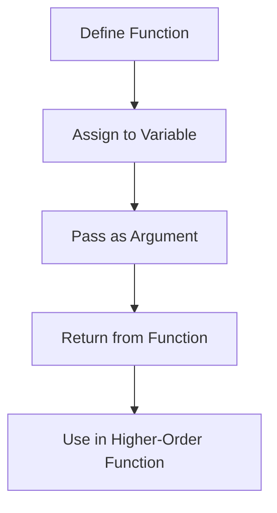

## 6.3. Functions as First-Class Objects

In JavaScript, functions are more than just blocks of code that perform tasks. They are first-class objects, meaning they can be treated like any other object. This concept is fundamental to understanding JavaScript's flexibility and power, especially when it comes to functional programming. In this section, we will explore what it means for functions to be first-class objects, how to assign them to variables, pass them as arguments, return them from other functions, and their practical applications, such as callbacks and higher-order functions.

### Understanding Functions as First-Class Citizens

When we say that functions are first-class citizens in JavaScript, we mean that they can be:

- **Assigned to variables**: Just like numbers or strings, functions can be stored in variables.
- **Passed as arguments**: Functions can be passed as arguments to other functions.
- **Returned from other functions**: Functions can return other functions.
- **Stored in data structures**: Functions can be stored in arrays or objects.

This flexibility allows for a wide range of programming techniques and patterns, such as callbacks, closures, and higher-order functions.

### Assigning Functions to Variables

In JavaScript, you can assign a function to a variable, which allows you to use the variable name to call the function. This is similar to how you would assign a number or a string to a variable.

```javascript
// Assigning a function to a variable
const greet = function(name) {
    return `Hello, ${name}!`;
};

// Using the variable to call the function
console.log(greet('Alice')); // Output: Hello, Alice!
```

In this example, we have assigned an anonymous function to the variable `greet`. We can then call the function using the variable name, just like any other function.

### Passing Functions as Arguments

One of the most powerful features of JavaScript is the ability to pass functions as arguments to other functions. This is a common pattern in JavaScript and is used extensively in asynchronous programming and event handling.

```javascript
// Function that takes another function as an argument
function performOperation(operation, a, b) {
    return operation(a, b);
}

// Example functions
function add(x, y) {
    return x + y;
}

function multiply(x, y) {
    return x * y;
}

// Passing functions as arguments
console.log(performOperation(add, 5, 3)); // Output: 8
console.log(performOperation(multiply, 5, 3)); // Output: 15
```

In this example, the `performOperation` function takes another function as its first argument and two numbers as the second and third arguments. We can pass different functions to `performOperation` to perform different operations on the numbers.

### Returning Functions from Other Functions

In JavaScript, functions can also return other functions. This is another powerful feature that allows for the creation of higher-order functions and closures.

```javascript
// Function that returns another function
function createGreeter(greeting) {
    return function(name) {
        return `${greeting}, ${name}!`;
    };
}

// Using the returned function
const sayHello = createGreeter('Hello');
console.log(sayHello('Bob')); // Output: Hello, Bob!

const sayGoodbye = createGreeter('Goodbye');
console.log(sayGoodbye('Bob')); // Output: Goodbye, Bob!
```

Here, the `createGreeter` function returns a new function that uses the `greeting` argument. This allows us to create customized greeting functions.

### Practical Applications: Callbacks and Higher-Order Functions

#### Callbacks

A callback is a function that is passed as an argument to another function and is executed after some operation has been completed. Callbacks are commonly used in asynchronous programming, such as handling events or making HTTP requests.

```javascript
// Example of a callback function
function fetchData(callback) {
    setTimeout(() => {
        const data = { id: 1, name: 'Alice' };
        callback(data);
    }, 1000);
}

// Using a callback function
fetchData((data) => {
    console.log('Data received:', data);
});
```

In this example, the `fetchData` function simulates an asynchronous operation using `setTimeout`. Once the data is "fetched," the callback function is called with the data.

#### Higher-Order Functions

A higher-order function is a function that takes one or more functions as arguments or returns a function as its result. Higher-order functions are a key concept in functional programming and are used to create more abstract and reusable code.

```javascript
// Higher-order function example
function applyOperation(arr, operation) {
    return arr.map(operation);
}

// Example operation functions
function square(x) {
    return x * x;
}

function double(x) {
    return x * 2;
}

// Using higher-order function
console.log(applyOperation([1, 2, 3], square)); // Output: [1, 4, 9]
console.log(applyOperation([1, 2, 3], double)); // Output: [2, 4, 6]
```

In this example, the `applyOperation` function takes an array and a function as arguments. It uses the `map` method to apply the operation to each element of the array.

### Visualizing Functions as First-Class Objects

To better understand how functions as first-class objects work, let's visualize the concept using a flowchart. This flowchart will show how a function can be assigned to a variable, passed as an argument, and returned from another function.



**Figure 1: Visualizing Functions as First-Class Objects**

This flowchart illustrates the flexibility of functions in JavaScript. They can be assigned to variables, passed around as arguments, returned from other functions, and used in higher-order functions.

### Try It Yourself

Now that we've covered the basics of functions as first-class objects, let's try some exercises to reinforce your understanding. Modify the code examples provided to experiment with different operations and callbacks. For instance, try creating a higher-order function that filters an array based on a condition, or a callback function that logs messages at different intervals.

### References and Links

For further reading on functions as first-class objects in JavaScript, check out these resources:

- [MDN Web Docs: Functions](https://developer.mozilla.org/en-US/docs/Web/JavaScript/Guide/Functions)
- [JavaScript.info: Functions](https://javascript.info/function-basics)
- [W3Schools: JavaScript Functions](https://www.w3schools.com/js/js_functions.asp)

### Knowledge Check

Before we move on, let's summarize the key takeaways:

- Functions in JavaScript are first-class objects, meaning they can be assigned to variables, passed as arguments, and returned from other functions.
- This flexibility allows for powerful programming patterns, such as callbacks and higher-order functions.
- Understanding functions as first-class objects is essential for mastering JavaScript and functional programming.

### Embrace the Journey

Remember, this is just the beginning. As you progress, you'll discover more complex and interactive ways to use functions in JavaScript. Keep experimenting, stay curious, and enjoy the journey!

## Quiz Time!



### What does it mean for functions to be first-class objects in JavaScript?

- [x] Functions can be assigned to variables, passed as arguments, and returned from other functions.
- [ ] Functions can only be used in loops and conditionals.
- [ ] Functions cannot be stored in data structures.
- [ ] Functions must always be anonymous.

> **Explanation:** Functions as first-class objects can be assigned to variables, passed as arguments, and returned from other functions, allowing for flexible programming patterns.

### Which of the following is an example of a higher-order function?

- [x] A function that takes another function as an argument.
- [ ] A function that only returns numbers.
- [ ] A function that uses loops.
- [ ] A function that only performs arithmetic operations.

> **Explanation:** A higher-order function is one that takes another function as an argument or returns a function as its result.

### How can you pass a function as an argument in JavaScript?

- [x] By using the function name without parentheses.
- [ ] By using the function name with parentheses.
- [ ] By converting the function to a string.
- [ ] By using the `eval` function.

> **Explanation:** To pass a function as an argument, use the function name without parentheses to pass the function itself, not its result.

### What is a callback function?

- [x] A function passed as an argument to another function and executed after an operation.
- [ ] A function that calls itself recursively.
- [ ] A function that only works with arrays.
- [ ] A function that is always asynchronous.

> **Explanation:** A callback function is passed as an argument to another function and is executed after some operation has been completed.

### Which of the following is NOT a characteristic of first-class functions?

- [ ] Can be assigned to variables.
- [ ] Can be passed as arguments.
- [ ] Can be returned from other functions.
- [x] Must be declared using the `function` keyword.

> **Explanation:** First-class functions can be declared using various syntaxes, including arrow functions, and are not limited to the `function` keyword.

### What is the output of the following code?

```javascript
function greet(name) {
    return `Hello, ${name}!`;
}

const sayHello = greet;
console.log(sayHello('Alice'));
```

- [x] Hello, Alice!
- [ ] Hello, name!
- [ ] Error: greet is not a function
- [ ] Undefined

> **Explanation:** The function `greet` is assigned to `sayHello`, and calling `sayHello('Alice')` returns "Hello, Alice!".

### What is a practical use of higher-order functions?

- [x] To create reusable and abstract code.
- [ ] To perform only arithmetic operations.
- [ ] To make JavaScript code run faster.
- [ ] To avoid using variables.

> **Explanation:** Higher-order functions allow for creating reusable and abstract code by taking functions as arguments or returning functions.

### What is the purpose of the `map` method in JavaScript?

- [x] To create a new array by applying a function to each element of an existing array.
- [ ] To sort an array in ascending order.
- [ ] To find the maximum value in an array.
- [ ] To remove duplicates from an array.

> **Explanation:** The `map` method creates a new array by applying a function to each element of an existing array.

### Which of the following is an example of a function returning another function?

- [x] `function outer() { return function inner() { return 'Hello'; }; }`
- [ ] `function add(a, b) { return a + b; }`
- [ ] `function logMessage(message) { console.log(message); }`
- [ ] `function multiply(x, y) { return x * y; }`

> **Explanation:** The `outer` function returns the `inner` function, demonstrating a function returning another function.

### True or False: Functions in JavaScript cannot be stored in arrays.

- [ ] True
- [x] False

> **Explanation:** Functions in JavaScript can be stored in arrays, just like any other data type, because they are first-class objects.


