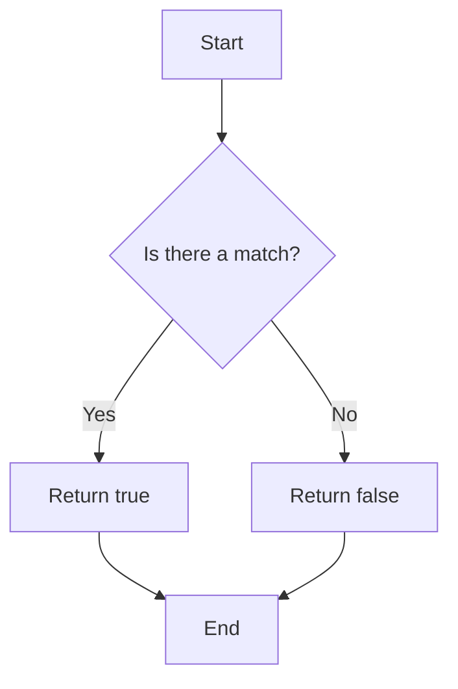

## 6.5. Regular Expressions

Regular expressions, often abbreviated as regex or regexp, are a powerful tool in JavaScript for pattern matching and string manipulation. They allow us to search, match, and manipulate strings with precision and efficiency. In this section, we'll explore the syntax of regular expressions, how to create them, and how to use them effectively with various JavaScript methods. We'll also look at common use cases such as validation and search.

### Introduction to Regular Expressions

Regular expressions are sequences of characters that form search patterns. They can be used to perform all types of text search and text replace operations. In JavaScript, regular expressions are implemented using the `RegExp` object.

#### Basic Syntax

A regular expression can be created in two ways:

1. **Literal Notation**: Enclosed between forward slashes (`/pattern/`).
2. **Constructor Function**: Using the `RegExp` constructor (`new RegExp('pattern')`).

Both methods are equivalent, but the literal notation is more concise and commonly used.

```javascript
// Using literal notation
let regexLiteral = /hello/;

// Using constructor function
let regexConstructor = new RegExp('hello');
```

### Creating Regular Expressions

#### Characters and Metacharacters

Regular expressions consist of literal characters and metacharacters. Literal characters match themselves, while metacharacters have special meanings.

- **Literal Characters**: Match exactly as they appear.
- **Metacharacters**: Include symbols like `.` (dot), `*` (asterisk), `+` (plus), `?` (question mark), `^` (caret), `$` (dollar sign), `[]` (brackets), `()` (parentheses), `|` (pipe), and `\` (backslash).

#### Examples of Metacharacters

- `.`: Matches any single character except newline.
- `*`: Matches zero or more occurrences of the preceding element.
- `+`: Matches one or more occurrences of the preceding element.
- `?`: Matches zero or one occurrence of the preceding element.
- `^`: Matches the beginning of a string.
- `$`: Matches the end of a string.
- `[]`: Matches any one of the characters inside the brackets.
- `()`: Groups expressions.
- `|`: Acts as an OR operator.
- `\`: Escapes special characters.

#### Example: Matching a Simple Pattern

Let's create a regex to match the word "cat" in a string.

```javascript
let pattern = /cat/;
let text = "The cat is on the roof.";
console.log(pattern.test(text)); // Output: true
```

### Using Regex Methods

JavaScript provides several methods to work with regular expressions. Let's explore some of the most commonly used methods.

#### The `test` Method

The `test` method checks if a pattern exists in a string. It returns `true` if the pattern is found, otherwise `false`.

```javascript
let pattern = /dog/;
let text = "The dog is barking.";
console.log(pattern.test(text)); // Output: true

text = "The cat is meowing.";
console.log(pattern.test(text)); // Output: false
```

#### The `exec` Method

The `exec` method searches for a match in a string and returns an array of information about the match. If no match is found, it returns `null`.

```javascript
let pattern = /fox/;
let text = "The quick brown fox jumps over the lazy dog.";
let result = pattern.exec(text);

console.log(result); 
// Output: [ 'fox', index: 16, input: 'The quick brown fox jumps over the lazy dog.', groups: undefined ]
```

#### The `match` Method

The `match` method retrieves the matches when matching a string against a regular expression. It returns an array of matches or `null` if no matches are found.

```javascript
let text = "The rain in Spain stays mainly in the plain.";
let matches = text.match(/ain/g);

console.log(matches); 
// Output: [ 'ain', 'ain', 'ain' ]
```

### Common Use Cases

Regular expressions are incredibly versatile and can be used for a variety of tasks. Here are some common use cases:

#### Validation

Regular expressions are often used to validate input data, such as checking if an email address is in the correct format.

```javascript
let emailPattern = /^[a-zA-Z0-9._%+-]+@[a-zA-Z0-9.-]+\.[a-zA-Z]{2,}$/;
let email = "example@example.com";

console.log(emailPattern.test(email)); // Output: true

email = "invalid-email";
console.log(emailPattern.test(email)); // Output: false
```

#### Search and Replace

You can use regular expressions to search for patterns and replace them with new strings.

```javascript
let text = "The sky is blue.";
let newText = text.replace(/blue/, "clear");

console.log(newText); // Output: "The sky is clear."
```

#### Splitting Strings

Regular expressions can be used to split strings into arrays based on a pattern.

```javascript
let text = "apple, banana, cherry";
let fruits = text.split(/,\s*/);

console.log(fruits); 
// Output: [ 'apple', 'banana', 'cherry' ]
```

### Advanced Regular Expression Features

#### Flags

Regular expressions can have flags that modify their behavior. Common flags include:

- `g`: Global search.
- `i`: Case-insensitive search.
- `m`: Multi-line search.

```javascript
let pattern = /hello/i; // Case-insensitive
let text = "Hello World!";
console.log(pattern.test(text)); // Output: true
```

#### Quantifiers

Quantifiers specify the number of times a character or group should be matched.

- `{n}`: Matches exactly `n` occurrences.
- `{n,}`: Matches `n` or more occurrences.
- `{n,m}`: Matches between `n` and `m` occurrences.

```javascript
let pattern = /a{2,4}/; // Matches between 2 and 4 'a's
let text = "aaa";
console.log(pattern.test(text)); // Output: true
```

#### Character Classes

Character classes allow you to define a set of characters to match.

- `\d`: Matches any digit.
- `\D`: Matches any non-digit.
- `\w`: Matches any word character (alphanumeric + underscore).
- `\W`: Matches any non-word character.
- `\s`: Matches any whitespace character.
- `\S`: Matches any non-whitespace character.

```javascript
let pattern = /\d+/; // Matches one or more digits
let text = "The year is 2024.";
console.log(pattern.test(text)); // Output: true
```

### Visualizing Regular Expressions

To better understand how regular expressions work, let's visualize the process of matching a pattern against a string.



This flowchart illustrates the basic decision-making process when using the `test` method to determine if a pattern matches a string.

### Try It Yourself

Experiment with the following code examples to reinforce your understanding of regular expressions. Try modifying the patterns and input strings to see how the results change.

```javascript
// Try changing the pattern to match different words
let pattern = /cat/;
let text = "The cat is on the roof.";
console.log(pattern.test(text)); // Output: true

// Try using different flags
pattern = /HELLO/i;
text = "hello world!";
console.log(pattern.test(text)); // Output: true

// Experiment with different quantifiers
pattern = /a{3}/;
text = "aaa";
console.log(pattern.test(text)); // Output: true
```

### References and Links

For further reading and more in-depth information about regular expressions, consider the following resources:

- [MDN Web Docs: Regular Expressions](https://developer.mozilla.org/en-US/docs/Web/JavaScript/Guide/Regular_Expressions)
- [W3Schools: JavaScript RegExp](https://www.w3schools.com/js/js_regexp.asp)

### Knowledge Check

Let's reinforce what we've learned with a few questions and exercises.

1. What is the purpose of the `test` method in regular expressions?
2. How do you create a regular expression using the constructor function?
3. What does the `g` flag do in a regular expression?
4. Write a regular expression to match a phone number in the format `(123) 456-7890`.
5. How can you use regular expressions to validate an email address?

### Embrace the Journey

Remember, mastering regular expressions takes practice. As you continue to explore and experiment with regex, you'll become more comfortable and proficient in using them to solve complex text processing tasks. Keep experimenting, stay curious, and enjoy the journey!

## Quiz Time!



### What does the `test` method do in regular expressions?

- [x] Checks if a pattern exists in a string and returns true or false
- [ ] Returns an array of matches found in a string
- [ ] Replaces a pattern in a string with a new string
- [ ] Splits a string into an array based on a pattern

> **Explanation:** The `test` method checks if a pattern exists in a string and returns `true` if it does, otherwise `false`.


### How can you create a regular expression using the constructor function?

- [ ] /pattern/
- [x] new RegExp('pattern')
- [ ] RegExp(pattern)
- [ ] regex('pattern')

> **Explanation:** The `RegExp` constructor function is used to create regular expressions with `new RegExp('pattern')`.


### Which flag makes a regular expression case-insensitive?

- [ ] g
- [x] i
- [ ] m
- [ ] s

> **Explanation:** The `i` flag makes a regular expression case-insensitive.


### What does the `g` flag do in a regular expression?

- [ ] Makes the search case-insensitive
- [ ] Matches the beginning of a string
- [x] Performs a global search
- [ ] Matches the end of a string

> **Explanation:** The `g` flag performs a global search, finding all matches rather than stopping after the first match.


### How would you write a regular expression to match a phone number in the format `(123) 456-7890`?

- [x] /^\\(\d{3}\\) \d{3}-\d{4}$/
- [ ] /^\d{3}-\d{3}-\d{4}$/
- [ ] /^\d{10}$/
- [ ] /^\\(\d{3}\\)\d{3}-\d{4}$/

> **Explanation:** The regular expression `/^\\(\d{3}\\) \d{3}-\d{4}$/` matches a phone number in the format `(123) 456-7890`.


### What does the `exec` method return if no match is found?

- [ ] An empty array
- [ ] An empty string
- [x] null
- [ ] false

> **Explanation:** The `exec` method returns `null` if no match is found.


### How can you use regular expressions to validate an email address?

- [ ] By using the `split` method
- [x] By using a pattern like `/^[a-zA-Z0-9._%+-]+@[a-zA-Z0-9.-]+\.[a-zA-Z]{2,}$/`
- [ ] By using the `replace` method
- [ ] By using the `join` method

> **Explanation:** You can validate an email address using a regular expression pattern like `/^[a-zA-Z0-9._%+-]+@[a-zA-Z0-9.-]+\.[a-zA-Z]{2,}$/`.


### What does the `+` quantifier do in a regular expression?

- [ ] Matches zero or more occurrences
- [x] Matches one or more occurrences
- [ ] Matches zero or one occurrence
- [ ] Matches exactly one occurrence

> **Explanation:** The `+` quantifier matches one or more occurrences of the preceding element.


### Which character class matches any digit?

- [x] \d
- [ ] \D
- [ ] \w
- [ ] \W

> **Explanation:** The `\d` character class matches any digit.


### True or False: Regular expressions can only be used for search operations.

- [ ] True
- [x] False

> **Explanation:** Regular expressions can be used for search, replace, validation, and splitting operations, among others.





