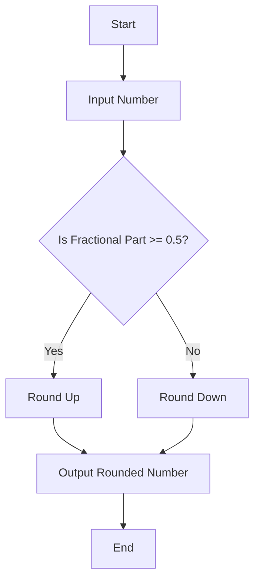

## 6.6. The Math Object

In the world of programming, mathematical operations are fundamental. Whether you're calculating the position of an element on a web page, generating random numbers for a game, or performing complex calculations, JavaScript's `Math` object is an invaluable tool. In this section, we'll explore the `Math` object, its methods, and properties, and how you can leverage them to perform various mathematical operations.

### Introduction to the Math Object

The `Math` object in JavaScript is a built-in object that has properties and methods for mathematical constants and functions. Unlike other objects, you don't need to create an instance of `Math`. Instead, you can directly use its properties and methods. 

The `Math` object is static, meaning that all its properties and methods are accessible directly from the object itself, rather than from instances of the object. This makes it easy to perform mathematical operations without the need for additional setup.

### Common Methods and Properties of Math

Let's start by listing some of the most commonly used methods and properties of the `Math` object. We'll then dive deeper into each one with examples.

#### Properties

- **Math.PI**: Represents the ratio of the circumference of a circle to its diameter, approximately 3.14159.
- **Math.E**: Represents Euler's number, the base of natural logarithms, approximately 2.718.

#### Methods

- **Math.round()**: Rounds a number to the nearest integer.
- **Math.ceil()**: Rounds a number up to the next largest integer.
- **Math.floor()**: Rounds a number down to the largest integer less than or equal to the given number.
- **Math.random()**: Returns a pseudo-random number between 0 and 1.
- **Math.max()**: Returns the largest of zero or more numbers.
- **Math.min()**: Returns the smallest of zero or more numbers.
- **Math.abs()**: Returns the absolute value of a number.
- **Math.sqrt()**: Returns the square root of a number.
- **Math.pow()**: Returns the base to the exponent power, that is, base^exponent.

### Using Math Methods: Practical Examples

Now that we've introduced some of the key methods, let's explore how to use them with practical examples.

#### Rounding Numbers

Rounding numbers is a common task in programming, and JavaScript provides several methods to do this.

**Math.round()**

The `Math.round()` method rounds a number to the nearest integer. If the fractional part is 0.5 or greater, the argument is rounded to the next higher integer.

```javascript
let num1 = 4.7;
let rounded1 = Math.round(num1); // 5

let num2 = 4.4;
let rounded2 = Math.round(num2); // 4

console.log(`Rounded values: ${rounded1}, ${rounded2}`);
```

**Math.ceil()**

The `Math.ceil()` method always rounds a number up to the next largest integer.

```javascript
let num = 4.1;
let ceiling = Math.ceil(num); // 5

console.log(`Ceiling value: ${ceiling}`);
```

**Math.floor()**

The `Math.floor()` method always rounds a number down to the largest integer less than or equal to the given number.

```javascript
let num = 4.9;
let floor = Math.floor(num); // 4

console.log(`Floor value: ${floor}`);
```

#### Generating Random Numbers

Random numbers are essential in many applications, from games to simulations. The `Math.random()` method is used to generate a pseudo-random number between 0 (inclusive) and 1 (exclusive).

```javascript
let randomNum = Math.random();
console.log(`Random number: ${randomNum}`);
```

To generate a random number within a specific range, you can scale and shift the result:

```javascript
// Random number between 1 and 10
let randomInRange = Math.floor(Math.random() * 10) + 1;
console.log(`Random number between 1 and 10: ${randomInRange}`);
```

#### Finding Maximum and Minimum Values

When working with a set of numbers, you might need to find the largest or smallest value. The `Math.max()` and `Math.min()` methods are perfect for this.

**Math.max()**

The `Math.max()` method returns the largest of zero or more numbers.

```javascript
let maxVal = Math.max(10, 20, 30, 5, 15);
console.log(`Maximum value: ${maxVal}`); // 30
```

**Math.min()**

The `Math.min()` method returns the smallest of zero or more numbers.

```javascript
let minVal = Math.min(10, 20, 30, 5, 15);
console.log(`Minimum value: ${minVal}`); // 5
```

#### Absolute Values and Square Roots

**Math.abs()**

The `Math.abs()` method returns the absolute value of a number, which is the number without its sign.

```javascript
let negativeNum = -5;
let absoluteValue = Math.abs(negativeNum);
console.log(`Absolute value: ${absoluteValue}`); // 5
```

**Math.sqrt()**

The `Math.sqrt()` method returns the square root of a number.

```javascript
let num = 16;
let squareRoot = Math.sqrt(num);
console.log(`Square root: ${squareRoot}`); // 4
```

#### Exponentiation

**Math.pow()**

The `Math.pow()` method returns the base to the exponent power, that is, base^exponent.

```javascript
let base = 2;
let exponent = 3;
let power = Math.pow(base, exponent);
console.log(`Power: ${power}`); // 8
```

### Limitations and Precision Considerations

While the `Math` object provides a wide range of mathematical operations, there are some limitations and precision considerations to keep in mind.

#### Floating-Point Precision

JavaScript uses the IEEE 754 standard for floating-point arithmetic, which can lead to precision issues. For example, some decimal numbers cannot be represented exactly in binary, leading to small errors in calculations.

```javascript
let result = 0.1 + 0.2;
console.log(`0.1 + 0.2 = ${result}`); // 0.30000000000000004
```

To mitigate this, consider using libraries like [Decimal.js](https://github.com/MikeMcl/decimal.js/) for high-precision arithmetic.

#### Random Number Generation

The `Math.random()` method generates pseudo-random numbers, which means they are deterministic and not suitable for cryptographic purposes. For cryptographic randomness, consider using the [Web Crypto API](https://developer.mozilla.org/en-US/docs/Web/API/Crypto/getRandomValues).

### Try It Yourself

Now that we've covered the basics, it's time to experiment with the `Math` object. Try modifying the examples above to see how they behave with different inputs. For instance:

- Change the range of random numbers generated.
- Use `Math.max()` and `Math.min()` with different sets of numbers.
- Experiment with rounding methods using negative numbers.

### Visualizing Math Object Methods

To better understand how some of these methods work, let's visualize the process of rounding numbers using a flowchart.



**Caption**: This flowchart illustrates the decision-making process of the `Math.round()` method, where a number is rounded up if its fractional part is 0.5 or greater, and rounded down otherwise.

### References and Links

For further reading and more detailed explanations, consider exploring the following resources:

- [MDN Web Docs - Math Object](https://developer.mozilla.org/en-US/docs/Web/JavaScript/Reference/Global_Objects/Math)
- [W3Schools - JavaScript Math](https://www.w3schools.com/js/js_math.asp)

### Knowledge Check

Before we wrap up, let's reinforce what we've learned with a few questions:

1. What is the purpose of the `Math` object in JavaScript?
2. How would you generate a random number between 1 and 100?
3. What method would you use to find the largest number in a set?
4. How does JavaScript handle floating-point arithmetic, and what are the implications?

### Embrace the Journey

Remember, mastering the `Math` object is just one step in your JavaScript journey. As you continue to explore and experiment, you'll discover even more powerful tools and techniques. Keep practicing, stay curious, and enjoy the process of learning and creating with JavaScript!

## Quiz Time!



### What is the `Math` object in JavaScript?

- [x] A built-in object for mathematical operations
- [ ] A user-defined object for storing numbers
- [ ] An external library for complex calculations
- [ ] A method for generating random numbers

> **Explanation:** The `Math` object is a built-in object in JavaScript that provides properties and methods for mathematical operations.

### Which method would you use to round a number to the nearest integer?

- [ ] Math.floor()
- [ ] Math.ceil()
- [x] Math.round()
- [ ] Math.abs()

> **Explanation:** `Math.round()` rounds a number to the nearest integer, while `Math.floor()` and `Math.ceil()` round down and up, respectively.

### How can you generate a random number between 1 and 10?

- [x] Math.floor(Math.random() * 10) + 1
- [ ] Math.random() * 10
- [ ] Math.ceil(Math.random() * 10)
- [ ] Math.round(Math.random() * 10)

> **Explanation:** `Math.floor(Math.random() * 10) + 1` generates a random number between 1 and 10 by scaling and shifting the result of `Math.random()`.

### What does `Math.max()` do?

- [ ] Returns the smallest number
- [x] Returns the largest number
- [ ] Returns the average of numbers
- [ ] Returns the sum of numbers

> **Explanation:** `Math.max()` returns the largest of zero or more numbers.

### Which method returns the absolute value of a number?

- [ ] Math.sqrt()
- [ ] Math.pow()
- [x] Math.abs()
- [ ] Math.floor()

> **Explanation:** `Math.abs()` returns the absolute value of a number, removing its sign.

### What is the result of `Math.sqrt(16)`?

- [ ] 2
- [x] 4
- [ ] 8
- [ ] 16

> **Explanation:** `Math.sqrt(16)` returns 4, which is the square root of 16.

### How does JavaScript handle floating-point arithmetic?

- [ ] With exact precision
- [x] Using the IEEE 754 standard
- [ ] With integer values only
- [ ] Using a custom algorithm

> **Explanation:** JavaScript uses the IEEE 754 standard for floating-point arithmetic, which can lead to precision issues.

### What is a limitation of `Math.random()`?

- [ ] It generates numbers greater than 1
- [ ] It requires external libraries
- [x] It generates pseudo-random numbers
- [ ] It only works with integers

> **Explanation:** `Math.random()` generates pseudo-random numbers, which are deterministic and not suitable for cryptographic purposes.

### Which method would you use to calculate 2 raised to the power of 3?

- [ ] Math.sqrt(2, 3)
- [ ] Math.abs(2, 3)
- [x] Math.pow(2, 3)
- [ ] Math.max(2, 3)

> **Explanation:** `Math.pow(2, 3)` calculates 2 raised to the power of 3, resulting in 8.

### True or False: The `Math` object requires instantiation before use.

- [ ] True
- [x] False

> **Explanation:** The `Math` object is static and does not require instantiation. Its methods and properties are accessible directly.


