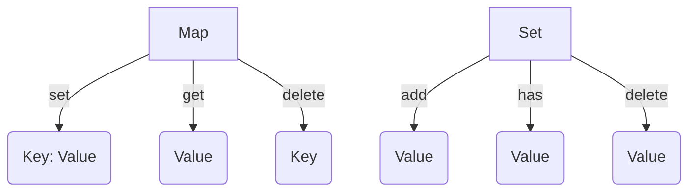

## 6.7. Maps and Sets (ES6)

In the world of JavaScript, managing data efficiently is crucial for building robust applications. With the introduction of ECMAScript 6 (ES6), two powerful data structures were introduced: `Map` and `Set`. These structures offer a more efficient and flexible way to handle collections of data compared to traditional objects and arrays. In this section, we will explore the purpose and usage of `Map` and `Set`, learn how to create and manipulate them, and understand their advantages over objects and arrays.

### Understanding Maps in JavaScript

A `Map` is a collection of keyed data items, just like an object. However, the main difference is that a `Map` allows keys of any type, not just strings or symbols. This flexibility makes `Map` a versatile tool for storing and retrieving data efficiently.

#### Creating a Map

To create a `Map`, you simply use the `Map` constructor. Here's how you can do it:

```javascript
// Create a new Map
let myMap = new Map();
```

#### Adding Entries to a Map

To add entries to a `Map`, you use the `set` method. The `set` method takes two arguments: the key and the value. Here's an example:

```javascript
// Add entries to the Map
myMap.set('name', 'John Doe');
myMap.set(1, 'one');
myMap.set(true, 'boolean key');
```

In this example, we have added three entries to the `Map`: a string key, a number key, and a boolean key. This demonstrates the flexibility of `Map` in handling different types of keys.

#### Retrieving Values from a Map

To retrieve a value from a `Map`, you use the `get` method. The `get` method takes the key as an argument and returns the corresponding value:

```javascript
// Retrieve values from the Map
console.log(myMap.get('name')); // Output: John Doe
console.log(myMap.get(1)); // Output: one
console.log(myMap.get(true)); // Output: boolean key
```

#### Checking for Existence of a Key

To check if a key exists in a `Map`, you can use the `has` method. This method returns a boolean indicating whether the key is present:

```javascript
// Check if a key exists in the Map
console.log(myMap.has('name')); // Output: true
console.log(myMap.has('age')); // Output: false
```

#### Deleting Entries from a Map

To delete an entry from a `Map`, you use the `delete` method. This method takes the key as an argument and removes the corresponding entry:

```javascript
// Delete an entry from the Map
myMap.delete('name');
console.log(myMap.has('name')); // Output: false
```

#### Clearing All Entries in a Map

If you want to remove all entries from a `Map`, you can use the `clear` method:

```javascript
// Clear all entries in the Map
myMap.clear();
console.log(myMap.size); // Output: 0
```

#### Iterating Over a Map

Maps are iterable, which means you can loop through them using a `for...of` loop. You can iterate over keys, values, or entries (key-value pairs):

```javascript
// Iterate over entries
for (let [key, value] of myMap) {
  console.log(`${key}: ${value}`);
}

// Iterate over keys
for (let key of myMap.keys()) {
  console.log(key);
}

// Iterate over values
for (let value of myMap.values()) {
  console.log(value);
}
```

### Understanding Sets in JavaScript

A `Set` is a collection of unique values. Unlike arrays, a `Set` does not allow duplicate values, making it ideal for storing distinct items.

#### Creating a Set

To create a `Set`, you use the `Set` constructor:

```javascript
// Create a new Set
let mySet = new Set();
```

#### Adding Values to a Set

To add values to a `Set`, you use the `add` method. Here's an example:

```javascript
// Add values to the Set
mySet.add(1);
mySet.add(5);
mySet.add('Hello');
```

If you try to add a duplicate value, it will be ignored:

```javascript
// Attempt to add a duplicate value
mySet.add(1);
console.log(mySet.size); // Output: 3
```

#### Checking for Existence of a Value

To check if a value exists in a `Set`, you use the `has` method:

```javascript
// Check if a value exists in the Set
console.log(mySet.has(1)); // Output: true
console.log(mySet.has(10)); // Output: false
```

#### Deleting Values from a Set

To remove a value from a `Set`, you use the `delete` method:

```javascript
// Delete a value from the Set
mySet.delete(5);
console.log(mySet.has(5)); // Output: false
```

#### Clearing All Values in a Set

To remove all values from a `Set`, you use the `clear` method:

```javascript
// Clear all values in the Set
mySet.clear();
console.log(mySet.size); // Output: 0
```

#### Iterating Over a Set

Sets are iterable, so you can loop through them using a `for...of` loop:

```javascript
// Iterate over values in the Set
for (let value of mySet) {
  console.log(value);
}
```

### Comparing Maps and Sets with Objects and Arrays

While `Map` and `Set` offer similar functionalities to objects and arrays, they have distinct advantages:

- **Maps vs. Objects**: Maps allow keys of any type and maintain the order of entries, whereas objects only allow string or symbol keys and do not guarantee order.
- **Sets vs. Arrays**: Sets automatically handle unique values and provide efficient methods for checking existence, whereas arrays require manual checks for duplicates.

### Visualizing Maps and Sets

Let's use a diagram to visualize how Maps and Sets work:



**Diagram Description**: This diagram illustrates the basic operations of Maps and Sets. Maps involve setting, getting, and deleting key-value pairs, while Sets involve adding, checking, and deleting unique values.

### Try It Yourself

To solidify your understanding, try modifying the following code examples:

1. **Experiment with Different Key Types in a Map**: Try using objects or functions as keys in a `Map`.
2. **Test Unique Value Handling in a Set**: Add duplicate values to a `Set` and observe the behavior.
3. **Iterate Over Maps and Sets**: Practice iterating over entries in a `Map` and values in a `Set`.

### Further Reading

For more information on Maps and Sets, check out these resources:

- [MDN Web Docs: Map](https://developer.mozilla.org/en-US/docs/Web/JavaScript/Reference/Global_Objects/Map)
- [MDN Web Docs: Set](https://developer.mozilla.org/en-US/docs/Web/JavaScript/Reference/Global_Objects/Set)

### Knowledge Check

Before moving on, let's summarize the key points:

- **Maps**: Store key-value pairs with keys of any type and maintain order.
- **Sets**: Store unique values and provide efficient methods for checking existence.
- **Comparison**: Maps and Sets offer advantages over objects and arrays in terms of flexibility and efficiency.

### Embrace the Journey

Remember, this is just the beginning. As you progress, you'll discover more powerful features of JavaScript. Keep experimenting, stay curious, and enjoy the journey!

## Quiz Time!



### What is a primary advantage of using a Map over an Object?

- [x] Maps can have keys of any type.
- [ ] Maps are faster than objects.
- [ ] Maps are easier to use.
- [ ] Maps are more secure.

> **Explanation:** Maps allow keys of any type, whereas objects only allow string or symbol keys.

### How do you add an entry to a Map?

- [x] Use the `set` method with a key and value.
- [ ] Use the `add` method with a key and value.
- [ ] Use the `push` method with a key and value.
- [ ] Use the `insert` method with a key and value.

> **Explanation:** The `set` method is used to add entries to a Map.

### What method checks if a key exists in a Map?

- [x] `has`
- [ ] `exists`
- [ ] `contains`
- [ ] `find`

> **Explanation:** The `has` method checks for the existence of a key in a Map.

### What is a Set primarily used for?

- [x] Storing unique values.
- [ ] Storing key-value pairs.
- [ ] Storing ordered data.
- [ ] Storing complex objects.

> **Explanation:** Sets are used to store unique values.

### How do you remove a value from a Set?

- [x] Use the `delete` method with the value.
- [ ] Use the `remove` method with the value.
- [ ] Use the `pop` method with the value.
- [ ] Use the `clear` method with the value.

> **Explanation:** The `delete` method removes a value from a Set.

### What is a key difference between a Set and an Array?

- [x] Sets do not allow duplicate values.
- [ ] Sets are faster than arrays.
- [ ] Sets are easier to use.
- [ ] Sets are more secure.

> **Explanation:** Sets automatically handle unique values, unlike arrays.

### How do you clear all entries in a Map?

- [x] Use the `clear` method.
- [ ] Use the `deleteAll` method.
- [ ] Use the `removeAll` method.
- [ ] Use the `reset` method.

> **Explanation:** The `clear` method removes all entries from a Map.

### How do you iterate over a Map?

- [x] Use a `for...of` loop.
- [ ] Use a `forEach` loop.
- [ ] Use a `while` loop.
- [ ] Use a `do...while` loop.

> **Explanation:** Maps can be iterated over using a `for...of` loop.

### What does the `size` property of a Set return?

- [x] The number of unique values in the Set.
- [ ] The number of duplicate values in the Set.
- [ ] The total memory used by the Set.
- [ ] The number of operations performed on the Set.

> **Explanation:** The `size` property returns the number of unique values in a Set.

### True or False: A Map maintains the order of its entries.

- [x] True
- [ ] False

> **Explanation:** Maps maintain the order of entries based on the insertion order.




