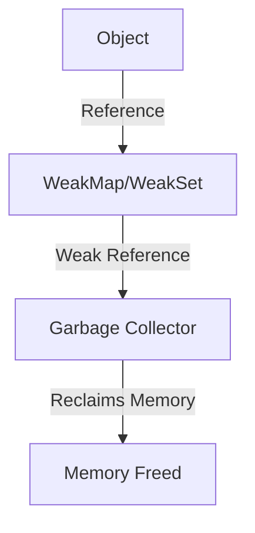

## 6.8. WeakMap and WeakSet

In this section, we will delve into the fascinating world of `WeakMap` and `WeakSet` in JavaScript. These data structures are designed to provide a memory-efficient way to store data, particularly when dealing with objects that may be garbage collected. Let's explore how they differ from their counterparts, `Map` and `Set`, and understand their unique characteristics and use cases.

### Introduction to WeakMap and WeakSet

JavaScript offers various data structures to store collections of data, such as `Array`, `Object`, `Map`, and `Set`. However, when it comes to managing memory efficiently, especially in scenarios where objects may be dynamically removed, `WeakMap` and `WeakSet` come into play.

#### What is a WeakMap?

A `WeakMap` is a collection of key/value pairs where the keys are objects, and the values can be arbitrary values. The key feature of a `WeakMap` is that it holds "weak" references to the keys, meaning that if there are no other references to the key object, it can be garbage collected. This behavior is crucial for memory management, as it allows the memory used by the key/value pair to be reclaimed when the key is no longer needed.

#### What is a WeakSet?

Similarly, a `WeakSet` is a collection of objects. Like `WeakMap`, it holds weak references to its objects, allowing them to be garbage collected if there are no other references to them. This makes `WeakSet` ideal for storing objects temporarily without preventing their garbage collection.

### Differences Between WeakMap/WeakSet and Map/Set

To fully appreciate the utility of `WeakMap` and `WeakSet`, it's important to understand how they differ from `Map` and `Set`.

#### Key Differences

1. **Weak References**: The most significant difference is that `WeakMap` and `WeakSet` hold weak references to their keys and objects, respectively. This means they do not prevent garbage collection of the keys or objects.

2. **Iteration**: Unlike `Map` and `Set`, `WeakMap` and `WeakSet` do not support iteration. You cannot iterate over the entries of a `WeakMap` or the objects in a `WeakSet`. This is because the entries can be garbage collected at any time, making it impossible to reliably iterate over them.

3. **Methods**: `WeakMap` and `WeakSet` have a limited set of methods compared to `Map` and `Set`. For example, `WeakMap` only supports `get`, `set`, `has`, and `delete` methods, while `WeakSet` supports `add`, `has`, and `delete`.

4. **Key Types**: In a `WeakMap`, keys must be objects, whereas in a `Map`, keys can be any data type. Similarly, `WeakSet` can only store objects, while `Set` can store any data type.

### Garbage Collection Behavior

One of the primary advantages of using `WeakMap` and `WeakSet` is their interaction with JavaScript's garbage collector. Let's explore how this works.

#### Garbage Collection and Weak References

In JavaScript, garbage collection is the process of automatically reclaiming memory that is no longer in use. When an object is no longer reachable, the garbage collector can reclaim its memory. `WeakMap` and `WeakSet` leverage this behavior by holding weak references to their keys and objects.

- **WeakMap**: If an object used as a key in a `WeakMap` has no other references, it can be garbage collected, and the corresponding entry in the `WeakMap` will be removed.
  
- **WeakSet**: Similarly, if an object in a `WeakSet` has no other references, it can be garbage collected, and the object will be removed from the `WeakSet`.

This behavior is particularly useful for managing memory in applications where objects are dynamically created and discarded.

### Practical Use Cases for WeakMap and WeakSet

Now that we understand the characteristics of `WeakMap` and `WeakSet`, let's explore some practical scenarios where they can be effectively used.

#### Use Case 1: Caching Computed Values

Imagine you have a function that computes a value based on an object. You want to cache the computed value to avoid recalculating it if the same object is used again. However, you don't want the cache to prevent the object from being garbage collected when it's no longer needed.

```javascript
const cache = new WeakMap();

function computeValue(obj) {
  if (cache.has(obj)) {
    return cache.get(obj);
  }

  // Simulate a complex computation
  const result = obj.value * 2;
  cache.set(obj, result);
  return result;
}

const obj1 = { value: 10 };
console.log(computeValue(obj1)); // 20
console.log(computeValue(obj1)); // 20

// obj1 can be garbage collected when no longer needed
```

In this example, `WeakMap` is used to cache computed values without preventing the objects from being garbage collected.

#### Use Case 2: Managing Event Listeners

When adding event listeners to DOM elements, it's important to remove them when they are no longer needed to avoid memory leaks. `WeakSet` can be used to keep track of elements that have event listeners attached.

```javascript
const elementsWithListeners = new WeakSet();

function addListener(element) {
  if (!elementsWithListeners.has(element)) {
    element.addEventListener('click', () => {
      console.log('Element clicked!');
    });
    elementsWithListeners.add(element);
  }
}

const button = document.querySelector('button');
addListener(button);

// The button can be garbage collected when removed from the DOM
```

In this scenario, `WeakSet` helps manage event listeners efficiently by allowing elements to be garbage collected when they are removed from the DOM.

### Limitations of WeakMap and WeakSet

While `WeakMap` and `WeakSet` offer significant advantages in terms of memory management, they also come with limitations.

#### Limitation 1: No Iteration

As mentioned earlier, `WeakMap` and `WeakSet` do not support iteration. This means you cannot loop through the entries of a `WeakMap` or the objects in a `WeakSet`. This limitation arises because the entries can be garbage collected at any time, making it impossible to guarantee consistent iteration.

#### Limitation 2: No Size Property

Unlike `Map` and `Set`, `WeakMap` and `WeakSet` do not have a `size` property. This is because the number of entries can change dynamically due to garbage collection, making it impractical to maintain an accurate count.

#### Limitation 3: Key/Object Constraints

In a `WeakMap`, keys must be objects, and in a `WeakSet`, only objects can be stored. This constraint limits their use to scenarios where objects are involved.

### Visualizing WeakMap and WeakSet

To better understand the interaction between `WeakMap`, `WeakSet`, and garbage collection, let's visualize the process using a diagram.



**Diagram Description**: This diagram illustrates how an object is referenced by a `WeakMap` or `WeakSet`. The weak reference allows the garbage collector to reclaim the memory used by the object when it is no longer needed, freeing up resources.

### When to Use WeakMap and WeakSet

Given their unique characteristics, `WeakMap` and `WeakSet` are best suited for specific scenarios:

- **Temporary Associations**: Use `WeakMap` and `WeakSet` when you need to associate data with objects temporarily, without preventing garbage collection.

- **Memory Efficiency**: Use them when memory efficiency is a priority, and you want to ensure that unused objects are garbage collected.

- **Avoiding Memory Leaks**: Use them to manage resources like event listeners, where you want to avoid memory leaks by allowing objects to be garbage collected when they are no longer needed.

### Knowledge Check

Let's reinforce our understanding of `WeakMap` and `WeakSet` with some questions:

- What is the primary advantage of using `WeakMap` and `WeakSet` in terms of memory management?
- Why can't you iterate over the entries of a `WeakMap` or the objects in a `WeakSet`?
- How does garbage collection interact with `WeakMap` and `WeakSet`?
- What are some practical use cases for `WeakMap` and `WeakSet`?

### Try It Yourself

Now that we've covered the basics of `WeakMap` and `WeakSet`, let's experiment with some code. Try modifying the examples provided to see how they behave with different objects and scenarios. For instance, you can create a `WeakMap` to cache results of a function that processes DOM elements, and observe how the cache behaves when elements are removed from the DOM.

### Conclusion

In this section, we've explored the concepts of `WeakMap` and `WeakSet`, understanding their differences from `Map` and `Set`, and appreciating their role in memory-efficient data storage. By leveraging weak references, these data structures allow us to manage memory effectively, especially in scenarios where objects are dynamically created and discarded. Remember, this is just the beginning. As you progress, you'll discover more advanced use cases and techniques for using `WeakMap` and `WeakSet` in your JavaScript applications. Keep experimenting, stay curious, and enjoy the journey!

## Quiz Time!



### What is a primary advantage of using WeakMap and WeakSet?

- [x] Memory efficiency through garbage collection
- [ ] Faster data retrieval
- [ ] Ability to store primitive data types
- [ ] Built-in iteration methods

> **Explanation:** WeakMap and WeakSet provide memory efficiency by allowing objects to be garbage collected when they are no longer needed.

### Why can't you iterate over the entries of a WeakMap or the objects in a WeakSet?

- [x] Entries can be garbage collected at any time
- [ ] They lack iteration methods due to design oversight
- [ ] Iteration is too slow for these data structures
- [ ] They only store primitive data types

> **Explanation:** WeakMap and WeakSet do not support iteration because their entries can be garbage collected at any time, making it impossible to guarantee consistent iteration.

### What types of keys can a WeakMap have?

- [x] Objects only
- [ ] Strings only
- [ ] Any data type
- [ ] Numbers only

> **Explanation:** WeakMap keys must be objects, as weak references are only applicable to objects.

### How does garbage collection interact with WeakMap and WeakSet?

- [x] It can reclaim memory used by entries when keys or objects have no other references
- [ ] It prevents entries from being garbage collected
- [ ] It requires manual intervention to reclaim memory
- [ ] It does not interact with WeakMap and WeakSet

> **Explanation:** Garbage collection can reclaim memory used by WeakMap and WeakSet entries when the keys or objects have no other references.

### What is a practical use case for WeakMap?

- [x] Caching computed values without preventing garbage collection
- [ ] Storing primitive values efficiently
- [ ] Iterating over large datasets
- [ ] Implementing complex algorithms

> **Explanation:** WeakMap is useful for caching computed values without preventing the associated objects from being garbage collected.

### Can WeakSet store primitive data types?

- [ ] Yes
- [x] No

> **Explanation:** WeakSet can only store objects, not primitive data types.

### What happens to an entry in a WeakMap if the key object is garbage collected?

- [x] The entry is removed from the WeakMap
- [ ] The entry remains in the WeakMap
- [ ] The entry is converted to a primitive type
- [ ] The entry is moved to a different data structure

> **Explanation:** If the key object is garbage collected, the entry is removed from the WeakMap.

### What is a limitation of WeakMap and WeakSet?

- [x] They do not support iteration
- [ ] They can store only primitive data types
- [ ] They have a size property
- [ ] They prevent garbage collection

> **Explanation:** WeakMap and WeakSet do not support iteration due to the possibility of entries being garbage collected at any time.

### What is a key characteristic of WeakSet?

- [x] It holds weak references to objects
- [ ] It can store any data type
- [ ] It supports iteration
- [ ] It has a size property

> **Explanation:** WeakSet holds weak references to objects, allowing them to be garbage collected when no longer needed.

### True or False: WeakMap and WeakSet are ideal for storing primitive data types.

- [ ] True
- [x] False

> **Explanation:** WeakMap and WeakSet are not suitable for storing primitive data types; they are designed to hold objects with weak references.


