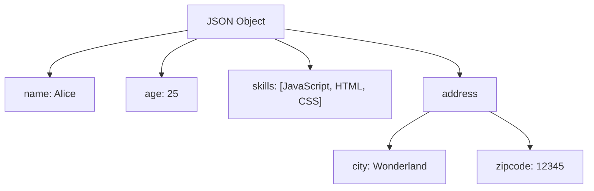

## 6.9. JSON Objects

### Introduction to JSON

JSON, which stands for JavaScript Object Notation, is a lightweight data interchange format that is easy for humans to read and write, and easy for machines to parse and generate. JSON is a text format that is completely language-independent, but it uses conventions that are familiar to programmers of the C family of languages, including C, C++, C#, Java, JavaScript, Perl, Python, and many others. These properties make JSON an ideal data-interchange language.

### The Significance of JSON

JSON is significant in the world of web development for several reasons:

- **Simplicity and Readability**: JSON's syntax is straightforward and easy to read, making it an excellent choice for data interchange between systems.
- **Language Independence**: Although JSON originated from JavaScript, it is language-independent, meaning it can be used with most modern programming languages.
- **Interoperability**: JSON is used extensively in web services and APIs, allowing different systems to communicate with each other seamlessly.
- **Efficiency**: JSON is lightweight, which makes it a preferred choice for transmitting data over the internet.

### JSON Syntax

JSON is built on two structures:

1. **A collection of name/value pairs**: In various languages, this is realized as an object, record, struct, dictionary, hash table, keyed list, or associative array.
2. **An ordered list of values**: In most languages, this is realized as an array, vector, list, or sequence.

Here is an example of a JSON object:

```json
{
  "name": "John Doe",
  "age": 30,
  "isStudent": false,
  "courses": ["Mathematics", "Computer Science"],
  "address": {
    "street": "123 Main St",
    "city": "Anytown",
    "zipcode": "12345"
  }
}
```

### JSON vs. JavaScript Object Literals

While JSON and JavaScript object literals look similar, there are key differences:

- **Keys in JSON must be strings**: In JavaScript object literals, keys can be strings, numbers, or symbols.
- **No functions or methods**: JSON cannot include functions or methods, while JavaScript objects can.
- **No comments**: JSON does not support comments, whereas JavaScript objects can include comments.

### Working with JSON in JavaScript

JavaScript provides two primary methods to work with JSON: `JSON.stringify()` and `JSON.parse()`.

#### JSON.stringify()

The `JSON.stringify()` method converts a JavaScript object or value to a JSON string. This is useful when you need to send data from a client to a server, or when you want to store data in a text-based format.

**Example:**

```javascript
const user = {
  name: "John Doe",
  age: 30,
  isStudent: false
};

const jsonString = JSON.stringify(user);
console.log(jsonString); // Output: {"name":"John Doe","age":30,"isStudent":false}
```

**Key Points:**

- **Circular References**: `JSON.stringify()` cannot handle circular references. If an object contains a circular reference, a `TypeError` will be thrown.
- **Replacer Function**: You can pass a function as the second argument to `JSON.stringify()` to control which properties are included in the JSON string.
- **Space Parameter**: The third parameter of `JSON.stringify()` can be used to add indentation, making the JSON string more readable.

#### JSON.parse()

The `JSON.parse()` method parses a JSON string, constructing the JavaScript value or object described by the string. This is useful when you receive data from a web server in JSON format and need to convert it into a JavaScript object.

**Example:**

```javascript
const jsonString = '{"name":"John Doe","age":30,"isStudent":false}';
const user = JSON.parse(jsonString);

console.log(user.name); // Output: John Doe
console.log(user.age); // Output: 30
```

**Key Points:**

- **Reviver Function**: You can pass a function as the second argument to `JSON.parse()` to transform the resulting object before it is returned.
- **Error Handling**: If the JSON string is not valid, `JSON.parse()` will throw a `SyntaxError`.

### Common Use Cases for JSON

#### Data Storage

JSON is often used for data storage, particularly in configuration files and databases. It provides a simple way to store structured data that can be easily read and written by both humans and machines.

**Example:**

```json
{
  "database": {
    "host": "localhost",
    "port": 5432,
    "username": "admin",
    "password": "secret"
  }
}
```

#### API Communication

JSON is the standard format for data exchange between web services and clients. APIs often use JSON to send and receive data, making it a crucial part of modern web development.

**Example:**

When a client requests data from a server, the server might respond with a JSON object:

```json
{
  "status": "success",
  "data": {
    "id": 1,
    "name": "Product Name",
    "price": 29.99
  }
}
```

#### Configuration Files

JSON is commonly used for configuration files in software applications. It allows developers to define settings in a structured format that is easy to modify.

**Example:**

```json
{
  "appName": "My Application",
  "version": "1.0.0",
  "settings": {
    "theme": "dark",
    "language": "en"
  }
}
```

### Visualizing JSON Structure

To better understand JSON, let's visualize its structure using a simple JSON object:

```json
{
  "name": "Alice",
  "age": 25,
  "skills": ["JavaScript", "HTML", "CSS"],
  "address": {
    "city": "Wonderland",
    "zipcode": "12345"
  }
}
```



**Description:** This diagram represents a JSON object with properties such as `name`, `age`, `skills`, and `address`. The `address` property is itself an object with `city` and `zipcode` properties.

### Try It Yourself

Let's experiment with JSON in JavaScript. Try modifying the following code to see how JSON.stringify() and JSON.parse() work in different scenarios.

```javascript
// Define a JavaScript object
const book = {
  title: "JavaScript Mastery",
  author: "Jane Doe",
  year: 2021,
  genres: ["Programming", "Technology"],
  available: true
};

// Convert the object to a JSON string
const jsonString = JSON.stringify(book, null, 2);
console.log("JSON String:", jsonString);

// Parse the JSON string back to a JavaScript object
const parsedBook = JSON.parse(jsonString);
console.log("Parsed Object:", parsedBook);

// Try modifying the object and see the changes
parsedBook.year = 2022;
console.log("Updated Year:", parsedBook.year);
```

### Knowledge Check

- **What is JSON and why is it important?**
- **How do you convert a JavaScript object to a JSON string?**
- **What are the differences between JSON and JavaScript object literals?**
- **How can you handle errors when parsing JSON strings?**

### Embrace the Journey

Remember, working with JSON is a fundamental skill in web development. As you continue to learn and experiment, you'll find JSON to be an invaluable tool for data interchange and storage. Keep exploring, stay curious, and enjoy the journey!

## Quiz Time!



### What does JSON stand for?

- [x] JavaScript Object Notation
- [ ] JavaScript Object Network
- [ ] JavaScript Online Notation
- [ ] JavaScript Object Node

> **Explanation:** JSON stands for JavaScript Object Notation, a lightweight data interchange format.

### Which method is used to convert a JavaScript object to a JSON string?

- [ ] JSON.parse()
- [x] JSON.stringify()
- [ ] JSON.convert()
- [ ] JSON.toString()

> **Explanation:** JSON.stringify() is used to convert a JavaScript object to a JSON string.

### What is a key difference between JSON and JavaScript object literals?

- [x] JSON keys must be strings
- [ ] JSON supports functions
- [ ] JSON allows comments
- [ ] JSON keys can be symbols

> **Explanation:** In JSON, keys must be strings, whereas JavaScript object literals can have keys that are strings, numbers, or symbols.

### What happens if you try to stringify an object with circular references?

- [ ] It returns null
- [ ] It ignores the circular reference
- [x] It throws a TypeError
- [ ] It converts the circular reference to a string

> **Explanation:** JSON.stringify() cannot handle circular references and will throw a TypeError.

### How can you add indentation to a JSON string using JSON.stringify()?

- [ ] Use a replacer function
- [x] Use the third parameter for spacing
- [ ] Use JSON.indent()
- [ ] Use JSON.format()

> **Explanation:** The third parameter of JSON.stringify() can be used to add indentation for readability.

### What is the purpose of the reviver function in JSON.parse()?

- [ ] To handle circular references
- [x] To transform the resulting object
- [ ] To add comments to JSON
- [ ] To stringify the object

> **Explanation:** The reviver function in JSON.parse() allows you to transform the resulting object before it is returned.

### Which of the following is a common use case for JSON?

- [x] API communication
- [ ] Styling web pages
- [ ] Compiling code
- [ ] Rendering graphics

> **Explanation:** JSON is commonly used for API communication to exchange data between clients and servers.

### Can JSON include functions or methods?

- [ ] Yes
- [x] No

> **Explanation:** JSON cannot include functions or methods; it is purely a data format.

### What error does JSON.parse() throw if the JSON string is invalid?

- [ ] TypeError
- [x] SyntaxError
- [ ] ReferenceError
- [ ] RangeError

> **Explanation:** JSON.parse() throws a SyntaxError if the JSON string is not valid.

### True or False: JSON is language-independent.

- [x] True
- [ ] False

> **Explanation:** JSON is language-independent, meaning it can be used with most modern programming languages.


