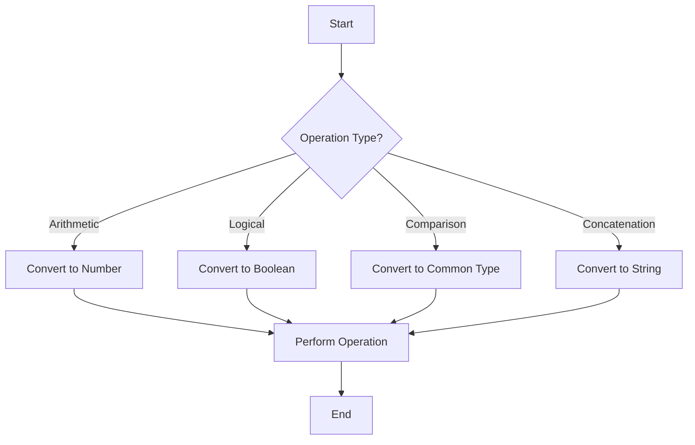

## 7.1. Implicit Type Coercion

As we delve deeper into JavaScript, we encounter a fascinating feature known as **implicit type coercion**. This is JavaScript's ability to automatically convert one data type to another during operations. While this feature can be incredibly useful, it can also lead to unexpected results if not fully understood. In this section, we'll explore what implicit type coercion is, when it occurs, the rules JavaScript follows for type conversion, and potential pitfalls to watch out for.

### What is Implicit Type Coercion?

Implicit type coercion refers to the automatic conversion of values from one data type to another by JavaScript. This occurs when an operation involves different data types, and JavaScript needs to convert one or both values to a common type to perform the operation. For instance, when you add a number to a string, JavaScript will convert the number to a string to concatenate the values.

Implicit type coercion can be both a blessing and a curse. It allows for flexible code but can also lead to bugs if the developer is not aware of how JavaScript is handling the types.

### When Does Implicit Type Coercion Occur?

Implicit type coercion typically occurs in the following scenarios:

1. **Arithmetic Operations**: When performing operations like addition, subtraction, multiplication, or division, JavaScript may convert strings to numbers or vice versa.

2. **Logical Operations**: When using logical operators such as `&&` (AND), `||` (OR), and `!` (NOT), JavaScript converts values to booleans.

3. **Comparison Operations**: When comparing values using operators like `==` (loose equality), JavaScript may convert the values to a common type.

4. **String Concatenation**: When using the `+` operator with a string, JavaScript converts other types to strings to concatenate.

### Examples of Implicit Type Coercion

Let's look at some examples to understand how implicit type coercion works in practice.

#### Arithmetic Operations

Consider the following code:

```javascript
let result = '5' - 3;
console.log(result); // Output: 2
```

In this example, JavaScript converts the string `'5'` to the number `5` before performing the subtraction, resulting in `2`.

Now, let's see what happens with addition:

```javascript
let result = '5' + 3;
console.log(result); // Output: '53'
```

Here, JavaScript converts the number `3` to a string and concatenates it with `'5'`, resulting in the string `'53'`.

#### Logical Operations

Logical operations involve converting values to booleans. Consider this example:

```javascript
let value = 'Hello' && 0;
console.log(value); // Output: 0
```

In this case, `'Hello'` is truthy, so JavaScript evaluates the second operand, which is `0`. Since `0` is falsy, the result is `0`.

#### Comparison Operations

When using loose equality (`==`), JavaScript may convert values to a common type:

```javascript
console.log(5 == '5'); // Output: true
```

Here, JavaScript converts the string `'5'` to the number `5` before comparing, resulting in `true`.

#### String Concatenation

When using the `+` operator with strings:

```javascript
let greeting = 'Hello, ' + 5;
console.log(greeting); // Output: 'Hello, 5'
```

JavaScript converts the number `5` to a string and concatenates it with `'Hello, '`.

### Rules for Type Conversion

JavaScript follows specific rules for implicit type coercion. Understanding these rules can help prevent unexpected results.

#### To String Conversion

- **Numbers**: Converted to their string representation.
- **Booleans**: `true` becomes `'true'`, and `false` becomes `'false'`.
- **Objects**: Converted to strings using the `toString()` method.

#### To Number Conversion

- **Strings**: Converted to numbers if they contain numeric values. Otherwise, they become `NaN` (Not-a-Number).
- **Booleans**: `true` becomes `1`, and `false` becomes `0`.
- **Null**: Becomes `0`.
- **Undefined**: Becomes `NaN`.

#### To Boolean Conversion

- **Falsy Values**: `0`, `NaN`, `null`, `undefined`, `''` (empty string) are converted to `false`.
- **Truthy Values**: All other values are converted to `true`.

### Potential Issues and Unexpected Results

Implicit type coercion can lead to unexpected results if not handled carefully. Here are some common pitfalls:

#### Mixing Types

Mixing different types in operations can lead to confusing results:

```javascript
console.log('5' - true); // Output: 4
```

Here, `true` is converted to `1`, and `'5'` is converted to `5`, resulting in `4`.

#### Loose Equality

Using `==` can lead to unexpected comparisons:

```javascript
console.log(false == '0'); // Output: true
```

JavaScript converts `'0'` to `0` and `false` to `0`, resulting in `true`.

#### NaN

Operations that result in `NaN` can propagate through calculations:

```javascript
let result = 'abc' - 5;
console.log(result); // Output: NaN
console.log(result + 1); // Output: NaN
```

Once a value becomes `NaN`, it remains `NaN` in subsequent operations.

### Visualizing Implicit Type Coercion

To better understand implicit type coercion, let's visualize how JavaScript handles different types during operations.



**Diagram Description**: This flowchart illustrates how JavaScript determines the type conversion needed based on the operation type. It shows the path from the start of an operation to the end, highlighting the conversion process.

### Try It Yourself

Experiment with the following code examples to see implicit type coercion in action. Try modifying the values and observe the results.

```javascript
// Example 1: Subtraction with a string
let result1 = '10' - 2;
console.log(result1); // What do you expect?

// Example 2: Addition with a boolean
let result2 = 5 + true;
console.log(result2); // What do you expect?

// Example 3: Loose equality comparison
console.log('' == false); // What do you expect?

// Example 4: Logical operation
let value = 'JavaScript' || 0;
console.log(value); // What do you expect?
```

### Knowledge Check

Before we wrap up, let's reinforce what we've learned about implicit type coercion. Consider the following questions:

- What happens when you add a number to a string in JavaScript?
- How does JavaScript handle logical operations with non-boolean values?
- What is the result of comparing `null` and `undefined` using `==`?

### Conclusion

Implicit type coercion is a powerful feature of JavaScript that allows for flexible coding but requires careful consideration to avoid unexpected results. By understanding the rules and scenarios where coercion occurs, we can write more predictable and reliable code.

Remember, this is just the beginning. As you progress, you'll build more complex and interactive web pages. Keep experimenting, stay curious, and enjoy the journey!

## Quiz Time!



### What is implicit type coercion in JavaScript?

- [x] Automatic conversion of one data type to another during operations
- [ ] Manual conversion of data types by the programmer
- [ ] A feature that prevents type conversion
- [ ] A method to explicitly convert data types

> **Explanation:** Implicit type coercion is when JavaScript automatically converts one data type to another during operations.

### When does implicit type coercion occur?

- [x] During arithmetic, logical, and comparison operations
- [ ] Only during string concatenation
- [ ] Only when using strict equality (`===`)
- [ ] Only when explicitly converting types

> **Explanation:** Implicit type coercion occurs during arithmetic, logical, and comparison operations, among others.

### What is the result of `'5' + 3` in JavaScript?

- [ ] 8
- [x] '53'
- [ ] '8'
- [ ] 53

> **Explanation:** JavaScript converts the number `3` to a string and concatenates it with `'5'`, resulting in `'53'`.

### What is the result of `5 == '5'`?

- [x] true
- [ ] false
- [ ] NaN
- [ ] undefined

> **Explanation:** JavaScript converts the string `'5'` to the number `5` before comparing, resulting in `true`.

### Which of the following values is considered falsy in JavaScript?

- [x] 0
- [x] ''
- [ ] 'false'
- [x] NaN

> **Explanation:** `0`, `''`, and `NaN` are considered falsy values in JavaScript.

### What happens when you subtract a boolean from a string containing a number?

- [x] The boolean is converted to a number, and the string is converted to a number
- [ ] The operation results in NaN
- [ ] The boolean is converted to a string
- [ ] The string remains unchanged

> **Explanation:** JavaScript converts the boolean to a number and the string to a number before performing the subtraction.

### What is the result of `false == '0'`?

- [x] true
- [ ] false
- [ ] NaN
- [ ] undefined

> **Explanation:** JavaScript converts `'0'` to `0` and `false` to `0`, resulting in `true`.

### How does JavaScript handle `null` and `undefined` when using loose equality (`==`)?

- [x] They are considered equal
- [ ] They are considered not equal
- [ ] They are both converted to `0`
- [ ] They are both converted to `false`

> **Explanation:** `null` and `undefined` are considered equal when using loose equality (`==`).

### What is the result of `'abc' - 5`?

- [ ] 5
- [ ] 'abc5'
- [x] NaN
- [ ] undefined

> **Explanation:** JavaScript cannot convert `'abc'` to a number, resulting in `NaN`.

### Is it true that implicit type coercion can lead to unexpected results?

- [x] True
- [ ] False

> **Explanation:** Implicit type coercion can lead to unexpected results if not handled carefully.


