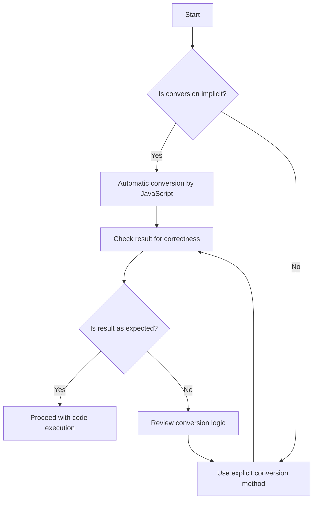

## 7.10. Best Practices for Type Conversion

Type conversion in JavaScript is a fundamental concept that can significantly impact the behavior and reliability of your code. As we've explored in previous sections, JavaScript can perform both implicit and explicit type conversions, often leading to unexpected results if not handled carefully. In this section, we'll summarize key recommendations and provide a checklist for developers to ensure safe and predictable type conversions in their code.

### Understanding Type Conversion

Before diving into best practices, let's briefly recap what type conversion is. Type conversion, also known as type coercion, is the process of converting a value from one data type to another. In JavaScript, this can happen implicitly (automatically by the language) or explicitly (intentionally by the developer).

#### Implicit Type Conversion

Implicit type conversion occurs when JavaScript automatically converts data types during operations. For example, when you add a number to a string, JavaScript will convert the number to a string:

```javascript
let result = 'The answer is ' + 42; // Implicit conversion of number to string
console.log(result); // Output: "The answer is 42"
```

While implicit conversion can be convenient, it can also lead to unexpected behavior if not understood properly.

#### Explicit Type Conversion

Explicit type conversion, on the other hand, is when you intentionally convert a value from one type to another using built-in functions or methods. This approach is generally safer and more predictable:

```javascript
let num = '42';
let convertedNum = Number(num); // Explicit conversion from string to number
console.log(convertedNum); // Output: 42
```

### Best Practices for Type Conversion

To ensure your code behaves as expected, follow these best practices for type conversion:

#### 1. Prefer Explicit Conversion

**Advocate for explicit over implicit conversions**. Whenever possible, use explicit conversion methods to make your intentions clear. This not only improves code readability but also reduces the risk of unexpected behavior.

- Use `Number()`, `String()`, and `Boolean()` for explicit conversions.
- Avoid relying on JavaScript's automatic type coercion.

#### 2. Understand Your Data

**Emphasize the importance of understanding the data being handled**. Before performing any type conversion, ensure you know the data types you are working with. This knowledge will help you choose the appropriate conversion method and avoid errors.

- Use `typeof` to check the data type of a variable before conversion.
- Be aware of potential `NaN` (Not-a-Number) results when converting strings to numbers.

#### 3. Handle Edge Cases

**Consider edge cases and potential pitfalls**. Some conversions can lead to unexpected results, especially when dealing with special values like `null`, `undefined`, or empty strings.

- Convert `null` and `undefined` to a specific type before using them in operations.
- Be cautious with empty strings, as they can convert to `0` when using `Number()`.

#### 4. Use Strict Equality

**Favor strict equality (`===`) over loose equality (`==`)**. Loose equality can perform implicit type conversion, leading to unexpected results. Strict equality checks both value and type, providing more predictable behavior.

```javascript
console.log(0 == '0'); // true (loose equality with implicit conversion)
console.log(0 === '0'); // false (strict equality without conversion)
```

#### 5. Validate User Input

**Always validate and sanitize user input**. When working with data from external sources, such as user input, ensure it is in the expected format before performing any operations or conversions.

- Use regular expressions or validation libraries to check input formats.
- Convert input to the desired type explicitly after validation.

#### 6. Avoid Magic Numbers and Strings

**Use constants instead of hard-coded values**. Magic numbers and strings can make your code less readable and more error-prone. Define constants for frequently used values and use them consistently.

```javascript
const MAX_USERS = 100;
if (userCount > MAX_USERS) {
  console.log('User limit exceeded');
}
```

#### 7. Leverage Modern JavaScript Features

**Take advantage of modern JavaScript features**. ES6 and later versions introduced several features that can simplify type conversion and improve code clarity.

- Use template literals for string interpolation instead of concatenation.
- Utilize `Array.from()` and `Array.of()` for array conversions.

#### 8. Document Your Code

**Provide clear documentation and comments**. When performing type conversions, document your code to explain the reasoning behind your choices. This practice helps other developers understand your intentions and maintain the codebase.

```javascript
// Convert user input to number for calculation
let userAge = Number(inputAge);
```

#### 9. Test Your Code

**Thoroughly test your code**. Ensure your type conversions work as expected by writing unit tests and using test-driven development (TDD) practices. Testing helps identify edge cases and potential issues early in the development process.

- Write tests for different input scenarios and edge cases.
- Use testing frameworks like Jest or Mocha for JavaScript testing.

#### 10. Stay Informed

**Keep up with JavaScript updates and best practices**. The JavaScript ecosystem is constantly evolving, with new features and best practices emerging regularly. Stay informed to leverage the latest tools and techniques for type conversion.

- Follow JavaScript blogs and communities.
- Regularly check the [MDN Web Docs](https://developer.mozilla.org/) for updates.

### Checklist for Safe Type Conversion

To help you implement these best practices, here's a checklist for safe type conversion in JavaScript:

- [ ] Use explicit conversion methods (`Number()`, `String()`, `Boolean()`) whenever possible.
- [ ] Check data types with `typeof` before conversion.
- [ ] Handle special values (`null`, `undefined`, empty strings) carefully.
- [ ] Use strict equality (`===`) to avoid implicit conversion.
- [ ] Validate and sanitize user input before conversion.
- [ ] Define constants for frequently used values.
- [ ] Leverage modern JavaScript features for clarity and efficiency.
- [ ] Document your conversion logic with comments.
- [ ] Write tests for different input scenarios and edge cases.
- [ ] Stay informed about JavaScript updates and best practices.

### Try It Yourself

To reinforce your understanding of type conversion, try modifying the following code examples:

```javascript
// Example 1: Convert a string to a number
let str = '123';
let num = Number(str);
console.log(num); // Output: 123

// Try converting different strings and observe the results

// Example 2: Use strict equality
let value = '42';
if (value === 42) {
  console.log('The value is 42');
} else {
  console.log('The value is not 42');
}

// Modify the value and test the behavior with strict equality
```

### Visualizing Type Conversion

To better understand how type conversion works in JavaScript, let's visualize the process using a flowchart:



This flowchart illustrates the decision-making process for type conversion in JavaScript. It emphasizes the importance of checking results and reviewing conversion logic if the outcome is not as expected.

### Conclusion

Type conversion is a crucial aspect of JavaScript programming that can impact the reliability and maintainability of your code. By following the best practices outlined in this section, you can ensure safe and predictable type conversions, leading to more robust and error-free applications. Remember, understanding your data and using explicit conversions are key to avoiding common pitfalls. Keep experimenting, stay curious, and enjoy the journey of mastering JavaScript!

## Quiz Time!



### What is the main advantage of using explicit type conversion over implicit conversion?

- [x] It makes the code more predictable and easier to understand.
- [ ] It allows JavaScript to handle conversions automatically.
- [ ] It reduces the amount of code needed.
- [ ] It speeds up code execution.

> **Explanation:** Explicit type conversion makes the code more predictable and easier to understand, as it clearly shows the developer's intent.

### Which method would you use for explicit conversion from a string to a number?

- [x] Number()
- [ ] String()
- [ ] Boolean()
- [ ] parseInt()

> **Explanation:** The `Number()` function is used for explicit conversion from a string to a number.

### Why is it recommended to use strict equality (`===`) over loose equality (`==`)?

- [x] To avoid implicit type conversion.
- [ ] To perform faster comparisons.
- [ ] To allow JavaScript to handle type conversions.
- [ ] To make the code shorter.

> **Explanation:** Using strict equality (`===`) avoids implicit type conversion, ensuring that both the value and type are compared.

### What should you do before performing a type conversion?

- [x] Use `typeof` to check the data type.
- [ ] Assume the data type is correct.
- [ ] Convert the data without checking.
- [ ] Use `parseInt()` for all conversions.

> **Explanation:** It's important to use `typeof` to check the data type before performing a conversion to ensure it's handled correctly.

### How can you handle special values like `null` and `undefined` in type conversions?

- [x] Convert them to a specific type before using them.
- [ ] Ignore them in your code.
- [ ] Use them directly in operations.
- [ ] Convert them to strings.

> **Explanation:** Converting `null` and `undefined` to a specific type before using them helps avoid unexpected results.

### What is a magic number in programming?

- [x] A hard-coded number that lacks context or explanation.
- [ ] A number that performs a specific function.
- [ ] A number that is automatically converted.
- [ ] A number that is used in calculations.

> **Explanation:** A magic number is a hard-coded number that lacks context or explanation, making the code less readable.

### Why should you validate and sanitize user input?

- [x] To ensure it is in the expected format before conversion.
- [ ] To make the code run faster.
- [ ] To allow JavaScript to handle conversions.
- [ ] To avoid using explicit conversions.

> **Explanation:** Validating and sanitizing user input ensures it is in the expected format before conversion, preventing errors.

### What is the benefit of using constants instead of magic numbers?

- [x] It improves code readability and maintainability.
- [ ] It speeds up code execution.
- [ ] It allows for implicit conversions.
- [ ] It reduces the number of variables.

> **Explanation:** Using constants instead of magic numbers improves code readability and maintainability by providing context.

### Which modern JavaScript feature can simplify string interpolation?

- [x] Template literals
- [ ] Arrow functions
- [ ] Promises
- [ ] Async/await

> **Explanation:** Template literals simplify string interpolation by allowing embedded expressions.

### True or False: Implicit type conversion is always the best choice for handling data types in JavaScript.

- [ ] True
- [x] False

> **Explanation:** False. Implicit type conversion can lead to unexpected results, so explicit conversion is often preferred for predictability.


