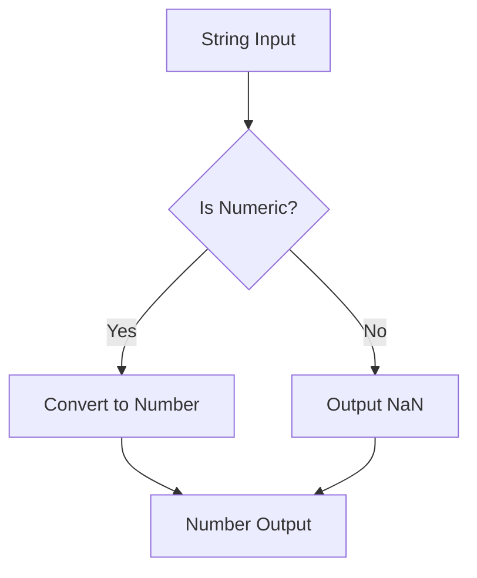

## 7.2. Explicit Type Conversion

In the world of JavaScript, understanding how to work with different data types is crucial. As you progress in your programming journey, you'll encounter situations where you need to convert one data type to another. This process, known as type conversion, can be implicit or explicit. In this section, we'll focus on explicit type conversion, where you deliberately convert data types using built-in functions and methods. This approach provides clarity and precision in your code, helping you avoid unexpected behavior and bugs.

### Why Explicit Type Conversion?

Before we dive into the specifics, let's discuss why explicit type conversion is important:

1. **Clarity and Precision**: By explicitly converting data types, you make your intentions clear to anyone reading your code, including your future self. This reduces the likelihood of errors and makes your code more maintainable.

2. **Avoiding Implicit Coercion Pitfalls**: JavaScript's implicit type coercion can lead to unexpected results. By using explicit conversion, you have full control over the data types you're working with.

3. **Improved Debugging**: When you explicitly convert types, it's easier to track down bugs related to data type issues, as the conversion points are clearly defined in your code.

### Functions for Explicit Type Conversion

JavaScript provides several built-in functions for explicit type conversion. Let's explore the most commonly used ones: `Number()`, `String()`, and `Boolean()`.

#### Converting to Number

The `Number()` function is used to convert a value to a number. This is particularly useful when you're working with user input or data from external sources that may be in string format.

```javascript
// Converting a string to a number
let strValue = "42";
let numValue = Number(strValue);
console.log(numValue); // Output: 42

// Converting a boolean to a number
let boolValue = true;
let numFromBool = Number(boolValue);
console.log(numFromBool); // Output: 1

// Converting a string with non-numeric characters
let invalidStr = "42abc";
let numFromInvalidStr = Number(invalidStr);
console.log(numFromInvalidStr); // Output: NaN (Not-a-Number)
```

**Key Points**:
- If the string contains only numeric characters, `Number()` will convert it to a number.
- If the string contains non-numeric characters, the result will be `NaN`.
- `true` converts to `1`, and `false` converts to `0`.

#### Converting to String

The `String()` function converts a value to a string. This is useful when you need to concatenate values or display them in a user interface.

```javascript
// Converting a number to a string
let numValue = 42;
let strFromNum = String(numValue);
console.log(strFromNum); // Output: "42"

// Converting a boolean to a string
let boolValue = false;
let strFromBool = String(boolValue);
console.log(strFromBool); // Output: "false"
```

**Key Points**:
- Numbers and booleans are converted to their string representations.
- This is useful for logging, concatenation, and UI display.

#### Converting to Boolean

The `Boolean()` function converts a value to a boolean. This is often used in conditional statements to ensure a value is treated as either `true` or `false`.

```javascript
// Converting a number to a boolean
let numValue = 0;
let boolFromNum = Boolean(numValue);
console.log(boolFromNum); // Output: false

// Converting a non-empty string to a boolean
let strValue = "Hello";
let boolFromStr = Boolean(strValue);
console.log(boolFromStr); // Output: true

// Converting an empty string to a boolean
let emptyStr = "";
let boolFromEmptyStr = Boolean(emptyStr);
console.log(boolFromEmptyStr); // Output: false
```

**Key Points**:
- `0`, `null`, `undefined`, `NaN`, and `""` (empty string) convert to `false`.
- All other values convert to `true`.

### Best Practices for Explicit Type Conversion

To ensure your code is robust and maintainable, follow these best practices for explicit type conversion:

1. **Use Explicit Conversion Over Implicit Coercion**: Whenever possible, use explicit conversion functions (`Number()`, `String()`, `Boolean()`) instead of relying on JavaScript's implicit coercion. This makes your code more predictable and easier to understand.

2. **Handle `NaN` Gracefully**: When converting strings to numbers, always check for `NaN` to avoid unexpected behavior. Use `isNaN()` to determine if a value is `NaN`.

3. **Be Mindful of Edge Cases**: Consider edge cases such as empty strings, `null`, and `undefined` when performing conversions. These values can behave differently than expected.

4. **Document Your Intentions**: Use comments to explain why you're performing a specific conversion. This helps others (and yourself) understand the purpose of the conversion.

5. **Test Thoroughly**: Include test cases that cover various input scenarios to ensure your conversions work as expected.

### Try It Yourself

Now that we've covered the basics of explicit type conversion, let's try a few exercises to reinforce your understanding. Modify the following code examples to see how different inputs affect the output:

1. **Convert a String to a Number**: Try converting different string values, including those with non-numeric characters, and observe the results.

```javascript
let input = "123abc"; // Try changing this value
let convertedNumber = Number(input);
console.log(`Converted Number: ${convertedNumber}`);
```

2. **Convert a Number to a String**: Experiment with different numbers, including negative and floating-point numbers.

```javascript
let number = -42.5; // Try changing this value
let convertedString = String(number);
console.log(`Converted String: "${convertedString}"`);
```

3. **Convert a Value to a Boolean**: Test with various values, including `0`, `1`, `null`, and non-empty strings.

```javascript
let value = " "; // Try changing this value
let convertedBoolean = Boolean(value);
console.log(`Converted Boolean: ${convertedBoolean}`);
```

### Visualizing Type Conversion

To better understand how explicit type conversion works in JavaScript, let's visualize the process using a flowchart. This diagram illustrates the steps involved in converting a string to a number, highlighting key decision points.



**Diagram Explanation**:
- The process starts with a string input.
- A decision is made to check if the string is numeric.
- If yes, the string is converted to a number.
- If no, the output is `NaN`.
- The final output is either a number or `NaN`.

### References and Further Reading

To deepen your understanding of explicit type conversion in JavaScript, consider exploring the following resources:

- [MDN Web Docs: JavaScript Data Types and Data Structures](https://developer.mozilla.org/en-US/docs/Web/JavaScript/Data_structures)
- [W3Schools: JavaScript Type Conversion](https://www.w3schools.com/js/js_type_conversion.asp)
- [JavaScript.info: Type Conversions](https://javascript.info/type-conversions)

### Knowledge Check

Let's summarize the key takeaways from this section:

- Explicit type conversion involves deliberately converting data types using functions like `Number()`, `String()`, and `Boolean()`.
- This approach provides clarity, precision, and control over data types, reducing the risk of errors.
- Always handle edge cases and test thoroughly to ensure your conversions work as expected.

## Embrace the Journey

Remember, mastering explicit type conversion is just one step in your JavaScript journey. As you continue to learn and experiment, you'll build more complex and interactive applications. Stay curious, keep practicing, and enjoy the process of becoming a proficient JavaScript developer!

---

## Quiz Time!



### What is the primary benefit of explicit type conversion?

- [x] Clarity and precision in code
- [ ] Faster execution
- [ ] Automatic error handling
- [ ] Reduced memory usage

> **Explanation:** Explicit type conversion makes your intentions clear and reduces the likelihood of errors, making your code more maintainable.

### Which function is used to convert a value to a number?

- [ ] String()
- [x] Number()
- [ ] Boolean()
- [ ] parseInt()

> **Explanation:** The `Number()` function is used to convert a value to a number.

### What will `Number("42abc")` return?

- [ ] 42
- [ ] "42abc"
- [x] NaN
- [ ] null

> **Explanation:** Since "42abc" contains non-numeric characters, `Number()` will return `NaN`.

### What does `Boolean("")` return?

- [x] false
- [ ] true
- [ ] NaN
- [ ] undefined

> **Explanation:** An empty string is considered a falsy value, so `Boolean("")` returns `false`.

### Which values convert to `false` when using `Boolean()`?

- [x] 0
- [ ] "0"
- [x] null
- [ ] "false"

> **Explanation:** `0`, `null`, `undefined`, `NaN`, and `""` are falsy values that convert to `false`.

### What is the result of `String(123)`?

- [ ] 123
- [x] "123"
- [ ] NaN
- [ ] null

> **Explanation:** `String(123)` converts the number 123 to its string representation, "123".

### Why is explicit conversion preferred over implicit coercion?

- [x] It makes code more predictable
- [ ] It is faster
- [ ] It uses less memory
- [ ] It is more concise

> **Explanation:** Explicit conversion provides clarity and control, making code more predictable and easier to understand.

### What does `Number(true)` return?

- [ ] 0
- [x] 1
- [ ] NaN
- [ ] undefined

> **Explanation:** `true` converts to `1` when using the `Number()` function.

### Which function would you use to convert a boolean to a string?

- [x] String()
- [ ] Number()
- [ ] Boolean()
- [ ] parseFloat()

> **Explanation:** The `String()` function is used to convert a boolean to its string representation.

### True or False: `Boolean(0)` returns `true`.

- [ ] True
- [x] False

> **Explanation:** `0` is a falsy value, so `Boolean(0)` returns `false`.


