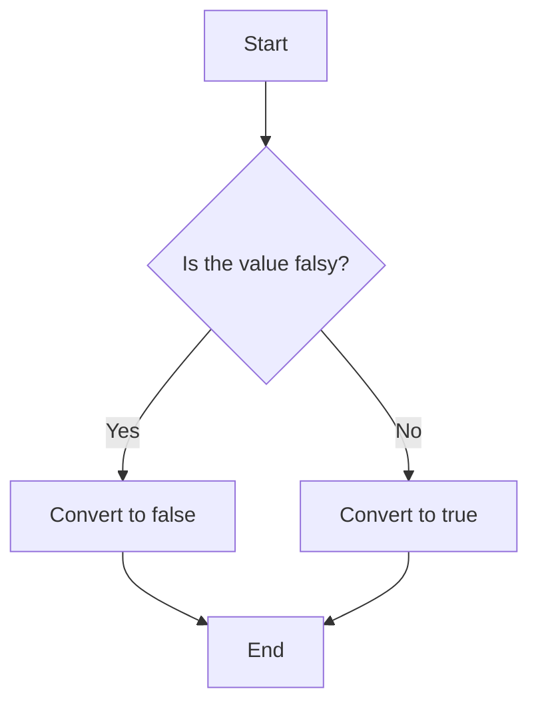

## 7.5. Converting to Boolean

In JavaScript, understanding how to convert values to boolean is crucial for controlling flow and making decisions in your code. This section will guide you through the concept of truthy and falsy values, how to convert values to boolean using the `Boolean()` function, and the double negation technique.

### Understanding Truthy and Falsy Values

JavaScript is a dynamically typed language, meaning that a variable can hold any type of data, and the type can change at runtime. In many situations, JavaScript needs to convert a value to a boolean to evaluate expressions in control structures like `if` statements, loops, and logical operations.

#### What are Truthy and Falsy Values?

In JavaScript, a value is considered **truthy** if it translates to `true` when evaluated in a boolean context. Conversely, a value is **falsy** if it translates to `false`. This implicit conversion is essential for understanding how JavaScript handles conditions and logical expressions.

**Truthy Values**: Any value that is not falsy is considered truthy. This includes:

- Non-zero numbers (e.g., `1`, `-1`, `3.14`)
- Non-empty strings (e.g., `"Hello"`, `"0"`)
- Objects (e.g., `{}`, `[]`)
- Functions

**Falsy Values**: There are only a few values in JavaScript that are considered falsy:

1. `false`
2. `0` (zero)
3. `-0` (negative zero)
4. `0n` (BigInt zero)
5. `""` (empty string)
6. `null`
7. `undefined`
8. `NaN` (Not-a-Number)

Here's a simple code example to illustrate truthy and falsy values:

```javascript
// Falsy values
console.log(Boolean(false));    // false
console.log(Boolean(0));        // false
console.log(Boolean(-0));       // false
console.log(Boolean(0n));       // false
console.log(Boolean(""));       // false
console.log(Boolean(null));     // false
console.log(Boolean(undefined));// false
console.log(Boolean(NaN));      // false

// Truthy values
console.log(Boolean(true));     // true
console.log(Boolean(1));        // true
console.log(Boolean("Hello"));  // true
console.log(Boolean([]));       // true
console.log(Boolean({}));       // true
console.log(Boolean(function(){})); // true
```

### Converting Values to Boolean

There are two primary ways to convert a value to a boolean in JavaScript: using the `Boolean()` function and the double negation technique.

#### Using the `Boolean()` Function

The `Boolean()` function is a built-in JavaScript function that converts a given value to a boolean. It's a straightforward way to explicitly convert any value to its boolean equivalent.

```javascript
let value1 = "Hello";
let value2 = 0;

console.log(Boolean(value1)); // true
console.log(Boolean(value2)); // false
```

In the example above, `"Hello"` is a non-empty string, so it converts to `true`, while `0` is a falsy value, so it converts to `false`.

#### Using Double Negation `!!`

Another common technique to convert a value to a boolean is by using double negation. This involves using the logical NOT operator (`!`) twice. The first negation converts the value to its opposite boolean, and the second negation converts it back to the original boolean value.

```javascript
let value1 = "Hello";
let value2 = 0;

console.log(!!value1); // true
console.log(!!value2); // false
```

The double negation technique is often used because it's concise and can be easily integrated into expressions.

### Practical Examples and Use Cases

Let's explore some practical examples to see how boolean conversion is used in real-world scenarios.

#### Example 1: Conditional Statements

Boolean conversion is frequently used in conditional statements to determine the flow of a program.

```javascript
let userInput = ""; // Simulating an empty user input

if (!userInput) {
    console.log("Input is required!");
} else {
    console.log("User input received.");
}
```

In this example, the `if` statement checks if `userInput` is falsy. Since an empty string is falsy, the message "Input is required!" is logged to the console.

#### Example 2: Default Values

Boolean conversion can also be used to provide default values in functions.

```javascript
function greet(name) {
    name = name || "Guest";
    console.log("Hello, " + name);
}

greet("Alice"); // Hello, Alice
greet();        // Hello, Guest
```

Here, the `||` operator is used to assign a default value of `"Guest"` if `name` is falsy. This is a common pattern in JavaScript to handle optional parameters.

### Visualizing Truthy and Falsy Values

To better understand how JavaScript evaluates truthy and falsy values, let's visualize the process using a flowchart.



In this flowchart, we start with a value and check if it is falsy. If it is, we convert it to `false`; otherwise, we convert it to `true`.

### Try It Yourself

Now that we've covered the basics of converting values to boolean, try experimenting with the following code snippets. Modify the values and observe the output to reinforce your understanding.

```javascript
let testValue1 = "JavaScript";
let testValue2 = 0;
let testValue3 = null;
let testValue4 = "0";

console.log(!!testValue1); // Try changing this value
console.log(!!testValue2); // Try changing this value
console.log(!!testValue3); // Try changing this value
console.log(!!testValue4); // Try changing this value
```

### Knowledge Check

Before we wrap up, let's summarize the key points:

- **Truthy values** are values that convert to `true` in a boolean context.
- **Falsy values** include `false`, `0`, `-0`, `0n`, `""`, `null`, `undefined`, and `NaN`.
- Use the `Boolean()` function or double negation `!!` to convert values to boolean.
- Boolean conversion is essential for controlling flow and making decisions in JavaScript.

### Embrace the Journey

Remember, mastering JavaScript is a journey. As you continue to learn and experiment, you'll become more comfortable with these concepts. Keep practicing, stay curious, and enjoy the process!

## Quiz Time!



### Which of the following is a falsy value in JavaScript?

- [x] 0
- [ ] "false"
- [ ] []
- [ ] {}

> **Explanation:** In JavaScript, `0` is a falsy value. The string `"false"` and empty arrays or objects are considered truthy.

### What does the `Boolean()` function do?

- [x] Converts a value to its boolean equivalent
- [ ] Converts a value to a string
- [ ] Converts a value to a number
- [ ] Converts a value to an object

> **Explanation:** The `Boolean()` function is used to convert a value to its boolean equivalent in JavaScript.

### Which of the following values is truthy?

- [x] "Hello"
- [ ] 0
- [ ] null
- [ ] undefined

> **Explanation:** The string `"Hello"` is a truthy value in JavaScript. The other options are falsy.

### How can you convert a value to a boolean using double negation?

- [x] !!
- [ ] !
- [ ] Boolean()
- [ ] ~

> **Explanation:** Double negation (`!!`) is a technique used to convert a value to a boolean in JavaScript.

### What is the result of `!!"0"`?

- [x] true
- [ ] false
- [ ] NaN
- [ ] undefined

> **Explanation:** The string `"0"` is a non-empty string, which is truthy. Therefore, `!!"0"` evaluates to `true`.

### Which of the following is NOT a falsy value?

- [x] "false"
- [ ] 0
- [ ] NaN
- [ ] undefined

> **Explanation:** The string `"false"` is a truthy value because it is a non-empty string.

### What will `Boolean([])` return?

- [x] true
- [ ] false
- [ ] undefined
- [ ] NaN

> **Explanation:** An empty array `[]` is considered a truthy value in JavaScript, so `Boolean([])` returns `true`.

### What is the output of `Boolean(null)`?

- [ ] true
- [x] false
- [ ] undefined
- [ ] NaN

> **Explanation:** `null` is a falsy value in JavaScript, so `Boolean(null)` returns `false`.

### Which operator is used in JavaScript to check if a value is falsy?

- [x] !
- [ ] &&
- [ ] ||
- [ ] ==

> **Explanation:** The logical NOT operator (`!`) is used to check if a value is falsy by converting it to its opposite boolean value.

### True or False: `Boolean(" ")` returns false.

- [ ] True
- [x] False

> **Explanation:** The string `" "` (a space) is a non-empty string, which is considered truthy in JavaScript. Therefore, `Boolean(" ")` returns `true`.


