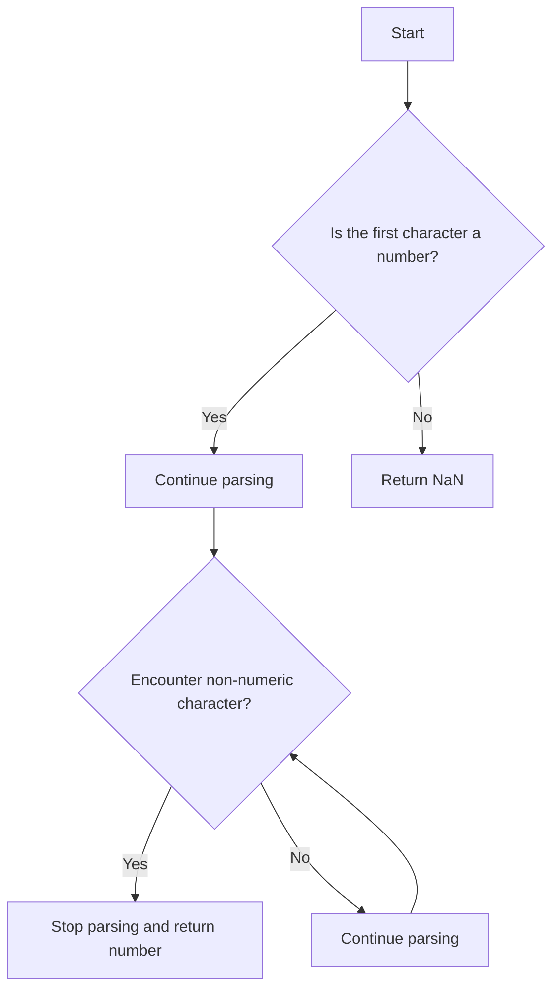

## 7.6. Parsing Numbers from Strings

In JavaScript, dealing with numbers and strings is a common task. Often, you may encounter situations where you need to extract numbers from strings. This is where JavaScript's parsing functions, `parseInt()` and `parseFloat()`, come into play. These functions allow you to convert strings into numbers, enabling you to perform mathematical operations on them. In this section, we'll explore how to use these functions effectively, understand their parameters, and avoid common pitfalls.

### Understanding `parseInt()`

The `parseInt()` function is used to parse a string and return an integer. It takes two arguments: the string to be parsed and an optional radix parameter. The radix parameter specifies the base of the numeral system to be used.

#### Syntax

```javascript
parseInt(string, radix);
```

- **string**: The value to parse. If the string does not start with a number, `parseInt()` returns `NaN`.
- **radix**: An integer between 2 and 36 that represents the base of the numeral system. If omitted, JavaScript assumes the following:
  - Base 10 for strings that do not start with "0x" or "0X".
  - Base 16 for strings that start with "0x" or "0X".

#### Example: Parsing Integers

```javascript
let num1 = parseInt("42"); // 42
let num2 = parseInt("101", 2); // 5 (binary to decimal)
let num3 = parseInt("0xFF"); // 255 (hexadecimal to decimal)

console.log(num1); // 42
console.log(num2); // 5
console.log(num3); // 255
```

In the examples above, `parseInt()` successfully converts the strings into integers. Notice how the radix parameter is used to specify the base for the conversion.

### Importance of the Radix Parameter

The radix parameter is crucial when using `parseInt()`. Without it, you might encounter unexpected results, especially with strings that start with a zero. Let's explore why specifying the radix is important.

#### Example: Radix Pitfalls

```javascript
let num4 = parseInt("08"); // 8 in modern browsers, but may return 0 in older ones
let num5 = parseInt("08", 10); // 8, explicitly specifying base 10

console.log(num4); // 8
console.log(num5); // 8
```

In older JavaScript versions, strings starting with "0" were interpreted as octal (base 8). This behavior is not consistent across all environments, so it's best practice to always specify the radix.

### Common Pitfalls with `parseInt()`

While `parseInt()` is powerful, it has some quirks that can lead to unexpected results. Let's explore some common pitfalls.

#### Leading Zeros

As mentioned earlier, leading zeros can cause issues if the radix is not specified. Always specify the radix to avoid ambiguity.

#### Non-Numeric Characters

`parseInt()` stops parsing as soon as it encounters a non-numeric character. This can lead to partial parsing.

```javascript
let num6 = parseInt("123abc"); // 123
let num7 = parseInt("abc123"); // NaN

console.log(num6); // 123
console.log(num7); // NaN
```

In the first example, `parseInt()` stops parsing at "a" and returns 123. In the second example, since the string does not start with a number, it returns `NaN`.

### Introducing `parseFloat()`

While `parseInt()` is great for integers, `parseFloat()` is used for parsing floating-point numbers. It only takes one argument: the string to be parsed.

#### Syntax

```javascript
parseFloat(string);
```

- **string**: The value to parse. If the string does not start with a number, `parseFloat()` returns `NaN`.

#### Example: Parsing Floats

```javascript
let float1 = parseFloat("3.14"); // 3.14
let float2 = parseFloat("10.5abc"); // 10.5
let float3 = parseFloat("abc10.5"); // NaN

console.log(float1); // 3.14
console.log(float2); // 10.5
console.log(float3); // NaN
```

Like `parseInt()`, `parseFloat()` stops parsing when it encounters a non-numeric character. However, it does not have a radix parameter, as it is designed to parse decimal numbers.

### Common Pitfalls with `parseFloat()`

#### Non-Numeric Characters

Just like `parseInt()`, `parseFloat()` stops parsing at the first non-numeric character.

```javascript
let float4 = parseFloat("123.45abc"); // 123.45
let float5 = parseFloat("abc123.45"); // NaN

console.log(float4); // 123.45
console.log(float5); // NaN
```

### Visualizing the Parsing Process

To better understand how `parseInt()` and `parseFloat()` work, let's visualize the parsing process using a flowchart.



In this flowchart, we see that both `parseInt()` and `parseFloat()` start by checking if the first character is a number. If not, they return `NaN`. If it is, they continue parsing until they encounter a non-numeric character, at which point they stop and return the parsed number.

### Practical Examples and Exercises

Let's put our knowledge into practice with some examples and exercises.

#### Example 1: Parsing User Input

Imagine you have a form where users input their age. You want to ensure the input is parsed as an integer.

```javascript
function getUserAge(input) {
    let age = parseInt(input, 10);
    if (isNaN(age)) {
        console.log("Please enter a valid number.");
    } else {
        console.log("Your age is " + age);
    }
}

getUserAge("25"); // Your age is 25
getUserAge("25 years"); // Your age is 25
getUserAge("years 25"); // Please enter a valid number.
```

In this example, we use `parseInt()` with a radix of 10 to ensure the input is parsed as a decimal number. We also check if the result is `NaN` to handle invalid inputs.

#### Example 2: Parsing Prices

Suppose you have a list of product prices as strings, and you want to calculate the total cost.

```javascript
function calculateTotal(prices) {
    let total = 0;
    for (let price of prices) {
        let parsedPrice = parseFloat(price);
        if (!isNaN(parsedPrice)) {
            total += parsedPrice;
        }
    }
    return total;
}

let prices = ["19.99", "5.99", "invalid", "12.50"];
console.log("Total cost: $" + calculateTotal(prices)); // Total cost: $38.48
```

Here, we use `parseFloat()` to parse each price and add it to the total if it's a valid number.

### Try It Yourself

Now it's your turn! Try modifying the examples above to see how `parseInt()` and `parseFloat()` behave with different inputs. Experiment with different radix values and observe how they affect the parsing process.

### Key Takeaways

- **Use `parseInt()` for integers**: Remember to specify the radix to avoid unexpected results.
- **Use `parseFloat()` for floating-point numbers**: It does not have a radix parameter, as it is designed for decimal numbers.
- **Handle non-numeric characters**: Both functions stop parsing at the first non-numeric character.
- **Check for `NaN`**: Always check if the result is `NaN` to handle invalid inputs gracefully.

### References and Further Reading

- [MDN Web Docs: `parseInt()`](https://developer.mozilla.org/en-US/docs/Web/JavaScript/Reference/Global_Objects/parseInt)
- [MDN Web Docs: `parseFloat()`](https://developer.mozilla.org/en-US/docs/Web/JavaScript/Reference/Global_Objects/parseFloat)
- [W3Schools: JavaScript Number Methods](https://www.w3schools.com/js/js_number_methods.asp)

### Embrace the Journey

Parsing numbers from strings is a fundamental skill in JavaScript. As you continue your journey, you'll encounter more complex scenarios where these functions will be invaluable. Keep experimenting, stay curious, and enjoy the process of learning and growing as a developer!

## Quiz Time!



### What does `parseInt("10", 2)` return?

- [x] 2
- [ ] 10
- [ ] 8
- [ ] NaN

> **Explanation:** The string "10" is parsed as a binary number (base 2), which is 2 in decimal.

### What does `parseFloat("3.14abc")` return?

- [x] 3.14
- [ ] NaN
- [ ] 3
- [ ] 0

> **Explanation:** `parseFloat()` parses the string until it encounters a non-numeric character, returning 3.14.

### What is the default radix for `parseInt()` if not specified?

- [ ] 8
- [x] 10
- [ ] 16
- [ ] 2

> **Explanation:** The default radix is 10, unless the string starts with "0x" or "0X", which indicates hexadecimal.

### What does `parseInt("0xF")` return?

- [x] 15
- [ ] 0
- [ ] NaN
- [ ] 16

> **Explanation:** "0xF" is a hexadecimal number, and `parseInt()` correctly parses it as 15.

### What does `parseInt("08", 10)` return?

- [x] 8
- [ ] 0
- [ ] NaN
- [ ] 10

> **Explanation:** Specifying the radix as 10 ensures the string "08" is parsed as a decimal number, returning 8.

### What does `parseFloat("abc123.45")` return?

- [ ] 123.45
- [ ] 0
- [ ] NaN
- [x] NaN

> **Explanation:** Since the string does not start with a number, `parseFloat()` returns `NaN`.

### What does `parseInt("123abc")` return?

- [x] 123
- [ ] NaN
- [ ] 0
- [ ] 1

> **Explanation:** `parseInt()` parses the string until it encounters a non-numeric character, returning 123.

### What does `parseFloat("00123.45")` return?

- [x] 123.45
- [ ] 123
- [ ] 0
- [ ] NaN

> **Explanation:** Leading zeros are ignored, and `parseFloat()` returns 123.45.

### What does `parseInt("101", 2)` return?

- [x] 5
- [ ] 101
- [ ] 2
- [ ] NaN

> **Explanation:** The string "101" is parsed as a binary number (base 2), which is 5 in decimal.

### True or False: `parseFloat()` has a radix parameter.

- [ ] True
- [x] False

> **Explanation:** `parseFloat()` does not have a radix parameter; it is designed to parse decimal numbers.


