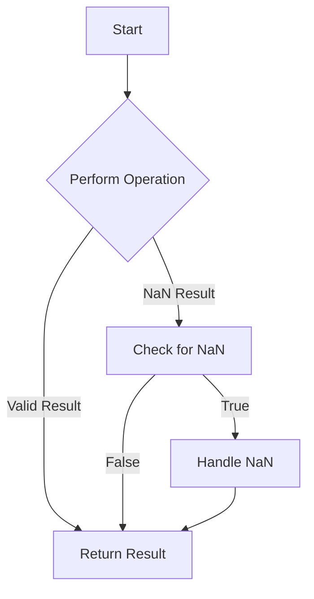

## 7.7. Dealing with `NaN`

In our journey through JavaScript, we've encountered various data types and operations. One peculiar value that often puzzles beginners is `NaN`, which stands for "Not-a-Number". Despite its name, `NaN` is a numeric data type in JavaScript. Let's dive deep into understanding what `NaN` signifies, how it can occur, and how to handle it effectively in your code.

### What is `NaN`?

`NaN` is a special value in JavaScript that represents a computational error. It is part of the `Number` type, but it signifies that a particular operation did not yield a valid number. This can be confusing at first, as you might expect a numeric type to always represent numbers. However, `NaN` is used to indicate that something went wrong during a numeric operation.

#### When Does `NaN` Occur?

`NaN` typically arises in situations where a mathematical operation fails to produce a meaningful result. Here are some common scenarios:

- **Invalid Mathematical Operations**: Operations that don't make sense mathematically, such as dividing zero by zero, result in `NaN`.
  
  ```javascript
  let result = 0 / 0; // NaN
  ```

- **Parsing Errors**: When you attempt to convert a non-numeric string to a number using `parseInt` or `parseFloat`, and the conversion fails, the result is `NaN`.

  ```javascript
  let number = parseInt("Hello"); // NaN
  ```

- **Indeterminate Forms**: Operations that are mathematically undefined, such as the square root of a negative number, can also yield `NaN`.

  ```javascript
  let sqrtNegative = Math.sqrt(-1); // NaN
  ```

- **Invalid Arithmetic Operations**: Using arithmetic operators on non-numeric values can lead to `NaN`.

  ```javascript
  let invalidOperation = "text" - 5; // NaN
  ```

### Checking for `NaN`

JavaScript provides built-in functions to check for `NaN` values. However, checking for `NaN` is not as straightforward as comparing it with itself or other numbers, because `NaN` is unique in that it is not equal to any value, including itself.

#### Using `isNaN()`

The `isNaN()` function is a global function that checks whether a value is `NaN`. However, it has a quirk: it first converts the value to a number before checking if it is `NaN`. This can lead to unexpected results.

```javascript
console.log(isNaN("Hello")); // true, because "Hello" is converted to NaN
console.log(isNaN(123)); // false, because 123 is a valid number
```

#### Using `Number.isNaN()`

To address the shortcomings of `isNaN()`, ECMAScript 2015 (ES6) introduced `Number.isNaN()`. This method checks if a value is `NaN` without converting it to a number first, making it a more reliable choice.

```javascript
console.log(Number.isNaN("Hello")); // false, because "Hello" is not NaN
console.log(Number.isNaN(NaN)); // true, because the value is NaN
```

### Preventing Unintended `NaN` Values

To avoid encountering `NaN` in your code, consider the following strategies:

#### Validate Input

Before performing operations on user input or external data, validate that the data is numeric. This can prevent `NaN` from arising due to invalid input.

```javascript
function safeDivide(a, b) {
  if (typeof a !== 'number' || typeof b !== 'number') {
    return 'Invalid input';
  }
  return a / b;
}

console.log(safeDivide(10, 2)); // 5
console.log(safeDivide(10, 'two')); // 'Invalid input'
```

#### Use Default Values

When parsing strings to numbers, provide default values to handle cases where the conversion fails.

```javascript
let input = "abc";
let parsedNumber = parseInt(input) || 0; // Defaults to 0 if parsing fails
console.log(parsedNumber); // 0
```

#### Check for `NaN` After Operations

After performing operations that might result in `NaN`, check the result and handle it appropriately.

```javascript
let result = Math.sqrt(-1);
if (Number.isNaN(result)) {
  console.log("Operation resulted in NaN");
}
```

### Visualizing `NaN` Handling

To better understand how `NaN` is handled in JavaScript, let's visualize the process using a flowchart.



**Figure 1**: This flowchart illustrates the process of performing an operation, checking for `NaN`, and handling it if necessary.

### Try It Yourself

Experiment with the following code snippets to get a hands-on understanding of `NaN`:

1. **Modify the Input**: Change the input values to see how they affect the result.

   ```javascript
   let value = "123abc";
   let number = parseInt(value);
   console.log(Number.isNaN(number)); // Try with different inputs
   ```

2. **Add Error Handling**: Implement error handling in a function that performs arithmetic operations.

   ```javascript
   function calculateSquareRoot(value) {
     let result = Math.sqrt(value);
     if (Number.isNaN(result)) {
       console.log("Cannot calculate square root of negative number");
     } else {
       console.log("Square root is: " + result);
     }
   }

   calculateSquareRoot(-9); // Try with different values
   ```

### Knowledge Check

Before we conclude, let's reinforce what we've learned about `NaN`:

- **`NaN` signifies a computational error** in numeric operations.
- **Common causes** of `NaN` include invalid operations, parsing errors, and indeterminate forms.
- **`isNaN()` and `Number.isNaN()`** are functions to check for `NaN`, with `Number.isNaN()` being more reliable.
- **Prevent `NaN`** by validating input, using default values, and checking results after operations.

### Embrace the Journey

Remember, dealing with `NaN` is just one of the many challenges you'll encounter as you learn JavaScript. As you progress, you'll become more adept at handling errors and writing robust code. Keep experimenting, stay curious, and enjoy the journey!

## Quiz Time!



### What does `NaN` stand for in JavaScript?

- [x] Not-a-Number
- [ ] Not-a-Null
- [ ] Not-a-Node
- [ ] Not-a-Name

> **Explanation:** `NaN` stands for "Not-a-Number" and represents a computational error in numeric operations.

### Which function is more reliable for checking `NaN` without type conversion?

- [ ] isNaN()
- [x] Number.isNaN()
- [ ] parseInt()
- [ ] parseFloat()

> **Explanation:** `Number.isNaN()` is more reliable as it checks for `NaN` without converting the value to a number first.

### What will `console.log(isNaN("Hello"))` output?

- [x] true
- [ ] false
- [ ] NaN
- [ ] undefined

> **Explanation:** `isNaN("Hello")` returns true because "Hello" is converted to `NaN`.

### What will `console.log(Number.isNaN("Hello"))` output?

- [ ] true
- [x] false
- [ ] NaN
- [ ] undefined

> **Explanation:** `Number.isNaN("Hello")` returns false because "Hello" is not `NaN`.

### Which operation will result in `NaN`?

- [x] 0 / 0
- [ ] 10 / 2
- [ ] Math.sqrt(4)
- [ ] 5 + 5

> **Explanation:** Dividing zero by zero is an invalid operation and results in `NaN`.

### How can you prevent `NaN` when parsing a string to a number?

- [x] Use default values
- [ ] Ignore the result
- [ ] Use `isNaN()` only
- [ ] Use `typeof` only

> **Explanation:** Using default values ensures that if parsing fails, a fallback value is used instead of `NaN`.

### What will `console.log(Number.isNaN(NaN))` output?

- [x] true
- [ ] false
- [ ] NaN
- [ ] undefined

> **Explanation:** `Number.isNaN(NaN)` returns true because the value is indeed `NaN`.

### Which method converts a non-numeric string to `NaN`?

- [x] parseInt()
- [ ] toString()
- [ ] toFixed()
- [ ] toPrecision()

> **Explanation:** `parseInt()` attempts to convert a string to a number, resulting in `NaN` if the string is non-numeric.

### What is a common strategy to handle `NaN` in arithmetic operations?

- [x] Validate input
- [ ] Ignore `NaN`
- [ ] Use `typeof`
- [ ] Use `instanceof`

> **Explanation:** Validating input ensures that only numeric values are used in arithmetic operations, preventing `NaN`.

### True or False: `NaN` is equal to itself.

- [ ] True
- [x] False

> **Explanation:** `NaN` is unique in that it is not equal to any value, including itself.


