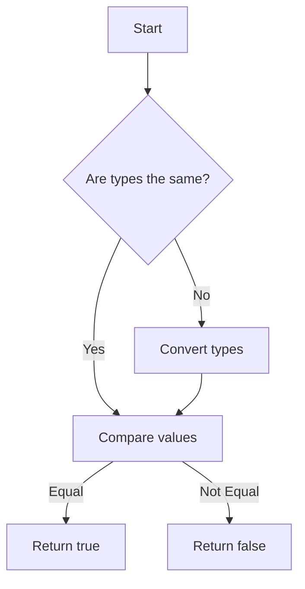

## 7.8. Equality Operators: `==` vs. `===`

In JavaScript, comparing values is a fundamental operation that you'll encounter frequently. Understanding how to do this correctly is crucial for writing reliable and bug-free code. JavaScript provides two primary equality operators: `==` (loose equality) and `===` (strict equality). While they might seem similar at first glance, they behave quite differently, especially when it comes to type coercion. In this section, we'll explore these differences, provide examples, and discuss best practices to help you decide which operator to use in various situations.

### Understanding Loose Equality (`==`)

The loose equality operator `==` compares two values for equality after converting both values to a common type. This process is known as type coercion. While this can be convenient, it can also lead to unexpected results if you're not careful.

#### How Type Coercion Works with `==`

When you use `==`, JavaScript attempts to convert the operands to the same type before making the comparison. This can lead to some surprising results, as shown in the examples below.

```javascript
console.log(5 == '5'); // true
console.log(false == 0); // true
console.log(null == undefined); // true
console.log('' == false); // true
```

In the first example, the string `'5'` is coerced into the number `5` before the comparison, resulting in `true`. Similarly, `false` is coerced to `0`, and both `null` and `undefined` are considered equal when using `==`.

#### Common Pitfalls with `==`

The implicit type conversion that occurs with `==` can lead to bugs that are difficult to track down. For example:

```javascript
console.log(' \t\r\n' == 0); // true
```

Here, a string containing only whitespace characters is coerced into the number `0`, resulting in `true`. Such behavior is often counterintuitive and can lead to errors if not carefully managed.

### Understanding Strict Equality (`===`)

The strict equality operator `===` compares both the value and the type of the operands. This means that no type conversion is performed, and the comparison is more predictable.

#### Examples of `===` in Action

With `===`, the values must be of the same type to be considered equal:

```javascript
console.log(5 === '5'); // false
console.log(false === 0); // false
console.log(null === undefined); // false
console.log('' === false); // false
```

As you can see, `===` provides a more reliable comparison because it does not perform type coercion. This makes it easier to understand and predict the behavior of your code.

### Best Practices for Using Equality Operators

#### Prefer `===` Over `==`

In most cases, it's advisable to use `===` over `==` to avoid unexpected type coercion. This ensures that both the value and the type are the same, leading to fewer bugs and more readable code.

#### Use `==` Only When Necessary

There are specific scenarios where `==` might be useful, such as when you want to check for both `null` and `undefined`:

```javascript
function checkValue(value) {
  if (value == null) {
    console.log('Value is either null or undefined');
  }
}
```

In this case, `value == null` will return `true` for both `null` and `undefined`, which can be convenient.

#### Avoid Common Mistakes

Be cautious of using `==` with non-primitive types like objects and arrays, as the results can be misleading:

```javascript
console.log([] == false); // true
console.log({} == false); // false
```

In the first example, an empty array is coerced to `false`, while an empty object is not. Such behavior can be confusing and is best avoided by using `===`.

### Visualizing Type Coercion

To better understand how type coercion works with `==`, let's visualize the process using a flowchart.



This flowchart illustrates the decision-making process when using `==`. If the types are the same, the values are compared directly. If not, JavaScript attempts to convert the types before making the comparison.

### Try It Yourself

Experiment with the following code examples to see how `==` and `===` behave differently. Try modifying the values and observe the results.

```javascript
// Example 1: Loose Equality
console.log('10' == 10); // true
console.log(true == 1); // true
console.log(false == 0); // true

// Example 2: Strict Equality
console.log('10' === 10); // false
console.log(true === 1); // false
console.log(false === 0); // false
```

### Summary

Understanding the differences between `==` and `===` is crucial for writing effective JavaScript code. While `==` can be useful in some situations, it often leads to unexpected results due to type coercion. On the other hand, `===` provides a more predictable and reliable comparison by ensuring both the value and type are the same. By following best practices and being aware of common pitfalls, you can avoid many common bugs and write cleaner, more maintainable code.

### Further Reading

For more information on equality operators and type coercion, check out the following resources:

- [MDN Web Docs: Equality comparisons and sameness](https://developer.mozilla.org/en-US/docs/Web/JavaScript/Equality_comparisons_and_sameness)
- [JavaScript Equality Table](https://dorey.github.io/JavaScript-Equality-Table/)

## Quiz Time!



### Which operator performs type coercion?

- [x] `==`
- [ ] `===`
- [ ] Both `==` and `===`
- [ ] Neither `==` nor `===`

> **Explanation:** The `==` operator performs type coercion, while `===` does not.

### What will `5 == '5'` evaluate to?

- [x] true
- [ ] false

> **Explanation:** The `==` operator coerces the string `'5'` to the number `5`, resulting in `true`.

### What will `5 === '5'` evaluate to?

- [ ] true
- [x] false

> **Explanation:** The `===` operator checks both value and type, so `5` and `'5'` are not strictly equal.

### Which operator should you generally prefer to use?

- [ ] `==`
- [x] `===`

> **Explanation:** It's generally recommended to use `===` to avoid unexpected type coercion.

### What will `null == undefined` evaluate to?

- [x] true
- [ ] false

> **Explanation:** The `==` operator considers `null` and `undefined` equal.

### What will `null === undefined` evaluate to?

- [ ] true
- [x] false

> **Explanation:** The `===` operator checks both value and type, so `null` and `undefined` are not strictly equal.

### What will `[] == false` evaluate to?

- [x] true
- [ ] false

> **Explanation:** The `==` operator coerces the empty array `[]` to `false`.

### What will `{} == false` evaluate to?

- [ ] true
- [x] false

> **Explanation:** The `==` operator does not coerce an empty object `{}` to `false`.

### Which operator checks both value and type?

- [ ] `==`
- [x] `===`

> **Explanation:** The `===` operator checks both value and type, while `==` only checks value after type coercion.

### Is it true that `==` and `===` will always give the same result?

- [ ] True
- [x] False

> **Explanation:** `==` and `===` can give different results due to type coercion in `==`.



Remember, this is just the beginning. As you progress, you'll build more complex and interactive web pages. Keep experimenting, stay curious, and enjoy the journey!
