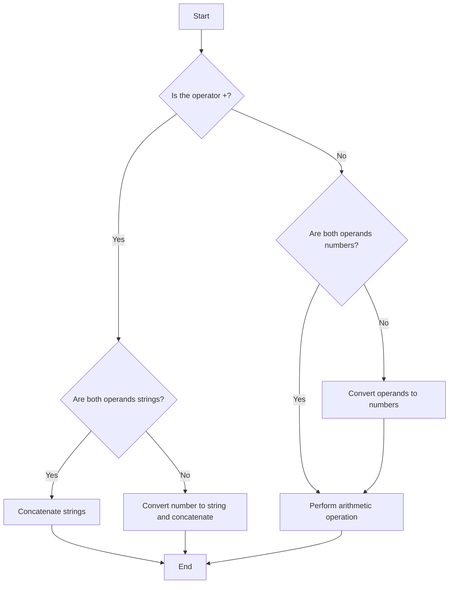

## 7.9. Common Pitfalls in Type Conversion

In the world of JavaScript, type conversion and coercion are common occurrences that can lead to unexpected results if not handled carefully. As an absolute beginner, understanding these pitfalls is crucial for writing robust and error-free code. In this section, we will explore some of the most common issues that arise during type conversion, provide examples of these pitfalls, and offer strategies for writing defensive code to avoid them.

### Understanding Type Conversion and Coercion

Before diving into the pitfalls, let's briefly revisit the concepts of type conversion and coercion. **Type conversion** is the process of converting a value from one data type to another. This can be done explicitly by the programmer or implicitly by JavaScript itself, which is known as **type coercion**.

#### Implicit Type Coercion

JavaScript often performs type coercion automatically, converting values to the expected type in certain contexts. For example, when using the `+` operator with a string and a number, JavaScript will coerce the number to a string and concatenate them:

```javascript
let result = "5" + 3; // "53"
```

#### Explicit Type Conversion

Explicit type conversion, on the other hand, is when the programmer deliberately converts a value using functions like `Number()`, `String()`, or `Boolean()`:

```javascript
let num = Number("5"); // 5
```

### Common Pitfalls in Type Conversion

Now that we have a basic understanding of type conversion and coercion, let's explore some common pitfalls that can occur during these processes.

#### 1. Unexpected Type Coercion

One of the most frequent issues in JavaScript is unexpected type coercion. This occurs when JavaScript automatically converts a value to a different type, leading to results that may not align with your expectations.

**Example:**

```javascript
let result = "5" - 3; // 2
```

In this example, JavaScript coerces the string `"5"` to a number and performs subtraction. This might not be immediately obvious, especially for beginners.

**Tip:** Always be cautious when mixing different data types in operations. Use explicit type conversion to ensure clarity.

#### 2. Arithmetic Operations with Non-Numeric Strings

When performing arithmetic operations, non-numeric strings can lead to unexpected results. JavaScript will attempt to convert the string to a number, but if it fails, the result will be `NaN` (Not-a-Number).

**Example:**

```javascript
let result = "hello" * 2; // NaN
```

**Tip:** Validate input data to ensure it is numeric before performing arithmetic operations.

#### 3. Comparisons with `==` vs. `===`

JavaScript provides two types of equality operators: `==` (loose equality) and `===` (strict equality). The `==` operator performs type coercion, which can lead to unexpected results.

**Example:**

```javascript
console.log(0 == false);  // true
console.log(0 === false); // false
```

In the first comparison, `0` is coerced to `false`, resulting in `true`. The strict equality operator `===` does not perform coercion, so the comparison is `false`.

**Tip:** Prefer using `===` to avoid unexpected type coercion.

#### 4. Misleading `null` and `undefined` Comparisons

Both `null` and `undefined` represent the absence of a value, but they behave differently in comparisons. Using `==` can lead to unexpected results due to type coercion.

**Example:**

```javascript
console.log(null == undefined);  // true
console.log(null === undefined); // false
```

**Tip:** Use `===` to avoid confusion between `null` and `undefined`.

#### 5. String Concatenation with Numbers

When using the `+` operator with strings and numbers, JavaScript will concatenate them as strings. This can lead to unexpected results if you intended to perform arithmetic.

**Example:**

```javascript
let result = "10" + 5; // "105"
```

**Tip:** Convert strings to numbers explicitly before performing arithmetic operations.

#### 6. Boolean Conversion Pitfalls

JavaScript coerces values to booleans in contexts like conditionals. However, some values can be misleading.

**Example:**

```javascript
let value = "0";
if (value) {
  console.log("This is true!"); // This will be logged
}
```

In this example, the string `"0"` is truthy, so the condition evaluates to `true`.

**Tip:** Be aware of truthy and falsy values in JavaScript. Use explicit boolean conversion if necessary.

### Defensive Coding Strategies

To avoid these common pitfalls, consider adopting the following defensive coding strategies:

#### 1. Use Explicit Type Conversion

Whenever possible, use explicit type conversion to make your intentions clear. This reduces the risk of unexpected type coercion.

**Example:**

```javascript
let num = Number("5");
let str = String(5);
let bool = Boolean(1);
```

#### 2. Validate Input Data

Before performing operations on data, validate it to ensure it is of the expected type. This is especially important for user input.

**Example:**

```javascript
function addNumbers(a, b) {
  if (typeof a !== "number" || typeof b !== "number") {
    throw new Error("Both arguments must be numbers");
  }
  return a + b;
}
```

#### 3. Use Strict Equality

Prefer using `===` and `!==` for comparisons to avoid unexpected type coercion.

**Example:**

```javascript
if (value === null) {
  console.log("Value is null");
}
```

#### 4. Be Cautious with `+` Operator

When using the `+` operator, be mindful of whether you are performing arithmetic or string concatenation. Convert values explicitly if needed.

**Example:**

```javascript
let sum = Number("10") + 5; // 15
```

#### 5. Understand Truthy and Falsy Values

Familiarize yourself with JavaScript's truthy and falsy values to avoid unexpected behavior in conditionals.

**Example:**

```javascript
let values = [0, "", null, undefined, NaN, false];
values.forEach(value => {
  if (!value) {
    console.log(`${value} is falsy`);
  }
});
```

### Visualizing Type Conversion Pitfalls

To better understand how JavaScript handles type conversion, let's visualize the process using a flowchart. This diagram illustrates the decision-making process JavaScript follows when performing type coercion in arithmetic operations.



**Diagram Explanation:**

- **Start**: The process begins when an arithmetic operation is encountered.
- **Operator Check**: JavaScript first checks if the operator is `+`.
- **String Concatenation**: If both operands are strings, they are concatenated.
- **Number Conversion**: If one operand is a string, it is converted to a number for arithmetic operations.
- **Arithmetic Operation**: If both operands are numbers, the operation is performed.
- **End**: The process concludes with the result of the operation.

### Try It Yourself

To reinforce your understanding, try modifying the following code examples to see how different type conversions affect the output:

```javascript
// Experiment with string and number concatenation
let result1 = "10" + 5; // Modify to perform arithmetic
console.log(result1);

// Experiment with boolean conversion
let value = "0";
if (value) {
  console.log("This is true!"); // Modify to check falsy values
}

// Experiment with comparisons
console.log(0 == false);  // Modify to use strict equality
console.log(null == undefined); // Modify to use strict equality
```

### References and Further Reading

For more in-depth information on JavaScript type conversion and coercion, consider exploring the following resources:

- [MDN Web Docs: Type Conversion](https://developer.mozilla.org/en-US/docs/Web/JavaScript/Guide/Expressions_and_Operators#type_conversions)
- [W3Schools: JavaScript Type Conversion](https://www.w3schools.com/js/js_type_conversion.asp)

### Knowledge Check

Let's summarize the key takeaways from this section:

- **Type coercion** occurs automatically in JavaScript and can lead to unexpected results.
- **Explicit type conversion** is recommended to ensure clarity and prevent errors.
- **Loose equality (`==`)** can lead to misleading comparisons due to type coercion.
- **Truthy and falsy values** can affect conditional logic in unexpected ways.
- **Defensive coding** strategies, such as input validation and using strict equality, help avoid common pitfalls.

Remember, this is just the beginning of your journey with JavaScript. As you continue to learn and practice, you'll become more adept at handling type conversion and writing robust code. Keep experimenting, stay curious, and enjoy the journey!

## Quiz Time!



### Which operator can lead to unexpected string concatenation when used with numbers?

- [x] +
- [ ] -
- [ ] *
- [ ] /

> **Explanation:** The `+` operator can lead to string concatenation when used with strings and numbers, resulting in unexpected outcomes.

### What is the result of `"5" - 3` in JavaScript?

- [x] 2
- [ ] "53"
- [ ] NaN
- [ ] 8

> **Explanation:** JavaScript coerces the string `"5"` to a number and performs subtraction, resulting in `2`.

### Which equality operator should you use to avoid type coercion?

- [x] ===
- [ ] ==
- [ ] !=
- [ ] =

> **Explanation:** The `===` operator performs strict equality checks without type coercion, preventing unexpected results.

### What is the result of `null == undefined` in JavaScript?

- [x] true
- [ ] false
- [ ] NaN
- [ ] null

> **Explanation:** The loose equality operator `==` considers `null` and `undefined` equal, resulting in `true`.

### Which of the following is a truthy value in JavaScript?

- [x] "0"
- [ ] 0
- [ ] null
- [ ] undefined

> **Explanation:** The string `"0"` is a truthy value in JavaScript, while `0`, `null`, and `undefined` are falsy.

### What is the result of `Number("hello")` in JavaScript?

- [x] NaN
- [ ] 0
- [ ] "hello"
- [ ] undefined

> **Explanation:** The `Number()` function cannot convert the string `"hello"` to a number, resulting in `NaN`.

### Which method can you use to explicitly convert a value to a string?

- [x] String()
- [ ] Number()
- [ ] Boolean()
- [ ] parseInt()

> **Explanation:** The `String()` function explicitly converts a value to a string.

### What is the result of `Boolean(0)` in JavaScript?

- [x] false
- [ ] true
- [ ] NaN
- [ ] undefined

> **Explanation:** The number `0` is a falsy value in JavaScript, so `Boolean(0)` returns `false`.

### Which of the following is a defensive coding strategy to avoid type conversion pitfalls?

- [x] Use explicit type conversion
- [ ] Use loose equality
- [ ] Avoid input validation
- [ ] Ignore truthy and falsy values

> **Explanation:** Using explicit type conversion is a defensive coding strategy to prevent unexpected type coercion.

### True or False: JavaScript automatically converts `null` to `0` in arithmetic operations.

- [ ] True
- [x] False

> **Explanation:** JavaScript does not automatically convert `null` to `0` in arithmetic operations. It treats `null` as `0` only in specific contexts, such as when using the `+` operator with numbers.


