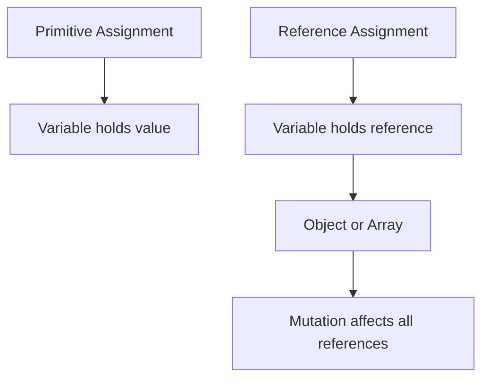

## 8.1. Variable Assignment and Mutation

In this section, we will delve into the concepts of variable assignment and mutation in JavaScript. As you embark on your journey to mastering JavaScript, understanding these fundamental concepts will empower you to write more effective and efficient code. Let's explore how JavaScript handles variable assignment, the difference between assignment and mutation, and the implications of these concepts on program state.

### Understanding Variable Assignment

Variable assignment in JavaScript is the process of storing a value in a variable. This is a basic yet crucial operation in programming, as it allows us to manipulate and store data for later use. Let's break down this concept further.

#### The Assignment Operator

The assignment operator in JavaScript is the equal sign (`=`). It is used to assign a value to a variable. Here's a simple example:

```javascript
let myNumber = 10; // Assigns the value 10 to the variable myNumber
```

In this example, the value `10` is assigned to the variable `myNumber`. The assignment operator takes the value on the right and assigns it to the variable on the left.

#### Multiple Assignments

JavaScript allows for multiple assignments in a single line. This can be particularly useful when initializing multiple variables with the same value:

```javascript
let a, b, c;
a = b = c = 5; // Assigns the value 5 to variables a, b, and c
```

In this example, the value `5` is assigned to `c`, then `c` is assigned to `b`, and finally `b` is assigned to `a`. All three variables end up with the value `5`.

### Differentiating Assignment and Mutation

While assignment is the act of giving a variable a value, mutation refers to changing the contents of a data structure without changing its reference. This distinction is crucial when working with objects and arrays in JavaScript.

#### Primitive vs. Reference Types

Before we dive into mutation, it's important to understand the difference between primitive and reference types in JavaScript.

- **Primitive Types**: These include `number`, `string`, `boolean`, `null`, `undefined`, `symbol`, and `bigint`. They are immutable, meaning their values cannot be changed once created. When you assign a primitive value to a variable, the actual value is stored in the variable.

- **Reference Types**: These include `objects`, `arrays`, and `functions`. They are mutable, meaning their contents can be changed. When you assign a reference type to a variable, the reference (or address) to the value is stored, not the actual value.

#### Example of Assignment with Primitives

Let's see how assignment works with primitive types:

```javascript
let x = 10;
let y = x; // y is assigned the value of x, which is 10

x = 20; // Changing x does not affect y
console.log(y); // Outputs: 10
```

In this example, `x` and `y` are independent variables. Changing `x` does not affect `y` because they hold separate copies of the value.

#### Example of Mutation with Reference Types

Now, let's explore mutation with reference types:

```javascript
let arr1 = [1, 2, 3];
let arr2 = arr1; // arr2 is assigned the reference to arr1

arr1.push(4); // Mutates arr1 by adding a new element
console.log(arr2); // Outputs: [1, 2, 3, 4]
```

In this example, `arr1` and `arr2` point to the same array in memory. Mutating `arr1` affects `arr2` because they both reference the same object.

### Assigning Values to Variables

Assigning values to variables is straightforward in JavaScript, but it's important to understand the nuances of how different types are handled.

#### Assigning Primitive Values

When you assign a primitive value, you are directly assigning the value to the variable:

```javascript
let greeting = "Hello, World!";
let isJavaScriptFun = true;
```

In these examples, the string `"Hello, World!"` and the boolean `true` are directly stored in the variables `greeting` and `isJavaScriptFun`, respectively.

#### Assigning Reference Values

When you assign a reference value, you are assigning a reference to the object or array:

```javascript
let person = { name: "Alice", age: 25 };
let numbers = [1, 2, 3, 4, 5];
```

Here, `person` holds a reference to an object, and `numbers` holds a reference to an array.

### Mutation of Objects and Arrays

One of the powerful features of JavaScript is the ability to mutate objects and arrays, even when they are declared with `const`. This can be both a blessing and a curse, depending on how it's used.

#### Mutating Objects

Objects in JavaScript are mutable, meaning you can change their properties even after they are created:

```javascript
const car = { brand: "Toyota", model: "Corolla" };
car.model = "Camry"; // Mutates the car object
console.log(car); // Outputs: { brand: "Toyota", model: "Camry" }
```

In this example, the `model` property of the `car` object is changed from `"Corolla"` to `"Camry"`, demonstrating mutation.

#### Mutating Arrays

Similarly, arrays are mutable, and you can change their contents:

```javascript
const fruits = ["apple", "banana", "cherry"];
fruits.push("date"); // Mutates the fruits array
console.log(fruits); // Outputs: ["apple", "banana", "cherry", "date"]
```

Here, the `push` method is used to add a new element to the `fruits` array, demonstrating mutation.

### Implications of Variable Mutation

Understanding the implications of variable mutation is crucial for writing robust JavaScript code. Let's explore how mutation affects program state and what you should be aware of.

#### Shared References

When multiple variables reference the same object or array, changes to one variable can affect the others. This can lead to unintended side effects if not managed carefully.

```javascript
let original = { value: 42 };
let copy = original; // copy references the same object as original

copy.value = 100; // Mutates the object
console.log(original.value); // Outputs: 100
```

In this example, changing `copy` also changes `original` because they reference the same object.

#### Avoiding Unintended Mutations

To avoid unintended mutations, consider creating copies of objects or arrays when necessary. JavaScript provides several methods for copying data structures:

- **Shallow Copy**: Creates a new object or array with the same top-level properties. Changes to nested objects or arrays will still affect the original.

  ```javascript
  let shallowCopy = { ...original }; // Shallow copy using spread operator
  ```

- **Deep Copy**: Creates a completely independent copy of an object or array, including nested structures. This can be achieved using libraries like Lodash or by manually copying each level.

  ```javascript
  let deepCopy = JSON.parse(JSON.stringify(original)); // Deep copy using JSON methods
  ```

#### Immutable Data Structures

For certain applications, using immutable data structures can help prevent unintended mutations. Libraries like Immutable.js provide immutable collections that cannot be changed after creation.

### Visualizing Variable Assignment and Mutation

To further enhance your understanding, let's visualize how variable assignment and mutation work in JavaScript.



**Caption**: This diagram illustrates the difference between primitive and reference assignment in JavaScript. Primitive assignment stores the value directly, while reference assignment stores a reference to the object or array, allowing for mutation.

### Try It Yourself

To reinforce your understanding, try modifying the code examples provided. Experiment with different data types and observe how assignment and mutation affect them. Here are a few suggestions:

- Change the value of a primitive variable and observe how it affects other variables.
- Create an object or array and try mutating it using different methods.
- Use the spread operator to create shallow copies and see how changes to the copy affect the original.

### References and Further Reading

For more information on variable assignment and mutation in JavaScript, check out these resources:

- [MDN Web Docs: Variables](https://developer.mozilla.org/en-US/docs/Web/JavaScript/Guide/Grammar_and_types#Declarations)
- [JavaScript.info: Data types](https://javascript.info/types)
- [W3Schools: JavaScript Variables](https://www.w3schools.com/js/js_variables.asp)

### Knowledge Check

Before moving on, take a moment to review the key concepts covered in this section:

- Variable assignment stores a value in a variable using the assignment operator (`=`).
- Primitive types are immutable, while reference types are mutable.
- Mutation refers to changing the contents of a data structure without changing its reference.
- Objects and arrays can be mutated even when declared with `const`.
- Shared references can lead to unintended side effects if not managed carefully.

### Embrace the Journey

Remember, mastering variable assignment and mutation is just the beginning of your JavaScript journey. As you progress, you'll encounter more complex scenarios that build upon these foundational concepts. Keep experimenting, stay curious, and enjoy the journey!

## Quiz Time!



### What is the assignment operator in JavaScript?

- [x] `=`
- [ ] `==`
- [ ] `===`
- [ ] `=>`

> **Explanation:** The assignment operator in JavaScript is the equal sign (`=`), used to assign values to variables.

### Which of the following is a primitive type in JavaScript?

- [x] Number
- [ ] Object
- [ ] Array
- [ ] Function

> **Explanation:** Number is a primitive type in JavaScript, while Object, Array, and Function are reference types.

### What happens when you assign a reference type to a variable?

- [ ] The actual value is stored in the variable.
- [x] A reference to the value is stored in the variable.
- [ ] The variable becomes immutable.
- [ ] The variable is automatically deep copied.

> **Explanation:** When you assign a reference type to a variable, a reference (or address) to the value is stored, not the actual value.

### How can you create a shallow copy of an object in JavaScript?

- [x] Using the spread operator (`...`)
- [ ] Using `JSON.parse(JSON.stringify())`
- [ ] Using `Object.freeze()`
- [ ] Using `Object.seal()`

> **Explanation:** The spread operator (`...`) can be used to create a shallow copy of an object in JavaScript.

### What is the result of mutating an array declared with `const`?

- [ ] An error is thrown.
- [x] The array can be mutated.
- [ ] The array becomes immutable.
- [ ] The array is automatically deep copied.

> **Explanation:** Arrays declared with `const` can still be mutated, as `const` only prevents reassignment of the variable.

### Which method can be used to create a deep copy of an object?

- [ ] Using the spread operator (`...`)
- [x] Using `JSON.parse(JSON.stringify())`
- [ ] Using `Object.assign()`
- [ ] Using `Object.freeze()`

> **Explanation:** `JSON.parse(JSON.stringify())` can be used to create a deep copy of an object, although it has limitations with certain data types.

### What is the effect of shared references in JavaScript?

- [ ] They prevent mutation of objects.
- [x] Changes to one reference affect all references.
- [ ] They create immutable data structures.
- [ ] They automatically create deep copies.

> **Explanation:** Shared references mean that changes to one reference affect all references, as they point to the same object or array.

### How can you prevent unintended mutations in JavaScript?

- [x] By creating copies of objects or arrays
- [ ] By using `var` instead of `let` or `const`
- [ ] By avoiding the use of functions
- [ ] By using `==` instead of `===`

> **Explanation:** Creating copies of objects or arrays can help prevent unintended mutations by ensuring independent data structures.

### Which of the following is a reference type in JavaScript?

- [ ] String
- [x] Array
- [ ] Boolean
- [ ] Number

> **Explanation:** Array is a reference type in JavaScript, while String, Boolean, and Number are primitive types.

### True or False: Primitive types in JavaScript are immutable.

- [x] True
- [ ] False

> **Explanation:** Primitive types in JavaScript are immutable, meaning their values cannot be changed once created.


