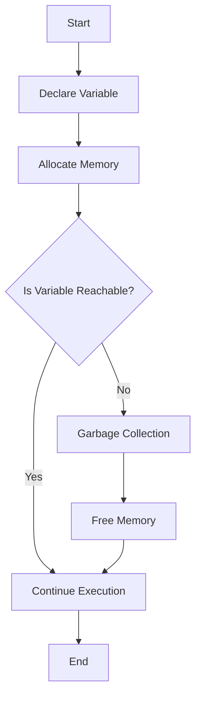

## 8.10. Memory Management and Garbage Collection

In this section, we will dive into the fascinating world of memory management and garbage collection in JavaScript. Understanding these concepts is crucial for writing efficient and performant JavaScript code. We'll explore how JavaScript handles memory allocation, the role of garbage collection, and best practices to avoid memory leaks. Let's embark on this journey to ensure our JavaScript applications run smoothly and efficiently!

### Understanding Memory Allocation

Memory allocation is a fundamental concept in programming. When we create variables, objects, or functions in JavaScript, the engine allocates memory to store these entities. Let's break down how this process works:

#### Memory Allocation Basics

In JavaScript, memory is primarily divided into two areas:

1. **Stack**: This is where primitive values (like numbers, strings, and booleans) and references to objects are stored. The stack is fast and efficient but limited in size.

2. **Heap**: This is where objects and functions are stored. The heap is larger and can accommodate more complex data structures.

When you declare a variable, JavaScript allocates memory for it. For example:

```javascript
let number = 42; // Allocates memory for a number
let name = "JavaScript"; // Allocates memory for a string
let person = { name: "Alice", age: 30 }; // Allocates memory for an object
```

In the above code, `number` and `name` are stored in the stack, while the `person` object is stored in the heap.

#### Memory Allocation for Functions

Functions in JavaScript are first-class objects, meaning they can be assigned to variables, passed as arguments, and returned from other functions. When a function is created, memory is allocated for its code and any variables it might use.

```javascript
function greet() {
  let message = "Hello, World!";
  console.log(message);
}
```

In this example, memory is allocated for the `greet` function and the `message` variable within its scope.

### The Role of Garbage Collection

Garbage collection is a form of automatic memory management. It helps free up memory that is no longer in use, preventing memory leaks and ensuring efficient use of resources.

#### How Garbage Collection Works

JavaScript uses a garbage collector to automatically reclaim memory. The garbage collector identifies objects that are no longer reachable and frees the memory they occupy. This process is typically based on the concept of **reference counting** or **mark-and-sweep** algorithms.

1. **Reference Counting**: This method keeps track of the number of references to an object. When the reference count drops to zero, the object is considered unreachable and can be collected.

2. **Mark-and-Sweep**: This is the most common garbage collection algorithm in modern JavaScript engines. It works in two phases:
   - **Marking**: The garbage collector traverses the object graph, marking all reachable objects.
   - **Sweeping**: It then collects all unmarked objects, freeing their memory.

#### Garbage Collection in Action

Consider the following code:

```javascript
function createPerson() {
  let person = { name: "Bob", age: 25 };
  return person;
}

let person1 = createPerson();
person1 = null; // The object is now eligible for garbage collection
```

In this example, the `person` object created inside `createPerson` becomes unreachable once `person1` is set to `null`. The garbage collector will eventually reclaim the memory used by this object.

### Best Practices to Avoid Memory Leaks

Memory leaks occur when memory that is no longer needed is not released. This can lead to increased memory usage and degraded performance. Here are some best practices to avoid memory leaks:

#### 1. Avoid Global Variables

Global variables remain in memory for the lifetime of the application. Minimize their use to reduce memory footprint.

```javascript
// Avoid this
var globalVar = "I'm a global variable";

// Prefer this
function myFunction() {
  let localVar = "I'm a local variable";
}
```

#### 2. Manage Event Listeners

Event listeners can inadvertently hold references to DOM elements, preventing them from being garbage collected. Remove event listeners when they are no longer needed.

```javascript
let button = document.getElementById("myButton");

function handleClick() {
  console.log("Button clicked!");
}

button.addEventListener("click", handleClick);

// Later, remove the event listener
button.removeEventListener("click", handleClick);
```

#### 3. Use Closures Wisely

Closures can capture variables from their enclosing scope, potentially leading to memory leaks if not managed properly.

```javascript
function createCounter() {
  let count = 0;
  return function() {
    count++;
    console.log(count);
  };
}

let counter = createCounter();
counter(); // 1
counter(); // 2
```

In this example, the `count` variable is captured by the closure, and its memory is retained as long as the closure exists.

#### 4. Nullify References

Explicitly setting references to `null` can help the garbage collector identify objects that are no longer needed.

```javascript
let data = { key: "value" };
data = null; // Helps the garbage collector reclaim memory
```

### Common Memory Management Issues

Let's explore some common memory management issues and how to address them:

#### 1. Circular References

Circular references occur when two or more objects reference each other, preventing garbage collection.

```javascript
function createCircularReference() {
  let obj1 = {};
  let obj2 = {};
  obj1.ref = obj2;
  obj2.ref = obj1;
}

createCircularReference();
```

In this example, `obj1` and `obj2` reference each other, creating a circular reference. Use weak references or break the cycle to resolve this issue.

#### 2. Detached DOM Elements

Detached DOM elements are elements that are removed from the DOM but still referenced in JavaScript.

```javascript
let element = document.getElementById("myElement");
document.body.removeChild(element); // Element is detached but still referenced
```

To avoid memory leaks, ensure that references to detached elements are removed.

### Tools and Techniques for Monitoring Memory Usage

Monitoring memory usage is essential for identifying and resolving memory-related issues. Here are some tools and techniques:

#### 1. Browser Developer Tools

Most modern browsers offer developer tools that include memory profiling features. Use these tools to track memory usage and identify leaks.

- **Chrome DevTools**: Use the Memory panel to take heap snapshots and analyze memory usage.
- **Firefox Developer Tools**: Use the Memory tool to capture snapshots and inspect memory allocations.

#### 2. Heap Snapshots

Heap snapshots provide a detailed view of memory usage. They help identify objects that consume the most memory and detect memory leaks.

#### 3. Performance Monitoring

Monitor the performance of your application to identify memory-related bottlenecks. Use performance profiling tools to analyze memory allocation patterns.

### Visualizing Memory Management

Let's visualize how memory management works in JavaScript using a flowchart:



**Diagram Description**: This flowchart illustrates the process of memory management in JavaScript. It starts with variable declaration and memory allocation. If a variable is no longer reachable, garbage collection is triggered to free memory.

### Knowledge Check

Let's reinforce what we've learned with a few questions:

1. What are the two main areas of memory in JavaScript?
2. How does the mark-and-sweep algorithm work?
3. What is a common cause of memory leaks in JavaScript?
4. How can you remove an event listener in JavaScript?
5. What is a circular reference, and how can it lead to memory leaks?

### Embrace the Journey

Remember, understanding memory management and garbage collection is a crucial step in becoming a proficient JavaScript developer. As you continue to learn and experiment, you'll gain more insights into optimizing your code for performance and efficiency. Keep exploring, stay curious, and enjoy the journey!

## Quiz Time!



### What are the two main areas of memory in JavaScript?

- [x] Stack and Heap
- [ ] Cache and Buffer
- [ ] RAM and ROM
- [ ] Register and Disk

> **Explanation:** JavaScript primarily uses the stack for primitive values and the heap for objects and functions.

### How does the mark-and-sweep algorithm work?

- [x] Marks reachable objects and sweeps unmarked ones
- [ ] Counts references and deletes zero-referenced objects
- [ ] Moves objects from stack to heap
- [ ] Compacts memory by rearranging objects

> **Explanation:** The mark-and-sweep algorithm marks all reachable objects and sweeps away those that are not marked.

### What is a common cause of memory leaks in JavaScript?

- [x] Unreferenced objects
- [ ] Using `const` for variable declaration
- [ ] Declaring functions
- [ ] Using primitive data types

> **Explanation:** Memory leaks often occur when objects are no longer referenced but not collected by the garbage collector.

### How can you remove an event listener in JavaScript?

- [x] `removeEventListener`
- [ ] `deleteEventListener`
- [ ] `detachEventListener`
- [ ] `clearEventListener`

> **Explanation:** The `removeEventListener` method is used to remove an event listener from an element.

### What is a circular reference, and how can it lead to memory leaks?

- [x] Objects referencing each other, preventing garbage collection
- [ ] Functions calling themselves recursively
- [ ] Variables declared globally
- [ ] Using `var` instead of `let` or `const`

> **Explanation:** Circular references occur when objects reference each other, making them unreachable for garbage collection.

### What is the purpose of setting a variable to `null`?

- [x] To help the garbage collector identify unused objects
- [ ] To initialize a variable
- [ ] To declare a constant
- [ ] To create a new object

> **Explanation:** Setting a variable to `null` can help the garbage collector identify objects that are no longer needed.

### Which tool can be used to monitor memory usage in Chrome?

- [x] Chrome DevTools
- [ ] Firebug
- [ ] Visual Studio Code
- [ ] Sublime Text

> **Explanation:** Chrome DevTools provides a Memory panel for monitoring memory usage and analyzing heap snapshots.

### What is a heap snapshot?

- [x] A detailed view of memory usage
- [ ] A screenshot of the browser window
- [ ] A backup of the JavaScript code
- [ ] A list of all global variables

> **Explanation:** A heap snapshot provides a detailed view of memory usage, helping identify memory leaks.

### What is the benefit of using closures?

- [x] Capturing variables from enclosing scope
- [ ] Declaring global variables
- [ ] Creating circular references
- [ ] Increasing memory usage

> **Explanation:** Closures capture variables from their enclosing scope, allowing them to be used later.

### True or False: Global variables are automatically garbage collected when no longer in use.

- [ ] True
- [x] False

> **Explanation:** Global variables remain in memory for the lifetime of the application and are not automatically garbage collected.


