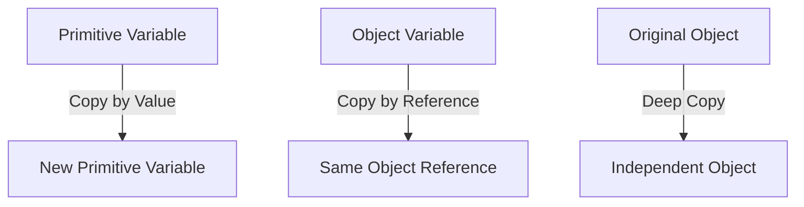

## 8.2. Copying by Value vs. Reference

In JavaScript, understanding how data is stored and manipulated is crucial for writing efficient and bug-free code. One of the fundamental concepts to grasp is the difference between copying by value and copying by reference. This distinction affects how variables interact with each other and how changes to data are propagated throughout your code. In this section, we'll explore these concepts in detail, provide illustrative examples, and offer best practices to help you manage data effectively.

### Understanding Primitives and Objects

Before diving into copying mechanisms, let's briefly revisit the two main categories of data types in JavaScript: primitives and objects.

**Primitives** are basic data types that include:
- **Number**: Represents numeric values.
- **String**: Represents sequences of characters.
- **Boolean**: Represents `true` or `false`.
- **Undefined**: Represents a variable that has been declared but not assigned a value.
- **Null**: Represents the intentional absence of any object value.
- **Symbol**: Represents a unique and immutable primitive value.
- **BigInt**: Represents whole numbers larger than 2^53 - 1.

**Objects** are more complex data structures that can store collections of values and more complex entities. Common objects include:
- **Arrays**: Ordered collections of values.
- **Functions**: First-class objects that can be assigned to variables.
- **Date**: Represents dates and times.
- **RegExp**: Represents regular expressions.
- **Maps and Sets**: Collections of key-value pairs and unique values, respectively.

### Copying by Value

When we talk about copying by value, we're referring to how primitive data types are handled in JavaScript. When you assign a primitive value to a variable, and then copy that variable to another, you're copying the actual value, not a reference to it.

#### Example: Copying Primitives

Let's look at an example to illustrate this concept:

```javascript
let originalNumber = 42;
let copiedNumber = originalNumber;

// Change the original number
originalNumber = 100;

console.log(copiedNumber); // Output: 42
```

In this example, `copiedNumber` retains the original value of `42` even after `originalNumber` is changed to `100`. This is because `copiedNumber` holds a copy of the value, not a reference to `originalNumber`.

#### Key Takeaways

- **Primitives are immutable**: Once created, their value cannot be changed. Any operation that seems to modify a primitive actually creates a new primitive.
- **Copying a primitive creates a new, independent value**: Changes to one variable do not affect the other.

### Copying by Reference

Objects, on the other hand, are copied by reference. This means that when you assign an object to a variable and then copy that variable to another, both variables point to the same object in memory.

#### Example: Copying Objects

Consider the following example:

```javascript
let originalObject = { name: "Alice", age: 30 };
let copiedObject = originalObject;

// Modify the original object
originalObject.age = 31;

console.log(copiedObject.age); // Output: 31
```

In this case, `copiedObject` reflects the change made to `originalObject` because both variables reference the same object in memory.

#### Key Takeaways

- **Objects are mutable**: Their properties can be changed even after creation.
- **Copying an object creates a reference**: Changes to one variable affect all variables that reference the same object.

### Potential Issues with Copying by Reference

Copying by reference can lead to unintended side effects, especially when multiple parts of your code modify the same object. This can make debugging difficult and lead to unpredictable behavior.

#### Example: Unintended Side Effects

```javascript
function updateName(person) {
  person.name = "Bob";
}

let user = { name: "Alice" };
updateName(user);

console.log(user.name); // Output: Bob
```

In this example, the `updateName` function modifies the `user` object directly, which might not be the intended behavior if you wanted to keep `user` unchanged.

### Solutions: Creating Deep Copies

To avoid these issues, you can create a deep copy of an object. A deep copy duplicates the object and all objects it references, creating a completely independent copy.

#### Method 1: Using `JSON.parse` and `JSON.stringify`

This method is simple but has limitations, such as not supporting functions or special objects like `Date`.

```javascript
let originalObject = { name: "Alice", age: 30 };
let deepCopiedObject = JSON.parse(JSON.stringify(originalObject));

// Modify the original object
originalObject.age = 31;

console.log(deepCopiedObject.age); // Output: 30
```

#### Method 2: Using a Recursive Function

For more complex objects, you might need a custom function to handle deep copying:

```javascript
function deepCopy(obj) {
  if (obj === null || typeof obj !== "object") {
    return obj;
  }

  let copy = Array.isArray(obj) ? [] : {};

  for (let key in obj) {
    if (obj.hasOwnProperty(key)) {
      copy[key] = deepCopy(obj[key]);
    }
  }

  return copy;
}

let originalObject = { name: "Alice", age: 30, address: { city: "Wonderland" } };
let deepCopiedObject = deepCopy(originalObject);

// Modify the original object
originalObject.address.city = "Elsewhere";

console.log(deepCopiedObject.address.city); // Output: Wonderland
```

### Visualizing Copying by Value and Reference

To better understand these concepts, let's visualize how JavaScript handles copying by value and reference.



**Figure 1**: This diagram illustrates how primitives are copied by value, creating a new independent variable, while objects are copied by reference, pointing to the same memory location. A deep copy creates a completely independent object.

### Best Practices for Managing Copies

1. **Use Primitives for Simple Data**: When possible, use primitive types for data that doesn't require complex structures. This minimizes the risk of unintended side effects.

2. **Create Deep Copies for Objects**: When working with objects that need to be independent, use deep copying techniques to ensure changes don't propagate unexpectedly.

3. **Be Mindful of Function Parameters**: When passing objects to functions, consider whether you need to modify the original object or work with a copy.

4. **Leverage Libraries**: Consider using libraries like Lodash, which provide utility functions for deep copying and other operations.

### Try It Yourself

Experiment with the examples provided by modifying the code and observing the results. Try creating your own objects and practice copying them by value and reference. Consider the following challenges:

- Modify the `deepCopy` function to handle special objects like `Date`.
- Create a function that accepts an array of objects and returns a deep copy of the array.
- Experiment with copying arrays and nested objects to see how changes affect each reference.

### Knowledge Check

- What is the difference between copying by value and copying by reference?
- How can you create a deep copy of an object in JavaScript?
- What are the potential pitfalls of copying by reference?

### Embrace the Journey

Remember, understanding how JavaScript handles data is a crucial step in becoming a proficient developer. As you continue to learn and experiment, you'll gain confidence in managing variables and data types effectively. Keep exploring, stay curious, and enjoy the journey!

## Quiz Time!



### What is the primary difference between copying by value and copying by reference?

- [x] Copying by value creates a new independent copy of the data.
- [ ] Copying by reference creates a new independent copy of the data.
- [ ] Copying by value and copying by reference are the same.
- [ ] Copying by reference only applies to primitive data types.

> **Explanation:** Copying by value creates a new independent copy of the data, while copying by reference means both variables point to the same data in memory.

### Which data types in JavaScript are copied by value?

- [x] Primitives
- [ ] Objects
- [ ] Arrays
- [ ] Functions

> **Explanation:** Primitives such as numbers, strings, and booleans are copied by value in JavaScript.

### How can you create a deep copy of an object in JavaScript?

- [x] Use `JSON.parse` and `JSON.stringify`.
- [ ] Use the `Object.assign` method.
- [ ] Use the `Array.prototype.slice` method.
- [ ] Use the `typeof` operator.

> **Explanation:** `JSON.parse` and `JSON.stringify` can be used to create a deep copy of an object, although it has limitations with certain data types.

### What is a potential issue when copying objects by reference?

- [x] Changes to one reference affect all references to the same object.
- [ ] It creates a new independent object.
- [ ] It only works with primitive data types.
- [ ] It is not supported in JavaScript.

> **Explanation:** When objects are copied by reference, changes to one reference affect all references to the same object.

### Which method is not suitable for deep copying objects with functions or special objects like `Date`?

- [x] `JSON.parse` and `JSON.stringify`
- [ ] A recursive function
- [ ] Lodash's `cloneDeep` function
- [ ] `Object.create`

> **Explanation:** `JSON.parse` and `JSON.stringify` do not support functions or special objects like `Date`.

### What is the output of the following code?
```javascript
let a = 10;
let b = a;
a = 20;
console.log(b);
```

- [x] 10
- [ ] 20
- [ ] Undefined
- [ ] Null

> **Explanation:** `b` is a copy of the value of `a` at the time of assignment, so it remains 10 even after `a` is changed.

### What is the output of the following code?
```javascript
let obj1 = { value: 5 };
let obj2 = obj1;
obj1.value = 10;
console.log(obj2.value);
```

- [x] 10
- [ ] 5
- [ ] Undefined
- [ ] Null

> **Explanation:** `obj2` is a reference to the same object as `obj1`, so changes to `obj1` are reflected in `obj2`.

### Which of the following is a best practice when dealing with object copies?

- [x] Use deep copies when you need independent objects.
- [ ] Always use shallow copies for efficiency.
- [ ] Avoid copying objects altogether.
- [ ] Use primitive types to avoid copying issues.

> **Explanation:** Using deep copies ensures that changes to one object do not affect another when independence is required.

### What is the result of the following code?
```javascript
let arr1 = [1, 2, 3];
let arr2 = arr1;
arr1.push(4);
console.log(arr2.length);
```

- [x] 4
- [ ] 3
- [ ] 2
- [ ] 1

> **Explanation:** `arr2` is a reference to the same array as `arr1`, so changes to `arr1` affect `arr2`.

### True or False: Copying by reference is only applicable to primitive data types.

- [ ] True
- [x] False

> **Explanation:** Copying by reference applies to objects, not primitive data types.


