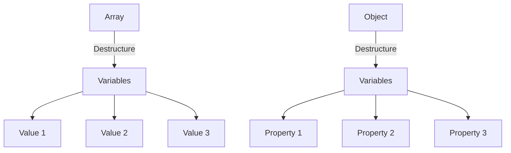

## 8.3. Destructuring Assignment (ES6)

Destructuring assignment is a powerful feature introduced in ECMAScript 6 (ES6) that allows you to unpack values from arrays or properties from objects into distinct variables. This feature simplifies the process of extracting data from complex structures and enhances the readability and maintainability of your code. In this section, we will explore the syntax of destructuring, provide examples, explain default values and nested destructuring, and discuss practical use cases.

### Introduction to Destructuring

Destructuring allows you to break down complex data structures into simpler parts, making it easier to work with data in a concise and readable manner. Let's start by understanding the basic syntax of array and object destructuring.

#### Array Destructuring

Array destructuring allows you to extract values from an array and assign them to variables in a single statement. The syntax involves using square brackets `[]` on the left-hand side of an assignment to specify the variables that will receive the values.

```javascript
// Basic array destructuring
const numbers = [1, 2, 3];
const [first, second, third] = numbers;

console.log(first); // Output: 1
console.log(second); // Output: 2
console.log(third); // Output: 3
```

In this example, the values from the `numbers` array are unpacked into the variables `first`, `second`, and `third`.

#### Object Destructuring

Object destructuring allows you to extract properties from an object and assign them to variables. The syntax involves using curly braces `{}` on the left-hand side of an assignment to specify the variables that will receive the values.

```javascript
// Basic object destructuring
const person = { name: 'Alice', age: 25 };
const { name, age } = person;

console.log(name); // Output: Alice
console.log(age); // Output: 25
```

Here, the properties `name` and `age` from the `person` object are unpacked into the variables `name` and `age`.

### Destructuring Assignment in Various Contexts

Destructuring can be used in various contexts, such as function parameters, swapping variables, and iterating over data structures.

#### Destructuring Function Parameters

Destructuring can be particularly useful when dealing with function parameters, allowing you to extract specific values directly from the arguments passed to a function.

```javascript
// Destructuring in function parameters
function greet({ name, age }) {
  console.log(`Hello, my name is ${name} and I am ${age} years old.`);
}

const user = { name: 'Bob', age: 30 };
greet(user); // Output: Hello, my name is Bob and I am 30 years old.
```

In this example, the `greet` function takes an object as an argument and destructures it to extract the `name` and `age` properties.

#### Swapping Variables

Destructuring provides a concise way to swap the values of two variables without using a temporary variable.

```javascript
// Swapping variables using destructuring
let a = 1;
let b = 2;

[a, b] = [b, a];

console.log(a); // Output: 2
console.log(b); // Output: 1
```

This example demonstrates how destructuring can be used to swap the values of `a` and `b`.

#### Iterating Over Data Structures

Destructuring can also be used in loops to extract values from arrays or objects.

```javascript
// Iterating over an array with destructuring
const fruits = ['apple', 'banana', 'cherry'];

for (const [index, fruit] of fruits.entries()) {
  console.log(`Index: ${index}, Fruit: ${fruit}`);
}

// Output:
// Index: 0, Fruit: apple
// Index: 1, Fruit: banana
// Index: 2, Fruit: cherry
```

In this example, the `entries()` method is used to get an iterator over the array, and destructuring is used to extract the index and value of each element.

### Default Values and Nested Destructuring

Destructuring allows you to provide default values for variables and to destructure nested data structures.

#### Default Values

You can specify default values for variables in case the value being destructured is `undefined`.

```javascript
// Default values in destructuring
const [x = 10, y = 20] = [5];

console.log(x); // Output: 5
console.log(y); // Output: 20
```

In this example, `x` is assigned the value `5` from the array, while `y` is assigned the default value `20` because there is no second element in the array.

#### Nested Destructuring

Destructuring can be applied to nested data structures, allowing you to extract values from deeply nested arrays or objects.

```javascript
// Nested destructuring
const user = {
  id: 1,
  profile: {
    username: 'john_doe',
    email: 'john@example.com'
  }
};

const { profile: { username, email } } = user;

console.log(username); // Output: john_doe
console.log(email); // Output: john@example.com
```

In this example, the `profile` object is nested within the `user` object, and destructuring is used to extract the `username` and `email` properties.

### Practical Use Cases

Destructuring is a versatile feature that can be used in various practical scenarios, such as handling function parameters, working with API responses, and managing state in frameworks like React.

#### Handling Function Parameters

Destructuring can simplify the process of handling function parameters, especially when dealing with objects that have many properties.

```javascript
// Destructuring function parameters
function createUser({ id, name, email }) {
  return {
    id,
    name,
    email,
    createdAt: new Date()
  };
}

const newUser = createUser({ id: 1, name: 'Alice', email: 'alice@example.com' });
console.log(newUser);
```

In this example, the `createUser` function takes an object as an argument and destructures it to extract the `id`, `name`, and `email` properties.

#### Working with API Responses

When working with API responses, destructuring can help you extract specific data from the response object.

```javascript
// Destructuring API response
const response = {
  data: {
    user: {
      id: 1,
      name: 'Alice'
    }
  }
};

const { data: { user: { id, name } } } = response;

console.log(id); // Output: 1
console.log(name); // Output: Alice
```

In this example, destructuring is used to extract the `id` and `name` properties from the nested `response` object.

#### Managing State in React

In React, destructuring is commonly used to manage state and props, making the code more readable and concise.

```javascript
// Destructuring in React
function UserProfile({ user }) {
  const { name, age } = user;

  return (
    <div>
      <h1>{name}</h1>
      <p>Age: {age}</p>
    </div>
  );
}
```

In this example, the `UserProfile` component takes a `user` object as a prop and destructures it to extract the `name` and `age` properties.

### Common Patterns and Best Practices

When using destructuring, it's important to follow common patterns and best practices to ensure your code is efficient and maintainable.

#### Use Descriptive Variable Names

When destructuring, use descriptive variable names that clearly indicate the purpose of the variable.

```javascript
// Descriptive variable names
const { firstName, lastName } = person;
```

#### Avoid Over-Destructuring

While destructuring is powerful, avoid over-destructuring, which can lead to complex and hard-to-read code.

```javascript
// Avoid over-destructuring
const { a: { b: { c: { d } } } } = complexObject;
```

#### Use Default Values Wisely

Use default values to handle cases where the destructured value might be `undefined`, but avoid setting unnecessary defaults.

```javascript
// Use default values wisely
const { age = 18 } = person;
```

#### Be Mindful of Nested Destructuring

Nested destructuring can be useful, but it can also make the code harder to read. Use it judiciously and consider breaking it into smaller parts if it becomes too complex.

### Visualizing Destructuring

To better understand destructuring, let's visualize how it works with arrays and objects.



In this diagram, we see how values from an array or properties from an object are mapped to individual variables through destructuring.

### Try It Yourself

To reinforce your understanding of destructuring, try modifying the examples provided. Experiment with different data structures, such as arrays of objects or nested arrays, and see how destructuring can simplify your code.

### References and Links

For further reading on destructuring assignment, check out the following resources:

- [MDN Web Docs: Destructuring Assignment](https://developer.mozilla.org/en-US/docs/Web/JavaScript/Reference/Operators/Destructuring_assignment)
- [JavaScript.info: Destructuring Assignment](https://javascript.info/destructuring-assignment)
- [W3Schools: JavaScript Destructuring](https://www.w3schools.com/js/js_destructuring.asp)

### Knowledge Check

Before we conclude, let's summarize the key takeaways from this section:

- Destructuring allows you to extract values from arrays and objects into distinct variables.
- It simplifies the process of working with complex data structures.
- Destructuring can be used in various contexts, such as function parameters and iterating over data structures.
- Default values and nested destructuring provide additional flexibility.
- Following best practices ensures your code remains readable and maintainable.

## Quiz Time!



### What is destructuring in JavaScript?

- [x] A feature that allows unpacking values from arrays or properties from objects into distinct variables.
- [ ] A method to combine multiple arrays into one.
- [ ] A way to create new objects from existing ones.
- [ ] A technique to optimize code performance.

> **Explanation:** Destructuring is a feature in JavaScript that allows you to unpack values from arrays or properties from objects into distinct variables, simplifying the process of working with complex data structures.

### How do you provide default values in destructuring?

- [x] By assigning a value to the variable in the destructuring pattern.
- [ ] By using the `default` keyword.
- [ ] By declaring the variable before destructuring.
- [ ] By using the `let` keyword.

> **Explanation:** Default values can be provided in destructuring by assigning a value to the variable in the destructuring pattern, which will be used if the value being destructured is `undefined`.

### Which of the following is an example of array destructuring?

- [x] `const [a, b] = [1, 2];`
- [ ] `const {a, b} = {a: 1, b: 2};`
- [ ] `const a = [1, 2];`
- [ ] `const a = {b: 2};`

> **Explanation:** `const [a, b] = [1, 2];` is an example of array destructuring, where values from the array `[1, 2]` are unpacked into the variables `a` and `b`.

### What is a practical use case for destructuring?

- [x] Handling function parameters.
- [ ] Creating new objects.
- [ ] Optimizing loops.
- [ ] Declaring variables.

> **Explanation:** Destructuring is particularly useful for handling function parameters, allowing you to extract specific values directly from the arguments passed to a function.

### How can destructuring be used to swap variables?

- [x] `[a, b] = [b, a];`
- [ ] `a = b; b = a;`
- [ ] `a = [b, a];`
- [ ] `swap(a, b);`

> **Explanation:** Destructuring can be used to swap variables by using the syntax `[a, b] = [b, a];`, which swaps the values of `a` and `b` without a temporary variable.

### What is nested destructuring?

- [x] Extracting values from nested arrays or objects.
- [ ] Combining multiple arrays into one.
- [ ] Creating new arrays from existing ones.
- [ ] Optimizing nested loops.

> **Explanation:** Nested destructuring refers to extracting values from nested arrays or objects, allowing you to access deeply nested data structures in a concise manner.

### Which syntax is used for object destructuring?

- [x] Curly braces `{}` on the left-hand side of an assignment.
- [ ] Square brackets `[]` on the left-hand side of an assignment.
- [ ] Parentheses `()` on the left-hand side of an assignment.
- [ ] Angle brackets `<>` on the left-hand side of an assignment.

> **Explanation:** Object destructuring uses curly braces `{}` on the left-hand side of an assignment to specify the variables that will receive the values from the object properties.

### What is a common pattern when using destructuring?

- [x] Using descriptive variable names.
- [ ] Using the `var` keyword.
- [ ] Over-destructuring complex objects.
- [ ] Avoiding default values.

> **Explanation:** A common pattern when using destructuring is to use descriptive variable names that clearly indicate the purpose of the variable, enhancing code readability.

### Can destructuring be used in loops?

- [x] Yes
- [ ] No

> **Explanation:** Destructuring can be used in loops to extract values from arrays or objects, making it easier to work with data structures in iterative contexts.

### Is it possible to destructure function parameters?

- [x] True
- [ ] False

> **Explanation:** It is possible to destructure function parameters, allowing you to extract specific values directly from the arguments passed to a function, simplifying parameter handling.



Remember, destructuring is a powerful tool in your JavaScript toolkit. Keep practicing and experimenting with different data structures to master this feature. As you progress, you'll find that destructuring can greatly enhance the readability and maintainability of your code. Keep up the great work, and enjoy the journey of learning JavaScript!
