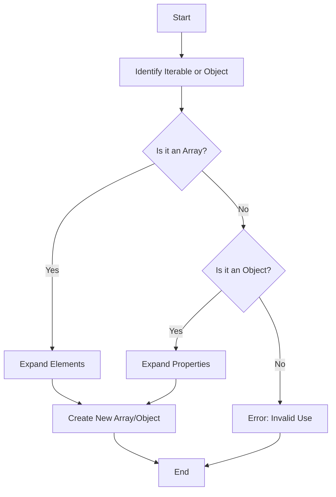

## 8.4. The Spread Operator (ES6)

The spread operator, introduced in ECMAScript 6 (ES6), is a powerful feature that allows you to expand elements of an iterable (like arrays) or properties of an object. This operator, represented by three dots (`...`), can greatly simplify your code by making it more readable and concise. In this section, we will explore how the spread operator works, its applications, and some best practices to keep in mind when using it.

### Understanding the Spread Operator

The spread operator is used to expand elements of an iterable (such as an array) or properties of an object into a list of arguments or elements. It can be used in various contexts, including function calls, array literals, and object literals.

#### Spread Operator with Arrays

Let's start by looking at how the spread operator works with arrays. The spread operator can be used to copy arrays, merge arrays, and even convert iterable objects into arrays.

**Example 1: Copying Arrays**

```javascript
// Original array
const originalArray = [1, 2, 3];

// Copying the array using the spread operator
const copiedArray = [...originalArray];

console.log(copiedArray); // Output: [1, 2, 3]
```

In this example, the spread operator is used to create a shallow copy of `originalArray`. This means that the elements of the array are copied into a new array, but if the array contains objects, only the references are copied.

**Example 2: Merging Arrays**

```javascript
const array1 = [1, 2, 3];
const array2 = [4, 5, 6];

// Merging arrays using the spread operator
const mergedArray = [...array1, ...array2];

console.log(mergedArray); // Output: [1, 2, 3, 4, 5, 6]
```

Here, the spread operator is used to merge `array1` and `array2` into a single array. This is much cleaner and more concise than using methods like `concat`.

**Example 3: Converting Iterables to Arrays**

```javascript
const set = new Set([1, 2, 3]);

// Using the spread operator to convert a Set to an array
const arrayFromSet = [...set];

console.log(arrayFromSet); // Output: [1, 2, 3]
```

The spread operator can also be used to convert iterable objects, such as Sets, into arrays. This can be particularly useful when you need to perform array-specific operations on iterable objects.

#### Spread Operator with Objects

The spread operator can also be used with objects to copy properties or merge objects. This feature was introduced in ES2018 and has become a staple in modern JavaScript development.

**Example 4: Copying Objects**

```javascript
const originalObject = { a: 1, b: 2 };

// Copying the object using the spread operator
const copiedObject = { ...originalObject };

console.log(copiedObject); // Output: { a: 1, b: 2 }
```

Just like with arrays, the spread operator can be used to create a shallow copy of an object. This means that while the properties are copied, if any of the properties are objects themselves, only the references are copied.

**Example 5: Merging Objects**

```javascript
const object1 = { a: 1, b: 2 };
const object2 = { b: 3, c: 4 };

// Merging objects using the spread operator
const mergedObject = { ...object1, ...object2 };

console.log(mergedObject); // Output: { a: 1, b: 3, c: 4 }
```

When merging objects, properties from later objects will overwrite those from earlier ones if they have the same key. In the example above, the value of `b` in `object2` overwrites the value of `b` in `object1`.

### Shallow vs. Deep Copies

It's important to understand the difference between shallow and deep copies when using the spread operator. The spread operator performs a shallow copy, meaning that it only copies the top-level properties or elements. If the array or object contains nested objects, only the references to those objects are copied, not the objects themselves.

**Example 6: Shallow Copy Pitfall**

```javascript
const originalArray = [{ a: 1 }, { b: 2 }];

// Shallow copy using the spread operator
const shallowCopy = [...originalArray];

// Modifying the nested object
shallowCopy[0].a = 99;

console.log(originalArray); // Output: [{ a: 99 }, { b: 2 }]
```

In this example, modifying the nested object in `shallowCopy` also affects `originalArray` because the nested objects are shared between the two arrays.

To create a deep copy, you would need to use additional techniques, such as JSON serialization or a library like Lodash.

### Use Cases for the Spread Operator

The spread operator can simplify many common tasks in JavaScript, making your code more readable and concise. Here are some use cases where the spread operator shines:

1. **Function Arguments**: The spread operator can be used to pass an array of arguments to a function.

   ```javascript
   function sum(x, y, z) {
     return x + y + z;
   }

   const numbers = [1, 2, 3];

   console.log(sum(...numbers)); // Output: 6
   ```

2. **Array Manipulation**: The spread operator can be used to insert elements into an array at a specific position.

   ```javascript
   const array = [1, 4, 5];
   const newArray = [...array.slice(0, 1), 2, 3, ...array.slice(1)];

   console.log(newArray); // Output: [1, 2, 3, 4, 5]
   ```

3. **Object Cloning**: The spread operator can be used to clone objects and add or override properties.

   ```javascript
   const user = { name: 'Alice', age: 25 };
   const updatedUser = { ...user, age: 26 };

   console.log(updatedUser); // Output: { name: 'Alice', age: 26 }
   ```

4. **Combining Data**: The spread operator can be used to combine data from multiple sources into a single array or object.

   ```javascript
   const defaults = { theme: 'light', showNotifications: true };
   const userSettings = { theme: 'dark' };

   const settings = { ...defaults, ...userSettings };

   console.log(settings); // Output: { theme: 'dark', showNotifications: true }
   ```

### Caution: Mutating Original Data

While the spread operator is a powerful tool, it's important to be mindful of its behavior with references. When using the spread operator, be aware that it creates shallow copies. This means that if your arrays or objects contain nested objects, changes to the nested objects in the copied array or object will affect the original.

**Example 7: Avoiding Unintended Mutations**

```javascript
const original = [{ a: 1 }, { b: 2 }];
const copy = [...original];

// Modifying the nested object
copy[0].a = 99;

console.log(original); // Output: [{ a: 99 }, { b: 2 }]
```

In this example, modifying the nested object in `copy` also affects `original`. To avoid this, you may need to perform a deep copy.

### Visualizing the Spread Operator

To better understand how the spread operator works, let's visualize its operation with a simple flowchart.



This flowchart illustrates the decision-making process when using the spread operator. It checks if the target is an array or an object and then expands its elements or properties accordingly.

### Try It Yourself

Now that we've covered the basics of the spread operator, it's time to experiment with it. Try modifying the examples above to see how the spread operator behaves in different scenarios. Here are some suggestions:

- Modify the `mergedArray` example to include additional arrays.
- Experiment with nested objects to see how changes affect shallow copies.
- Use the spread operator to merge objects with conflicting properties and observe the results.

### References and Further Reading

- [MDN Web Docs: Spread Syntax](https://developer.mozilla.org/en-US/docs/Web/JavaScript/Reference/Operators/Spread_syntax)
- [JavaScript Info: Spread Operator](https://javascript.info/rest-parameters-spread-operator)
- [W3Schools: JavaScript Spread Operator](https://www.w3schools.com/js/js_es6.asp)

### Knowledge Check

Before we move on, let's summarize the key points:

- The spread operator (`...`) is used to expand elements of an array or properties of an object.
- It can be used for copying, merging, and converting iterables to arrays.
- The spread operator performs a shallow copy, meaning nested objects are shared between copies.
- It simplifies code by making it more readable and concise.
- Be cautious of mutating original data when using shallow copies.

Remember, this is just the beginning. As you progress, you'll discover even more ways to leverage the spread operator in your JavaScript projects. Keep experimenting, stay curious, and enjoy the journey!

## Quiz Time!



### What does the spread operator (`...`) do in JavaScript?

- [x] Expands elements of an iterable or properties of an object
- [ ] Contracts elements of an iterable or properties of an object
- [ ] Deletes elements of an iterable or properties of an object
- [ ] Reverses elements of an iterable or properties of an object

> **Explanation:** The spread operator expands elements of an iterable (like an array) or properties of an object.

### Which of the following is a correct use of the spread operator with arrays?

- [x] `const newArray = [...oldArray];`
- [ ] `const newArray = [..oldArray];`
- [ ] `const newArray = [oldArray...];`
- [ ] `const newArray = [...oldArray]`

> **Explanation:** The correct syntax for using the spread operator with arrays is `const newArray = [...oldArray];`.

### What type of copy does the spread operator create?

- [x] Shallow copy
- [ ] Deep copy
- [ ] Full copy
- [ ] No copy

> **Explanation:** The spread operator creates a shallow copy, meaning it only copies the top-level properties or elements.

### When merging objects with the spread operator, which object's properties take precedence?

- [x] The properties of the last object
- [ ] The properties of the first object
- [ ] The properties of the largest object
- [ ] The properties of the smallest object

> **Explanation:** When merging objects, the properties of the last object take precedence and overwrite those of earlier objects if they have the same key.

### How can you avoid unintended mutations when using the spread operator?

- [x] Perform a deep copy
- [ ] Perform a shallow copy
- [ ] Avoid using the spread operator
- [ ] Use the `concat` method

> **Explanation:** To avoid unintended mutations, you should perform a deep copy, especially when dealing with nested objects.

### Which of the following is NOT a use case for the spread operator?

- [ ] Copying arrays
- [ ] Merging objects
- [x] Sorting arrays
- [ ] Converting iterables to arrays

> **Explanation:** The spread operator is not used for sorting arrays; it's used for copying, merging, and converting iterables to arrays.

### What happens if you use the spread operator on a non-iterable object?

- [x] Error: Invalid Use
- [ ] It converts the object to an array
- [ ] It creates an empty array
- [ ] It creates a deep copy

> **Explanation:** Using the spread operator on a non-iterable object results in an error, as it is only applicable to iterables and objects.

### What is the result of `const result = [...[1, 2], ...[3, 4]];`?

- [x] `[1, 2, 3, 4]`
- [ ] `[1, 2, [3, 4]]`
- [ ] `[[1, 2], [3, 4]]`
- [ ] `[1, 2, 3, 4, [3, 4]]`

> **Explanation:** The spread operator expands the elements of both arrays into a single array, resulting in `[1, 2, 3, 4]`.

### Can the spread operator be used with function arguments?

- [x] True
- [ ] False

> **Explanation:** True. The spread operator can be used to pass an array of arguments to a function.

### Which of the following is a benefit of using the spread operator?

- [x] Simplifies code by making it more readable and concise
- [ ] Increases code complexity
- [ ] Decreases code performance
- [ ] Limits code flexibility

> **Explanation:** The spread operator simplifies code by making it more readable and concise, which is one of its main benefits.


