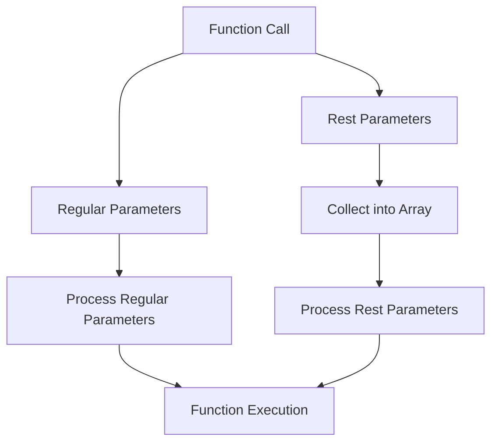

## 8.5. Rest Parameters (ES6)

In the world of JavaScript, functions are a fundamental building block. They allow us to encapsulate code, making it reusable and organized. But what happens when you need a function to handle an unknown number of arguments? This is where rest parameters come into play. Introduced in ECMAScript 6 (ES6), rest parameters provide a clean and efficient way to work with multiple arguments in a function. Let's dive into understanding rest parameters, their syntax, and their usage.

### What are Rest Parameters?

Rest parameters allow a function to accept an indefinite number of arguments as an array. This means you can pass any number of arguments to a function, and they will be collected into a single array. This feature is particularly useful when you don't know how many arguments will be passed to your function.

#### Syntax of Rest Parameters

The syntax for rest parameters is simple: you use three dots (`...`) followed by the name of the array that will hold the rest of the arguments. This syntax must be the last parameter in the function definition, as it collects all remaining arguments into an array.

```javascript
function exampleFunction(...args) {
  console.log(args);
}

exampleFunction(1, 2, 3, 4); // Output: [1, 2, 3, 4]
```

In this example, `args` is an array containing all the arguments passed to `exampleFunction`.

### Purpose and Use Cases

Rest parameters are particularly useful in scenarios where you need to handle a variable number of arguments. Some common use cases include:

- **Creating utility functions** that can operate on any number of inputs, such as mathematical operations.
- **Handling event listeners** where the number of arguments can vary.
- **Building APIs** that need to accept flexible input parameters.

### Rest Parameters vs. `arguments` Object

Before ES6, JavaScript developers often used the `arguments` object to handle multiple arguments. While `arguments` is an array-like object, it is not a true array. This means it lacks array methods like `map`, `filter`, and `reduce`. Rest parameters, on the other hand, are actual arrays, making them more versatile and easier to work with.

#### Key Differences

1. **Array Methods**: Rest parameters are true arrays, allowing you to use array methods directly. The `arguments` object does not have these methods.

2. **Arrow Functions**: The `arguments` object is not available in arrow functions, but rest parameters can be used.

3. **Named Parameters**: Rest parameters provide a named array, making your code more readable and easier to understand.

4. **Performance**: Rest parameters can be more performant as they avoid the overhead of converting `arguments` into an array.

#### Example Comparison

Let's compare rest parameters and the `arguments` object in a function:

```javascript
// Using arguments object
function sumArguments() {
  let sum = 0;
  for (let i = 0; i < arguments.length; i++) {
    sum += arguments[i];
  }
  return sum;
}

console.log(sumArguments(1, 2, 3)); // Output: 6

// Using rest parameters
function sumRest(...numbers) {
  return numbers.reduce((acc, curr) => acc + curr, 0);
}

console.log(sumRest(1, 2, 3)); // Output: 6
```

In the second example, using rest parameters makes the code cleaner and more concise.

### Combining Rest Parameters with Regular Parameters

Rest parameters can be combined with regular parameters, but they must come last in the parameter list. This allows you to specify required parameters while still accepting additional arguments.

```javascript
function greet(greeting, ...names) {
  return names.map(name => `${greeting}, ${name}!`);
}

console.log(greet("Hello", "Alice", "Bob", "Charlie"));
// Output: ["Hello, Alice!", "Hello, Bob!", "Hello, Charlie!"]
```

In this example, `greeting` is a regular parameter, and `names` is a rest parameter that collects all additional arguments.

### Best Practices for Function Parameter Handling

When working with rest parameters, consider the following best practices:

1. **Use Descriptive Names**: Choose meaningful names for your rest parameter arrays to make your code more readable.

2. **Limit the Use of Rest Parameters**: While rest parameters are powerful, overusing them can lead to code that is difficult to understand. Use them judiciously.

3. **Combine with Default Parameters**: You can combine rest parameters with default parameters to provide default values for your functions.

4. **Avoid Overloading Functions**: Instead of creating functions that handle many different types of input, consider creating separate functions for different tasks.

5. **Document Your Functions**: Clearly document how your functions handle parameters, especially when using rest parameters.

### Try It Yourself

Now that we've covered the basics of rest parameters, let's try a simple exercise. Modify the following function to use rest parameters instead of the `arguments` object:

```javascript
function multiply() {
  let product = 1;
  for (let i = 0; i < arguments.length; i++) {
    product *= arguments[i];
  }
  return product;
}

console.log(multiply(2, 3, 4)); // Output: 24
```

### Visualizing Rest Parameters

To better understand how rest parameters work, let's visualize the process of collecting arguments into an array.



**Diagram Description**: This flowchart illustrates how a function call is processed with both regular and rest parameters. Regular parameters are processed individually, while rest parameters are collected into an array for further processing.

### Conclusion

Rest parameters in JavaScript ES6 provide a powerful and flexible way to handle functions with an indefinite number of arguments. They offer a cleaner and more efficient alternative to the `arguments` object, making your code more readable and maintainable. By understanding and utilizing rest parameters, you can write more versatile and robust functions.

Remember, this is just the beginning. As you progress, you'll build more complex and interactive web pages. Keep experimenting, stay curious, and enjoy the journey!

## Quiz Time!



### What is the primary purpose of rest parameters in JavaScript?

- [x] To handle an indefinite number of function arguments as an array.
- [ ] To limit the number of arguments a function can accept.
- [ ] To replace all regular parameters in a function.
- [ ] To improve the performance of function calls.

> **Explanation:** Rest parameters allow a function to accept an indefinite number of arguments as an array, making it easier to work with multiple inputs.

### How do rest parameters differ from the `arguments` object?

- [x] Rest parameters are true arrays, while `arguments` is array-like.
- [ ] Rest parameters are only available in arrow functions.
- [ ] Rest parameters can only be used with named parameters.
- [ ] Rest parameters are less performant than `arguments`.

> **Explanation:** Rest parameters are true arrays, allowing the use of array methods directly, unlike the `arguments` object, which is array-like.

### Can rest parameters be used with regular parameters?

- [x] Yes, but they must be the last parameter in the function definition.
- [ ] No, rest parameters cannot be combined with regular parameters.
- [ ] Yes, but they must be the first parameter in the function definition.
- [ ] No, rest parameters replace all regular parameters.

> **Explanation:** Rest parameters can be combined with regular parameters, but they must be the last in the parameter list.

### What is a key advantage of using rest parameters over the `arguments` object?

- [x] Rest parameters allow the use of array methods.
- [ ] Rest parameters are more readable in arrow functions.
- [ ] Rest parameters automatically convert to strings.
- [ ] Rest parameters are faster to execute.

> **Explanation:** Rest parameters are true arrays, allowing the use of array methods like `map`, `filter`, and `reduce`.

### Which of the following is a best practice when using rest parameters?

- [x] Use descriptive names for rest parameter arrays.
- [ ] Always use rest parameters for all functions.
- [ ] Avoid using rest parameters with regular parameters.
- [ ] Use rest parameters to replace all default parameters.

> **Explanation:** Using descriptive names for rest parameter arrays improves code readability and maintainability.

### What happens if you place rest parameters before regular parameters in a function definition?

- [ ] The function will execute normally.
- [ ] The function will ignore the rest parameters.
- [ ] The function will throw a syntax error.
- [x] The function will collect all arguments into the rest parameter.

> **Explanation:** Rest parameters must be the last in the parameter list; otherwise, a syntax error occurs.

### Are rest parameters available in arrow functions?

- [x] Yes, rest parameters can be used in arrow functions.
- [ ] No, rest parameters are not available in arrow functions.
- [ ] Yes, but only in strict mode.
- [ ] No, rest parameters are exclusive to regular functions.

> **Explanation:** Rest parameters can be used in both regular and arrow functions, providing flexibility in handling arguments.

### Can you use array methods directly on rest parameters?

- [x] Yes, because rest parameters are true arrays.
- [ ] No, because rest parameters are array-like.
- [ ] Yes, but only in strict mode.
- [ ] No, because rest parameters are not arrays.

> **Explanation:** Rest parameters are true arrays, allowing the use of array methods directly.

### How do you declare rest parameters in a function?

- [x] By using three dots (`...`) followed by the parameter name.
- [ ] By using two dots (`..`) followed by the parameter name.
- [ ] By using square brackets (`[]`) around the parameter name.
- [ ] By using curly braces (`{}`) around the parameter name.

> **Explanation:** Rest parameters are declared using three dots (`...`) followed by the parameter name.

### True or False: Rest parameters can improve code readability and maintainability.

- [x] True
- [ ] False

> **Explanation:** Rest parameters provide a clear and concise way to handle multiple arguments, improving code readability and maintainability.


