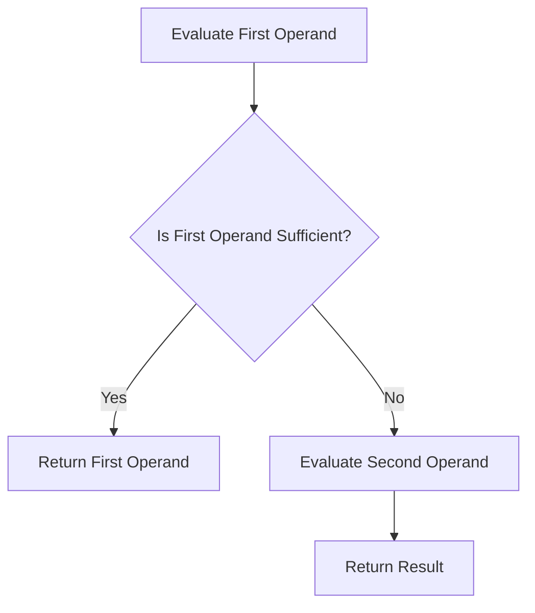

## 8.6. Short-Circuit Evaluation

In the world of programming, understanding how to control the flow of your code is essential. JavaScript, like many other programming languages, provides logical operators that can be used not only for making decisions but also for optimizing your code through a technique known as **short-circuit evaluation**. This section will guide you through the intricacies of short-circuit evaluation, how it works with logical operators, and how you can leverage it for efficient coding practices.

### Understanding Logical Operators

Before diving into short-circuit evaluation, let's briefly revisit the logical operators in JavaScript:

- **Logical AND (`&&`)**: Returns true if both operands are true.
- **Logical OR (`||`)**: Returns true if at least one operand is true.
- **Logical NOT (`!`)**: Inverts the truthiness of the operand.

These operators are not only used for evaluating conditions but also play a crucial role in short-circuit evaluation.

### What is Short-Circuit Evaluation?

Short-circuit evaluation is a programming technique where the second argument in a logical operation is evaluated only if the first argument does not suffice to determine the value of the expression. This can be a powerful tool for controlling the flow of your code and optimizing performance.

#### Logical AND (`&&`) Short-Circuiting

With the `&&` operator, if the first operand evaluates to false, the entire expression will be false, and the second operand will not be evaluated. This is because, in a logical AND operation, both conditions must be true for the result to be true.

```javascript
let isLoggedIn = false;
let userName = isLoggedIn && "JohnDoe";

console.log(userName); // Output: false
```

In this example, since `isLoggedIn` is false, the `userName` variable is assigned the value of `isLoggedIn` without evaluating the second operand.

#### Logical OR (`||`) Short-Circuiting

Conversely, with the `||` operator, if the first operand evaluates to true, the entire expression will be true, and the second operand will not be evaluated. This is because, in a logical OR operation, only one condition needs to be true for the result to be true.

```javascript
let defaultName = "Guest";
let userName = "" || defaultName;

console.log(userName); // Output: "Guest"
```

Here, since the left operand is an empty string (falsy value), the `defaultName` is evaluated and assigned to `userName`.

### Practical Uses of Short-Circuit Evaluation

Short-circuit evaluation is not just a theoretical concept; it has practical applications that can make your code cleaner and more efficient.

#### Default Value Assignment

One common use of short-circuit evaluation is providing default values. This is particularly useful when dealing with optional parameters or undefined variables.

```javascript
function greetUser(name) {
  let userName = name || "Guest";
  console.log(`Hello, ${userName}!`);
}

greetUser(); // Output: "Hello, Guest!"
greetUser("Alice"); // Output: "Hello, Alice!"
```

In this function, if no argument is provided, `name` is `undefined`, and the `||` operator assigns "Guest" as the default value.

#### Conditional Execution

Short-circuit evaluation can also be used to conditionally execute code. This can be particularly useful for executing functions only when certain conditions are met.

```javascript
let isAuthenticated = true;
isAuthenticated && console.log("User is authenticated!");

// Output: "User is authenticated!"
```

In this example, the `console.log` function is only called if `isAuthenticated` is true.

### Potential Pitfalls and Readability Considerations

While short-circuit evaluation can make your code more concise, it can also lead to potential pitfalls if not used carefully.

#### Unintended Side Effects

If the second operand in a short-circuit operation has side effects (e.g., function calls that modify state), these side effects will not occur if the first operand determines the result.

```javascript
let count = 0;

function increment() {
  count++;
  return true;
}

let result = false && increment();

console.log(count); // Output: 0
```

In this example, `increment` is never called, and `count` remains 0.

#### Readability Concerns

Using short-circuit evaluation for complex logic can make your code harder to read and understand, especially for those unfamiliar with the technique. It's important to balance conciseness with clarity.

### Comparison with the Nullish Coalescing Operator (`??`)

The nullish coalescing operator (`??`) is a newer addition to JavaScript that provides a more explicit way to handle default values. It only evaluates the right operand if the left operand is `null` or `undefined`, unlike `||`, which considers any falsy value.

```javascript
let userName = null;
let displayName = userName ?? "Anonymous";

console.log(displayName); // Output: "Anonymous"
```

In this example, `displayName` is assigned "Anonymous" because `userName` is `null`.

#### When to Use `??` vs. `||`

- Use `||` when you want to provide a default for any falsy value (e.g., `0`, `""`, `false`).
- Use `??` when you specifically want to handle `null` or `undefined`.

### Visualizing Short-Circuit Evaluation

Let's visualize how short-circuit evaluation works using a flowchart:



This flowchart illustrates the decision-making process in short-circuit evaluation, where the second operand is only evaluated if necessary.

### Try It Yourself

Experiment with the following code snippets to see short-circuit evaluation in action:

1. Modify the `greetUser` function to use the nullish coalescing operator (`??`) instead of `||` and observe the difference when passing different values.
2. Create a function that logs a message only if a certain condition is met using the `&&` operator.
3. Test the behavior of `||` and `??` with various falsy values like `0`, `false`, and `undefined`.

### References and Further Reading

- [MDN Web Docs: Logical Operators](https://developer.mozilla.org/en-US/docs/Web/JavaScript/Reference/Operators/Logical_Operators)
- [MDN Web Docs: Nullish Coalescing Operator](https://developer.mozilla.org/en-US/docs/Web/JavaScript/Reference/Operators/Nullish_coalescing_operator)
- [JavaScript.info: Logical Operators](https://javascript.info/logical-operators)

### Knowledge Check

Let's summarize the key takeaways from this section:

- **Short-circuit evaluation** allows for efficient code execution by evaluating only necessary operands.
- The **`&&` operator** stops evaluation if the first operand is false.
- The **`||` operator** stops evaluation if the first operand is true.
- Use short-circuit evaluation for **default value assignment** and **conditional execution**.
- Be cautious of **unintended side effects** and **readability issues**.
- The **nullish coalescing operator (`??`)** provides a more explicit way to handle `null` and `undefined`.

### Embrace the Journey

Remember, mastering short-circuit evaluation is just one step on your journey to becoming proficient in JavaScript. As you continue to explore and experiment, you'll discover more powerful techniques to write efficient and effective code. Keep practicing, stay curious, and enjoy the process!

## Quiz Time!



### What is short-circuit evaluation?

- [x] A technique where the second operand is evaluated only if necessary.
- [ ] A method to loop through arrays.
- [ ] A way to declare variables.
- [ ] A function to handle errors.

> **Explanation:** Short-circuit evaluation is a technique where the second operand in a logical operation is evaluated only if the first operand does not determine the result.

### Which operator stops evaluating if the first operand is true?

- [ ] &&
- [x] ||
- [ ] !
- [ ] ??

> **Explanation:** The `||` operator stops evaluating if the first operand is true because only one true operand is needed for the result to be true.

### What does the following code output: `let x = 0 || "default"; console.log(x);`?

- [ ] 0
- [x] "default"
- [ ] undefined
- [ ] null

> **Explanation:** The `||` operator assigns "default" because `0` is a falsy value.

### What is the output of `let y = null ?? "fallback"; console.log(y);`?

- [x] "fallback"
- [ ] null
- [ ] undefined
- [ ] "null"

> **Explanation:** The nullish coalescing operator (`??`) assigns "fallback" because `y` is `null`.

### When should you use the nullish coalescing operator (`??`) instead of `||`?

- [x] When you want to handle `null` or `undefined` specifically.
- [ ] When you want to handle any falsy value.
- [ ] When you want to loop through arrays.
- [ ] When you want to declare variables.

> **Explanation:** The `??` operator is used to handle `null` or `undefined` specifically, unlike `||`, which handles any falsy value.

### Which of the following is a potential pitfall of short-circuit evaluation?

- [x] Unintended side effects.
- [ ] Faster execution.
- [ ] Easier debugging.
- [ ] Increased readability.

> **Explanation:** Unintended side effects can occur if the second operand has side effects that are not executed due to short-circuiting.

### What does the following code output: `let isAuthenticated = false; isAuthenticated && console.log("Authenticated");`?

- [ ] "Authenticated"
- [x] Nothing
- [ ] false
- [ ] true

> **Explanation:** The `console.log` function is not called because `isAuthenticated` is false, and the `&&` operator short-circuits.

### How does short-circuit evaluation improve performance?

- [x] By avoiding unnecessary evaluations.
- [ ] By increasing the speed of loops.
- [ ] By reducing memory usage.
- [ ] By simplifying syntax.

> **Explanation:** Short-circuit evaluation improves performance by avoiding the evaluation of the second operand when it's not necessary.

### Which operator is used to invert the truthiness of an operand?

- [ ] &&
- [ ] ||
- [x] !
- [ ] ??

> **Explanation:** The `!` operator is used to invert the truthiness of an operand.

### True or False: The `??` operator considers `0` as a nullish value.

- [ ] True
- [x] False

> **Explanation:** False. The `??` operator only considers `null` and `undefined` as nullish values, not `0`.




