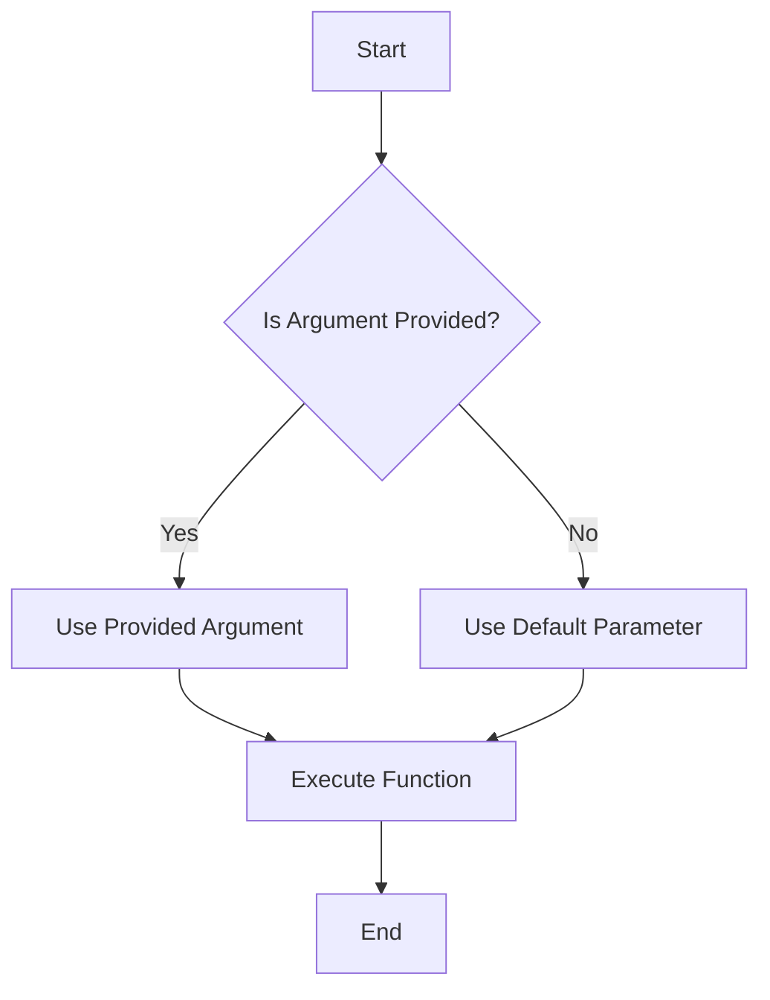

## 8.7. Default Parameters in Functions

In this section, we will explore the concept of default parameters in JavaScript functions. Default parameters allow us to set initial values for function parameters, which can be particularly useful when dealing with undefined or missing arguments. This feature, introduced in ECMAScript 6 (ES6), simplifies function definitions and enhances code readability.

### Introduction to Default Parameters

Default parameters in JavaScript provide a way to initialize function parameters with default values. This means that if no argument is provided for a parameter, the function will use the default value instead. This feature helps prevent errors and makes functions more robust and flexible.

#### Syntax of Default Parameters

The syntax for default parameters is straightforward. You simply assign a default value to a parameter using the assignment operator (`=`) within the function definition. Here's a basic example:

```javascript
function greet(name = "Guest") {
    console.log(`Hello, ${name}!`);
}

greet(); // Output: Hello, Guest!
greet("Alice"); // Output: Hello, Alice!
```

In this example, the `greet` function has a default parameter `name` with a value of `"Guest"`. If no argument is passed when calling the function, it defaults to `"Guest"`.

### Benefits of Using Default Parameters

Default parameters offer several advantages:

1. **Simplified Code**: They reduce the need for additional logic to handle missing arguments.
2. **Improved Readability**: The function signature clearly indicates the default behavior.
3. **Reduced Errors**: They help avoid `undefined` values and potential runtime errors.

### Examples of Functions with Default Parameters

Let's explore some practical examples to understand how default parameters can be used effectively.

#### Example 1: Calculating Area

Consider a function that calculates the area of a rectangle. We can use default parameters to handle cases where only one dimension is provided:

```javascript
function calculateArea(width = 1, height = 1) {
    return width * height;
}

console.log(calculateArea()); // Output: 1
console.log(calculateArea(5)); // Output: 5
console.log(calculateArea(5, 10)); // Output: 50
```

In this example, the `calculateArea` function defaults both `width` and `height` to `1`. If only one argument is provided, the other dimension defaults to `1`.

#### Example 2: Personalized Greeting

Here's another example where default parameters enhance a greeting function:

```javascript
function personalizedGreeting(name = "Friend", timeOfDay = "day") {
    console.log(`Good ${timeOfDay}, ${name}!`);
}

personalizedGreeting(); // Output: Good day, Friend!
personalizedGreeting("Sam"); // Output: Good day, Sam!
personalizedGreeting("Sam", "morning"); // Output: Good morning, Sam!
```

This function uses default parameters to provide a personalized greeting based on the time of day and the recipient's name.

### Default Parameters and Destructuring

JavaScript's destructuring assignment syntax can be combined with default parameters to extract values from objects or arrays while providing defaults. This is particularly useful when dealing with complex data structures.

#### Example: Destructuring with Default Parameters

Consider a function that extracts user information from an object:

```javascript
function displayUserInfo({ name = "Anonymous", age = 0 } = {}) {
    console.log(`Name: ${name}, Age: ${age}`);
}

displayUserInfo(); // Output: Name: Anonymous, Age: 0
displayUserInfo({ name: "Alice" }); // Output: Name: Alice, Age: 0
displayUserInfo({ name: "Bob", age: 25 }); // Output: Name: Bob, Age: 25
```

In this example, the function `displayUserInfo` uses destructuring to extract `name` and `age` from an object, with default values provided for both. The function call `displayUserInfo()` demonstrates how the defaults are applied when no argument is passed.

### Order of Parameters and Best Practices

When using default parameters, it's important to consider the order of parameters in your function definition. Typically, parameters with default values should be placed after those without defaults. This ensures that the function can be called with varying numbers of arguments without ambiguity.

#### Example: Ordering Parameters

```javascript
function createUser(username, role = "user", isActive = true) {
    console.log(`Username: ${username}, Role: ${role}, Active: ${isActive}`);
}

createUser("john_doe"); // Output: Username: john_doe, Role: user, Active: true
createUser("admin_user", "admin"); // Output: Username: admin_user, Role: admin, Active: true
createUser("guest_user", "guest", false); // Output: Username: guest_user, Role: guest, Active: false
```

In this example, `username` is a required parameter, while `role` and `isActive` have default values. This ordering allows for flexible function calls.

### Default Parameters vs. Short-Circuiting

Before ES6, developers often used short-circuiting with logical operators to provide default values. While this approach works, default parameters offer a cleaner and more intuitive solution.

#### Example: Short-Circuiting vs. Default Parameters

Consider the following function using short-circuiting:

```javascript
function oldGreet(name) {
    name = name || "Guest";
    console.log(`Hello, ${name}!`);
}

oldGreet(); // Output: Hello, Guest!
oldGreet("Alice"); // Output: Hello, Alice!
```

This function uses the logical OR (`||`) operator to provide a default value. However, this approach can lead to unexpected results if `0`, `false`, or `""` are valid arguments, as they are considered falsy in JavaScript.

With default parameters, the behavior is more predictable:

```javascript
function newGreet(name = "Guest") {
    console.log(`Hello, ${name}!`);
}

newGreet(); // Output: Hello, Guest!
newGreet("Alice"); // Output: Hello, Alice!
newGreet(0); // Output: Hello, 0!
```

Default parameters handle all falsy values correctly, providing a more reliable solution.

### Visualizing Default Parameters

Let's visualize how default parameters work in JavaScript functions using a flowchart:



This flowchart illustrates the decision-making process when a function with default parameters is called. If an argument is provided, it is used; otherwise, the default parameter is applied.

### Try It Yourself

To solidify your understanding of default parameters, try modifying the examples provided:

- Change the default values and observe how the function behavior changes.
- Add additional parameters with defaults and experiment with different argument combinations.
- Combine default parameters with destructuring in more complex data structures.

### References and Further Reading

For more information on default parameters and related topics, check out these resources:

- [MDN Web Docs: Default Parameters](https://developer.mozilla.org/en-US/docs/Web/JavaScript/Reference/Functions/Default_parameters)
- [W3Schools: JavaScript Function Parameters](https://www.w3schools.com/js/js_function_parameters.asp)

### Knowledge Check

Before moving on, let's summarize the key points:

- Default parameters provide initial values for function parameters.
- They simplify function definitions and improve code readability.
- Destructuring can be combined with default parameters for complex data structures.
- Parameters with defaults should be placed after required parameters.
- Default parameters offer a more reliable alternative to short-circuiting.

### Embrace the Journey

Remember, mastering default parameters is just one step in your JavaScript journey. As you continue to learn, you'll discover more powerful features and techniques that will enhance your programming skills. Keep experimenting, stay curious, and enjoy the process!

## Quiz Time!



### What is the main advantage of using default parameters in JavaScript functions?

- [x] They provide initial values for parameters, reducing the need for additional logic.
- [ ] They make functions run faster.
- [ ] They allow functions to accept unlimited arguments.
- [ ] They prevent syntax errors.

> **Explanation:** Default parameters provide initial values for parameters, which reduces the need for additional logic to handle missing arguments.

### How do you define a default parameter in a function?

- [x] By assigning a value to the parameter in the function definition.
- [ ] By using the `default` keyword before the parameter.
- [ ] By using the `var` keyword inside the function.
- [ ] By declaring the parameter as a constant.

> **Explanation:** Default parameters are defined by assigning a value to the parameter in the function definition.

### What happens if you call a function with default parameters without providing any arguments?

- [x] The function uses the default values for all parameters.
- [ ] The function throws an error.
- [ ] The function returns `undefined`.
- [ ] The function does not execute.

> **Explanation:** If no arguments are provided, the function uses the default values for all parameters.

### Can default parameters be used with destructuring in JavaScript?

- [x] Yes, default parameters can be combined with destructuring.
- [ ] No, default parameters and destructuring cannot be used together.
- [ ] Only in ES5.
- [ ] Only with arrays, not objects.

> **Explanation:** Default parameters can be combined with destructuring to provide default values for extracted properties.

### In which version of ECMAScript were default parameters introduced?

- [x] ES6
- [ ] ES5
- [ ] ES7
- [ ] ES3

> **Explanation:** Default parameters were introduced in ECMAScript 6 (ES6).

### What is a potential issue with using short-circuiting to provide default values?

- [x] It may not work correctly with falsy values like `0`, `false`, or `""`.
- [ ] It is slower than using default parameters.
- [ ] It requires more code.
- [ ] It only works with string values.

> **Explanation:** Short-circuiting may not work correctly with falsy values like `0`, `false`, or `""`, as they are considered falsy in JavaScript.

### Which of the following is a best practice when using default parameters?

- [x] Place parameters with defaults after required parameters.
- [ ] Use default parameters for all function parameters.
- [ ] Avoid using default parameters with objects.
- [ ] Always use short-circuiting instead of default parameters.

> **Explanation:** It is a best practice to place parameters with defaults after required parameters to avoid ambiguity.

### What is the output of the following code?
```javascript
function sayHello(name = "World") {
    console.log(`Hello, ${name}!`);
}
sayHello("");
```

- [x] Hello, !
- [ ] Hello, World!
- [ ] Hello, undefined!
- [ ] Hello, null!

> **Explanation:** The empty string `""` is a valid argument and is not replaced by the default value.

### Can default parameters be functions themselves?

- [x] Yes, default parameters can be functions.
- [ ] No, default parameters must be primitive values.
- [ ] Only in ES7 and later.
- [ ] Only with arrow functions.

> **Explanation:** Default parameters can be functions, allowing for more dynamic default behavior.

### True or False: Default parameters can only be used with primitive data types.

- [ ] True
- [x] False

> **Explanation:** Default parameters can be used with any data type, including objects, arrays, and functions.


