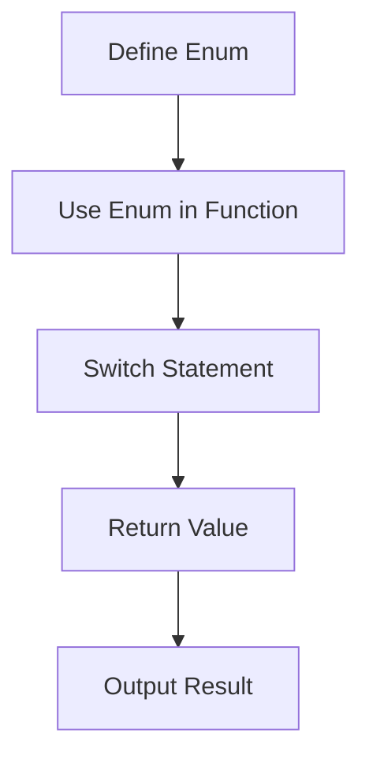

## 8.8. Working with Enumerations

In this section, we will explore the concept of enumerations, commonly referred to as enums, in JavaScript. Although JavaScript does not have built-in support for enums like some other programming languages, we can simulate them using objects or constants. Enums are a powerful tool for representing a fixed set of constants, making your code more readable and maintainable. Let's dive into the world of enums and see how they can be utilized effectively in JavaScript.

### Why Use Enums?

Enums are useful in programming for several reasons:

1. **Readability**: Enums provide meaningful names to a set of related values, making the code easier to understand.
2. **Maintainability**: By centralizing related constants, enums make it easier to update values in one place without affecting the rest of the code.
3. **Error Reduction**: Enums can help prevent errors by restricting values to a predefined set, reducing the chances of invalid data.
4. **Code Clarity**: Enums improve code clarity by providing a clear context for the values being used.

### Creating Enums in JavaScript

Since JavaScript does not have a native enum type, we can simulate enums using objects or constants. Let's explore both approaches.

#### Using Objects to Simulate Enums

One common way to create enums in JavaScript is by using objects. Here's how you can do it:

```javascript
// Define an enum using an object
const Color = {
  RED: 'red',
  GREEN: 'green',
  BLUE: 'blue'
};

// Use the enum in your code
function getColorName(color) {
  switch (color) {
    case Color.RED:
      return 'Red';
    case Color.GREEN:
      return 'Green';
    case Color.BLUE:
      return 'Blue';
    default:
      return 'Unknown color';
  }
}

console.log(getColorName(Color.RED)); // Output: Red
```

In this example, we define a `Color` object that holds a set of related constants. We then use these constants in a function to determine the color name.

#### Using `const` to Simulate Enums

Another approach is to use `const` declarations to create a set of constants:

```javascript
// Define an enum using const
const RED = 'red';
const GREEN = 'green';
const BLUE = 'blue';

// Use the enum in your code
function getColorName(color) {
  switch (color) {
    case RED:
      return 'Red';
    case GREEN:
      return 'Green';
    case BLUE:
      return 'Blue';
    default:
      return 'Unknown color';
  }
}

console.log(getColorName(RED)); // Output: Red
```

This method uses individual constants to represent each value in the enum. While this approach works, it lacks the grouping that objects provide, which can be useful for organization and clarity.

### Examples of Using Enums

Let's look at a few practical examples of how enums can be used in JavaScript.

#### Example 1: Traffic Light System

Enums can be used to represent states in a traffic light system:

```javascript
const TrafficLight = {
  RED: 'red',
  YELLOW: 'yellow',
  GREEN: 'green'
};

function getNextLight(currentLight) {
  switch (currentLight) {
    case TrafficLight.RED:
      return TrafficLight.GREEN;
    case TrafficLight.YELLOW:
      return TrafficLight.RED;
    case TrafficLight.GREEN:
      return TrafficLight.YELLOW;
    default:
      throw new Error('Invalid traffic light state');
  }
}

console.log(getNextLight(TrafficLight.RED)); // Output: green
```

In this example, the `TrafficLight` enum represents the states of a traffic light. The `getNextLight` function uses the enum to determine the next state.

#### Example 2: User Roles

Enums can also be used to define user roles in an application:

```javascript
const UserRole = {
  ADMIN: 'admin',
  EDITOR: 'editor',
  VIEWER: 'viewer'
};

function getAccessLevel(role) {
  switch (role) {
    case UserRole.ADMIN:
      return 'Full access';
    case UserRole.EDITOR:
      return 'Edit access';
    case UserRole.VIEWER:
      return 'View only';
    default:
      return 'No access';
  }
}

console.log(getAccessLevel(UserRole.EDITOR)); // Output: Edit access
```

Here, the `UserRole` enum defines different roles within an application, and the `getAccessLevel` function determines the access level based on the role.

### Potential Issues with Enums in JavaScript

While enums are useful, there are some potential issues to be aware of when using them in JavaScript:

1. **Lack of Type Safety**: JavaScript is a dynamically typed language, so there's no compile-time check to ensure that only valid enum values are used. This can lead to runtime errors if invalid values are passed.
2. **No Native Enum Support**: JavaScript does not have built-in enum support, so developers must use workarounds like objects or constants.
3. **String Comparison**: Enums often rely on string comparison, which can be error-prone and less efficient than numeric comparison.

### Third-Party Libraries and TypeScript for Robust Enum Support

To address some of the limitations of enums in JavaScript, developers can use third-party libraries or TypeScript.

#### Third-Party Libraries

Several libraries provide enhanced support for enums in JavaScript. One such library is [Enumify](https://github.com/rauschma/enumify), which allows you to create more robust enums with additional features like iteration and value validation.

#### TypeScript Enums

TypeScript, a superset of JavaScript, provides native support for enums. TypeScript enums offer type safety and compile-time checks, making them a popular choice for developers who need robust enum support.

Here's an example of how enums work in TypeScript:

```typescript
enum Direction {
  Up,
  Down,
  Left,
  Right
}

function move(direction: Direction) {
  switch (direction) {
    case Direction.Up:
      console.log('Moving up');
      break;
    case Direction.Down:
      console.log('Moving down');
      break;
    case Direction.Left:
      console.log('Moving left');
      break;
    case Direction.Right:
      console.log('Moving right');
      break;
  }
}

move(Direction.Left); // Output: Moving left
```

In this TypeScript example, the `Direction` enum provides a set of named constants, and the `move` function uses these constants to determine the direction of movement.

### Try It Yourself

Now that we've covered the basics of enums in JavaScript, it's time to try it yourself. Modify the following code examples to experiment with enums:

1. Add a new color to the `Color` enum and update the `getColorName` function to handle it.
2. Create a new enum for vehicle types (e.g., `CAR`, `TRUCK`, `MOTORCYCLE`) and write a function that returns the number of wheels for each type.
3. Use a third-party library like Enumify to create an enum with additional features.

### Visualizing Enums

To help visualize how enums work in JavaScript, let's use a flowchart to represent the process of using enums in a function.



In this flowchart, we start by defining an enum, then use it in a function with a switch statement to determine the return value, which is then outputted.

### References and Links

- [MDN Web Docs: JavaScript Data Types and Data Structures](https://developer.mozilla.org/en-US/docs/Web/JavaScript/Data_structures)
- [Enumify GitHub Repository](https://github.com/rauschma/enumify)
- [TypeScript Enums](https://www.typescriptlang.org/docs/handbook/enums.html)

### Knowledge Check

To reinforce your understanding of enums in JavaScript, let's summarize the key takeaways:

- Enums are useful for representing a fixed set of constants, improving code readability and maintainability.
- JavaScript does not have native enum support, but we can simulate enums using objects or constants.
- TypeScript provides native enum support with type safety and compile-time checks.
- Third-party libraries can enhance enum functionality in JavaScript.

### Embrace the Journey

Remember, this is just the beginning. As you progress, you'll learn more about how to use enums effectively in your JavaScript projects. Keep experimenting, stay curious, and enjoy the journey!

## Quiz Time!



### What is an enum?

- [x] A way to represent a fixed set of constants
- [ ] A function that returns a value
- [ ] A variable that holds multiple values
- [ ] A loop that iterates over an array

> **Explanation:** An enum is a way to represent a fixed set of constants, making code more readable and maintainable.


### How can you simulate enums in JavaScript?

- [x] Using objects
- [x] Using constants
- [ ] Using arrays
- [ ] Using loops

> **Explanation:** Enums can be simulated in JavaScript using objects or constants.


### What is a potential issue with enums in JavaScript?

- [x] Lack of type safety
- [ ] Too many features
- [ ] Difficult to read
- [ ] Requires a lot of memory

> **Explanation:** JavaScript's lack of type safety can lead to runtime errors when using enums.


### Which library can enhance enum functionality in JavaScript?

- [x] Enumify
- [ ] Lodash
- [ ] jQuery
- [ ] Axios

> **Explanation:** Enumify is a library that provides enhanced support for enums in JavaScript.


### What does TypeScript offer for enums?

- [x] Native support with type safety
- [ ] More complex syntax
- [ ] Slower performance
- [ ] Less readability

> **Explanation:** TypeScript offers native support for enums with type safety and compile-time checks.


### How can enums improve code?

- [x] By providing meaningful names to values
- [ ] By making code longer
- [ ] By adding more variables
- [ ] By increasing complexity

> **Explanation:** Enums improve code by providing meaningful names to values, enhancing readability.


### What is a common use case for enums?

- [x] Defining user roles
- [ ] Storing user data
- [ ] Performing calculations
- [ ] Creating animations

> **Explanation:** Enums are commonly used to define user roles, among other use cases.


### What is a benefit of using enums?

- [x] Reducing errors by restricting values
- [ ] Making code harder to understand
- [ ] Increasing the number of variables
- [ ] Slowing down execution

> **Explanation:** Enums reduce errors by restricting values to a predefined set.


### Can JavaScript natively support enums?

- [ ] True
- [x] False

> **Explanation:** JavaScript does not have native support for enums; they must be simulated using objects or constants.


### What is a TypeScript enum?

- [x] A set of named constants with type safety
- [ ] A function that returns a value
- [ ] A variable that holds multiple values
- [ ] A loop that iterates over an array

> **Explanation:** A TypeScript enum is a set of named constants with type safety and compile-time checks.


