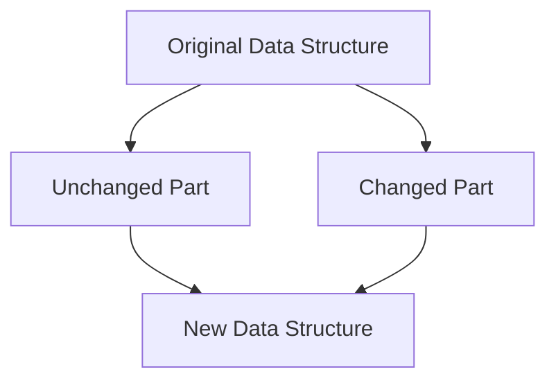

## 8.9. Immutability in JavaScript

In the world of programming, immutability is a concept that can significantly enhance the reliability and predictability of your code. In this section, we will explore what immutability means, why it is beneficial, and how you can implement it in JavaScript. We will also delve into libraries like Immutable.js and the concept of persistent data structures to further strengthen your understanding.

### What is Immutability?

Immutability refers to the state of an object that cannot be changed after it has been created. In other words, once you create an immutable object, you cannot alter its properties or values. This concept is crucial in programming because it helps prevent unintended side effects, making your code more predictable and easier to debug.

#### Benefits of Immutability

1. **Predictability**: Immutable objects ensure that data remains consistent throughout the program, reducing unexpected behavior.
2. **Thread Safety**: In multi-threaded environments, immutable objects can be shared across threads without the risk of data corruption.
3. **Simplified Debugging**: Since immutable objects do not change, tracking down bugs related to data mutation becomes easier.
4. **Functional Programming**: Immutability is a core principle of functional programming, which emphasizes the use of pure functions and immutable data.

### Enforcing Immutability with `Object.freeze()`

JavaScript provides a built-in method called `Object.freeze()` that can be used to make objects immutable. When an object is frozen, you cannot add, remove, or modify its properties.

```javascript
// Create an object
const person = {
  name: 'Alice',
  age: 30
};

// Freeze the object
Object.freeze(person);

// Attempt to modify the object
person.age = 31; // This will not change the age property
person.city = 'New York'; // This will not add a new property

console.log(person); // Output: { name: 'Alice', age: 30 }
```

In the example above, the `Object.freeze()` method prevents any modifications to the `person` object. This ensures that the object's state remains unchanged throughout the program.

#### Limitations of `Object.freeze()`

While `Object.freeze()` is useful, it has some limitations:

- **Shallow Freezing**: `Object.freeze()` only applies to the immediate properties of the object. If the object contains nested objects, those nested objects are not frozen.

```javascript
const user = {
  name: 'Bob',
  address: {
    city: 'Los Angeles'
  }
};

Object.freeze(user);
user.address.city = 'San Francisco'; // This will change the city property

console.log(user.address.city); // Output: 'San Francisco'
```

To achieve deep immutability, you need to recursively freeze each nested object.

### Using Immutable.js for Deep Immutability

Immutable.js is a library that provides persistent immutable data structures. It allows you to create deeply immutable objects and collections, ensuring that all levels of the data structure are immutable.

#### Installing Immutable.js

To use Immutable.js, you need to install it via npm:

```bash
npm install immutable
```

#### Creating Immutable Data Structures

Immutable.js provides several data structures, such as `Map`, `List`, and `Set`, that are immutable by default.

```javascript
const { Map } = require('immutable');

// Create an immutable map
const user = Map({
  name: 'Charlie',
  age: 25
});

// Attempt to modify the map
const updatedUser = user.set('age', 26);

console.log(user.get('age')); // Output: 25
console.log(updatedUser.get('age')); // Output: 26
```

In this example, the `user` map remains unchanged, while `updatedUser` is a new map with the updated age. Immutable.js ensures that the original data structure is not modified.

### Persistent Data Structures

Persistent data structures are a key concept in immutability. They allow you to create new versions of data structures without modifying the original. This is achieved through structural sharing, where unchanged parts of the data structure are shared between versions.

#### Benefits of Persistent Data Structures

1. **Efficiency**: Structural sharing minimizes memory usage and improves performance by reusing unchanged parts of the data structure.
2. **Versioning**: You can easily keep track of different versions of data, which is useful for undo/redo functionality.
3. **Concurrency**: Persistent data structures are inherently thread-safe, making them ideal for concurrent programming.

### Scenarios Where Immutability Enhances Code Reliability

Immutability can be particularly beneficial in the following scenarios:

1. **State Management**: In applications with complex state management, such as React applications, immutability helps ensure that state updates are predictable and traceable.
2. **Concurrency**: In multi-threaded environments, immutable data structures prevent race conditions and data corruption.
3. **Functional Programming**: Immutability aligns with the principles of functional programming, enabling the use of pure functions and reducing side effects.

### Visualizing Immutability

To better understand how immutability works, let's visualize the concept of structural sharing in persistent data structures.



In this diagram, the original data structure is divided into unchanged and changed parts. The new data structure shares the unchanged part with the original, while the changed part is newly created.

### Try It Yourself

Experiment with immutability by modifying the code examples provided. Try creating your own immutable data structures using `Object.freeze()` and Immutable.js. Observe how immutability affects the behavior of your code.

### References and Links

- [MDN Web Docs: Object.freeze()](https://developer.mozilla.org/en-US/docs/Web/JavaScript/Reference/Global_Objects/Object/freeze)
- [Immutable.js Documentation](https://immutable-js.github.io/immutable-js/)

### Knowledge Check

- What is immutability, and why is it important in programming?
- How does `Object.freeze()` enforce immutability in JavaScript?
- What are the limitations of `Object.freeze()`?
- How does Immutable.js provide deep immutability?
- What are persistent data structures, and how do they enhance code reliability?

### Embrace the Journey

Remember, immutability is a powerful tool in your programming toolkit. As you continue to learn and experiment, you'll discover new ways to apply immutability to enhance the reliability and maintainability of your code. Keep exploring, stay curious, and enjoy the journey!

## Quiz Time!



### What is immutability in programming?

- [x] The state of an object that cannot be changed after it is created
- [ ] The ability to change an object's state at any time
- [ ] A method to increase the speed of a program
- [ ] A technique to reduce memory usage

> **Explanation:** Immutability refers to the state of an object that cannot be changed after it has been created, ensuring data consistency and predictability.

### How does `Object.freeze()` work in JavaScript?

- [x] It prevents adding, removing, or modifying properties of an object
- [ ] It increases the speed of object manipulation
- [ ] It allows nested objects to be automatically frozen
- [ ] It makes a deep copy of an object

> **Explanation:** `Object.freeze()` prevents any changes to the properties of an object, making it immutable.

### What is a limitation of `Object.freeze()`?

- [x] It only applies to the immediate properties of an object
- [ ] It automatically freezes nested objects
- [ ] It allows changes to object properties
- [ ] It increases memory usage significantly

> **Explanation:** `Object.freeze()` only applies to the immediate properties of an object, not nested objects.

### What is Immutable.js used for?

- [x] Creating deeply immutable data structures
- [ ] Increasing the speed of JavaScript execution
- [ ] Automatically freezing all objects in a program
- [ ] Reducing the size of JavaScript files

> **Explanation:** Immutable.js provides persistent immutable data structures that ensure deep immutability.

### What are persistent data structures?

- [x] Data structures that allow new versions without modifying the original
- [ ] Data structures that automatically delete old versions
- [ ] Data structures that increase memory usage
- [ ] Data structures that are only used in functional programming

> **Explanation:** Persistent data structures allow the creation of new versions without modifying the original, using structural sharing.

### How does immutability enhance code reliability?

- [x] By preventing unintended side effects and ensuring data consistency
- [ ] By allowing changes to data at any time
- [ ] By reducing the need for testing
- [ ] By increasing the speed of data processing

> **Explanation:** Immutability enhances code reliability by preventing unintended side effects and ensuring data consistency.

### What is structural sharing in persistent data structures?

- [x] Reusing unchanged parts of a data structure between versions
- [ ] Deleting unchanged parts of a data structure
- [ ] Increasing the size of a data structure
- [ ] Automatically freezing all parts of a data structure

> **Explanation:** Structural sharing involves reusing unchanged parts of a data structure between versions, improving efficiency.

### In which scenario is immutability particularly beneficial?

- [x] State management in complex applications
- [ ] Increasing the speed of simple scripts
- [ ] Reducing the need for comments in code
- [ ] Automatically optimizing code

> **Explanation:** Immutability is particularly beneficial in state management for complex applications, ensuring predictable state updates.

### Can `Object.freeze()` be used for deep immutability?

- [ ] True
- [x] False

> **Explanation:** `Object.freeze()` only provides shallow immutability, affecting only the immediate properties of an object.

### What is the main advantage of using Immutable.js?

- [x] It provides deep immutability for complex data structures
- [ ] It automatically increases the speed of JavaScript execution
- [ ] It reduces the size of JavaScript files
- [ ] It allows changes to immutable objects

> **Explanation:** Immutable.js provides deep immutability for complex data structures, ensuring that all levels are immutable.


