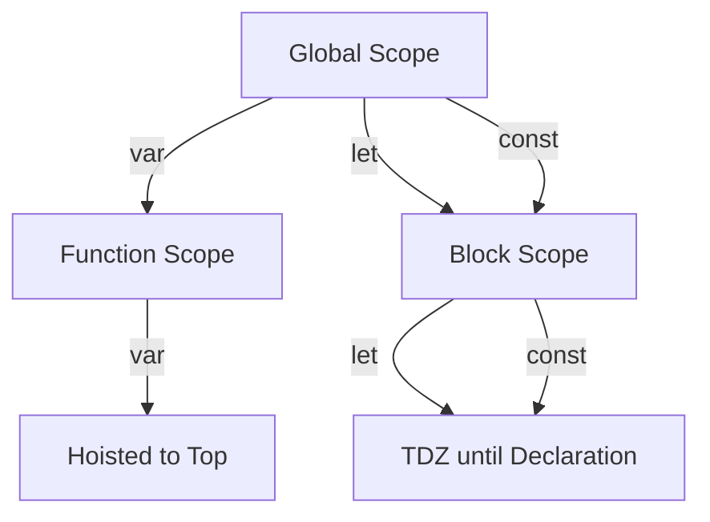

## 9.1. Choosing the Appropriate Variable Keyword

In JavaScript, choosing the correct keyword for declaring variables is crucial for writing clean, efficient, and maintainable code. The three keywords available for variable declaration are `var`, `let`, and `const`. Each has its own characteristics and use cases. In this section, we will delve into the differences between these keywords, provide criteria for selecting each, and offer best practices to enhance code readability and communicate intent effectively.

### Understanding `var`, `let`, and `const`

Before we dive into the guidelines for choosing the appropriate keyword, let's summarize the differences between `var`, `let`, and `const`.

#### `var`

- **Scope**: Function-scoped or globally-scoped if declared outside a function.
- **Hoisting**: Variables declared with `var` are hoisted to the top of their scope, meaning they are accessible before their declaration in the code.
- **Re-declaration**: Can be re-declared within the same scope.
- **Use Case**: Historically used for variable declaration before ES6 introduced `let` and `const`.

#### `let`

- **Scope**: Block-scoped, meaning it is only accessible within the block it is declared.
- **Hoisting**: Variables declared with `let` are hoisted but not initialized, leading to a Temporal Dead Zone (TDZ) until the declaration is encountered.
- **Re-declaration**: Cannot be re-declared in the same scope.
- **Use Case**: Preferred for variables that may change value but are limited to a specific block or function.

#### `const`

- **Scope**: Block-scoped, similar to `let`.
- **Hoisting**: Also subject to TDZ, like `let`.
- **Re-declaration**: Cannot be re-declared or reassigned in the same scope.
- **Use Case**: Ideal for variables that should not change after being initialized.

### Criteria for Choosing Each Keyword

Choosing the right keyword depends on the context and purpose of the variable. Here are some guidelines to help you decide:

#### When to Use `var`

- **Legacy Code**: Use `var` when working with legacy JavaScript codebases where `var` is already prevalent.
- **Global Variables**: If you need a variable to be globally accessible and don't mind the risks associated with global variables, `var` can be used. However, this is generally discouraged due to potential conflicts and unintended side effects.

#### When to Use `let`

- **Block Scope**: Use `let` when you need a variable to be limited to a specific block, such as within a loop or conditional statement.
- **Reassignment**: Choose `let` for variables that need to be reassigned new values within their scope.
- **Avoiding Hoisting Issues**: `let` helps prevent issues related to hoisting by ensuring variables are not accessible before their declaration.

#### When to Use `const`

- **Immutable Values**: Use `const` for variables that should not be reassigned after their initial assignment. This is particularly useful for constants and configuration values.
- **Readability and Intent**: `const` communicates to other developers that the variable is intended to remain unchanged, enhancing code readability.
- **Best Practice**: As a general rule, default to using `const` unless you know the variable will need to be reassigned.

### Encouraging the Use of `const`

Using `const` by default is a best practice in modern JavaScript development. It helps prevent accidental reassignment of variables, leading to more predictable and bug-free code. By using `const`, you also make your code's intent clearer to others, indicating that the variable is not meant to change.

#### Example: Using `const` for Immutable Values

```javascript
// Declare a constant for the value of pi
const PI = 3.14159;

// Attempting to reassign a const variable will result in an error
// PI = 3.14; // Uncaught TypeError: Assignment to constant variable.
```

In this example, `PI` is declared as a constant using `const`, indicating that its value should not change throughout the program.

### Code Readability and Intent Communication

Choosing the appropriate variable keyword is not just about technical correctness; it's also about communicating intent and improving code readability. By using `let` and `const` appropriately, you can make your code easier to understand and maintain.

#### Example: Communicating Intent with `let` and `const`

```javascript
// Use const for variables that should not change
const MAX_USERS = 100;

// Use let for variables that may change
let currentUsers = 0;

function addUser() {
  if (currentUsers < MAX_USERS) {
    currentUsers++;
    console.log(`User added. Current users: ${currentUsers}`);
  } else {
    console.log('Maximum users reached.');
  }
}
```

In this example, `MAX_USERS` is declared with `const` to indicate that it is a constant value, while `currentUsers` is declared with `let` because its value changes as users are added.

### Best Practices for Variable Declaration

To ensure your code is clean, efficient, and maintainable, follow these best practices for variable declaration:

1. **Default to `const`**: Use `const` by default for all variables unless you know they need to be reassigned.

2. **Use `let` for Reassignable Variables**: When a variable needs to be reassigned, use `let` to limit its scope and prevent accidental re-declaration.

3. **Avoid `var`**: Unless working with legacy code, avoid using `var` due to its function scope and hoisting behavior, which can lead to unexpected results.

4. **Communicate Intent**: Use `const` and `let` to clearly communicate the intent of your variables, making your code easier to read and understand.

5. **Limit Scope**: Declare variables in the narrowest scope possible to reduce potential conflicts and improve code maintainability.

6. **Consistent Naming**: Use meaningful and consistent naming conventions for your variables to enhance readability.

### Code Examples Demonstrating Best Practices

Let's look at some examples that demonstrate these best practices in action.

#### Example 1: Using `const` for Constant Values

```javascript
// Declare constants for configuration settings
const API_URL = 'https://api.example.com';
const TIMEOUT = 5000;

// Use the constants in a function
function fetchData() {
  console.log(`Fetching data from ${API_URL} with a timeout of ${TIMEOUT}ms`);
  // Fetch data from the API...
}
```

In this example, `API_URL` and `TIMEOUT` are declared as constants using `const`, indicating that they are configuration settings that should not change.

#### Example 2: Using `let` for Loop Variables

```javascript
// Use let for loop variables
for (let i = 0; i < 10; i++) {
  console.log(`Iteration ${i}`);
}
```

In this example, `let` is used for the loop variable `i`, ensuring that it is limited to the scope of the loop and preventing accidental re-declaration outside the loop.

#### Example 3: Avoiding `var` in Modern JavaScript

```javascript
// Avoid using var in modern JavaScript
function calculateTotal(prices) {
  let total = 0;
  for (let price of prices) {
    total += price;
  }
  return total;
}
```

In this example, `let` is used for the variable `total`, avoiding the use of `var` and ensuring that the variable is limited to the scope of the function.

### Visualizing Variable Scope and Hoisting

To better understand the differences between `var`, `let`, and `const`, let's visualize their scope and hoisting behavior using a diagram.



**Caption**: This diagram illustrates the scope and hoisting behavior of `var`, `let`, and `const`. `var` is function-scoped and hoisted to the top of its scope, while `let` and `const` are block-scoped and subject to the Temporal Dead Zone (TDZ) until their declaration.

### Try It Yourself

Experiment with the following code examples to solidify your understanding of variable keywords:

1. **Modify the `const` Example**: Try changing the value of a `const` variable and observe the error message.
2. **Re-declare a `let` Variable**: Attempt to re-declare a `let` variable in the same scope and see what happens.
3. **Use `var` in a Block**: Declare a `var` variable inside a block and access it outside the block to observe its scope.

### References and Links

For further reading on variable declarations and best practices, check out these resources:

- [MDN Web Docs: var](https://developer.mozilla.org/en-US/docs/Web/JavaScript/Reference/Statements/var)
- [MDN Web Docs: let](https://developer.mozilla.org/en-US/docs/Web/JavaScript/Reference/Statements/let)
- [MDN Web Docs: const](https://developer.mozilla.org/en-US/docs/Web/JavaScript/Reference/Statements/const)
- [JavaScript Info: Variables](https://javascript.info/variables)

### Knowledge Check

To reinforce your understanding, try answering these questions:

- What is the main difference between `var` and `let` in terms of scope?
- Why is `const` recommended for variables that do not change?
- What is the Temporal Dead Zone (TDZ), and how does it affect `let` and `const`?
- How does using `const` improve code readability and intent communication?
- What are some best practices for variable declaration in JavaScript?

### Embrace the Journey

Remember, this is just the beginning. As you progress, you'll build more complex and interactive web pages. Keep experimenting, stay curious, and enjoy the journey!

## Quiz Time!



### What is the primary difference between `var` and `let` in terms of scope?

- [x] `var` is function-scoped, while `let` is block-scoped.
- [ ] `var` is block-scoped, while `let` is function-scoped.
- [ ] Both `var` and `let` are block-scoped.
- [ ] Both `var` and `let` are function-scoped.

> **Explanation:** `var` is function-scoped, meaning it is accessible throughout the function it is declared in, whereas `let` is block-scoped, meaning it is only accessible within the block it is declared in.

### Why is `const` recommended for variables that do not change?

- [x] It prevents reassignment, making the code more predictable.
- [ ] It allows reassignment, making the code more flexible.
- [ ] It is function-scoped, making the code easier to read.
- [ ] It is hoisted, making the code run faster.

> **Explanation:** `const` is recommended for variables that do not change because it prevents reassignment, making the code more predictable and reducing the risk of accidental changes.

### What is the Temporal Dead Zone (TDZ)?

- [x] The period between the start of a block and the declaration of a `let` or `const` variable.
- [ ] The period between the start of a function and the declaration of a `var` variable.
- [ ] The period between the declaration and initialization of a `var` variable.
- [ ] The period between the declaration and reassignment of a `const` variable.

> **Explanation:** The Temporal Dead Zone (TDZ) is the period between the start of a block and the declaration of a `let` or `const` variable, during which the variable cannot be accessed.

### How does using `const` improve code readability?

- [x] It communicates that the variable is not meant to change.
- [ ] It allows the variable to be reassigned, making the code more flexible.
- [ ] It is function-scoped, making the code easier to read.
- [ ] It is hoisted, making the code run faster.

> **Explanation:** Using `const` improves code readability by communicating to other developers that the variable is not meant to change, making the code's intent clearer.

### What is a best practice for variable declaration in JavaScript?

- [x] Default to using `const` unless reassignment is necessary.
- [ ] Default to using `var` for all variables.
- [ ] Use `let` for all variables, regardless of reassignment.
- [ ] Avoid using `const` to keep the code flexible.

> **Explanation:** A best practice for variable declaration in JavaScript is to default to using `const` unless reassignment is necessary, as it prevents accidental changes and improves code readability.

### Can `let` variables be re-declared in the same scope?

- [ ] Yes, they can be re-declared.
- [x] No, they cannot be re-declared.
- [ ] Yes, but only in strict mode.
- [ ] No, unless they are in a different block.

> **Explanation:** `let` variables cannot be re-declared in the same scope, which helps prevent accidental re-declaration and potential errors.

### What happens if you try to access a `let` variable before its declaration?

- [ ] It returns `undefined`.
- [ ] It returns `null`.
- [x] It throws a ReferenceError.
- [ ] It returns an empty string.

> **Explanation:** Accessing a `let` variable before its declaration results in a ReferenceError due to the Temporal Dead Zone (TDZ).

### What is the main advantage of using `let` over `var`?

- [x] `let` is block-scoped, reducing the risk of scope-related errors.
- [ ] `let` is function-scoped, making it easier to use in functions.
- [ ] `let` is hoisted, making it faster to access.
- [ ] `let` allows re-declaration, making it more flexible.

> **Explanation:** The main advantage of using `let` over `var` is that `let` is block-scoped, reducing the risk of scope-related errors and making the code more predictable.

### Can `const` variables be reassigned?

- [ ] Yes, they can be reassigned.
- [x] No, they cannot be reassigned.
- [ ] Yes, but only in strict mode.
- [ ] No, unless they are in a different block.

> **Explanation:** `const` variables cannot be reassigned, which is why they are used for values that should remain constant throughout the program.

### Is it a good practice to use `var` in modern JavaScript?

- [ ] True
- [x] False

> **Explanation:** It is generally not a good practice to use `var` in modern JavaScript due to its function scope and hoisting behavior, which can lead to unexpected results. Instead, `let` and `const` are preferred.


