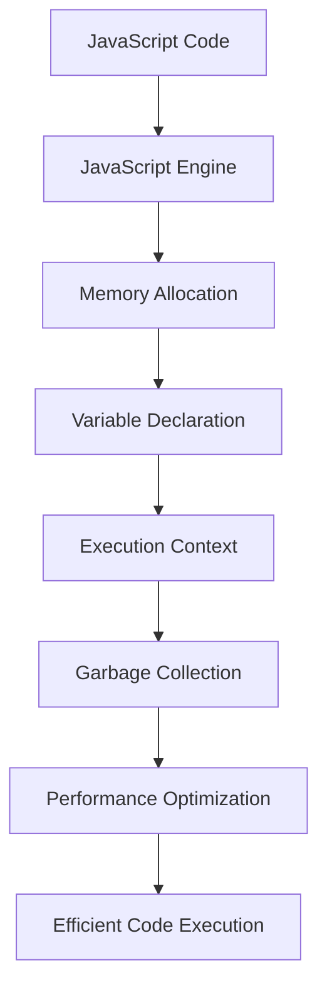

## 9.10. Performance Considerations

In this section, we will explore how to optimize your JavaScript code for better performance by focusing on variable usage and data handling. Performance optimization is crucial for creating efficient, responsive applications, especially as your codebase grows. We'll discuss the impact of variable declarations on performance, strategies for minimizing memory usage, tips for optimizing loops and iterations, and tools for profiling and measuring performance. Finally, we'll consider how to balance performance optimization with code readability, ensuring that your code remains maintainable.

### Understanding the Impact of Variable Declarations on Performance

Variables are fundamental to any programming language, and JavaScript is no exception. However, how you declare and manage variables can significantly impact your application's performance. Let's explore some key considerations:

#### Variable Scope and Lifetime

The scope and lifetime of a variable determine how long it exists in memory and where it can be accessed. In JavaScript, variables can be declared using `var`, `let`, or `const`, each affecting scope differently:

- **`var`**: Variables declared with `var` have function scope, meaning they are accessible throughout the function in which they are declared. They are also hoisted, which can lead to unexpected behavior if not managed carefully.

- **`let`** and **`const`**: These keywords introduce block scope, meaning the variables are only accessible within the block (e.g., within a loop or conditional statement) in which they are declared. This can help reduce memory usage by limiting the lifetime of variables to only when they are needed.

**Example:**

```javascript
function processData(data) {
    for (let i = 0; i < data.length; i++) {
        const item = data[i];
        // Process item
    }
    // 'i' and 'item' are not accessible here
}
```

In this example, `i` and `item` are limited to the loop block, reducing the memory footprint outside of the loop.

#### Minimizing Global Variables

Global variables are accessible throughout your entire codebase, which can lead to memory bloat and potential conflicts. It's best to minimize their use and instead prefer local variables or encapsulate them within functions or modules.

**Example:**

```javascript
// Avoid
var globalCounter = 0;

// Prefer
function incrementCounter() {
    let counter = 0;
    counter++;
    return counter;
}
```

### Minimizing Memory Usage with Proper Variable Management

Efficient memory usage is crucial for performance, especially in environments with limited resources, such as mobile devices. Here are some strategies to manage memory effectively:

#### Garbage Collection and Memory Leaks

JavaScript has an automatic garbage collector that frees up memory by removing objects that are no longer referenced. However, it's essential to be aware of potential memory leaks, which occur when objects are unintentionally kept in memory.

**Avoid Memory Leaks:**

- **Remove Event Listeners**: Ensure you remove event listeners when they are no longer needed.

- **Clear Intervals and Timeouts**: Use `clearInterval` and `clearTimeout` to stop any ongoing timers.

- **Avoid Circular References**: Be cautious of objects referencing each other, preventing garbage collection.

#### Use of Data Structures

Choosing the right data structure can significantly impact memory usage and performance. For example, use arrays for ordered collections and objects for key-value pairs.

**Example:**

```javascript
// Use an array for a list of items
let items = ['apple', 'banana', 'cherry'];

// Use an object for key-value pairs
let fruitColors = {
    apple: 'red',
    banana: 'yellow',
    cherry: 'red'
};
```

### Optimizing Loops and Iterations

Loops are a common source of performance bottlenecks, especially when dealing with large datasets. Here are some tips to optimize them:

#### Use Efficient Loop Constructs

- **Avoid `for...in` for Arrays**: The `for...in` loop is intended for iterating over object properties, not array elements. Use `for`, `for...of`, or array methods like `forEach`.

- **Use `forEach` and Other Array Methods**: These methods are optimized for performance and readability.

**Example:**

```javascript
let numbers = [1, 2, 3, 4, 5];

// Prefer forEach over for...in
numbers.forEach(number => {
    console.log(number);
});
```

#### Minimize Work Inside Loops

Perform as little work as possible inside loops. Move calculations or function calls outside the loop if they don't depend on the loop's iteration.

**Example:**

```javascript
let data = [/* large dataset */];
let processedData = [];

for (let i = 0, len = data.length; i < len; i++) {
    // Avoid recalculating data.length in each iteration
    processedData.push(processItem(data[i]));
}
```

### Profiling Tools to Measure Performance

Profiling tools help identify performance bottlenecks and optimize your code. Here are some popular tools:

#### Chrome DevTools

Chrome DevTools provides a comprehensive suite of tools for profiling JavaScript performance. Use the Performance tab to record and analyze your application's runtime performance.

**Steps to Use Chrome DevTools:**

1. Open Chrome DevTools (F12 or right-click > Inspect).
2. Navigate to the Performance tab.
3. Click "Record" to start profiling.
4. Interact with your application.
5. Click "Stop" to end profiling and analyze the results.

#### Lighthouse

Lighthouse is an open-source tool integrated into Chrome DevTools that provides performance audits for web applications. It offers insights into performance, accessibility, and best practices.

**Using Lighthouse:**

1. Open Chrome DevTools.
2. Go to the Lighthouse tab.
3. Select the categories you want to audit (e.g., Performance).
4. Click "Generate Report" to see detailed insights.

### Balancing Performance Optimization with Code Readability

While optimizing performance is essential, it's equally important to maintain code readability. Here are some tips to balance both:

#### Use Descriptive Variable Names

Descriptive variable names improve code readability and make it easier to understand the purpose of each variable.

**Example:**

```javascript
// Avoid
let x = 10;

// Prefer
let maxItems = 10;
```

#### Comment Your Code

Comments help explain complex logic and the purpose of specific optimizations, making it easier for others (and your future self) to understand the code.

**Example:**

```javascript
// Calculate the total price with tax
let totalPrice = calculateTotalPrice(items, taxRate);
```

#### Refactor for Clarity

Regularly refactor your code to improve clarity and remove unnecessary complexity. Break down complex functions into smaller, more manageable pieces.

**Example:**

```javascript
// Avoid
function processOrder(order) {
    // Complex logic
}

// Prefer
function validateOrder(order) {
    // Validation logic
}

function calculateOrderTotal(order) {
    // Calculation logic
}

function processOrder(order) {
    validateOrder(order);
    let total = calculateOrderTotal(order);
    // Further processing
}
```

### Visualizing JavaScript's Interaction with Web Browsers and Web Pages

To better understand how JavaScript interacts with web browsers and web pages, let's visualize the process using a diagram. This will help illustrate how JavaScript code is executed and how variables and data types are managed.



**Diagram Description:** This flowchart represents the process of JavaScript code execution, starting from the code itself, moving through the JavaScript engine, memory allocation, variable declaration, execution context, garbage collection, performance optimization, and finally resulting in efficient code execution.

### Try It Yourself

Now that we've covered various performance considerations, let's put them into practice. Try modifying the following code examples to see how different optimizations can improve performance:

**Example 1: Optimize Loop Performance**

```javascript
let numbers = [1, 2, 3, 4, 5];
let sum = 0;

// Original loop
for (let i = 0; i < numbers.length; i++) {
    sum += numbers[i];
}

// Optimized loop
for (let i = 0, len = numbers.length; i < len; i++) {
    sum += numbers[i];
}

console.log(sum);
```

**Challenge:** Modify the loop to use `forEach` and compare the readability and performance.

**Example 2: Minimize Memory Usage**

```javascript
function createLargeArray() {
    let largeArray = new Array(1000000).fill(0);
    return largeArray;
}

let array = createLargeArray();

// Perform operations on array

// Challenge: Implement a function to clear the array from memory when it's no longer needed.
```

### Knowledge Check

Before we conclude, let's review some key takeaways:

- **Variable Declarations**: Use `let` and `const` for block-scoped variables to reduce memory usage.
- **Memory Management**: Be aware of potential memory leaks and use appropriate data structures.
- **Loop Optimization**: Use efficient loop constructs and minimize work inside loops.
- **Profiling Tools**: Utilize tools like Chrome DevTools and Lighthouse to identify performance bottlenecks.
- **Code Readability**: Balance performance optimization with readability by using descriptive names, comments, and refactoring.

### Embrace the Journey

Remember, optimizing JavaScript performance is an ongoing process. As you gain experience, you'll develop an intuition for identifying bottlenecks and implementing efficient solutions. Keep experimenting, stay curious, and enjoy the journey of becoming a proficient JavaScript developer!

## Quiz Time!



### What is the main advantage of using `let` and `const` over `var`?

- [x] They provide block scope, reducing memory usage.
- [ ] They are faster than `var`.
- [ ] They are hoisted differently.
- [ ] They are easier to type.

> **Explanation:** `let` and `const` provide block scope, which limits the lifetime of variables to the block they are declared in, reducing memory usage.

### How can you minimize memory leaks in JavaScript?

- [x] Remove event listeners when no longer needed.
- [x] Clear intervals and timeouts.
- [ ] Use more global variables.
- [ ] Avoid using arrays.

> **Explanation:** Removing event listeners and clearing intervals and timeouts help prevent memory leaks by ensuring that unused objects are garbage collected.

### Which loop construct is not recommended for iterating over arrays?

- [ ] `for`
- [ ] `for...of`
- [x] `for...in`
- [ ] `forEach`

> **Explanation:** `for...in` is intended for iterating over object properties, not array elements, and can lead to unexpected results.

### What is the purpose of Chrome DevTools' Performance tab?

- [x] To record and analyze runtime performance.
- [ ] To edit HTML and CSS.
- [ ] To debug network requests.
- [ ] To manage browser extensions.

> **Explanation:** The Performance tab in Chrome DevTools is used to record and analyze the runtime performance of web applications.

### What is a common strategy for optimizing loops?

- [x] Minimize work inside loops.
- [ ] Use `for...in` for all loops.
- [ ] Declare variables globally.
- [ ] Avoid using functions.

> **Explanation:** Minimizing work inside loops helps improve performance by reducing the amount of processing done in each iteration.

### How can you improve code readability while optimizing performance?

- [x] Use descriptive variable names and comments.
- [ ] Use one-letter variable names.
- [ ] Avoid comments to reduce file size.
- [ ] Write all code in a single function.

> **Explanation:** Descriptive variable names and comments improve code readability, making it easier to understand and maintain.

### What is the role of garbage collection in JavaScript?

- [x] To free up memory by removing unreferenced objects.
- [ ] To speed up code execution.
- [ ] To optimize network requests.
- [ ] To manage CSS styles.

> **Explanation:** Garbage collection in JavaScript automatically frees up memory by removing objects that are no longer referenced.

### Which tool provides performance audits for web applications?

- [x] Lighthouse
- [ ] Node.js
- [ ] Webpack
- [ ] Babel

> **Explanation:** Lighthouse is an open-source tool integrated into Chrome DevTools that provides performance audits for web applications.

### What is a potential downside of excessive performance optimization?

- [x] Reduced code readability and maintainability.
- [ ] Increased memory usage.
- [ ] Slower code execution.
- [ ] More global variables.

> **Explanation:** Excessive performance optimization can lead to reduced code readability and maintainability, making it harder to understand and modify the code.

### True or False: Global variables should be minimized to improve performance.

- [x] True
- [ ] False

> **Explanation:** Minimizing global variables helps improve performance by reducing memory usage and potential conflicts in the global namespace.


