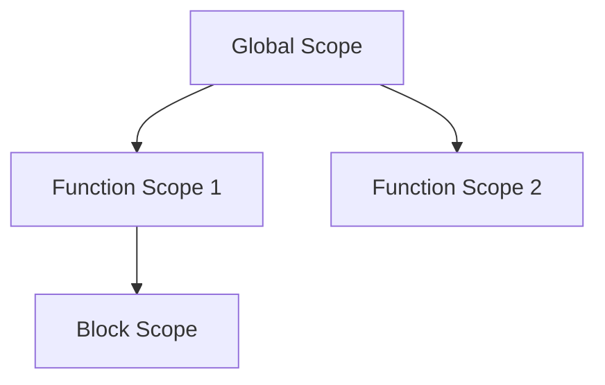

## 9.2. Avoiding Global Variables

In the world of JavaScript programming, global variables can often be a source of unexpected behavior and bugs. They are variables that are accessible from anywhere in your code, which might sound convenient at first, but can lead to a host of issues as your codebase grows. In this section, we will explore why global variables can be problematic, and provide you with strategies to avoid them, ensuring your code remains clean, efficient, and maintainable.

### Why Are Global Variables Problematic?

Global variables are accessible throughout your entire codebase, which can lead to several issues:

1. **Name Collisions**: Since global variables are accessible from anywhere, there's a risk of accidentally overwriting them. This is especially true in larger projects or when integrating third-party libraries.

2. **Tight Coupling**: Global variables can create dependencies between different parts of your code, making it harder to isolate and test individual components.

3. **Debugging Challenges**: When a global variable is modified unexpectedly, it can be difficult to track down where the change occurred, leading to time-consuming debugging sessions.

4. **Memory Leaks**: Global variables remain in memory for the duration of the application's lifecycle, potentially leading to memory leaks if not managed properly.

5. **Security Risks**: Exposing variables globally increases the risk of them being accessed or manipulated in unintended ways, which can be a security concern.

### Techniques to Limit Scope

To avoid the pitfalls of global variables, it's important to limit the scope of your variables. Here are some effective techniques:

#### 1. Immediately Invoked Function Expressions (IIFEs)

An IIFE is a function that runs as soon as it is defined. It creates a private scope, preventing variables from leaking into the global scope.

```javascript
(function() {
  var privateVariable = "I'm private!";
  console.log(privateVariable); // Outputs: I'm private!
})();

console.log(privateVariable); // ReferenceError: privateVariable is not defined
```

**Explanation**: The variable `privateVariable` is only accessible within the IIFE, protecting it from the global scope.

#### 2. Modules

Modules are a way to encapsulate code into separate files or components, each with its own scope. This is a powerful feature in modern JavaScript (ES6 and beyond) that helps manage dependencies and maintain a clean global namespace.

```javascript
// mathModule.js
export const add = (a, b) => a + b;
export const subtract = (a, b) => a - b;

// main.js
import { add, subtract } from './mathModule.js';

console.log(add(5, 3)); // Outputs: 8
console.log(subtract(5, 3)); // Outputs: 2
```

**Explanation**: By using modules, we can export and import specific functions or variables, keeping them scoped to their respective files.

#### 3. Namespace Patterns

Namespaces are a way to group related variables and functions under a single global object, reducing the risk of name collisions.

```javascript
var MyApp = MyApp || {};

MyApp.utils = {
  log: function(message) {
    console.log(message);
  }
};

MyApp.utils.log("Hello, World!"); // Outputs: Hello, World!
```

**Explanation**: The `MyApp` object serves as a namespace, encapsulating the `utils` object and its methods.

#### 4. Object Encapsulation

Encapsulation involves bundling data and methods that operate on that data within a single object. This limits access to the data and reduces the need for global variables.

```javascript
var counter = (function() {
  var count = 0;

  return {
    increment: function() {
      count++;
    },
    getCount: function() {
      return count;
    }
  };
})();

counter.increment();
console.log(counter.getCount()); // Outputs: 1
```

**Explanation**: The `count` variable is private to the `counter` object, accessible only through the `increment` and `getCount` methods.

### Refactoring Code to Eliminate Globals

Refactoring code to eliminate global variables involves identifying and isolating them, then applying the techniques mentioned above. Here are some steps to guide you:

1. **Identify Global Variables**: Use tools like linters or static analysis tools to identify global variables in your code.

2. **Assess Usage**: Determine how and where each global variable is used. This will help you decide the best way to refactor them.

3. **Encapsulate**: Use IIFEs, modules, or objects to encapsulate the variables, limiting their scope.

4. **Test Thoroughly**: After refactoring, ensure that your code still functions as expected by running tests and checking for any new issues.

5. **Iterate**: Refactoring is an iterative process. Continuously look for opportunities to improve your code and reduce reliance on global variables.

### Benefits of a Clean Global Namespace

Maintaining a clean global namespace offers several advantages:

- **Reduced Risk of Name Collisions**: By limiting the number of global variables, you minimize the risk of accidentally overwriting them.

- **Improved Maintainability**: Code that is modular and encapsulated is easier to maintain and understand.

- **Enhanced Testability**: Isolated components are easier to test, as they have fewer dependencies on the global state.

- **Better Performance**: Reducing the number of global variables can improve performance, as the JavaScript engine has fewer variables to track.

- **Increased Security**: Limiting access to variables reduces the risk of them being manipulated in unintended ways.

### Visualizing Scope with Diagrams

To better understand how scope works in JavaScript, let's visualize it using a scope chain diagram.



**Diagram Explanation**: This diagram illustrates how different scopes are nested within each other. The global scope contains two function scopes, and one of the function scopes contains a block scope. Variables declared in a specific scope are only accessible within that scope and its child scopes.

### Try It Yourself

To solidify your understanding, try modifying the code examples provided:

- **Experiment with IIFEs**: Create an IIFE that encapsulates a counter variable and provides methods to increment and reset it.

- **Create a Module**: Write a simple module that exports a function to calculate the area of a rectangle.

- **Implement a Namespace**: Group related functions under a single namespace object and access them using dot notation.

### References and Links

For further reading on avoiding global variables and managing scope in JavaScript, consider the following resources:

- [MDN Web Docs: JavaScript Guide](https://developer.mozilla.org/en-US/docs/Web/JavaScript/Guide)
- [W3Schools: JavaScript Scope](https://www.w3schools.com/js/js_scope.asp)
- [JavaScript.info: Global Object](https://javascript.info/global-object)

### Knowledge Check

Before moving on, let's review some key takeaways:

- Global variables can lead to name collisions, tight coupling, and debugging challenges.
- Techniques like IIFEs, modules, namespaces, and encapsulation help limit scope.
- Refactoring code to eliminate global variables improves maintainability and performance.
- A clean global namespace reduces risks and enhances code quality.

### Embrace the Journey

Remember, avoiding global variables is just one step towards writing clean and efficient JavaScript code. As you continue your learning journey, you'll discover more best practices and techniques to enhance your programming skills. Keep experimenting, stay curious, and enjoy the process!

---

## Quiz Time!



### Why are global variables problematic in JavaScript?

- [x] They can lead to name collisions.
- [ ] They are always faster than local variables.
- [ ] They are automatically garbage collected.
- [ ] They are only accessible within a single function.

> **Explanation:** Global variables can lead to name collisions because they are accessible from anywhere in the code, increasing the risk of overwriting them.

### Which technique creates a private scope in JavaScript?

- [x] Immediately Invoked Function Expressions (IIFEs)
- [ ] Global variables
- [ ] Inline styles
- [ ] Event listeners

> **Explanation:** IIFEs create a private scope by executing a function immediately, preventing variables from leaking into the global scope.

### What is a benefit of using modules in JavaScript?

- [x] They help maintain a clean global namespace.
- [ ] They increase the number of global variables.
- [ ] They make code harder to understand.
- [ ] They prevent all errors in the code.

> **Explanation:** Modules help maintain a clean global namespace by encapsulating code and managing dependencies.

### How can you group related functions under a single global object?

- [x] Using a namespace pattern
- [ ] By declaring them as global variables
- [ ] By using inline scripts
- [ ] By using CSS classes

> **Explanation:** A namespace pattern groups related functions under a single global object, reducing the risk of name collisions.

### What is the purpose of encapsulation in JavaScript?

- [x] To bundle data and methods within a single object
- [ ] To increase the number of global variables
- [ ] To make code execution slower
- [ ] To remove all functions from the code

> **Explanation:** Encapsulation bundles data and methods within a single object, limiting access and reducing the need for global variables.

### What is one way to refactor code to eliminate global variables?

- [x] Use IIFEs to encapsulate variables
- [ ] Increase the number of global variables
- [ ] Use inline styles
- [ ] Add more event listeners

> **Explanation:** Using IIFEs to encapsulate variables limits their scope, helping to eliminate global variables.

### What is a benefit of a clean global namespace?

- [x] Reduced risk of name collisions
- [ ] Increased memory usage
- [ ] Slower code execution
- [ ] More global variables

> **Explanation:** A clean global namespace reduces the risk of name collisions by limiting the number of global variables.

### How can you test if your refactored code still functions as expected?

- [x] By running tests and checking for new issues
- [ ] By adding more global variables
- [ ] By removing all comments
- [ ] By using inline styles

> **Explanation:** Running tests and checking for new issues ensures that refactored code still functions as expected.

### What is a potential security risk of global variables?

- [x] They can be accessed or manipulated in unintended ways.
- [ ] They are always faster than local variables.
- [ ] They are automatically garbage collected.
- [ ] They are only accessible within a single function.

> **Explanation:** Global variables can be accessed or manipulated in unintended ways, posing a security risk.

### True or False: Limiting the scope of variables can improve code maintainability.

- [x] True
- [ ] False

> **Explanation:** Limiting the scope of variables improves code maintainability by reducing dependencies and making the code easier to understand and test.




