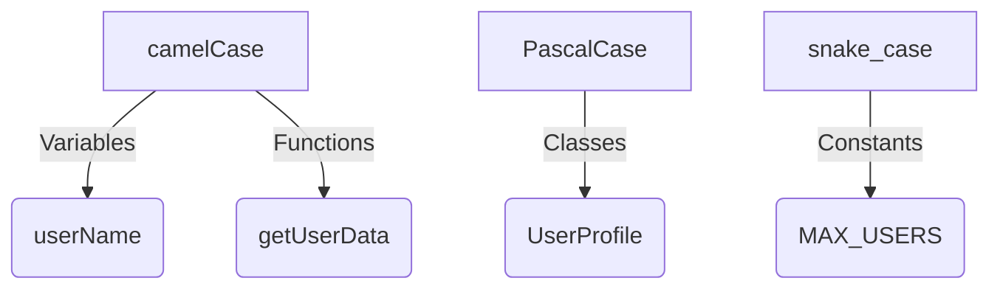

## 9.3. Using Descriptive Variable Names

In the world of programming, the importance of using descriptive variable names cannot be overstated. As we delve into this topic, we'll explore how meaningful names can significantly enhance code readability, maintainability, and collaboration. Whether you're working on a solo project or collaborating with a team, adopting clear and descriptive naming conventions is a practice that will pay dividends in the long run.

### Why Descriptive Variable Names Matter

Descriptive variable names serve as a bridge between the abstract logic of code and the human mind. They provide context and meaning, making it easier for us to understand what a piece of code is doing. This is especially crucial in JavaScript, a language known for its dynamic and flexible nature.

#### Enhancing Readability

Imagine reading a novel where every character is named "X" or "Y." It would be challenging to follow the plot, right? The same principle applies to code. Descriptive variable names act as characters in the story of your program, guiding the reader through the narrative.

#### Improving Maintainability

Code is often written once but read many times. As projects grow and evolve, maintaining them becomes a significant task. Descriptive names make it easier to revisit and modify code, reducing the time spent deciphering what each variable represents.

#### Facilitating Collaboration

In a collaborative environment, clear variable names are essential. They ensure that everyone on the team can understand and contribute to the codebase without unnecessary confusion. This is particularly important in open-source projects, where contributors may come from diverse backgrounds.

### Good vs. Bad Naming Practices

Let's illustrate the difference between good and bad naming practices with some examples.

#### Bad Naming Example

```javascript
// Bad naming example
let x = 10;
let y = 20;
let z = x + y;
console.log(z);
```

In this example, the variable names `x`, `y`, and `z` provide no context about what they represent. This makes the code difficult to understand at a glance.

#### Good Naming Example

```javascript
// Good naming example
let firstNumber = 10;
let secondNumber = 20;
let sum = firstNumber + secondNumber;
console.log(sum);
```

Here, the variable names `firstNumber`, `secondNumber`, and `sum` clearly convey their purpose, making the code much more readable.

### Naming Conventions

Adopting consistent naming conventions is a key aspect of writing clean and maintainable code. Let's explore some common conventions used in JavaScript.

#### camelCase

In JavaScript, camelCase is the standard naming convention for variables and functions. It involves starting with a lowercase letter and capitalizing the first letter of each subsequent word.

```javascript
let userName = "JohnDoe";
let totalAmount = 150.75;
```

#### PascalCase

PascalCase is similar to camelCase but starts with an uppercase letter. It's commonly used for class names and constructor functions.

```javascript
class UserProfile {
  constructor(name, age) {
    this.name = name;
    this.age = age;
  }
}
```

#### snake_case

While not as common in JavaScript, snake_case is sometimes used for constants or configuration settings. It involves separating words with underscores.

```javascript
const MAX_USERS = 100;
const API_ENDPOINT = "https://api.example.com";
```

### The Impact on Code Readability and Collaboration

Descriptive variable names and consistent naming conventions have a profound impact on code readability and collaboration. Let's explore these benefits in more detail.

#### Code Readability

When variable names are descriptive, they act as self-documenting code. This means that the code itself provides enough context to understand its purpose without needing extensive comments. Here's an example:

```javascript
// Self-documenting code
let userAge = 25;
let isEligibleForDiscount = userAge >= 18;
```

In this example, the variable names `userAge` and `isEligibleForDiscount` clearly indicate what the code is checking, making it easy to understand.

#### Collaboration

In a team setting, descriptive variable names reduce the cognitive load on developers. They don't have to spend time deciphering what each variable represents, allowing them to focus on solving problems and implementing features. This leads to more efficient collaboration and faster development cycles.

### Encouraging Consistency Across the Codebase

Consistency is key when it comes to naming variables. By adhering to a set of naming conventions, you create a uniform codebase that's easier to navigate and understand. Here are some tips for maintaining consistency:

1. **Establish a Style Guide**: Create a document outlining your team's naming conventions and coding standards. This serves as a reference for all team members.

2. **Use Linters**: Tools like ESLint can enforce naming conventions and catch inconsistencies automatically.

3. **Conduct Code Reviews**: Regular code reviews help ensure that everyone is adhering to the established conventions.

4. **Refactor Regularly**: As your codebase evolves, take the time to refactor and rename variables that don't adhere to the conventions.

### Try It Yourself

Now that we've covered the theory, let's put it into practice. Here's a simple exercise to help you get started with using descriptive variable names.

#### Exercise

Refactor the following code snippet to use descriptive variable names:

```javascript
// Original code
let a = 5;
let b = 10;
let c = a * b;
console.log(c);
```

#### Solution

```javascript
// Refactored code
let length = 5;
let width = 10;
let area = length * width;
console.log(area);
```

By renaming the variables to `length`, `width`, and `area`, we've made the code more descriptive and easier to understand.

### Visualizing Naming Conventions

To further illustrate the importance of naming conventions, let's visualize how different naming styles can be applied in a JavaScript codebase.



**Figure 1: Visualizing Naming Conventions in JavaScript**

This diagram shows how camelCase, PascalCase, and snake_case can be applied to different elements in a JavaScript codebase.

### References and Further Reading

For more information on naming conventions and best practices, check out these resources:

- [MDN Web Docs: JavaScript Guide](https://developer.mozilla.org/en-US/docs/Web/JavaScript/Guide)
- [W3Schools: JavaScript Naming Conventions](https://www.w3schools.com/js/js_conventions.asp)
- [Airbnb JavaScript Style Guide](https://github.com/airbnb/javascript)

### Knowledge Check

Let's reinforce what we've learned with a few questions:

1. Why are descriptive variable names important in programming?
2. What is the difference between camelCase and PascalCase?
3. How can descriptive names improve collaboration in a team setting?
4. What tools can help enforce naming conventions in a codebase?

### Embrace the Journey

Remember, using descriptive variable names is just one aspect of writing clean and maintainable code. As you continue your journey in JavaScript, keep experimenting with different naming conventions and find what works best for you and your team. Stay curious, and enjoy the process of becoming a more proficient programmer!

## Quiz Time!



### Why are descriptive variable names important?

- [x] They enhance code readability and maintainability.
- [ ] They make the code run faster.
- [ ] They are required by JavaScript syntax.
- [ ] They reduce the file size of the code.

> **Explanation:** Descriptive variable names provide context and meaning, making the code easier to read and maintain.

### What is camelCase commonly used for in JavaScript?

- [x] Variables and functions
- [ ] Class names
- [ ] Constants
- [ ] File names

> **Explanation:** camelCase is the standard naming convention for variables and functions in JavaScript.

### Which naming convention starts with an uppercase letter?

- [ ] camelCase
- [x] PascalCase
- [ ] snake_case
- [ ] kebab-case

> **Explanation:** PascalCase starts with an uppercase letter and is commonly used for class names.

### What is the benefit of using consistent naming conventions?

- [x] It creates a uniform codebase that's easier to navigate.
- [ ] It makes the code run faster.
- [ ] It is required by JavaScript syntax.
- [ ] It reduces the file size of the code.

> **Explanation:** Consistent naming conventions create a uniform codebase, making it easier to navigate and understand.

### How can linters help with naming conventions?

- [x] They enforce naming conventions and catch inconsistencies.
- [ ] They make the code run faster.
- [ ] They are required by JavaScript syntax.
- [ ] They reduce the file size of the code.

> **Explanation:** Linters like ESLint can enforce naming conventions and catch inconsistencies automatically.

### What is the primary purpose of descriptive variable names?

- [x] To provide context and meaning to the code
- [ ] To make the code run faster
- [ ] To reduce the file size of the code
- [ ] To comply with JavaScript syntax

> **Explanation:** Descriptive variable names provide context and meaning, making the code easier to read and understand.

### Which naming convention is sometimes used for constants?

- [ ] camelCase
- [ ] PascalCase
- [x] snake_case
- [ ] kebab-case

> **Explanation:** snake_case is sometimes used for constants or configuration settings.

### What is the impact of descriptive variable names on collaboration?

- [x] They reduce the cognitive load on developers.
- [ ] They make the code run faster.
- [ ] They are required by JavaScript syntax.
- [ ] They reduce the file size of the code.

> **Explanation:** Descriptive variable names reduce the cognitive load on developers, facilitating collaboration.

### Why should you refactor code regularly?

- [x] To ensure it adheres to established conventions
- [ ] To make the code run faster
- [ ] To reduce the file size of the code
- [ ] To comply with JavaScript syntax

> **Explanation:** Regular refactoring ensures that the code adheres to established conventions and remains maintainable.

### True or False: Descriptive variable names are only important in large projects.

- [ ] True
- [x] False

> **Explanation:** Descriptive variable names are important in projects of all sizes, as they enhance readability and maintainability.


