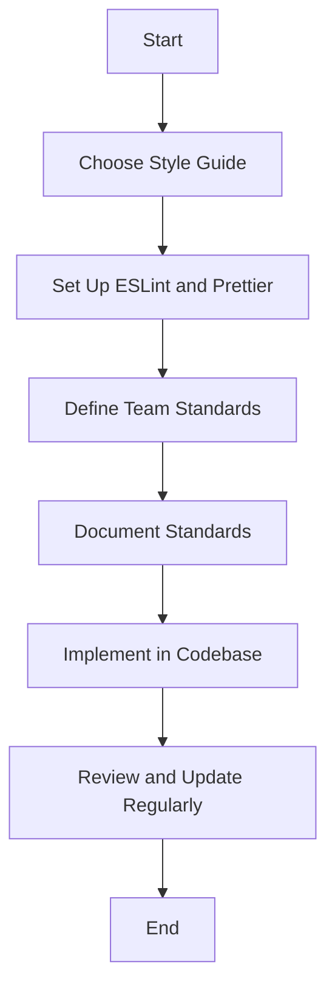

## 9.4. Consistent Coding Style

In the world of software development, a consistent coding style is not just a matter of aesthetics; it is a crucial practice that enhances readability, maintainability, and collaboration. When working with JavaScript, adopting a consistent coding style is particularly important due to the language's flexibility and dynamic nature. In this section, we'll explore the significance of coding style, introduce popular style guides, discuss tools like linters and formatters, and provide examples of style rules for variable declarations. We'll also emphasize the importance of team agreements on coding standards.

### The Importance of a Consistent Coding Style

A consistent coding style is akin to a universal language within a team or project. It ensures that everyone writes code in a similar manner, making it easier to read and understand. Here are some reasons why a consistent coding style is important:

- **Readability**: Code that follows a consistent style is easier to read and understand. This is crucial when multiple developers are working on the same codebase.
- **Maintainability**: Consistent code is easier to maintain and modify. It reduces the cognitive load on developers when they need to make changes or debug issues.
- **Collaboration**: When everyone on a team adheres to the same coding style, collaboration becomes smoother. Developers can focus on solving problems rather than deciphering each other's code.
- **Error Reduction**: A consistent style can help prevent common errors and misunderstandings. It encourages best practices and discourages bad habits.
- **Professionalism**: A well-styled codebase reflects professionalism and attention to detail. It can be a significant factor when presenting code to stakeholders or clients.

### Popular Style Guides

To achieve a consistent coding style, many organizations and developers rely on style guides. These guides provide a set of rules and conventions for writing code. Some popular JavaScript style guides include:

- **Airbnb JavaScript Style Guide**: Known for its comprehensive rules and best practices, the Airbnb style guide is widely adopted in the industry. It covers everything from variable declarations to function definitions and beyond.
- **Google JavaScript Style Guide**: Google's style guide is another popular choice. It emphasizes clarity and simplicity, making it a great option for teams that prioritize readability.
- **StandardJS**: StandardJS is a style guide, linter, and formatter all in one. It enforces a strict set of rules and requires no configuration, making it easy to adopt.

These style guides serve as a foundation for writing clean and consistent code. They can be customized to fit the specific needs of a project or team.

### Tools for Enforcing Coding Style

While style guides provide the rules, tools like linters and formatters help enforce them. These tools automatically check and format code to ensure it adheres to the specified style. Two popular tools for JavaScript are:

- **ESLint**: ESLint is a powerful linter that analyzes code for potential errors and style violations. It is highly configurable and can be integrated with various style guides, including Airbnb and Google. ESLint can be run manually or integrated into a development workflow to provide real-time feedback.
- **Prettier**: Prettier is an opinionated code formatter that automatically formats code to ensure consistency. It works alongside ESLint to handle formatting concerns, allowing ESLint to focus on code quality and potential errors.

#### Example: Setting Up ESLint and Prettier

Let's walk through the process of setting up ESLint and Prettier in a JavaScript project.

1. **Install ESLint and Prettier**: Use npm to install ESLint and Prettier as development dependencies.

   ```bash
   npm install eslint prettier --save-dev
   ```

2. **Initialize ESLint**: Run the ESLint initialization command to create a configuration file.

   ```bash
   npx eslint --init
   ```

   Follow the prompts to configure ESLint according to your preferences.

3. **Create a Prettier Configuration**: Create a `.prettierrc` file to define Prettier's formatting rules.

   ```json
   {
     "singleQuote": true,
     "trailingComma": "es5"
   }
   ```

4. **Integrate ESLint and Prettier**: Install the `eslint-config-prettier` package to ensure ESLint and Prettier work together without conflicts.

   ```bash
   npm install eslint-config-prettier --save-dev
   ```

   Update your ESLint configuration to include Prettier.

   ```json
   {
     "extends": ["eslint:recommended", "plugin:prettier/recommended"]
   }
   ```

5. **Run ESLint and Prettier**: Use npm scripts to run ESLint and Prettier on your codebase.

   ```json
   "scripts": {
     "lint": "eslint .",
     "format": "prettier --write ."
   }
   ```

By integrating ESLint and Prettier into your workflow, you can automatically enforce coding style and catch potential errors early.

### Style Rules for Variable Declarations

Variable declarations are a fundamental aspect of coding style. Consistent rules for declaring variables can greatly enhance code readability and maintainability. Here are some common style rules for variable declarations:

- **Use `const` by Default**: Whenever possible, use `const` for variable declarations. This ensures that variables are not accidentally reassigned.

  ```javascript
  const pi = 3.14; // Use const for constants
  ```

- **Use `let` for Reassignable Variables**: If a variable needs to be reassigned, use `let`. Avoid using `var` due to its function-scoped behavior.

  ```javascript
  let count = 0; // Use let for variables that will be reassigned
  count += 1;
  ```

- **Descriptive Variable Names**: Use descriptive names for variables to make the code self-explanatory. Avoid single-letter names except for loop counters.

  ```javascript
  let userName = 'Alice'; // Descriptive variable name
  ```

- **CamelCase for Variable Names**: Use camelCase for variable names to maintain consistency with JavaScript's naming conventions.

  ```javascript
  let userAge = 25; // CamelCase variable name
  ```

- **Group Related Declarations**: Group related variable declarations together to improve code organization.

  ```javascript
  const firstName = 'John',
        lastName = 'Doe',
        age = 30; // Group related declarations
  ```

- **Initialize Variables**: Always initialize variables when declaring them to avoid undefined values.

  ```javascript
  let isActive = false; // Initialize variables
  ```

### Team Agreements on Coding Standards

While style guides and tools provide a solid foundation, it's important for teams to agree on specific coding standards. This ensures that everyone is on the same page and reduces friction during code reviews. Here are some tips for establishing team agreements:

- **Discuss and Agree**: Hold discussions with the team to agree on a coding style that suits the project's needs. Consider factors like team preferences, project requirements, and existing codebase.
- **Document the Standards**: Create a document that outlines the agreed-upon coding standards. This document should be easily accessible to all team members.
- **Regularly Review and Update**: As the project evolves, review and update the coding standards to accommodate new practices or tools.
- **Encourage Adherence**: Encourage team members to adhere to the coding standards during development and code reviews. Provide constructive feedback to help maintain consistency.

### Visualizing Coding Style Consistency

To better understand how consistent coding style impacts a project, let's visualize the process of adopting and enforcing coding standards using a flowchart.



**Figure 1: Visualizing the Process of Adopting Consistent Coding Style**

### Try It Yourself

To truly grasp the importance of a consistent coding style, try implementing the following exercise:

1. **Choose a Style Guide**: Select a style guide that resonates with you or your team. For this exercise, let's use the Airbnb JavaScript Style Guide.

2. **Set Up ESLint and Prettier**: Follow the steps outlined earlier to set up ESLint and Prettier in a sample JavaScript project.

3. **Write a Simple Script**: Create a simple JavaScript script that includes variable declarations, functions, and loops.

4. **Run ESLint and Prettier**: Use the tools to lint and format your code. Observe the changes and improvements in consistency.

5. **Reflect on the Experience**: Consider how the tools and style guide helped improve your code. Reflect on the benefits of a consistent coding style.

### Knowledge Check

Before we wrap up this section, let's reinforce what we've learned with a few key takeaways:

- A consistent coding style enhances readability, maintainability, and collaboration.
- Popular style guides like Airbnb and Google provide a foundation for writing clean code.
- Tools like ESLint and Prettier help enforce coding style and catch potential errors.
- Consistent variable declarations improve code organization and prevent errors.
- Team agreements on coding standards ensure everyone is aligned and reduces friction.

### Embrace the Journey

Remember, adopting a consistent coding style is just the beginning of your journey as a JavaScript developer. As you progress, you'll encounter more complex coding challenges and opportunities to refine your skills. Keep experimenting, stay curious, and enjoy the journey!

## Quiz Time!



### Why is a consistent coding style important?

- [x] Enhances readability and maintainability
- [ ] Makes code run faster
- [ ] Increases file size
- [ ] Decreases security vulnerabilities

> **Explanation:** A consistent coding style enhances readability and maintainability, making it easier for developers to understand and modify code.

### Which tool is used to automatically format JavaScript code?

- [ ] ESLint
- [x] Prettier
- [ ] Babel
- [ ] Webpack

> **Explanation:** Prettier is a code formatter that automatically formats JavaScript code to ensure consistency.

### What is the purpose of ESLint?

- [x] To analyze code for potential errors and style violations
- [ ] To compile JavaScript code
- [ ] To minify JavaScript files
- [ ] To manage project dependencies

> **Explanation:** ESLint is a linter that analyzes code for potential errors and style violations, helping developers maintain code quality.

### Which variable declaration should be used by default in JavaScript?

- [x] const
- [ ] let
- [ ] var
- [ ] function

> **Explanation:** `const` should be used by default for variable declarations to prevent accidental reassignment.

### What is the benefit of using descriptive variable names?

- [x] Makes code self-explanatory
- [ ] Increases execution speed
- [ ] Reduces file size
- [ ] Improves security

> **Explanation:** Descriptive variable names make code self-explanatory, improving readability and understanding.

### Which style guide is known for its comprehensive rules and best practices?

- [x] Airbnb JavaScript Style Guide
- [ ] Google JavaScript Style Guide
- [ ] StandardJS
- [ ] Microsoft JavaScript Style Guide

> **Explanation:** The Airbnb JavaScript Style Guide is known for its comprehensive rules and best practices, making it widely adopted in the industry.

### How can teams ensure everyone follows the same coding standards?

- [x] By discussing and agreeing on a style guide
- [ ] By using different tools for each developer
- [ ] By avoiding code reviews
- [ ] By not documenting standards

> **Explanation:** Teams can ensure everyone follows the same coding standards by discussing and agreeing on a style guide and documenting the standards.

### What is the role of the `.prettierrc` file?

- [x] To define Prettier's formatting rules
- [ ] To configure ESLint
- [ ] To manage project dependencies
- [ ] To compile JavaScript code

> **Explanation:** The `.prettierrc` file is used to define Prettier's formatting rules, ensuring consistent code formatting.

### What should be done if a variable needs to be reassigned?

- [ ] Use const
- [x] Use let
- [ ] Use var
- [ ] Use function

> **Explanation:** If a variable needs to be reassigned, `let` should be used, as `const` does not allow reassignment.

### True or False: Consistent coding style is only important for large projects.

- [ ] True
- [x] False

> **Explanation:** Consistent coding style is important for projects of all sizes, as it enhances readability, maintainability, and collaboration.


