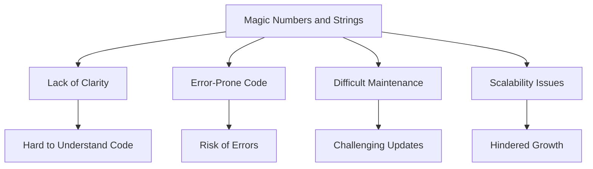

## 9.5. Avoiding Magic Numbers and Strings

In the world of programming, clarity and maintainability are key to writing effective code. One of the common pitfalls that can obscure the meaning of your code and make it harder to maintain is the use of "magic numbers" and "magic strings." In this section, we will explore what these terms mean, why they can be problematic, and how to replace them with more meaningful constructs to improve your JavaScript code.

### Understanding Magic Numbers and Strings

**Magic numbers** and **magic strings** are hard-coded values that appear directly in your code without explanation. They are called "magic" because their purpose is not immediately clear to someone reading the code. This can lead to confusion and errors, especially when the same value is used in multiple places.

#### What Are Magic Numbers?

A magic number is a numeric literal that is used in your code without any explanation of its meaning. For example, consider the following code snippet:

```javascript
let radius = 5;
let area = 3.14159 * radius * radius;
```

In this example, `3.14159` is a magic number. It represents the mathematical constant π (pi), but there's no indication of this in the code itself.

#### What Are Magic Strings?

Similarly, a magic string is a string literal that is used without explanation. For example:

```javascript
function getUserRole(role) {
    if (role === "admin") {
        // do something for admin
    } else if (role === "user") {
        // do something for user
    }
}
```

Here, "admin" and "user" are magic strings. Their meaning is not immediately clear, and any change to these values would require finding and updating every instance in the code.

### Problems Caused by Magic Numbers and Strings

Magic numbers and strings can lead to several issues in your code:

1. **Lack of Clarity**: Without context, it's difficult to understand what a magic number or string represents. This can make the code less readable and harder to understand for others (or even yourself at a later date).

2. **Error-Prone**: If a magic value needs to change, you have to find every instance of it in your code. This can lead to errors if you miss one or change the wrong value.

3. **Difficult Maintenance**: As your codebase grows, maintaining and updating magic values becomes increasingly challenging. It can also make refactoring more difficult.

4. **Scalability Issues**: Magic numbers and strings can hinder scalability. If you need to scale your application or add new features, magic values can make it harder to adapt your code.

### Using Constants to Eliminate Magic Values

One of the best ways to eliminate magic numbers and strings is to replace them with constants. Constants are named values that provide context and meaning, making your code more readable and maintainable.

#### Declaring Constants

In JavaScript, you can declare constants using the `const` keyword. Here's how you can replace magic numbers with constants:

```javascript
const PI = 3.14159;
let radius = 5;
let area = PI * radius * radius;
```

By using `PI` as a constant, we immediately convey the meaning of the value `3.14159`. This makes the code easier to read and understand.

#### Using Constants for Strings

Similarly, you can use constants for strings:

```javascript
const ROLE_ADMIN = "admin";
const ROLE_USER = "user";

function getUserRole(role) {
    if (role === ROLE_ADMIN) {
        // do something for admin
    } else if (role === ROLE_USER) {
        // do something for user
    }
}
```

By defining `ROLE_ADMIN` and `ROLE_USER` as constants, we make the code more readable and easier to maintain. If the role names need to change, we only need to update the constants.

### Refactoring Code to Eliminate Magic Values

Let's look at a more complex example and see how we can refactor it to eliminate magic numbers and strings.

#### Original Code with Magic Values

```javascript
function calculateDiscount(price, customerType) {
    if (customerType === "regular") {
        return price * 0.9; // 10% discount
    } else if (customerType === "member") {
        return price * 0.8; // 20% discount
    } else if (customerType === "vip") {
        return price * 0.7; // 30% discount
    }
    return price;
}
```

In this code, we have both magic numbers (discount percentages) and magic strings (customer types).

#### Refactored Code with Constants

```javascript
const DISCOUNT_REGULAR = 0.1;
const DISCOUNT_MEMBER = 0.2;
const DISCOUNT_VIP = 0.3;

const CUSTOMER_TYPE_REGULAR = "regular";
const CUSTOMER_TYPE_MEMBER = "member";
const CUSTOMER_TYPE_VIP = "vip";

function calculateDiscount(price, customerType) {
    if (customerType === CUSTOMER_TYPE_REGULAR) {
        return price * (1 - DISCOUNT_REGULAR);
    } else if (customerType === CUSTOMER_TYPE_MEMBER) {
        return price * (1 - DISCOUNT_MEMBER);
    } else if (customerType === CUSTOMER_TYPE_VIP) {
        return price * (1 - DISCOUNT_VIP);
    }
    return price;
}
```

By using constants, we have made the code more readable and maintainable. The purpose of each value is clear, and any changes can be made in one place.

### Using Configuration Objects

Another approach to eliminate magic values is to use configuration objects. This is especially useful when you have multiple related constants.

#### Example of Configuration Object

```javascript
const DISCOUNTS = {
    regular: 0.1,
    member: 0.2,
    vip: 0.3
};

function calculateDiscount(price, customerType) {
    const discount = DISCOUNTS[customerType] || 0;
    return price * (1 - discount);
}
```

In this example, we use a configuration object `DISCOUNTS` to store discount values. This makes it easy to add new customer types or change discount values.

### Impact on Code Maintenance and Scalability

By avoiding magic numbers and strings, you can significantly improve the maintainability and scalability of your code:

- **Improved Readability**: By using descriptive constants, your code becomes self-documenting. This makes it easier for others (and yourself) to understand what the code is doing.

- **Easier Maintenance**: When you need to change a value, you only need to update it in one place. This reduces the risk of errors and makes your code easier to maintain.

- **Better Scalability**: As your application grows, using constants and configuration objects makes it easier to manage and scale your code. You can add new features or modify existing ones without worrying about breaking your code.

### Try It Yourself

To get a better understanding of how to avoid magic numbers and strings, try refactoring the following code:

```javascript
function calculateShippingCost(weight, country) {
    if (country === "US") {
        return weight * 5;
    } else if (country === "CA") {
        return weight * 7;
    } else if (country === "MX") {
        return weight * 6;
    }
    return weight * 10; // default rate
}
```

**Challenge**: Replace the magic numbers and strings with constants or a configuration object. Experiment with adding new countries and rates.

### Visualizing the Impact of Magic Numbers and Strings

To help visualize the impact of using magic numbers and strings, consider the following diagram:



This diagram illustrates how magic numbers and strings can lead to various problems in your code, ultimately affecting its clarity, maintainability, and scalability.

### References and Further Reading

For more information on best practices in JavaScript, consider exploring the following resources:

- [MDN Web Docs: JavaScript Guide](https://developer.mozilla.org/en-US/docs/Web/JavaScript/Guide)
- [W3Schools: JavaScript Tutorial](https://www.w3schools.com/js/)
- [JavaScript: The Good Parts by Douglas Crockford](https://www.oreilly.com/library/view/javascript-the-good/9780596517748/)

### Embrace the Journey

Remember, avoiding magic numbers and strings is just one step towards writing better, more maintainable JavaScript code. As you continue to learn and grow as a developer, you'll discover more techniques and best practices that will help you write clean, efficient, and scalable code. Keep experimenting, stay curious, and enjoy the journey!

## Quiz Time!



### What is a magic number in programming?

- [x] A numeric literal used without explanation
- [ ] A variable that changes value
- [ ] A function that returns a random number
- [ ] A number that is always positive

> **Explanation:** A magic number is a numeric literal used in code without any explanation of its meaning.

### Why should you avoid using magic numbers and strings in your code?

- [x] They make the code less readable and maintainable
- [ ] They increase the performance of the code
- [ ] They are required for all JavaScript programs
- [ ] They make the code more secure

> **Explanation:** Magic numbers and strings make the code less readable and maintainable because their purpose is not immediately clear.

### How can you eliminate magic numbers in your code?

- [x] By using constants
- [ ] By using loops
- [ ] By using arrays
- [ ] By using functions

> **Explanation:** You can eliminate magic numbers by using constants, which provide context and meaning to the values.

### What is the benefit of using configuration objects?

- [x] They allow for easy management of related constants
- [ ] They increase the execution speed of the code
- [ ] They are required for all JavaScript programs
- [ ] They make the code more complex

> **Explanation:** Configuration objects allow for easy management of related constants, making the code more organized and maintainable.

### Which of the following is a magic string?

- [x] "admin"
- [ ] const ROLE_ADMIN = "admin";
- [ ] const PI = 3.14159;
- [ ] let radius = 5;

> **Explanation:** "admin" is a magic string because it is used directly in the code without explanation.

### What is a potential problem with using magic numbers?

- [x] They can lead to errors if you need to change the value
- [ ] They make the code run faster
- [ ] They are required for all JavaScript programs
- [ ] They make the code more secure

> **Explanation:** Magic numbers can lead to errors if you need to change the value, as you have to find and update every instance in the code.

### How can you improve code readability?

- [x] By using descriptive constants
- [ ] By using more loops
- [ ] By using fewer comments
- [ ] By using longer variable names

> **Explanation:** Using descriptive constants improves code readability by providing context and meaning to values.

### What is the impact of magic numbers on scalability?

- [x] They hinder scalability by making it harder to adapt the code
- [ ] They improve scalability by making the code more efficient
- [ ] They have no impact on scalability
- [ ] They are required for scalable applications

> **Explanation:** Magic numbers hinder scalability by making it harder to adapt the code to new features or changes.

### What is the purpose of the `const` keyword in JavaScript?

- [x] To declare a constant value that cannot be reassigned
- [ ] To declare a variable that can change value
- [ ] To create a loop
- [ ] To define a function

> **Explanation:** The `const` keyword is used to declare a constant value that cannot be reassigned, providing clarity and context to the code.

### True or False: Using magic numbers and strings is a best practice in JavaScript.

- [ ] True
- [x] False

> **Explanation:** False. Using magic numbers and strings is not a best practice because it makes the code less readable and maintainable.




