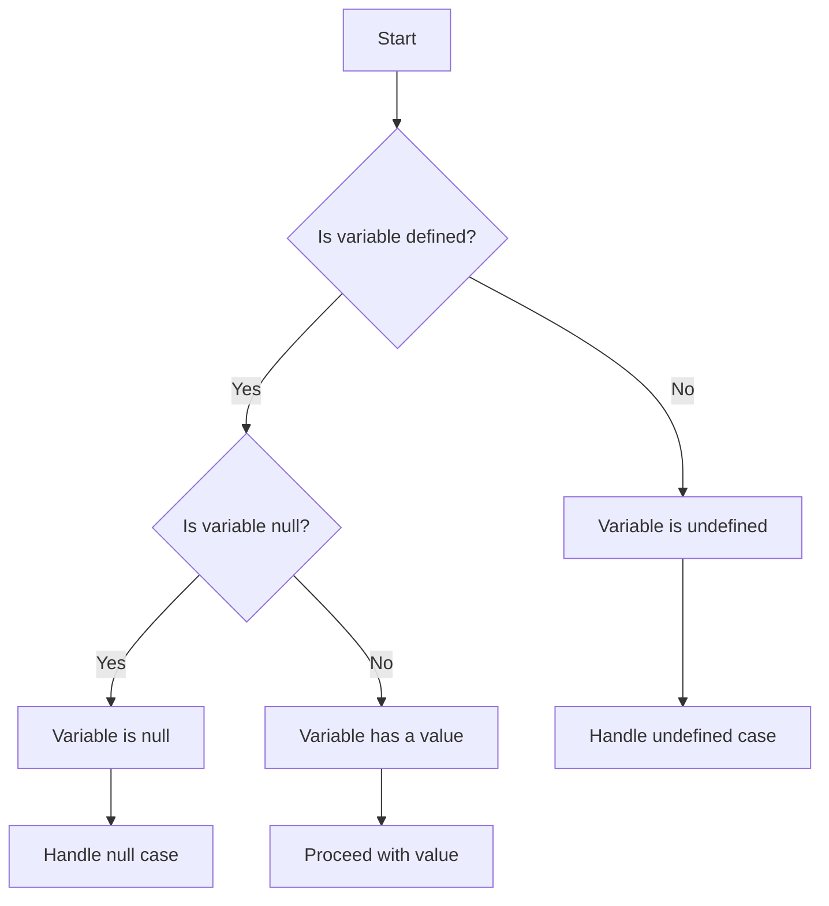

## 9.6. Handling Null and Undefined Safely

In JavaScript, dealing with `null` and `undefined` is a common task that every developer must master to write robust and error-free code. Understanding how these values arise, how to check for them, and how to handle them safely is crucial for avoiding runtime errors and ensuring your applications run smoothly. In this section, we'll explore the causes of `null` and `undefined`, techniques for handling them, and best practices to incorporate into your coding routine.

### Understanding `null` and `undefined`

Before diving into handling strategies, let's first understand what `null` and `undefined` represent in JavaScript.

- **`undefined`**: This value is automatically assigned to variables that have been declared but not initialized. It also appears when you attempt to access a property or array element that doesn't exist.

  ```javascript
  let uninitializedVariable;
  console.log(uninitializedVariable); // Output: undefined

  const obj = {};
  console.log(obj.nonExistentProperty); // Output: undefined
  ```

- **`null`**: This is an assignment value that represents the intentional absence of any object value. It's often used to indicate that a variable should be empty.

  ```javascript
  let emptyValue = null;
  console.log(emptyValue); // Output: null
  ```

#### Common Causes of `null` and `undefined`

1. **Uninitialized Variables**: Variables declared without an initial value are `undefined`.

2. **Non-existent Object Properties**: Accessing a property that hasn't been defined results in `undefined`.

3. **Function Return Values**: Functions that don't explicitly return a value will return `undefined`.

4. **Intentional Nullification**: Developers may assign `null` to variables to denote an empty or non-existent value.

5. **Array Elements**: Accessing an out-of-bounds index in an array returns `undefined`.

### Safe Methods for Handling `null` and `undefined`

Handling `null` and `undefined` safely involves checking for these values before performing operations that assume the presence of a valid object or value.

#### Checking for `null` and `undefined`

Use strict equality (`===`) to check for `null` and `undefined`, as it avoids type coercion.

```javascript
if (variable === null) {
  console.log("The variable is null.");
}

if (variable === undefined) {
  console.log("The variable is undefined.");
}
```

#### Optional Chaining

Optional chaining (`?.`) is a powerful feature that allows you to safely access deeply nested properties without having to check each level for `null` or `undefined`. If any part of the chain is `null` or `undefined`, the entire expression returns `undefined`.

```javascript
const user = {
  profile: {
    name: "Alice"
  }
};

console.log(user.profile?.name); // Output: Alice
console.log(user.address?.city); // Output: undefined
```

#### Default Values and Short-Circuiting

Use the logical OR (`||`) operator to provide default values when a variable is `null` or `undefined`. This is known as short-circuit evaluation.

```javascript
let name;
console.log(name || "Default Name"); // Output: Default Name

name = "Bob";
console.log(name || "Default Name"); // Output: Bob
```

**Note**: Be cautious with this approach as it treats other falsy values (`0`, `""`, `false`) the same as `null` and `undefined`.

#### Nullish Coalescing Operator

The nullish coalescing operator (`??`) is similar to the logical OR but only considers `null` and `undefined` as nullish values, allowing other falsy values to pass through.

```javascript
let count = 0;
console.log(count ?? 10); // Output: 0

let value = null;
console.log(value ?? "No value"); // Output: No value
```

### Defensive Programming Practices

Defensive programming involves writing code that anticipates and safely handles potential errors or unexpected input, including `null` and `undefined`.

#### Type Checking

Use `typeof` to check if a variable is `undefined` and `===` to check for `null`.

```javascript
if (typeof variable === "undefined") {
  console.log("Variable is undefined.");
}

if (variable === null) {
  console.log("Variable is null.");
}
```

#### Guard Clauses

Implement guard clauses at the beginning of functions to handle `null` or `undefined` inputs early.

```javascript
function processUser(user) {
  if (!user) {
    console.log("No user provided.");
    return;
  }
  // Proceed with processing
  console.log(`Processing user: ${user.name}`);
}
```

#### Handling Potential Errors

Be aware of potential `TypeError` when attempting to access properties of `null` or `undefined`. Use try-catch blocks to handle such cases gracefully.

```javascript
try {
  const user = null;
  console.log(user.name); // This will throw a TypeError
} catch (error) {
  console.error("An error occurred:", error.message);
}
```

### Visualizing `null` and `undefined` Handling

To better understand how JavaScript handles `null` and `undefined`, let's visualize the process using a flowchart.



This flowchart illustrates the decision-making process when checking a variable's state and handling `null` and `undefined` appropriately.

### Try It Yourself

Experiment with the following code snippets to reinforce your understanding of handling `null` and `undefined`:

1. Modify the `user` object to include an `address` property and test optional chaining.
2. Change the default values in the short-circuiting examples and observe the output.
3. Implement guard clauses in a function that processes an array of objects.

### References and Links

For further reading on handling `null` and `undefined`, consider the following resources:

- [MDN Web Docs on `null`](https://developer.mozilla.org/en-US/docs/Web/JavaScript/Reference/Global_Objects/null)
- [MDN Web Docs on `undefined`](https://developer.mozilla.org/en-US/docs/Web/JavaScript/Reference/Global_Objects/undefined)
- [MDN Web Docs on Optional Chaining](https://developer.mozilla.org/en-US/docs/Web/JavaScript/Reference/Operators/Optional_chaining)
- [MDN Web Docs on Nullish Coalescing Operator](https://developer.mozilla.org/en-US/docs/Web/JavaScript/Reference/Operators/Nullish_coalescing_operator)

### Knowledge Check

Let's summarize the key takeaways from this section:

- `null` and `undefined` are distinct values in JavaScript, each representing different states.
- Use strict equality checks to differentiate between `null` and `undefined`.
- Optional chaining and nullish coalescing are powerful tools for handling `null` and `undefined`.
- Defensive programming practices help prevent runtime errors and improve code reliability.

Remember, mastering these concepts will enhance your ability to write clean, error-free JavaScript code. Keep experimenting and applying these techniques in your projects!

## Quiz Time!



### What does `undefined` represent in JavaScript?

- [x] A variable that has been declared but not initialized
- [ ] A variable that has been explicitly set to have no value
- [ ] A variable that has a value of zero
- [ ] A variable that is not declared

> **Explanation:** `undefined` is automatically assigned to variables that have been declared but not initialized.

### What is the purpose of the optional chaining operator (`?.`)?

- [x] To safely access nested properties without causing errors if any part of the chain is `null` or `undefined`
- [ ] To assign default values to variables
- [ ] To check if a variable is `null`
- [ ] To convert a variable to a string

> **Explanation:** Optional chaining allows you to access nested properties safely, returning `undefined` if any part of the chain is `null` or `undefined`.

### Which operator should you use to provide default values only when a variable is `null` or `undefined`?

- [x] Nullish coalescing operator (`??`)
- [ ] Logical OR operator (`||`)
- [ ] Logical AND operator (`&&`)
- [ ] Ternary operator (`?:`)

> **Explanation:** The nullish coalescing operator (`??`) provides default values only when a variable is `null` or `undefined`.

### What is a common cause of `null` in JavaScript?

- [ ] A variable that has been declared but not initialized
- [x] A variable that has been explicitly set to have no value
- [ ] A variable that is not declared
- [ ] A variable that has a value of zero

> **Explanation:** `null` is often used to explicitly indicate that a variable should have no value.

### How can you safely handle potential `TypeError` when accessing properties of `null` or `undefined`?

- [x] Use try-catch blocks to handle errors
- [ ] Use the logical AND operator (`&&`)
- [ ] Use the logical OR operator (`||`)
- [ ] Use the ternary operator (`?:`)

> **Explanation:** Try-catch blocks can be used to catch and handle errors like `TypeError` when accessing properties of `null` or `undefined`.

### What is the output of the following code snippet?
```javascript
let value = null;
console.log(value ?? "No value");
```

- [x] "No value"
- [ ] `null`
- [ ] `undefined`
- [ ] An error

> **Explanation:** The nullish coalescing operator (`??`) returns "No value" because `value` is `null`.

### Which of the following is a defensive programming practice for handling `null` and `undefined`?

- [x] Implementing guard clauses at the beginning of functions
- [ ] Using the logical OR operator (`||`) for all default values
- [ ] Ignoring `null` and `undefined` values
- [ ] Using `==` for equality checks

> **Explanation:** Guard clauses help handle `null` or `undefined` inputs early in functions, preventing errors.

### What is the result of the following code?
```javascript
let count = 0;
console.log(count || 10);
```

- [ ] 10
- [x] 0
- [ ] `undefined`
- [ ] An error

> **Explanation:** The logical OR operator (`||`) treats `0` as falsy, so it returns 10.

### True or False: The logical OR operator (`||`) considers `0`, `""`, and `false` as falsy values.

- [x] True
- [ ] False

> **Explanation:** The logical OR operator (`||`) treats `0`, `""`, and `false` as falsy values, along with `null` and `undefined`.

### What is the best way to check if a variable is `undefined`?

- [x] Use `typeof variable === "undefined"`
- [ ] Use `variable == null`
- [ ] Use `variable === null`
- [ ] Use `variable !== undefined`

> **Explanation:** Using `typeof variable === "undefined"` is the most reliable way to check if a variable is `undefined`.


