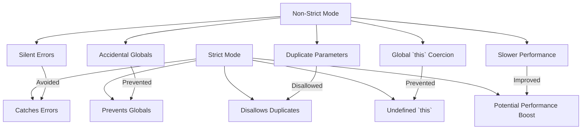

## 9.7. Leveraging Strict Mode

In the world of JavaScript, where flexibility and dynamism reign supreme, it's easy to write code that works but is prone to subtle bugs and errors. This is where **strict mode** comes into play. Introduced in ECMAScript 5, strict mode is a way to opt into a restricted variant of JavaScript, intentionally making it easier to write "secure" JavaScript.

### What is Strict Mode?

Strict mode is a feature in JavaScript that helps you write cleaner code by catching common coding bloopers, preventing the use of potentially problematic language features, and making your code run faster in some cases. It enforces stricter parsing and error handling, which can help you avoid errors that are otherwise silently ignored by JavaScript.

### Enabling Strict Mode

Enabling strict mode is straightforward. You can apply it to an entire script or to individual functions. To enable strict mode, simply add the following string at the beginning of your script or function:

```javascript
"use strict";
```

#### Enabling Strict Mode in a Script

To enable strict mode for an entire script, place `"use strict";` at the top of the file, before any other code:

```javascript
"use strict";

// All the code in this script will be in strict mode
let x = 3.14;
```

#### Enabling Strict Mode in a Function

If you only want to apply strict mode to a specific function, place `"use strict";` at the beginning of the function body:

```javascript
function myFunction() {
    "use strict";
    // Code in this function will be in strict mode
    let y = 3.14;
}
```

### Benefits of Strict Mode

Strict mode offers several benefits that can help you write better JavaScript code:

1. **Catching Silent Errors**: In non-strict mode, some errors are silently ignored, which can lead to unexpected behavior. Strict mode throws exceptions for these errors, making them easier to detect and fix.

2. **Preventing Accidental Globals**: In non-strict mode, assigning a value to an undeclared variable automatically creates a global variable. Strict mode prevents this by throwing an error if you try to assign a value to an undeclared variable.

3. **Eliminating `this` Coercion**: In non-strict mode, `this` is automatically coerced to the global object when it's `null` or `undefined`. Strict mode leaves `this` as `undefined`, which can prevent bugs in your code.

4. **Disallowing Duplicate Parameter Names**: Strict mode prohibits duplicate parameter names in functions, which can help avoid confusion and potential bugs.

5. **Making `eval()` Safer**: Strict mode restricts the use of `eval()` by preventing it from introducing new variables into the surrounding scope.

6. **Improving Performance**: Some JavaScript engines can optimize strict mode code more efficiently than non-strict mode code, potentially leading to performance improvements.

### Changes in Variable Declaration Requirements

One of the most significant changes in strict mode is the requirement for variable declarations. In non-strict mode, you can accidentally create global variables by omitting the `var`, `let`, or `const` keyword. Strict mode eliminates this possibility by throwing an error if you try to assign a value to an undeclared variable.

#### Example: Variable Declaration

**Before Strict Mode:**

```javascript
x = 3.14; // No error, but x becomes a global variable
```

**After Strict Mode:**

```javascript
"use strict";
x = 3.14; // Error: x is not defined
```

### Examples of Code Before and After Applying Strict Mode

Let's look at some examples to see how strict mode can help catch errors and improve code quality.

#### Example 1: Accidental Global Variables

**Before Strict Mode:**

```javascript
function myFunction() {
    y = 3.14; // Creates a global variable y
}
myFunction();
console.log(y); // 3.14
```

**After Strict Mode:**

```javascript
"use strict";
function myFunction() {
    y = 3.14; // Error: y is not defined
}
myFunction();
```

In strict mode, the code throws an error because `y` is not declared, preventing the accidental creation of a global variable.

#### Example 2: Duplicate Parameter Names

**Before Strict Mode:**

```javascript
function sum(a, a, c) { // Duplicate parameter names
    return a + a + c;
}
console.log(sum(1, 2, 3)); // 7
```

**After Strict Mode:**

```javascript
"use strict";
function sum(a, a, c) { // Error: Duplicate parameter name not allowed in this context
    return a + a + c;
}
```

Strict mode throws an error for duplicate parameter names, helping you avoid potential bugs.

#### Example 3: `this` Coercion

**Before Strict Mode:**

```javascript
function showThis() {
    console.log(this); // Logs the global object
}
showThis();
```

**After Strict Mode:**

```javascript
"use strict";
function showThis() {
    console.log(this); // Logs undefined
}
showThis();
```

In strict mode, `this` is `undefined` when not set by the call, preventing unintended global object access.

### Encouraging the Use of Strict Mode

Using strict mode is considered a best practice in JavaScript development. It helps you write cleaner, more reliable code by catching errors early and enforcing better coding standards. Here are some reasons why you should always use strict mode:

- **Error Detection**: It helps you catch errors that might otherwise go unnoticed, making debugging easier.
- **Code Quality**: It enforces better coding practices, leading to more maintainable and robust code.
- **Future-Proofing**: It prepares your code for future JavaScript versions, as strict mode is more aligned with modern JavaScript features.
- **Performance**: It can lead to performance improvements in some JavaScript engines.

### Visualizing Strict Mode Benefits

To better understand the benefits of strict mode, let's visualize how it affects variable declarations and error handling.



**Diagram Description:** This flowchart illustrates how strict mode addresses common issues in non-strict mode, such as silent errors, accidental globals, duplicate parameters, and `this` coercion, while potentially improving performance.

### References and Links

For more information on strict mode, you can refer to the following resources:

- [MDN Web Docs: Strict mode](https://developer.mozilla.org/en-US/docs/Web/JavaScript/Reference/Strict_mode)
- [W3Schools: JavaScript Strict Mode](https://www.w3schools.com/js/js_strict.asp)

### Knowledge Check

Let's reinforce what we've learned about strict mode with a few questions and exercises.

1. **What is strict mode, and why is it useful?**
2. **How do you enable strict mode in a script?**
3. **What are some common errors that strict mode can help catch?**
4. **Try enabling strict mode in a small script and observe the changes.**
5. **What happens when you try to use an undeclared variable in strict mode?**

### Embrace the Journey

Remember, using strict mode is just one of many best practices that can help you become a better JavaScript developer. As you continue your learning journey, keep experimenting with different features and techniques. Stay curious, and enjoy the process of mastering JavaScript!

## Quiz Time!



### What is the primary purpose of strict mode in JavaScript?

- [x] To enforce stricter parsing and error handling
- [ ] To make JavaScript code run faster
- [ ] To add new features to JavaScript
- [ ] To simplify JavaScript syntax

> **Explanation:** Strict mode is designed to enforce stricter parsing and error handling, making it easier to catch common coding errors and improve code quality.

### How do you enable strict mode for an entire script?

- [x] By placing "use strict"; at the top of the script
- [ ] By using a special JavaScript library
- [ ] By setting a global variable
- [ ] By using a command-line option

> **Explanation:** To enable strict mode for an entire script, you place "use strict"; at the top of the file before any other code.

### What happens if you try to assign a value to an undeclared variable in strict mode?

- [x] An error is thrown
- [ ] The variable is automatically declared as global
- [ ] The assignment is ignored
- [ ] The variable is declared as local

> **Explanation:** In strict mode, assigning a value to an undeclared variable throws an error, preventing accidental global variable creation.

### Which of the following is NOT a benefit of strict mode?

- [ ] Catching silent errors
- [ ] Preventing accidental globals
- [x] Allowing duplicate parameter names
- [ ] Improving performance

> **Explanation:** Strict mode disallows duplicate parameter names, which is a benefit, not a drawback.

### In strict mode, what is the value of `this` in a function that is called without an object?

- [x] undefined
- [ ] null
- [ ] The global object
- [ ] An empty object

> **Explanation:** In strict mode, `this` is `undefined` when a function is called without an object, preventing unintended global object access.

### Can strict mode be enabled for individual functions?

- [x] Yes
- [ ] No

> **Explanation:** Strict mode can be enabled for individual functions by placing "use strict"; at the beginning of the function body.

### What is one of the reasons strict mode can improve performance?

- [x] Some JavaScript engines optimize strict mode code more efficiently
- [ ] It reduces the size of the JavaScript file
- [ ] It uses less memory
- [ ] It simplifies the syntax

> **Explanation:** Some JavaScript engines can optimize strict mode code more efficiently, potentially leading to performance improvements.

### Which of the following statements is true about strict mode?

- [x] It helps catch errors early
- [ ] It makes JavaScript code more complex
- [ ] It is only useful for large projects
- [ ] It is deprecated in modern JavaScript

> **Explanation:** Strict mode helps catch errors early, making it a valuable tool for writing cleaner, more reliable code.

### What does strict mode do to the `eval()` function?

- [x] Restricts it from introducing new variables into the surrounding scope
- [ ] Enhances its performance
- [ ] Simplifies its syntax
- [ ] Disables it completely

> **Explanation:** Strict mode restricts the `eval()` function from introducing new variables into the surrounding scope, making it safer to use.

### True or False: Strict mode is automatically enabled in all JavaScript code.

- [ ] True
- [x] False

> **Explanation:** Strict mode is not automatically enabled; it must be explicitly declared using "use strict"; at the beginning of a script or function.


