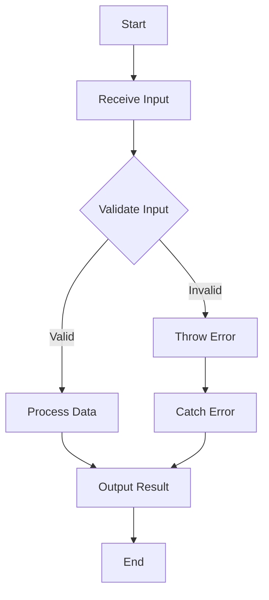

## 9.8. Defensive Programming

In the world of software development, writing code that works is only part of the challenge. The real test of a programmer's skill is writing code that not only functions correctly but also anticipates and safely handles unexpected inputs or states. This is where **defensive programming** comes into play. In this section, we'll delve into the principles of defensive programming, focusing on strategies for validating inputs, handling errors, and ensuring that your JavaScript code is robust and reliable.

### What is Defensive Programming?

Defensive programming is a proactive approach to software development that involves writing code to handle potential errors and unexpected conditions gracefully. The goal is to ensure that your application continues to function correctly even when faced with unforeseen inputs or situations. By anticipating potential problems and coding defensively, you can minimize the risk of bugs and improve the overall reliability of your software.

#### Importance of Defensive Programming

1. **Error Prevention**: By anticipating potential issues, you can prevent errors from occurring in the first place.
2. **Robustness**: Defensive programming makes your code more robust, meaning it can handle unexpected situations without crashing.
3. **Maintainability**: Code that is written defensively is often easier to maintain and debug, as it includes clear error handling and validation logic.
4. **Security**: By validating inputs and handling errors properly, you can reduce the risk of security vulnerabilities.

### Strategies for Defensive Programming

Let's explore some key strategies for implementing defensive programming in your JavaScript code.

#### 1. Validate Inputs and Parameters

One of the most important aspects of defensive programming is validating inputs and parameters. This involves checking that the data your functions receive is in the expected format and within acceptable ranges.

**Example: Validating Function Parameters**

```javascript
function calculateArea(width, height) {
    // Validate that width and height are numbers
    if (typeof width !== 'number' || typeof height !== 'number') {
        throw new Error('Invalid input: width and height must be numbers.');
    }

    // Validate that width and height are positive
    if (width <= 0 || height <= 0) {
        throw new Error('Invalid input: width and height must be positive numbers.');
    }

    return width * height;
}

try {
    console.log(calculateArea(5, 10)); // 50
    console.log(calculateArea('5', 10)); // Error: Invalid input
} catch (error) {
    console.error(error.message);
}
```

In this example, we validate that the `width` and `height` parameters are numbers and that they are positive. If the validation fails, an error is thrown, which can be caught and handled appropriately.

#### 2. Use `try...catch` for Error Handling

JavaScript provides the `try...catch` statement for handling exceptions. By wrapping potentially error-prone code in a `try` block and handling errors in a `catch` block, you can prevent your application from crashing and provide meaningful error messages to users.

**Example: Handling Errors with `try...catch`**

```javascript
function parseJSON(jsonString) {
    try {
        const data = JSON.parse(jsonString);
        console.log('Parsed data:', data);
    } catch (error) {
        console.error('Failed to parse JSON:', error.message);
    }
}

parseJSON('{"name": "Alice", "age": 30}'); // Parsed data: { name: 'Alice', age: 30 }
parseJSON('Invalid JSON string'); // Failed to parse JSON: Unexpected token I in JSON at position 0
```

In this example, we attempt to parse a JSON string. If the string is not valid JSON, an error is thrown, which we catch and handle by logging an error message.

#### 3. Guard Against Edge Cases

Edge cases are situations that occur at the extreme ends of operating parameters. Defensive programming involves identifying and handling these edge cases to ensure your code behaves correctly in all scenarios.

**Example: Handling Edge Cases**

```javascript
function divide(a, b) {
    if (b === 0) {
        throw new Error('Division by zero is not allowed.');
    }
    return a / b;
}

try {
    console.log(divide(10, 2)); // 5
    console.log(divide(10, 0)); // Error: Division by zero
} catch (error) {
    console.error(error.message);
}
```

Here, we handle the edge case of division by zero by checking if `b` is zero before performing the division.

#### 4. Use Assertions

Assertions are a way to enforce that certain conditions hold true during the execution of your program. They are useful for catching errors early in the development process.

**Example: Using Assertions**

```javascript
function assert(condition, message) {
    if (!condition) {
        throw new Error(message);
    }
}

function getUserAge(user) {
    assert(user && typeof user.age === 'number', 'User must have a valid age.');
    return user.age;
}

try {
    const user = { name: 'Bob', age: 25 };
    console.log(getUserAge(user)); // 25

    const invalidUser = { name: 'Charlie' };
    console.log(getUserAge(invalidUser)); // Error: User must have a valid age.
} catch (error) {
    console.error(error.message);
}
```

In this example, we use an `assert` function to ensure that the `user` object has a valid `age` property before accessing it.

#### 5. Thorough Testing and Code Reviews

Testing and code reviews are essential components of defensive programming. By thoroughly testing your code and having it reviewed by others, you can catch potential issues before they reach production.

- **Unit Testing**: Write tests for individual functions to ensure they behave as expected.
- **Integration Testing**: Test how different parts of your application work together.
- **Code Reviews**: Have other developers review your code to catch potential issues and improve code quality.

### Visualizing Defensive Programming Concepts

To better understand how defensive programming fits into the overall development process, let's visualize the flow of handling inputs and errors in a JavaScript application.



**Diagram Description**: This flowchart illustrates the process of receiving input, validating it, processing data if valid, throwing and catching errors if invalid, and finally outputting the result.

### References and Links

- [MDN Web Docs: Error Handling](https://developer.mozilla.org/en-US/docs/Web/JavaScript/Guide/Control_flow_and_error_handling)
- [W3Schools: JavaScript Try Catch](https://www.w3schools.com/js/js_errors.asp)
- [JavaScript Info: Error Handling](https://javascript.info/try-catch)

### Knowledge Check

To reinforce your understanding of defensive programming, consider the following questions and challenges:

1. What is the primary goal of defensive programming?
2. How can you validate inputs in a JavaScript function?
3. Describe how `try...catch` can be used to handle errors.
4. What are edge cases, and why is it important to guard against them?
5. How can assertions be used to catch errors early in development?

### Embrace the Journey

Remember, defensive programming is about anticipating the unexpected and writing code that is resilient to errors and edge cases. As you continue to develop your skills, keep experimenting with different strategies, stay curious, and enjoy the journey of becoming a more proficient and confident programmer.

## Quiz Time!



### What is the primary goal of defensive programming?

- [x] To anticipate and handle unexpected inputs or states
- [ ] To make code run faster
- [ ] To reduce the size of the codebase
- [ ] To increase the complexity of the code

> **Explanation:** Defensive programming aims to anticipate and handle unexpected inputs or states to ensure robust and reliable code.

### Which statement is used in JavaScript for error handling?

- [ ] if...else
- [ ] switch
- [x] try...catch
- [ ] for...loop

> **Explanation:** The `try...catch` statement is used in JavaScript to handle exceptions and manage errors gracefully.

### What is an edge case?

- [x] A situation that occurs at the extreme ends of operating parameters
- [ ] A common scenario in the middle of the operating range
- [ ] A bug in the code
- [ ] A type of variable

> **Explanation:** An edge case is a situation that occurs at the extreme ends of operating parameters and requires special handling.

### How can assertions help in defensive programming?

- [x] By enforcing that certain conditions hold true during execution
- [ ] By making code run faster
- [ ] By reducing code size
- [ ] By increasing code complexity

> **Explanation:** Assertions help in defensive programming by enforcing that certain conditions hold true during execution, catching errors early.

### What is the benefit of validating inputs?

- [x] Prevents errors from occurring
- [ ] Makes code run faster
- [ ] Reduces code size
- [ ] Increases code complexity

> **Explanation:** Validating inputs prevents errors from occurring by ensuring data is in the expected format and within acceptable ranges.

### Which of the following is a strategy for defensive programming?

- [x] Thorough testing and code reviews
- [ ] Ignoring errors
- [ ] Writing complex code
- [ ] Avoiding documentation

> **Explanation:** Thorough testing and code reviews are strategies for defensive programming to catch potential issues before production.

### What does the `throw` statement do in JavaScript?

- [x] Throws an error to be caught by a `catch` block
- [ ] Catches an error
- [ ] Logs an error to the console
- [ ] Silently ignores an error

> **Explanation:** The `throw` statement in JavaScript throws an error, which can be caught by a `catch` block for handling.

### Why is it important to handle edge cases?

- [x] To ensure code behaves correctly in all scenarios
- [ ] To make code run faster
- [ ] To reduce code size
- [ ] To increase code complexity

> **Explanation:** Handling edge cases ensures code behaves correctly in all scenarios, preventing unexpected errors.

### What is a benefit of using `try...catch`?

- [x] Prevents application crashes by handling errors
- [ ] Makes code run faster
- [ ] Reduces code size
- [ ] Increases code complexity

> **Explanation:** Using `try...catch` prevents application crashes by handling errors and providing meaningful error messages.

### Defensive programming is only useful in large projects.

- [ ] True
- [x] False

> **Explanation:** Defensive programming is useful in projects of all sizes, as it helps ensure code reliability and robustness.


