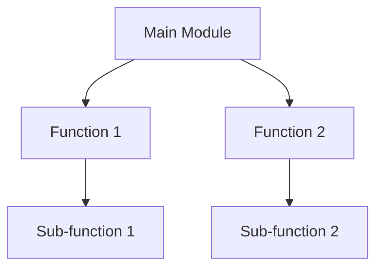

## 9.9. Code Readability and Maintainability

In the world of software development, writing code that works is just the beginning. As developers, we must also strive to write code that is clean, understandable, and maintainable. This is especially true in JavaScript, where dynamic typing and flexible syntax can sometimes lead to less-than-ideal coding practices. In this section, we'll explore the principles of clean coding, the importance of commenting and documentation, and strategies for structuring code logically. We'll also provide examples of refactoring for readability and stress the long-term benefits of these practices for team collaboration.

### Principles of Clean Coding

Clean code is not just about making your code look pretty. It's about writing code that is easy to understand, modify, and extend. Here are some key principles to keep in mind:

#### DRY (Don't Repeat Yourself)

The DRY principle emphasizes reducing repetition within your code. Repeated code can lead to errors and make your code harder to maintain. Instead, aim to encapsulate repeated logic into functions or modules.

```javascript
// Before applying DRY
function calculateArea(length, width) {
    return length * width;
}

function calculateVolume(length, width, height) {
    return length * width * height;
}

// After applying DRY
function calculateRectangle(length, width, height = 1) {
    return length * width * height;
}
```

#### KISS (Keep It Simple, Stupid)

The KISS principle encourages simplicity. Avoid overcomplicating your code with unnecessary complexity. Simple code is easier to read and less prone to errors.

```javascript
// Complex approach
function isEven(number) {
    return number % 2 === 0 ? true : false;
}

// Simple approach
function isEven(number) {
    return number % 2 === 0;
}
```

#### YAGNI (You Aren't Gonna Need It)

YAGNI is a principle of extreme programming that states you should not add functionality until it is necessary. This helps keep your codebase lean and focused.

### Commenting and Documentation

While clean code should be self-explanatory, comments and documentation are still crucial. They provide context and explanations that might not be immediately obvious from the code itself.

#### When to Comment

- **Complex Logic**: If a piece of code is particularly complex, a comment explaining the logic can be invaluable.
- **Intent**: Explain why a piece of code exists, not just what it does.
- **TODOs and FIXMEs**: Use comments to mark areas of code that need attention or improvement.

```javascript
// Calculate the factorial of a number using recursion
function factorial(n) {
    // Base case: factorial of 0 is 1
    if (n === 0) return 1;
    // Recursive case: n * factorial of (n-1)
    return n * factorial(n - 1);
}
```

#### Documentation

In addition to inline comments, consider using tools like JSDoc to generate documentation for your code. This is especially useful for larger projects or when working in teams.

```javascript
/**
 * Calculate the factorial of a number.
 * @param {number} n - The number to calculate the factorial for.
 * @returns {number} The factorial of the number.
 */
function factorial(n) {
    if (n === 0) return 1;
    return n * factorial(n - 1);
}
```

### Structuring Code Logically

Logical structuring of code involves organizing your code in a way that makes sense and is easy to follow. This includes clear variable scopes and modular design.

#### Clear Variable Scopes

Understanding and managing variable scope is crucial for writing maintainable JavaScript code. Use `let` and `const` to define variables with block scope, reducing the risk of variable collisions and unintended side effects.

```javascript
function processItems(items) {
    for (let i = 0; i < items.length; i++) {
        const item = items[i];
        // Process item
    }
    // 'i' and 'item' are not accessible here
}
```

#### Modular Design

Break your code into smaller, reusable modules. This makes your code easier to test and maintain.

```javascript
// module.js
export function add(a, b) {
    return a + b;
}

// main.js
import { add } from './module.js';
console.log(add(2, 3)); // 5
```

### Refactoring for Readability

Refactoring is the process of restructuring existing code without changing its external behavior. This can greatly improve readability and maintainability.

#### Example of Refactoring

Consider the following code snippet:

```javascript
// Original code
function getUserInfo(user) {
    return 'Name: ' + user.name + ', Age: ' + user.age;
}

// Refactored code using template literals
function getUserInfo(user) {
    return `Name: ${user.name}, Age: ${user.age}`;
}
```

In this example, we refactored the code to use template literals, which improve readability by making the string construction clearer.

### Long-term Benefits for Team Collaboration

Writing readable and maintainable code is not just beneficial for you; it's crucial for team collaboration. Here are some long-term benefits:

- **Easier Onboarding**: New team members can understand the codebase more quickly.
- **Fewer Bugs**: Clear code reduces the likelihood of introducing bugs.
- **Faster Development**: Teams can work more efficiently when code is easy to understand and modify.

### Visualizing Code Structure

To further enhance understanding, let's visualize how modular design and clear variable scopes contribute to code readability and maintainability.



In this diagram, we see a main module that calls two functions, each with their own sub-functions. This modular approach makes it easier to understand the flow of the program and isolate parts of the code for testing or modification.

### Try It Yourself

To reinforce your understanding, try refactoring some of your own code. Look for opportunities to apply the DRY and KISS principles, add comments where necessary, and organize your code into modules. Experiment with different ways to structure your code and see how it affects readability.

### Knowledge Check

Before moving on, let's summarize the key takeaways:

- **DRY and KISS**: Avoid repetition and keep your code simple.
- **Commenting**: Provide context and explanations for complex logic.
- **Variable Scopes**: Use `let` and `const` for clear scoping.
- **Modular Design**: Break your code into smaller, reusable modules.
- **Refactoring**: Continuously improve your code for readability.

Remember, writing clean and maintainable code is a skill that improves with practice. Keep experimenting, stay curious, and enjoy the journey!

## Quiz Time!



### Which principle emphasizes reducing repetition in your code?

- [x] DRY
- [ ] KISS
- [ ] YAGNI
- [ ] SOLID

> **Explanation:** DRY stands for "Don't Repeat Yourself" and focuses on reducing code duplication.

### What does the KISS principle encourage?

- [x] Simplicity
- [ ] Complexity
- [ ] Repetition
- [ ] Over-engineering

> **Explanation:** KISS stands for "Keep It Simple, Stupid," encouraging simplicity in code.

### What is the purpose of comments in code?

- [x] Provide context and explanations
- [ ] Increase code complexity
- [ ] Obfuscate code logic
- [ ] Reduce code readability

> **Explanation:** Comments provide context and explanations for code, especially for complex logic.

### Which keyword should you use for block-scoped variables?

- [x] let
- [ ] var
- [ ] function
- [ ] class

> **Explanation:** `let` is used for block-scoped variables in JavaScript.

### What is the benefit of modular design?

- [x] Easier testing and maintenance
- [ ] Increased code complexity
- [ ] Reduced code readability
- [ ] Slower development

> **Explanation:** Modular design makes code easier to test and maintain by breaking it into smaller, reusable parts.

### What is refactoring?

- [x] Restructuring code without changing its behavior
- [ ] Adding new features to code
- [ ] Removing comments from code
- [ ] Obfuscating code logic

> **Explanation:** Refactoring involves restructuring existing code to improve readability and maintainability without altering its external behavior.

### Why is clean code important for team collaboration?

- [x] Easier onboarding and fewer bugs
- [ ] Increased code complexity
- [ ] Slower development
- [ ] More frequent errors

> **Explanation:** Clean code facilitates easier onboarding, reduces bugs, and speeds up development, benefiting team collaboration.

### What does YAGNI stand for?

- [x] You Aren't Gonna Need It
- [ ] You Always Gonna Need It
- [ ] You Are Gonna Need It
- [ ] You Aren't Gonna Need That

> **Explanation:** YAGNI stands for "You Aren't Gonna Need It," a principle that discourages adding unnecessary functionality.

### What tool can generate documentation for JavaScript code?

- [x] JSDoc
- [ ] HTML
- [ ] CSS
- [ ] JSON

> **Explanation:** JSDoc is a tool used to generate documentation for JavaScript code.

### True or False: Using `var` is recommended for clear variable scoping.

- [ ] True
- [x] False

> **Explanation:** `let` and `const` are recommended for clear variable scoping, as they provide block-level scope unlike `var`.




