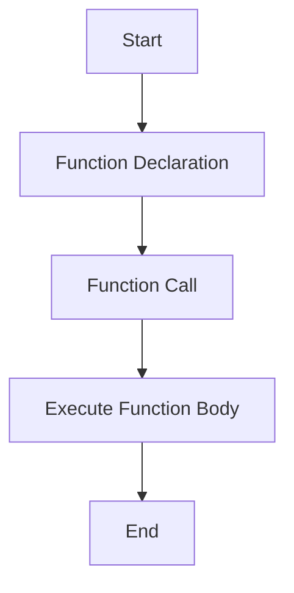

## 1.1 What is a Function?

Welcome to the world of JavaScript, where functions are the building blocks that bring your code to life! In this section, we'll delve into what functions are, why they're essential, and how they can transform your programming experience. Whether you're just starting or looking to solidify your understanding, this guide will provide the foundation you need to harness the power of functions.

### Understanding Functions in JavaScript

**Definition**: In JavaScript, a function is a reusable block of code designed to perform a specific task. Think of it as a mini-program within your program, capable of executing a series of instructions whenever you call upon it.

Functions are integral to JavaScript and programming in general. They allow us to break down complex problems into manageable pieces, making our code more organized, readable, and maintainable. By encapsulating a task within a function, we can reuse it throughout our codebase without rewriting the same logic multiple times.

### The Purpose of Functions

Functions serve several crucial purposes in programming:

1. **Code Reusability**: Functions allow us to write code once and use it multiple times. This reduces redundancy and the potential for errors.

2. **Modularity**: By breaking down tasks into functions, we create modular code that is easier to understand and maintain.

3. **Abstraction**: Functions enable us to abstract complex operations into simple function calls, hiding the underlying complexity from the user.

4. **Organization**: Functions help organize code logically, making it easier to navigate and understand.

5. **Debugging**: With functions, debugging becomes more manageable as we can isolate and test individual parts of our code.

### Functions vs. Other Code Blocks

While functions are blocks of code, not all code blocks are functions. Let's explore the differences:

- **Code Blocks**: These are sections of code enclosed in curly braces `{}`. They can exist in loops, conditionals, or standalone but don't inherently have a name or reusability.

- **Functions**: These are named blocks of code that can be invoked or called upon. They can accept inputs (parameters) and return outputs (return values).

### A Simple Function Example

Let's look at a simple example to illustrate what a function is and how it works:

```javascript
// Function Declaration
function greet() {
    console.log("Hello, World!");
}

// Calling the function
greet(); // Outputs: Hello, World!
```

In this example, we define a function named `greet` that, when called, prints "Hello, World!" to the console. The function is defined using the `function` keyword, followed by the function name and a pair of parentheses `()`.

### Analogies to Understand Functions

To make the concept of functions more accessible, let's use some analogies:

- **Recipe Analogy**: Think of a function as a recipe. Just like a recipe provides instructions to make a dish, a function provides instructions to perform a task. You can use the recipe (function) whenever you want to make the dish (execute the task).

- **Factory Analogy**: Imagine a function as a factory. The factory takes raw materials (inputs) and processes them to produce a product (output). Similarly, a function can take inputs, process them, and return a result.

### Breaking Down a Function

Let's break down the components of a function to understand it better:

1. **Function Declaration**: This is where we define the function. It includes the `function` keyword, the function name, and a pair of parentheses `()`.

2. **Function Body**: This is the block of code enclosed in curly braces `{}` that contains the instructions the function will execute.

3. **Function Call**: This is how we execute the function. We use the function name followed by parentheses `()`.

### Example: A Function with Parameters

Functions can accept inputs, known as parameters, which allow them to perform tasks with varying data. Here's an example:

```javascript
// Function with Parameters
function greetUser(name) {
    console.log("Hello, " + name + "!");
}

// Calling the function with an argument
greetUser("Alice"); // Outputs: Hello, Alice!
greetUser("Bob");   // Outputs: Hello, Bob!
```

In this example, the `greetUser` function takes a parameter `name` and uses it to personalize the greeting. When we call the function, we provide an argument (e.g., "Alice") that replaces the parameter within the function body.

### Visualizing Function Execution

To better understand how functions work, let's visualize the process:



**Diagram Description**: This flowchart represents the process of defining and executing a function. We start with the function declaration, make a function call, execute the function body, and then reach the end.

### Try It Yourself

Now that we've covered the basics, it's time to experiment! Try modifying the examples above:

- Change the message in the `greet` function.
- Add more parameters to the `greetUser` function.
- Create a new function that performs a different task.

### Key Takeaways

- A function is a reusable block of code that performs a specific task.
- Functions help organize code, improve reusability, and simplify debugging.
- Functions can accept inputs (parameters) and return outputs (return values).
- Understanding functions is fundamental to writing efficient and maintainable JavaScript code.

### Further Reading

For more information on JavaScript functions, check out these resources:

- [MDN Web Docs: Functions](https://developer.mozilla.org/en-US/docs/Web/JavaScript/Guide/Functions)
- [W3Schools: JavaScript Functions](https://www.w3schools.com/js/js_functions.asp)

### Embrace the Journey

Remember, this is just the beginning. As you progress, you'll build more complex and interactive web pages. Keep experimenting, stay curious, and enjoy the journey!

## Quiz Time!



### What is a function in JavaScript?

- [x] A reusable block of code that performs a specific task
- [ ] A variable that stores data
- [ ] A loop that iterates over a set of values
- [ ] A conditional statement that makes decisions

> **Explanation:** A function is a reusable block of code designed to perform a specific task, making it distinct from variables, loops, and conditionals.

### What is the primary purpose of using functions in code?

- [x] To improve code organization and reusability
- [ ] To increase the number of lines of code
- [ ] To make code run slower
- [ ] To create more complex code

> **Explanation:** Functions improve code organization and reusability by encapsulating tasks into reusable blocks of code.

### How do you define a function in JavaScript?

- [x] Using the `function` keyword followed by a name and parentheses
- [ ] Using the `var` keyword followed by a name and parentheses
- [ ] Using the `if` keyword followed by a condition
- [ ] Using the `for` keyword followed by a loop

> **Explanation:** Functions are defined using the `function` keyword, followed by a name and parentheses.

### What is the difference between a function and a code block?

- [x] A function is a named block of code that can be reused, while a code block is not inherently reusable
- [ ] A function is a loop, while a code block is a conditional statement
- [ ] A function is a variable, while a code block is an array
- [ ] A function is a string, while a code block is a number

> **Explanation:** Functions are named and reusable, whereas code blocks are not inherently reusable and can exist in various contexts.

### What analogy can help beginners understand functions?

- [x] A recipe providing instructions to make a dish
- [ ] A car driving on a highway
- [ ] A bird flying in the sky
- [ ] A tree growing in a forest

> **Explanation:** A recipe analogy helps beginners understand functions as it provides instructions to perform a task, similar to a function.

### What is a parameter in a function?

- [x] An input that a function can accept to perform a task
- [ ] A variable that stores the result of a function
- [ ] A loop that iterates over a function
- [ ] A conditional statement within a function

> **Explanation:** Parameters are inputs that a function can accept to perform a task with varying data.

### How do you call a function in JavaScript?

- [x] By using the function name followed by parentheses
- [ ] By using the `var` keyword followed by the function name
- [ ] By using the `if` keyword followed by a condition
- [ ] By using the `for` keyword followed by a loop

> **Explanation:** Functions are called using their name followed by parentheses.

### What is the output of the following code?
```javascript
function greet() {
    console.log("Hello, World!");
}
greet();
```

- [x] Hello, World!
- [ ] Hello, User!
- [ ] World, Hello!
- [ ] No output

> **Explanation:** The function `greet` prints "Hello, World!" to the console when called.

### Can functions return values?

- [x] True
- [ ] False

> **Explanation:** Functions can return values, allowing them to output results that can be used elsewhere in the code.

### What is a common benefit of using functions?

- [x] Simplifying debugging by isolating code into manageable parts
- [ ] Increasing code complexity
- [ ] Making code harder to read
- [ ] Reducing code efficiency

> **Explanation:** Functions simplify debugging by isolating code into manageable parts, making it easier to test and fix issues.




