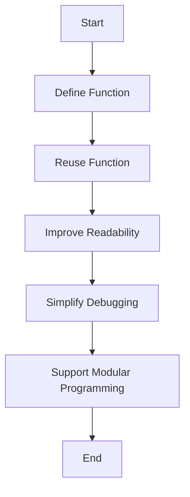

## 1.2 Benefits of Using Functions

In the world of programming, functions are akin to the building blocks of a house. They are essential components that, when combined, create a robust and efficient structure. In JavaScript, functions play a pivotal role in enhancing code organization, promoting reusability, improving readability, simplifying debugging, and supporting modular programming. In this section, we will delve into these benefits, providing you with a comprehensive understanding of why functions are indispensable in JavaScript development.

### Promoting Code Reusability

One of the most significant advantages of using functions is their ability to promote code reusability. Let's explore what this means and why it's beneficial.

#### What is Code Reusability?

Code reusability refers to the practice of writing code that can be used multiple times across different parts of an application or even in different projects. Functions allow you to encapsulate a specific piece of logic or functionality, which can then be invoked whenever needed, without rewriting the same code.

#### Why is Code Reusability Important?

- **Efficiency**: By reusing code, you save time and effort, as you don't need to write the same logic repeatedly.
- **Consistency**: Reusing the same function ensures consistent behavior across your application.
- **Maintainability**: If a function needs to be updated, you only need to change it in one place, reducing the risk of errors.

#### Code Example: Reusability in Action

Consider a simple function that calculates the area of a rectangle:

```javascript
// Function to calculate the area of a rectangle
function calculateRectangleArea(length, width) {
    return length * width;
}

// Using the function multiple times
let area1 = calculateRectangleArea(5, 10);
let area2 = calculateRectangleArea(7, 3);
let area3 = calculateRectangleArea(2, 8);

console.log(area1); // Output: 50
console.log(area2); // Output: 21
console.log(area3); // Output: 16
```

In this example, the `calculateRectangleArea` function is defined once and reused multiple times, demonstrating how functions promote code reusability.

### Enhancing Code Readability and Maintainability

Functions also play a crucial role in enhancing the readability and maintainability of your code.

#### How Do Functions Improve Readability?

- **Abstraction**: Functions abstract complex logic into a single, descriptive name, making the code easier to understand.
- **Organization**: By breaking down code into smaller, manageable functions, you create a clear structure that is easier to follow.

#### Code Example: Readability with Functions

Let's look at an example where functions improve readability:

```javascript
// Function to check if a number is even
function isEven(number) {
    return number % 2 === 0;
}

// Function to filter even numbers from an array
function filterEvenNumbers(numbers) {
    return numbers.filter(isEven);
}

let numbers = [1, 2, 3, 4, 5, 6];
let evenNumbers = filterEvenNumbers(numbers);

console.log(evenNumbers); // Output: [2, 4, 6]
```

In this example, the `isEven` function abstracts the logic of checking if a number is even, and the `filterEvenNumbers` function organizes the logic of filtering even numbers from an array. This makes the code more readable and easier to maintain.

### Simplifying Debugging

Debugging is an inevitable part of programming, and functions can significantly simplify this process.

#### How Do Functions Aid in Debugging?

- **Isolation**: Functions isolate specific logic, making it easier to identify and fix errors.
- **Testing**: Functions can be tested independently, allowing you to verify their correctness before integrating them into larger systems.

#### Code Example: Debugging with Functions

Consider a function that calculates the factorial of a number:

```javascript
// Function to calculate factorial
function factorial(n) {
    if (n < 0) return undefined; // Error handling for negative numbers
    if (n === 0) return 1; // Base case
    return n * factorial(n - 1); // Recursive case
}

console.log(factorial(5)); // Output: 120
console.log(factorial(-1)); // Output: undefined
```

In this example, the `factorial` function isolates the logic for calculating factorials. If there's an error, you can focus on this function alone, simplifying the debugging process.

### Supporting Modular Programming

Functions are fundamental to modular programming, a design technique that divides a program into separate modules that can be developed, tested, and maintained independently.

#### What is Modular Programming?

Modular programming involves breaking down a program into smaller, self-contained modules, each responsible for a specific piece of functionality. Functions are the building blocks of these modules.

#### Benefits of Modular Programming

- **Scalability**: Modular programs are easier to scale, as new modules can be added without affecting existing ones.
- **Collaboration**: Different developers can work on separate modules simultaneously, improving collaboration and productivity.
- **Maintainability**: Modules can be updated or replaced independently, enhancing maintainability.

#### Code Example: Modular Programming with Functions

Let's consider a simple example of modular programming:

```javascript
// Module for user authentication
function authenticateUser(username, password) {
    // Logic for authenticating user
    return username === 'admin' && password === '1234';
}

// Module for displaying user dashboard
function displayDashboard() {
    console.log('Welcome to the dashboard!');
}

// Main program
let username = 'admin';
let password = '1234';

if (authenticateUser(username, password)) {
    displayDashboard();
} else {
    console.log('Authentication failed!');
}
```

In this example, the program is divided into two modules: `authenticateUser` and `displayDashboard`. Each module is responsible for a specific piece of functionality, demonstrating the principles of modular programming.

### Real-World Scenarios

Functions are not just theoretical concepts; they have practical applications in real-world scenarios. Let's explore some examples where functions improve workflow and productivity.

#### Scenario 1: Web Development

In web development, functions are used extensively to handle user interactions, manipulate the DOM (Document Object Model), and manage data. For example, a function can be used to validate form inputs before submission:

```javascript
// Function to validate form inputs
function validateForm(formData) {
    if (!formData.name) {
        return 'Name is required';
    }
    if (!formData.email.includes('@')) {
        return 'Invalid email address';
    }
    return 'Form is valid';
}

let formData = { name: 'John', email: 'john@example.com' };
console.log(validateForm(formData)); // Output: Form is valid
```

In this example, the `validateForm` function encapsulates the logic for validating form inputs, improving the workflow by ensuring data integrity before submission.

#### Scenario 2: Data Processing

In data processing, functions are used to transform and analyze data efficiently. For example, a function can be used to calculate the average of an array of numbers:

```javascript
// Function to calculate average
function calculateAverage(numbers) {
    let sum = numbers.reduce((acc, num) => acc + num, 0);
    return sum / numbers.length;
}

let data = [10, 20, 30, 40, 50];
console.log(calculateAverage(data)); // Output: 30
```

In this example, the `calculateAverage` function simplifies the process of calculating the average, making the code more efficient and easier to understand.

### Try It Yourself

Now that we've explored the benefits of using functions, it's time to put your knowledge into practice. Try modifying the code examples provided in this section to see how changes affect the output. For instance, you can:

- Modify the `calculateRectangleArea` function to calculate the perimeter of a rectangle.
- Add additional validation checks in the `validateForm` function.
- Experiment with different data sets in the `calculateAverage` function.

By experimenting with these examples, you'll gain a deeper understanding of how functions work and how they can be applied to solve real-world problems.

### Visualizing Function Benefits

To further illustrate the benefits of functions, let's use a flowchart to visualize how functions improve code organization and workflow:



**Figure 1**: This flowchart demonstrates the process of defining a function, reusing it, and the resulting benefits such as improved readability, simplified debugging, and support for modular programming.

### References and Links

For further reading on functions in JavaScript, consider exploring the following resources:

- [MDN Web Docs: Functions](https://developer.mozilla.org/en-US/docs/Web/JavaScript/Guide/Functions)
- [W3Schools: JavaScript Functions](https://www.w3schools.com/js/js_functions.asp)

These resources provide additional examples and explanations to supplement your understanding of functions in JavaScript.

### Knowledge Check

To reinforce your learning, consider the following questions:

- How do functions promote code reusability?
- In what ways do functions enhance code readability?
- How can functions simplify the debugging process?
- What is modular programming, and how do functions support it?
- Can you think of a real-world scenario where functions improve workflow?

### Embrace the Journey

Remember, mastering functions is just the beginning of your journey in JavaScript programming. As you progress, you'll encounter more complex concepts and challenges. Keep experimenting, stay curious, and enjoy the journey!

### Summary

In this section, we've explored the numerous benefits of using functions in JavaScript. Functions promote code reusability, enhance readability and maintainability, simplify debugging, and support modular programming. By understanding and applying these concepts, you'll be well-equipped to write efficient and effective JavaScript code.

## Quiz Time!



### What is one primary benefit of using functions in JavaScript?

- [x] Code reusability
- [ ] Increased file size
- [ ] Slower execution
- [ ] More complex syntax

> **Explanation:** Functions promote code reusability by allowing you to write a piece of logic once and use it multiple times.

### How do functions enhance code readability?

- [x] By abstracting complex logic into a single, descriptive name
- [ ] By increasing the number of lines of code
- [ ] By making code more complex
- [ ] By requiring more comments

> **Explanation:** Functions improve readability by abstracting complex logic, making the code easier to understand.

### Why is modular programming beneficial?

- [x] It allows for independent development and testing of modules
- [ ] It makes code harder to read
- [ ] It increases the risk of errors
- [ ] It requires more resources

> **Explanation:** Modular programming allows for independent development and testing, enhancing collaboration and maintainability.

### How do functions simplify debugging?

- [x] By isolating specific logic, making it easier to identify errors
- [ ] By making code more complex
- [ ] By increasing the number of errors
- [ ] By requiring more testing

> **Explanation:** Functions isolate logic, making it easier to identify and fix errors during debugging.

### What is a real-world scenario where functions improve workflow?

- [x] Validating form inputs in web development
- [ ] Increasing the number of errors in a program
- [ ] Making code harder to read
- [ ] Slowing down program execution

> **Explanation:** Functions can validate form inputs, ensuring data integrity and improving workflow in web development.

### How do functions support code maintainability?

- [x] By allowing changes to be made in one place
- [ ] By increasing the number of lines of code
- [ ] By making code more complex
- [ ] By requiring more resources

> **Explanation:** Functions support maintainability by allowing changes to be made in one place, reducing the risk of errors.

### What is the role of functions in modular programming?

- [x] They act as building blocks for modules
- [ ] They increase the complexity of modules
- [ ] They make modules harder to test
- [ ] They require more resources

> **Explanation:** Functions act as building blocks for modules, supporting modular programming.

### How can functions be tested independently?

- [x] By isolating them from other parts of the program
- [ ] By integrating them with other functions
- [ ] By increasing the number of errors
- [ ] By requiring more resources

> **Explanation:** Functions can be tested independently by isolating them from other parts of the program.

### What is one way functions improve consistency in code?

- [x] By ensuring consistent behavior across the application
- [ ] By increasing the number of errors
- [ ] By making code harder to read
- [ ] By requiring more resources

> **Explanation:** Functions ensure consistent behavior across the application, improving consistency.

### Functions are essential for which programming technique?

- [x] Modular programming
- [ ] Increasing code complexity
- [ ] Reducing code readability
- [ ] Slowing down execution

> **Explanation:** Functions are essential for modular programming, allowing for independent development and testing of modules.


