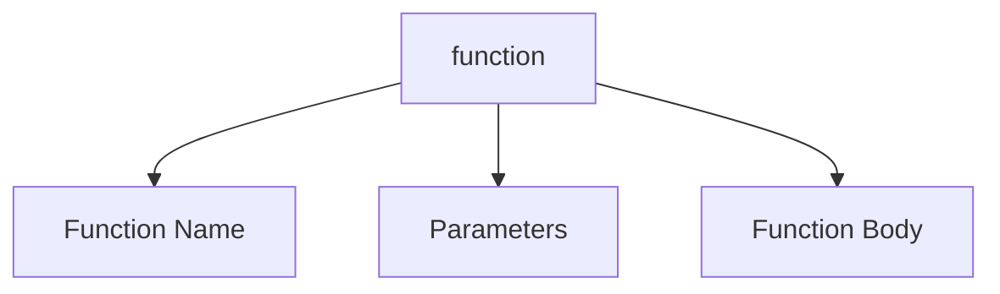

## 1.3 Basic Function Syntax

Welcome to the exciting world of JavaScript functions! In this section, we'll delve into the fundamental building blocks of function syntax. Functions are the heart of any programming language, and understanding their syntax is crucial for writing efficient and effective code. Let's embark on this journey to explore the components of a function declaration, syntax rules, naming conventions, and common beginner mistakes.

### Understanding Function Declarations

A function declaration is a way to define a function in JavaScript. It consists of several key components: the `function` keyword, the function name, parameters, and the function body. Let's break down each of these components:

#### The `function` Keyword

The `function` keyword is the starting point of any function declaration. It tells JavaScript that you are about to define a function. This keyword is essential and must be used to declare a function.

```javascript
function greet() {
    console.log("Hello, World!");
}
```

In the example above, `function` is the keyword that initiates the function declaration.

#### Function Name

The function name is an identifier that you use to call the function later in your code. It should be descriptive and follow certain naming conventions to ensure readability and maintainability.

**Naming Conventions:**

- Use camelCase: Start with a lowercase letter and capitalize each subsequent word. For example, `calculateSum`, `fetchData`.
- Avoid using reserved words: JavaScript has a list of reserved words that cannot be used as function names, such as `return`, `if`, `else`.
- Be descriptive: Choose names that clearly describe what the function does. For instance, `getUserInfo` is more descriptive than `getInfo`.

```javascript
function calculateSum(a, b) {
    return a + b;
}
```

In this example, `calculateSum` is a descriptive function name that follows camelCase convention.

#### Parameters

Parameters are placeholders for values that you pass into the function when you call it. They act as variables within the function and allow you to customize the function's behavior.

- Parameters are defined within parentheses `()` after the function name.
- You can define multiple parameters, separated by commas.

```javascript
function greetUser(name) {
    console.log("Hello, " + name + "!");
}
```

Here, `name` is a parameter that the function uses to greet a specific user.

#### Function Body

The function body is enclosed in curly braces `{}` and contains the code that defines what the function does. This is where you write the logic that executes when the function is called.

```javascript
function multiply(a, b) {
    return a * b;
}
```

In this example, the function body contains a single line of code that multiplies two numbers and returns the result.

### Syntax Rules and Guidelines

Understanding the syntax rules and guidelines for function declarations is essential for writing error-free code. Let's explore some key rules:

1. **Function Declaration Syntax:**

   ```javascript
   function functionName(parameter1, parameter2) {
       // Function body
   }
   ```

2. **Function Names:**

   - Must start with a letter, underscore `_`, or dollar sign `$`.
   - Can contain letters, digits, underscores, and dollar signs.
   - Are case-sensitive (`myFunction` and `myfunction` are different).

3. **Parameters:**

   - Are optional; a function can have zero or more parameters.
   - Must be separated by commas if there are multiple.

4. **Function Body:**

   - Must be enclosed in curly braces `{}`.
   - Can contain any valid JavaScript statements.

### Code Snippets: Correct and Incorrect Syntax

Let's look at some examples to reinforce the correct syntax and highlight common mistakes.

#### Correct Syntax

```javascript
function add(a, b) {
    return a + b;
}

function sayHello() {
    console.log("Hello!");
}
```

In these examples, the functions are correctly declared with appropriate names, parameters, and bodies.

#### Incorrect Syntax

```javascript
function 123add(a, b) { // Incorrect: Function name cannot start with a digit
    return a + b;
}

function sayHello( { // Incorrect: Missing closing parenthesis
    console.log("Hello!");
}

function greetUser(name) // Incorrect: Missing function body
```

These examples demonstrate common syntax errors, such as invalid function names, missing parentheses, and missing function bodies.

### Common Beginner Mistakes

As you begin your journey with JavaScript functions, it's important to be aware of common mistakes that beginners often make. Let's address a few of these:

#### Forgetting the `function` Keyword

One of the most common mistakes is forgetting to include the `function` keyword when declaring a function. Without it, JavaScript won't recognize your code as a function declaration.

```javascript
// Incorrect
greet() {
    console.log("Hello!");
}

// Correct
function greet() {
    console.log("Hello!");
}
```

#### Misplacing Curly Braces

Another frequent error is misplacing or omitting curly braces. Remember that the function body must be enclosed in curly braces.

```javascript
// Incorrect
function add(a, b)
    return a + b;

// Correct
function add(a, b) {
    return a + b;
}
```

#### Incorrect Parameter Syntax

Ensure that parameters are correctly defined within parentheses and separated by commas if there are multiple.

```javascript
// Incorrect
function multiply a, b {
    return a * b;
}

// Correct
function multiply(a, b) {
    return a * b;
}
```

### Try It Yourself

Now that we've covered the basics of function syntax, it's time to put your knowledge into practice. Try modifying the following code examples to experiment with different function names, parameters, and return values:

```javascript
// Experiment with different parameter names and return values
function calculateArea(length, width) {
    return length * width;
}

console.log(calculateArea(5, 10)); // Try changing the arguments
```

Feel free to change the function name, parameters, and the logic inside the function body. This hands-on practice will help solidify your understanding of function syntax.

### Visualizing Function Syntax

To better understand how function syntax works, let's visualize the components of a function declaration using a diagram.



**Diagram Description:** This diagram represents the structure of a function declaration in JavaScript. It shows the `function` keyword leading to the function name, parameters, and function body.

### Further Reading

For more information on JavaScript functions and syntax, check out these resources:

- [MDN Web Docs: Functions](https://developer.mozilla.org/en-US/docs/Web/JavaScript/Guide/Functions)
- [W3Schools: JavaScript Functions](https://www.w3schools.com/js/js_functions.asp)

### Knowledge Check

Let's reinforce what we've learned with a few questions and challenges:

1. What is the purpose of the `function` keyword in a function declaration?
2. How should you name a function to ensure readability and maintainability?
3. What are common mistakes beginners make when declaring functions?
4. Try writing a function that calculates the square of a number.

### Embrace the Journey

Remember, mastering JavaScript functions is a journey. As you progress, you'll build more complex and interactive web pages. Keep experimenting, stay curious, and enjoy the journey!

---

## Quiz Time!



### What is the keyword used to declare a function in JavaScript?

- [x] function
- [ ] func
- [ ] declare
- [ ] def

> **Explanation:** The `function` keyword is used to declare a function in JavaScript.

### Which of the following is a correct function name?

- [x] calculateSum
- [ ] 123add
- [ ] calculate-sum
- [ ] CalculateSum

> **Explanation:** `calculateSum` follows the camelCase convention and starts with a letter, making it a valid function name.

### What is the purpose of parameters in a function?

- [x] To pass values into the function
- [ ] To define the function's return value
- [ ] To declare variables inside the function
- [ ] To specify the function's name

> **Explanation:** Parameters are used to pass values into the function, allowing it to perform operations with those values.

### Which of the following is NOT a valid way to define a function?

- [ ] function greet() { console.log("Hello!"); }
- [x] function greet { console.log("Hello!"); }
- [ ] function greet(name) { console.log("Hello, " + name); }
- [ ] function() { console.log("Hello!"); }

> **Explanation:** The second option is incorrect because it lacks parentheses after the function name.

### What should you do if you want a function to return a value?

- [x] Use the `return` statement
- [ ] Use the `console.log` statement
- [ ] Use the `alert` statement
- [ ] Use the `print` statement

> **Explanation:** The `return` statement is used to return a value from a function.

### What is a common mistake when declaring a function?

- [x] Forgetting the `function` keyword
- [ ] Using too many parameters
- [ ] Using too few parameters
- [ ] Using a descriptive name

> **Explanation:** Forgetting the `function` keyword is a common mistake that leads to syntax errors.

### How can you ensure a function name is valid?

- [x] Start with a letter, underscore, or dollar sign
- [ ] Start with a number
- [ ] Use spaces between words
- [ ] Use special characters like `@` or `#`

> **Explanation:** A valid function name must start with a letter, underscore, or dollar sign.

### What is the correct syntax for defining a function with two parameters?

- [x] function add(a, b) { return a + b; }
- [ ] function add a, b { return a + b; }
- [ ] function add(a b) { return a + b; }
- [ ] function add(a b) { return a + b }

> **Explanation:** The correct syntax includes parentheses around the parameters and curly braces around the function body.

### True or False: Function names are case-sensitive.

- [x] True
- [ ] False

> **Explanation:** Function names are case-sensitive, meaning `myFunction` and `myfunction` are different.

### What is the purpose of the function body?

- [x] To contain the code that defines what the function does
- [ ] To declare the function's name
- [ ] To specify the function's parameters
- [ ] To return the function's name

> **Explanation:** The function body contains the code that defines the function's behavior and operations.



---
