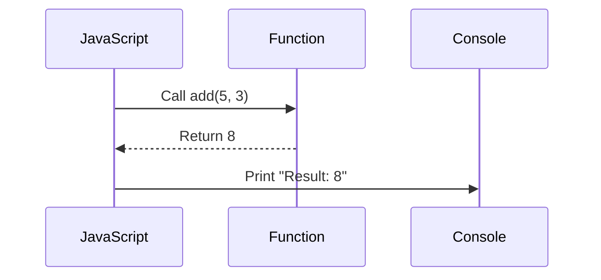

## 1.4 Executing Functions

Welcome to the exciting world of executing functions in JavaScript! In this section, we will explore how to invoke functions, understand the flow of execution, and see how functions can be executed with or without parameters. By the end of this chapter, you'll be equipped with the knowledge to write and execute your own functions confidently.

### Understanding Function Execution

Before we dive into executing functions, let's clarify the difference between defining and calling a function. 

#### Defining a Function

Defining a function is like writing a recipe. You outline the steps needed to perform a task, but you don't actually perform the task until you decide to follow the recipe. In JavaScript, defining a function involves specifying its name, parameters (if any), and the block of code it will execute.

Here's a simple function definition:

```javascript
function greet() {
    console.log("Hello, World!");
}
```

In this example, `greet` is the function name, and the code inside the curly braces `{}` is what the function will execute when called.

#### Calling a Function

Calling a function is like deciding to cook a dish using the recipe you wrote. You execute the steps outlined in the function definition. In JavaScript, you call a function by writing its name followed by parentheses `()`.

Here's how you call the `greet` function:

```javascript
greet(); // This will output: Hello, World!
```

When you call `greet()`, the JavaScript engine executes the code inside the function, and you see the output.

### Executing Functions with Parameters

Functions become even more powerful when you can pass data to them. This is done using parameters and arguments. Parameters are placeholders defined in the function definition, while arguments are the actual values you pass when calling the function.

#### Defining Functions with Parameters

Let's define a function that takes a parameter:

```javascript
function greetPerson(name) {
    console.log("Hello, " + name + "!");
}
```

In this example, `name` is a parameter. It's a placeholder for any value you pass when calling the function.

#### Calling Functions with Arguments

When you call a function with parameters, you provide arguments that replace the placeholders. Here's how you call `greetPerson`:

```javascript
greetPerson("Alice"); // This will output: Hello, Alice!
greetPerson("Bob");   // This will output: Hello, Bob!
```

In these calls, `"Alice"` and `"Bob"` are arguments that replace the `name` parameter.

### Flow of Execution

Understanding the flow of execution is crucial when working with functions. When a function is called, the JavaScript engine temporarily pauses the current execution and jumps to the function's code. Once the function completes its task, control returns to the point where the function was called.

#### Visualizing Execution Flow

Let's visualize this with a simple example:

```javascript
function add(a, b) {
    return a + b;
}

console.log("Start");
let result = add(5, 3);
console.log("Result:", result);
console.log("End");
```

Here's what happens step-by-step:

1. The program starts executing and prints "Start".
2. The `add` function is called with arguments `5` and `3`.
3. The execution jumps to the `add` function, calculates `5 + 3`, and returns `8`.
4. Control returns to the point after the function call, and "Result: 8" is printed.
5. Finally, "End" is printed.

#### Diagram: Function Execution Flow



This diagram illustrates how the JavaScript engine interacts with the function during execution.

### Executing Functions Without Parameters

Not all functions require parameters. Some functions perform tasks that don't depend on external data. Let's explore how to execute such functions.

#### Example: Function Without Parameters

Consider a function that prints a greeting message:

```javascript
function sayHello() {
    console.log("Hello, everyone!");
}

sayHello(); // This will output: Hello, everyone!
```

In this example, `sayHello` doesn't take any parameters. It simply executes its code block when called.

### Encouraging Experimentation

Now that we've covered the basics, it's time for you to experiment! Try writing your own functions and executing them. Here are a few ideas to get you started:

- **Create a function** that calculates the area of a rectangle given its width and height.
- **Write a function** that prints the current date and time.
- **Develop a function** that takes a number and prints whether it's even or odd.

Remember, practice makes perfect. The more you experiment, the more comfortable you'll become with functions.

### Try It Yourself

Here's a simple function to calculate the square of a number. Try modifying it to calculate the cube instead:

```javascript
function square(number) {
    return number * number;
}

console.log(square(4)); // This will output: 16
```

### Key Takeaways

- **Defining vs. Calling**: Defining a function is like writing a recipe, while calling it is executing the recipe.
- **Parameters and Arguments**: Parameters are placeholders in function definitions, while arguments are the actual values passed during function calls.
- **Execution Flow**: When a function is called, execution jumps to the function, and control returns after the function completes its task.

### Further Reading

For more information on functions in JavaScript, check out the following resources:

- [MDN Web Docs: Functions](https://developer.mozilla.org/en-US/docs/Web/JavaScript/Guide/Functions)
- [W3Schools: JavaScript Functions](https://www.w3schools.com/js/js_functions.asp)

### Embrace the Journey

Remember, this is just the beginning. As you progress, you'll build more complex and interactive web pages. Keep experimenting, stay curious, and enjoy the journey!

## Quiz Time!



### What is the difference between defining and calling a function?

- [x] Defining a function specifies its name and code block, while calling a function executes the code.
- [ ] Defining a function executes its code, while calling a function specifies its name and code block.
- [ ] There is no difference between defining and calling a function.
- [ ] Calling a function creates a new function definition.

> **Explanation:** Defining a function involves specifying its name, parameters, and code block, while calling a function involves executing the code within the function.

### How do you call a function named `displayMessage`?

- [x] `displayMessage();`
- [ ] `call displayMessage;`
- [ ] `function displayMessage();`
- [ ] `execute displayMessage();`

> **Explanation:** To call a function, you use its name followed by parentheses `()`.

### What is a parameter in a function?

- [x] A placeholder in a function definition for values to be passed during a call.
- [ ] The actual value passed to a function during a call.
- [ ] A variable used only inside a function.
- [ ] A function that calls another function.

> **Explanation:** Parameters are placeholders in a function definition that are replaced by actual values (arguments) during a call.

### What is an argument in a function call?

- [x] The actual value passed to a function during a call.
- [ ] A placeholder in a function definition.
- [ ] A variable used only inside a function.
- [ ] A function that calls another function.

> **Explanation:** Arguments are the actual values provided to a function when it is called, replacing the parameters.

### What happens when a function is called?

- [x] The execution jumps to the function's code block, and control returns after the function completes.
- [ ] The function is defined again.
- [ ] The function is deleted from memory.
- [ ] The function's code block is ignored.

> **Explanation:** When a function is called, execution jumps to the function's code block, and control returns after the function completes.

### Can a function be called without parameters?

- [x] Yes
- [ ] No

> **Explanation:** Functions can be called without parameters if they don't require any external data to perform their task.

### What is the output of the following code?

```javascript
function greet() {
    console.log("Hi!");
}
greet();
```

- [x] "Hi!"
- [ ] "Hello!"
- [ ] "Greetings!"
- [ ] "Welcome!"

> **Explanation:** The function `greet` prints "Hi!" when called.

### How do you pass a value to a function with parameters?

- [x] By providing arguments in the parentheses during the function call.
- [ ] By defining the function again with new values.
- [ ] By using a global variable.
- [ ] By using a return statement.

> **Explanation:** You pass values to a function with parameters by providing arguments in the parentheses during the function call.

### What is the purpose of a function without parameters?

- [x] To perform tasks that don't depend on external data.
- [ ] To store data permanently.
- [ ] To create new variables.
- [ ] To define new data types.

> **Explanation:** Functions without parameters perform tasks that don't depend on external data.

### True or False: A function can only be called once.

- [ ] True
- [x] False

> **Explanation:** Functions can be called multiple times, allowing for code reuse and modularity.


