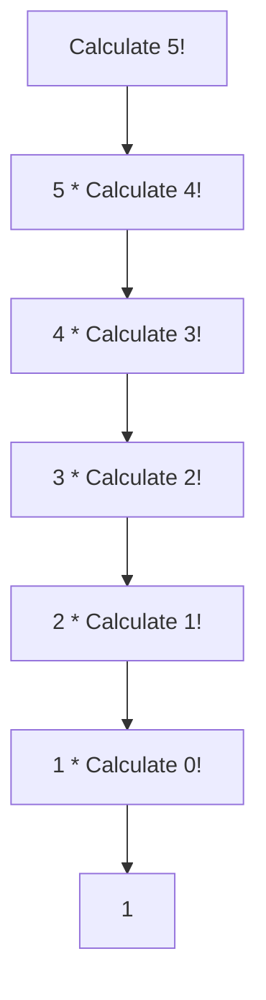
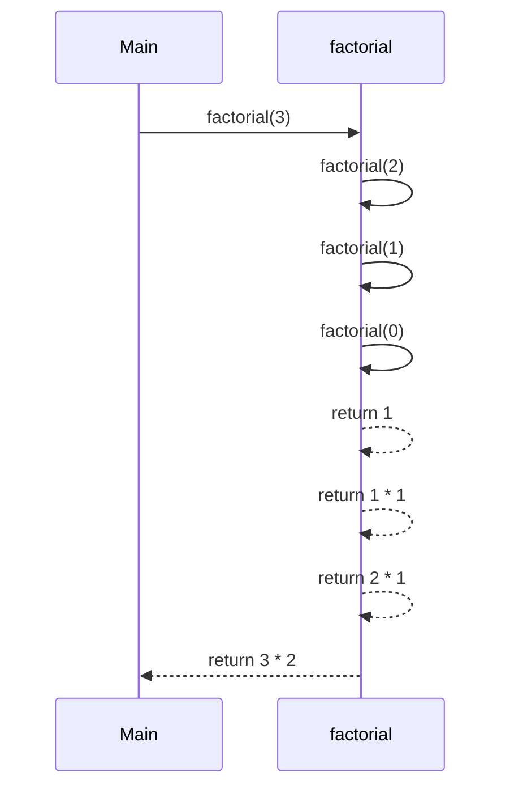

## 10.1 What is Recursion?

Recursion is a fundamental concept in computer science and programming that allows a function to call itself in order to solve a problem. This technique is particularly useful for solving problems that can be broken down into smaller, similar sub-problems. In this section, we will explore the concept of recursion in JavaScript functions, understand how it works, and learn about the importance of base cases to prevent infinite loops.

### Understanding Recursion

At its core, recursion is a process where a function calls itself directly or indirectly to solve a problem. This self-referential approach allows problems to be solved in a more elegant and efficient manner, especially when dealing with tasks that have repetitive or nested structures.

#### Key Components of Recursion

1. **Recursive Case**: This is the part of the function where the function calls itself. It represents the condition under which the problem is broken down into smaller sub-problems.

2. **Base Case**: This is a crucial component of recursion. It defines the condition under which the recursion stops. Without a base case, a recursive function would continue to call itself indefinitely, leading to an infinite loop and eventually a stack overflow error.

### Visualizing Recursion

To better understand recursion, let's visualize how recursive calls work. Consider a simple problem of calculating the factorial of a number. The factorial of a number `n` (denoted as `n!`) is the product of all positive integers less than or equal to `n`.

For example, `5!` (read as "five factorial") is `5 * 4 * 3 * 2 * 1`, which equals `120`.

#### Recursive Definition of Factorial

The factorial of a number can be defined recursively as follows:

- `n! = n * (n-1)!`
- The base case is `0! = 1`

Let's visualize this with a diagram:



In this diagram, each node represents a recursive call to calculate the factorial of a smaller number, until the base case `0! = 1` is reached.

### Implementing Recursion in JavaScript

Now that we have a conceptual understanding of recursion, let's implement a recursive function in JavaScript to calculate the factorial of a number.

```javascript
function factorial(n) {
    // Base case: if n is 0, return 1
    if (n === 0) {
        return 1;
    }
    // Recursive case: n * factorial of (n-1)
    return n * factorial(n - 1);
}

// Example usage
console.log(factorial(5)); // Output: 120
```

#### Explanation of the Code

- **Base Case**: The function checks if `n` is `0`. If it is, the function returns `1`, as `0!` is defined to be `1`.
- **Recursive Case**: If `n` is not `0`, the function calls itself with the argument `n - 1` and multiplies the result by `n`.

### Importance of Base Cases

The base case is a critical component of any recursive function. It acts as a stopping condition to prevent the function from calling itself indefinitely. Without a base case, the recursion would continue until the system runs out of memory, resulting in a stack overflow error.

#### Common Mistakes with Base Cases

1. **Missing Base Case**: Forgetting to include a base case can lead to infinite recursion.
2. **Incorrect Base Case**: An incorrect base case can cause the function to return incorrect results or fail to terminate.

### Try It Yourself

Experiment with the recursive factorial function by modifying the code to handle negative numbers. What happens if you call `factorial(-1)`? How can you modify the function to handle such cases gracefully?

### Visualizing Recursive Function Calls

To further illustrate how recursive function calls work, let's visualize the call stack for calculating `factorial(3)`.



In this sequence diagram, we see how the function calls itself with decreasing values until the base case is reached. The function then returns values back up the call stack, ultimately returning the result to the initial caller.

### Practical Applications of Recursion

Recursion is not limited to calculating factorials. It is widely used in various applications, including:

- **Tree Traversals**: Recursion is commonly used to traverse tree structures, such as the Document Object Model (DOM) in web development.
- **Searching and Sorting Algorithms**: Recursive algorithms like quicksort and mergesort are efficient for sorting large datasets.
- **Solving Puzzles**: Problems like the Tower of Hanoi and the Eight Queens puzzle can be elegantly solved using recursion.

### Recursion vs. Iteration

While recursion is a powerful tool, it is important to understand when to use it. In some cases, iterative solutions (using loops) may be more efficient or easier to understand. Let's compare recursion and iteration for calculating the factorial of a number.

#### Iterative Factorial Function

```javascript
function iterativeFactorial(n) {
    let result = 1;
    for (let i = 1; i <= n; i++) {
        result *= i;
    }
    return result;
}

// Example usage
console.log(iterativeFactorial(5)); // Output: 120
```

#### Comparison

- **Recursion**: Provides a more intuitive and concise solution for problems that have a natural recursive structure. However, it can be less efficient due to the overhead of multiple function calls.
- **Iteration**: Often more efficient for simple problems, as it avoids the overhead of recursive function calls. However, it may be less intuitive for problems with a recursive nature.

### Knowledge Check

1. What is recursion, and how does it differ from iteration?
2. Why is a base case important in a recursive function?
3. How can recursion be used to traverse tree structures?

### Further Reading

For more information on recursion and its applications, consider exploring the following resources:

- [MDN Web Docs: Recursion](https://developer.mozilla.org/en-US/docs/Glossary/Recursion)
- [W3Schools: JavaScript Recursion](https://www.w3schools.com/js/js_function_recursion.asp)

### Embrace the Journey

Remember, recursion is a powerful tool in your programming toolkit. As you continue to explore and practice, you'll gain a deeper understanding of how to use recursion effectively. Keep experimenting, stay curious, and enjoy the journey!

## Quiz Time!



### What is recursion in programming?

- [x] A technique where a function calls itself to solve a problem.
- [ ] A method of iterating over arrays.
- [ ] A process of defining variables.
- [ ] A type of loop structure.

> **Explanation:** Recursion is a programming technique where a function calls itself to solve a problem, often breaking it down into smaller, more manageable sub-problems.

### What is the base case in recursion?

- [x] The condition under which the recursion stops.
- [ ] The first call of the recursive function.
- [ ] The last line of the recursive function.
- [ ] The part of the function that calls itself.

> **Explanation:** The base case is the condition that stops the recursion, preventing infinite loops and stack overflow errors.

### What happens if a recursive function lacks a base case?

- [x] It may result in an infinite loop or stack overflow.
- [ ] It will execute only once.
- [ ] It will return undefined.
- [ ] It will automatically add a base case.

> **Explanation:** Without a base case, a recursive function will continue to call itself indefinitely, leading to an infinite loop or stack overflow error.

### Which of the following is a practical application of recursion?

- [x] Tree traversal
- [ ] Variable declaration
- [ ] Loop iteration
- [ ] Array sorting with bubble sort

> **Explanation:** Recursion is commonly used in tree traversal, where each node in the tree can be processed recursively.

### How does recursion differ from iteration?

- [x] Recursion involves function calls, while iteration uses loops.
- [ ] Recursion is faster than iteration.
- [ ] Iteration cannot solve complex problems.
- [ ] Recursion is used only in JavaScript.

> **Explanation:** Recursion involves a function calling itself, whereas iteration uses loops to repeat a block of code.

### What is a recursive case in a recursive function?

- [x] The part of the function that calls itself.
- [ ] The condition that stops the recursion.
- [ ] The initial call of the function.
- [ ] The return statement of the function.

> **Explanation:** The recursive case is the part of the function where it calls itself to solve a smaller sub-problem.

### Which of the following is a disadvantage of recursion?

- [x] It can lead to stack overflow if not properly managed.
- [ ] It is always slower than iteration.
- [ ] It cannot solve complex problems.
- [ ] It is not supported in JavaScript.

> **Explanation:** Recursion can lead to stack overflow if the base case is not properly defined or if the recursion depth is too high.

### What is the factorial of 5 using recursion?

- [x] 120
- [ ] 24
- [ ] 60
- [ ] 100

> **Explanation:** The factorial of 5 is calculated as 5 * 4 * 3 * 2 * 1, which equals 120.

### Can recursion be used to solve puzzles like the Tower of Hanoi?

- [x] True
- [ ] False

> **Explanation:** Recursion is an effective approach for solving puzzles like the Tower of Hanoi, where the problem can be broken down into smaller sub-problems.

### Is recursion always the best solution for all problems?

- [ ] True
- [x] False

> **Explanation:** Recursion is not always the best solution for all problems. In some cases, iterative solutions may be more efficient or easier to understand.


