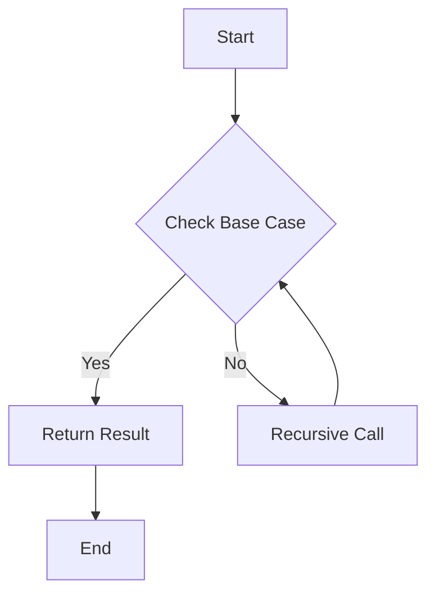
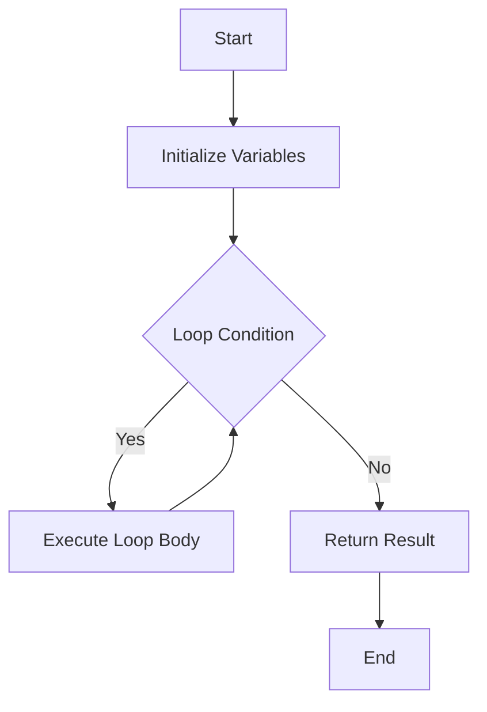

## 10.5 Recursion vs. Iteration

In the world of programming, solving problems often involves repeating a set of instructions. Two fundamental techniques for achieving repetition are **recursion** and **iteration**. Both methods have their strengths and weaknesses, and understanding when to use each can significantly enhance your problem-solving skills in JavaScript. In this section, we will delve into the differences between recursion and iteration, explore their pros and cons, and provide practical examples to illustrate their use.

### Understanding Recursion

**Recursion** is a technique where a function calls itself to solve a smaller instance of the same problem. This approach is particularly useful for problems that can be broken down into smaller, similar sub-problems. A classic example of recursion is calculating the factorial of a number.

#### Example: Factorial Using Recursion

```javascript
function factorial(n) {
    // Base case: if n is 0, return 1
    if (n === 0) {
        return 1;
    }
    // Recursive case: n * factorial of (n - 1)
    return n * factorial(n - 1);
}

console.log(factorial(5)); // Output: 120
```

In this example, the `factorial` function calls itself with a decremented value of `n` until it reaches the base case (`n === 0`), at which point it returns 1. The results of each recursive call are multiplied together to produce the final result.

### Understanding Iteration

**Iteration** involves using loops to repeat a set of instructions until a condition is met. This approach is often more intuitive for problems that require a straightforward repetition of steps. Let's look at how we can calculate the factorial of a number using iteration.

#### Example: Factorial Using Iteration

```javascript
function factorialIterative(n) {
    let result = 1;
    for (let i = 1; i <= n; i++) {
        result *= i;
    }
    return result;
}

console.log(factorialIterative(5)); // Output: 120
```

In this example, a `for` loop is used to multiply the numbers from 1 to `n`, storing the result in the `result` variable. This iterative approach achieves the same outcome as the recursive solution.

### Pros and Cons of Recursion

#### Pros of Recursion

1. **Simplicity**: Recursive solutions can be more straightforward and easier to understand, especially for problems that naturally fit a recursive pattern, such as tree traversals and divide-and-conquer algorithms.

2. **Elegant Code**: Recursive functions often result in cleaner and more elegant code, reducing the need for complex loop constructs.

3. **Problem Decomposition**: Recursion is ideal for problems that can be broken down into smaller sub-problems, making it easier to implement algorithms like quicksort and mergesort.

#### Cons of Recursion

1. **Performance**: Recursive functions can be less efficient due to the overhead of multiple function calls and the potential for stack overflow if the recursion depth is too high.

2. **Memory Usage**: Each recursive call adds a new frame to the call stack, which can lead to increased memory usage and stack overflow errors for deep recursions.

3. **Debugging Complexity**: Debugging recursive functions can be challenging, especially if the base case or recursive case is not correctly defined.

### Pros and Cons of Iteration

#### Pros of Iteration

1. **Efficiency**: Iterative solutions are generally more efficient in terms of performance and memory usage, as they do not involve the overhead of multiple function calls.

2. **Predictability**: Iterative loops are often easier to predict and debug, making them suitable for straightforward problems.

3. **Control**: Iteration provides more control over the loop's execution, allowing for easy implementation of complex loop conditions and break statements.

#### Cons of Iteration

1. **Complexity**: Iterative solutions can become complex and harder to read, especially for problems that naturally fit a recursive pattern.

2. **Code Length**: Iterative solutions may require more lines of code, leading to potential errors and maintenance challenges.

3. **Limited Use Cases**: Iteration is not always the best fit for problems that require problem decomposition or backtracking.

### When to Use Recursion vs. Iteration

Choosing between recursion and iteration depends on the nature of the problem and the specific requirements of your application. Here are some guidelines to help you decide:

- **Use Recursion** when the problem can be naturally divided into smaller sub-problems, such as tree traversals, graph algorithms, and divide-and-conquer strategies.

- **Use Iteration** for problems that involve straightforward repetition, such as iterating over arrays, performing simple calculations, and implementing loops with predictable conditions.

- **Consider Performance**: If performance and memory usage are critical, prefer iteration over recursion, especially for problems with large input sizes.

- **Simplify Code**: If readability and simplicity are more important, consider using recursion for problems that naturally fit a recursive pattern.

### Converting Recursive Functions to Iterative Ones

In some cases, it may be beneficial to convert a recursive function to an iterative one to improve performance and avoid stack overflow errors. Let's explore how we can convert a recursive function to an iterative one using the example of calculating the Fibonacci sequence.

#### Recursive Fibonacci Function

```javascript
function fibonacciRecursive(n) {
    if (n <= 1) {
        return n;
    }
    return fibonacciRecursive(n - 1) + fibonacciRecursive(n - 2);
}

console.log(fibonacciRecursive(5)); // Output: 5
```

#### Iterative Fibonacci Function

```javascript
function fibonacciIterative(n) {
    let a = 0, b = 1, temp;
    for (let i = 1; i < n; i++) {
        temp = a + b;
        a = b;
        b = temp;
    }
    return b;
}

console.log(fibonacciIterative(5)); // Output: 5
```

In the iterative version, we use a loop to calculate the Fibonacci numbers, storing the previous two numbers in variables `a` and `b`. This approach avoids the overhead of recursive calls and is more efficient for larger values of `n`.

### Visualizing Recursion and Iteration

To better understand the differences between recursion and iteration, let's visualize how each approach works using a flowchart.



**Figure 1: Recursive Function Flowchart**

In a recursive function, the process involves checking the base case, making a recursive call, and returning the result once the base case is met.



**Figure 2: Iterative Function Flowchart**

In an iterative function, the process involves initializing variables, executing the loop body while the condition is met, and returning the result once the loop is complete.

### Try It Yourself

To deepen your understanding of recursion and iteration, try modifying the code examples provided. Experiment with different input values, add logging statements to trace the execution flow, and convert other recursive functions to iterative ones.

### Knowledge Check

- **What is recursion, and how does it differ from iteration?**
- **What are the pros and cons of using recursion?**
- **When should you prefer iteration over recursion?**
- **How can you convert a recursive function to an iterative one?**

### Embrace the Journey

Remember, mastering recursion and iteration is a journey that requires practice and experimentation. As you progress, you'll gain the flexibility to choose the best approach for each problem you encounter. Keep experimenting, stay curious, and enjoy the journey!

### References and Links

- [MDN Web Docs: Recursion](https://developer.mozilla.org/en-US/docs/Glossary/Recursion)
- [W3Schools: JavaScript Loops](https://www.w3schools.com/js/js_loop_for.asp)

## Quiz Time!



### What is a key advantage of recursion over iteration?

- [x] Simplicity and elegance in code
- [ ] Better performance in all cases
- [ ] Lower memory usage
- [ ] Easier debugging

> **Explanation:** Recursion often results in simpler and more elegant code, especially for problems that naturally fit a recursive pattern.

### Which of the following is a disadvantage of recursion?

- [x] Potential for stack overflow
- [ ] Complexity in code
- [ ] Inefficient for all problems
- [ ] Lack of readability

> **Explanation:** Recursive functions can lead to stack overflow if the recursion depth is too high, making them less efficient for large input sizes.

### When should you prefer iteration over recursion?

- [x] When performance and memory usage are critical
- [ ] When the problem naturally fits a recursive pattern
- [ ] When simplicity is more important than performance
- [ ] When debugging is not a concern

> **Explanation:** Iteration is generally more efficient in terms of performance and memory usage, making it preferable for problems with large input sizes.

### How can you convert a recursive function to an iterative one?

- [x] Use loops to replace recursive calls
- [ ] Add more base cases
- [ ] Increase the recursion depth
- [ ] Use a different programming language

> **Explanation:** Converting a recursive function to an iterative one involves using loops to replace recursive calls, improving performance and avoiding stack overflow.

### What is the base case in a recursive function?

- [x] The condition that stops the recursion
- [ ] The first recursive call
- [ ] The last recursive call
- [ ] The condition that starts the recursion

> **Explanation:** The base case is the condition that stops the recursion, preventing infinite recursive calls.

### Which approach is more suitable for problems that require problem decomposition?

- [x] Recursion
- [ ] Iteration
- [ ] Both are equally suitable
- [ ] Neither is suitable

> **Explanation:** Recursion is ideal for problems that can be broken down into smaller sub-problems, making it easier to implement algorithms like quicksort and mergesort.

### What is a common issue with debugging recursive functions?

- [x] Complexity in tracing the execution flow
- [ ] Lack of readability
- [ ] Inefficient performance
- [ ] Limited use cases

> **Explanation:** Debugging recursive functions can be challenging due to the complexity in tracing the execution flow and ensuring the base case and recursive case are correctly defined.

### What is a key advantage of iteration over recursion?

- [x] Efficiency in performance and memory usage
- [ ] Simplicity and elegance in code
- [ ] Better readability in all cases
- [ ] Easier problem decomposition

> **Explanation:** Iteration is generally more efficient in terms of performance and memory usage, as it does not involve the overhead of multiple function calls.

### Which of the following is a scenario where recursion is preferable?

- [x] Tree traversals
- [ ] Iterating over arrays
- [ ] Performing simple calculations
- [ ] Implementing loops with predictable conditions

> **Explanation:** Recursion is preferable for problems like tree traversals, where the problem can be naturally divided into smaller sub-problems.

### True or False: Iterative solutions always require more lines of code than recursive solutions.

- [ ] True
- [x] False

> **Explanation:** While iterative solutions may require more lines of code in some cases, this is not always true. The complexity and readability of the code depend on the specific problem and implementation.




