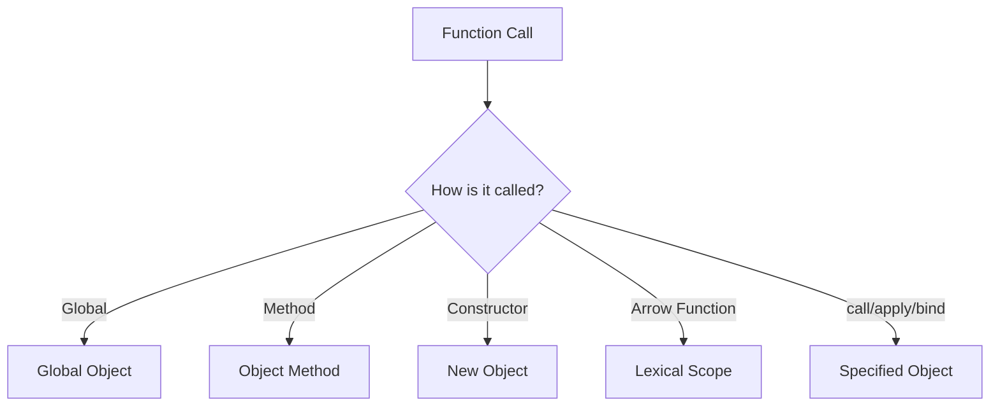

## 11.1 Understanding Context

In JavaScript, understanding the `this` keyword is crucial for writing effective and bug-free code. The `this` keyword is a fundamental aspect of JavaScript's execution context, and it can sometimes be a source of confusion for beginners. In this section, we will demystify `this`, explore how it is determined by the way a function is called, and examine its behavior in various contexts.

### Defining the `this` Keyword

The `this` keyword in JavaScript refers to an object that is executing the current piece of code. The value of `this` is determined by the context in which a function is called, not where it is defined. This means that `this` can refer to different objects depending on how a function is invoked.

### Execution Context and Scope

Before diving deeper into `this`, it's essential to understand the concept of execution context and scope. The execution context is the environment in which JavaScript code is executed. It consists of:

- **Variable Object**: Contains function arguments, inner variable declarations, and function declarations.
- **Scope Chain**: The chain of variable objects accessible in the current context.
- **`this` Value**: The object that the function is currently bound to.

Scope, on the other hand, refers to the visibility and lifetime of variables. JavaScript has two types of scope: global and local (function or block scope).

### How `this` is Determined

The value of `this` is determined by how a function is called. Let's explore the different ways `this` can be set:

#### 1. Global Context

When `this` is used in the global execution context (outside of any function), it refers to the global object. In browsers, the global object is `window`.

```javascript
console.log(this); // In a browser, this will log the window object
```

#### 2. Function Context

When a function is called as a standalone function, `this` refers to the global object (in non-strict mode) or `undefined` (in strict mode).

```javascript
function showThis() {
  console.log(this);
}

showThis(); // Logs the global object (window in browsers) or undefined in strict mode
```

#### 3. Method Context

When a function is called as a method of an object, `this` refers to the object the method is called on.

```javascript
const person = {
  name: 'Alice',
  greet: function() {
    console.log(this.name);
  }
};

person.greet(); // Logs 'Alice'
```

#### 4. Constructor Context

When a function is used as a constructor with the `new` keyword, `this` refers to the newly created object.

```javascript
function Person(name) {
  this.name = name;
}

const bob = new Person('Bob');
console.log(bob.name); // Logs 'Bob'
```

#### 5. `call`, `apply`, and `bind` Methods

JavaScript provides `call`, `apply`, and `bind` methods to explicitly set the value of `this`.

- **`call`**: Invokes a function with a specified `this` value and arguments.

  ```javascript
  function greet() {
    console.log(`Hello, ${this.name}`);
  }

  const user = { name: 'Charlie' };
  greet.call(user); // Logs 'Hello, Charlie'
  ```

- **`apply`**: Similar to `call`, but takes arguments as an array.

  ```javascript
  greet.apply(user); // Logs 'Hello, Charlie'
  ```

- **`bind`**: Returns a new function with a bound `this` value.

  ```javascript
  const boundGreet = greet.bind(user);
  boundGreet(); // Logs 'Hello, Charlie'
  ```

### `this` in Different Contexts

Let's explore how `this` behaves in various contexts with examples.

#### Arrow Functions

Arrow functions do not have their own `this` value. Instead, they inherit `this` from the enclosing lexical context.

```javascript
const obj = {
  name: 'Dave',
  regularFunction: function() {
    console.log(this.name); // 'Dave'
  },
  arrowFunction: () => {
    console.log(this.name); // undefined, as `this` is inherited from the global context
  }
};

obj.regularFunction();
obj.arrowFunction();
```

#### Event Handlers

In event handlers, `this` typically refers to the element that triggered the event.

```html
<button id="myButton">Click me</button>

<script>
  const button = document.getElementById('myButton');
  button.addEventListener('click', function() {
    console.log(this); // Logs the button element
  });
</script>
```

#### Object Methods

When a method is detached from its object, `this` can become the global object or `undefined` in strict mode.

```javascript
const car = {
  brand: 'Toyota',
  getBrand: function() {
    console.log(this.brand);
  }
};

const getCarBrand = car.getBrand;
getCarBrand(); // Logs undefined or throws an error in strict mode
```

### Visualizing `this` in JavaScript

To better understand how `this` works, let's visualize the concept using a flowchart.



**Caption**: This flowchart illustrates how the value of `this` is determined based on the context in which a function is called.

### Try It Yourself

Experiment with the following code examples to see how `this` behaves in different contexts. Try modifying the examples to observe changes in behavior.

```javascript
// Example 1: Global Context
function globalContext() {
  console.log(this);
}
globalContext();

// Example 2: Method Context
const animal = {
  type: 'Dog',
  speak: function() {
    console.log(`The ${this.type} barks.`);
  }
};
animal.speak();

// Example 3: Constructor Context
function Animal(type) {
  this.type = type;
}
const cat = new Animal('Cat');
console.log(cat.type);

// Example 4: Arrow Function
const group = {
  name: 'Developers',
  showGroup: function() {
    const arrowFunc = () => {
      console.log(this.name);
    };
    arrowFunc();
  }
};
group.showGroup();
```

### Knowledge Check

- What does `this` refer to in a global context?
- How does `this` behave in arrow functions compared to regular functions?
- What is the effect of using `call`, `apply`, and `bind` on `this`?

### Further Reading

For more information on the `this` keyword and execution context, consider exploring the following resources:

- [MDN Web Docs: `this`](https://developer.mozilla.org/en-US/docs/Web/JavaScript/Reference/Operators/this)
- [W3Schools: JavaScript `this` Keyword](https://www.w3schools.com/js/js_this.asp)

### Summary

Understanding the `this` keyword is crucial for mastering JavaScript functions and scope. By knowing how `this` is determined by the context of a function call, you can write more predictable and maintainable code. Remember, practice makes perfect. Keep experimenting with different contexts to solidify your understanding of `this`.

## Quiz Time!



### What does `this` refer to in a global context in non-strict mode?

- [x] The global object
- [ ] The function itself
- [ ] Undefined
- [ ] The nearest enclosing object

> **Explanation:** In a global context, `this` refers to the global object, which is `window` in browsers.

### How does `this` behave in an arrow function?

- [x] It inherits `this` from the enclosing lexical context
- [ ] It creates its own `this` value
- [ ] It always refers to the global object
- [ ] It is undefined

> **Explanation:** Arrow functions do not have their own `this` and inherit it from the surrounding context.

### Which method allows you to set `this` explicitly when calling a function?

- [x] `call`
- [ ] `bind`
- [ ] `apply`
- [ ] All of the above

> **Explanation:** `call` allows you to set `this` explicitly, as do `apply` and `bind`.

### What is the value of `this` in a method called on an object?

- [x] The object the method is called on
- [ ] The global object
- [ ] Undefined
- [ ] The function itself

> **Explanation:** In a method call, `this` refers to the object the method is called on.

### What happens to `this` when a method is detached from its object?

- [x] It becomes the global object or undefined in strict mode
- [ ] It remains the same
- [ ] It becomes null
- [ ] It refers to the nearest enclosing object

> **Explanation:** When a method is detached, `this` defaults to the global object or undefined in strict mode.

### What is the purpose of the `bind` method?

- [x] To create a new function with a bound `this` value
- [ ] To immediately call a function with a specific `this`
- [ ] To apply a function with an array of arguments
- [ ] To change the function's name

> **Explanation:** `bind` creates a new function with a specified `this` value.

### In event handlers, what does `this` typically refer to?

- [x] The element that triggered the event
- [ ] The global object
- [ ] The event object
- [ ] The function itself

> **Explanation:** In event handlers, `this` refers to the element that triggered the event.

### What is the `this` value in a constructor function?

- [x] The newly created object
- [ ] The global object
- [ ] Undefined
- [ ] The prototype object

> **Explanation:** In a constructor, `this` refers to the newly created object.

### Can `this` be set to any value using `call` and `apply`?

- [x] True
- [ ] False

> **Explanation:** `call` and `apply` can set `this` to any value, including primitives.

### How can you ensure `this` refers to the correct object in a callback?

- [x] Use `bind` to set `this` explicitly
- [ ] Use `apply` with an array
- [ ] Use `call` with arguments
- [ ] Declare `this` inside the function

> **Explanation:** `bind` can be used to ensure `this` refers to the correct object in callbacks.



Remember, this is just the beginning. As you progress, you'll build more complex and interactive web pages. Keep experimenting, stay curious, and enjoy the journey!
