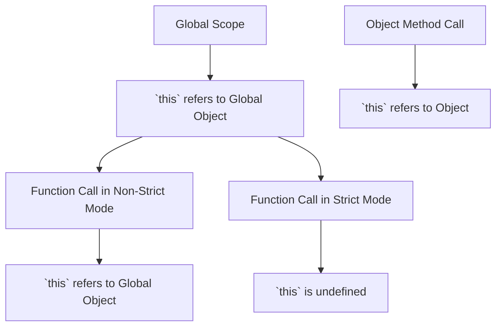

## 11.2 `this` in Global and Function Scope

In JavaScript, the `this` keyword is a fundamental concept that often confuses beginners. It is a special keyword that refers to the object it belongs to. The value of `this` is determined by how a function is called, not where it is defined. In this section, we will explore how `this` behaves in different scopes, specifically in the global and function scopes, and how strict mode affects it.

### Understanding `this` in Global Scope

In the global execution context (outside of any function), `this` refers to the global object. In a web browser, the global object is `window`. This means that any variable or function declared in the global scope becomes a property or method of the global object.

#### Code Example: `this` in Global Scope

```javascript
// In the global scope
console.log(this); // Outputs: Window object in browsers

var globalVariable = "I am a global variable";

function globalFunction() {
    console.log(this.globalVariable); // Outputs: "I am a global variable"
}

globalFunction();
```

In the example above, `this` in the global scope refers to the `window` object. Therefore, `this.globalVariable` is equivalent to `window.globalVariable`.

### `this` in Function Scope

When a function is invoked, the value of `this` inside the function depends on how the function is called. In non-strict mode, if a function is called without an explicit context, `this` defaults to the global object. However, in strict mode, `this` will be `undefined`.

#### Code Example: `this` in Function Scope

```javascript
function showThis() {
    console.log(this);
}

// Non-strict mode
showThis(); // Outputs: Window object

// Strict mode
"use strict";
function strictShowThis() {
    console.log(this);
}

strictShowThis(); // Outputs: undefined
```

In the first function, `showThis`, `this` refers to the global object because the function is called without any context. In the second function, `strictShowThis`, `this` is `undefined` due to strict mode.

### The Impact of Strict Mode on `this`

Strict mode is a way to opt into a restricted variant of JavaScript, which can help catch common coding bugs and prevent certain actions. One of the significant changes in strict mode is how `this` is handled in functions.

#### Code Example: Strict Mode and `this`

```javascript
"use strict";

function logThis() {
    console.log(this);
}

logThis(); // Outputs: undefined

var obj = {
    method: logThis
};

obj.method(); // Outputs: the obj object
```

In the example above, when `logThis` is called in strict mode without an explicit context, `this` is `undefined`. However, when `logThis` is assigned as a method of `obj` and called as `obj.method()`, `this` refers to `obj`.

### Try It Yourself

To better understand how `this` behaves in different contexts, try modifying the examples above. For instance, create an object with a method and see how `this` changes when the method is called in different ways.

### Visualizing `this` in Different Scopes

To help visualize how `this` behaves, let's use a diagram to show the relationship between `this`, the global object, and function calls.



This diagram illustrates how `this` behaves in different scenarios: in the global scope, during function calls in non-strict and strict modes, and when a function is called as a method of an object.

### Key Takeaways

- **Global Scope**: In the global scope, `this` refers to the global object (`window` in browsers).
- **Function Scope**: In non-strict mode, `this` in a function defaults to the global object. In strict mode, it is `undefined`.
- **Strict Mode**: Strict mode changes the default behavior of `this` in functions, making it `undefined` when no context is provided.

### Further Reading

For more information on the `this` keyword and its behavior in JavaScript, check out the following resources:

- [MDN Web Docs: this](https://developer.mozilla.org/en-US/docs/Web/JavaScript/Reference/Operators/this)
- [W3Schools: JavaScript this Keyword](https://www.w3schools.com/js/js_this.asp)

### Embrace the Journey

Remember, understanding `this` is crucial for mastering JavaScript. As you continue learning, you'll encounter more complex scenarios involving `this`, such as in classes and event handlers. Keep experimenting and exploring, and you'll gain a deeper understanding of how `this` works in JavaScript.

## Quiz Time!



### What does `this` refer to in the global scope?

- [x] The global object
- [ ] The function itself
- [ ] The local variable
- [ ] Undefined

> **Explanation:** In the global scope, `this` refers to the global object, which is `window` in browsers.

### What is the value of `this` inside a function in non-strict mode?

- [x] The global object
- [ ] Undefined
- [ ] The function itself
- [ ] The local variable

> **Explanation:** In non-strict mode, `this` inside a function defaults to the global object if no context is provided.

### What happens to `this` inside a function in strict mode?

- [x] It is undefined
- [ ] It refers to the global object
- [ ] It refers to the function itself
- [ ] It refers to the local variable

> **Explanation:** In strict mode, `this` inside a function is `undefined` if no context is provided.

### How does `this` behave when a function is called as a method of an object?

- [x] It refers to the object
- [ ] It refers to the global object
- [ ] It is undefined
- [ ] It refers to the function itself

> **Explanation:** When a function is called as a method of an object, `this` refers to the object.

### What is the effect of strict mode on `this` in a function?

- [x] It makes `this` undefined if no context is provided
- [ ] It makes `this` refer to the global object
- [x] It prevents `this` from referring to the global object
- [ ] It has no effect on `this`

> **Explanation:** Strict mode makes `this` undefined if no context is provided, preventing it from defaulting to the global object.

### In the global scope, what does `this` refer to in a Node.js environment?

- [x] The global object
- [ ] The function itself
- [ ] The local variable
- [ ] Undefined

> **Explanation:** In a Node.js environment, `this` in the global scope refers to the global object, similar to browsers.

### How does `this` behave in an arrow function?

- [x] It inherits `this` from the surrounding lexical context
- [ ] It refers to the global object
- [ ] It is undefined
- [ ] It refers to the function itself

> **Explanation:** In an arrow function, `this` inherits from the surrounding lexical context, not the function itself.

### What happens to `this` when a function is called with `call()` or `apply()`?

- [x] It is explicitly set to the first argument of `call()` or `apply()`
- [ ] It refers to the global object
- [ ] It is undefined
- [ ] It refers to the function itself

> **Explanation:** When a function is called with `call()` or `apply()`, `this` is explicitly set to the first argument passed to these methods.

### How can you ensure `this` refers to a specific object in a function?

- [x] Use `bind()` to create a new function with `this` bound to the object
- [ ] Use `call()` with no arguments
- [ ] Use `apply()` with no arguments
- [ ] Use strict mode

> **Explanation:** `bind()` creates a new function with `this` bound to the specified object, ensuring it refers to that object.

### True or False: In strict mode, `this` in a function called without a context is `undefined`.

- [x] True
- [ ] False

> **Explanation:** In strict mode, `this` in a function called without a context is indeed `undefined`.




