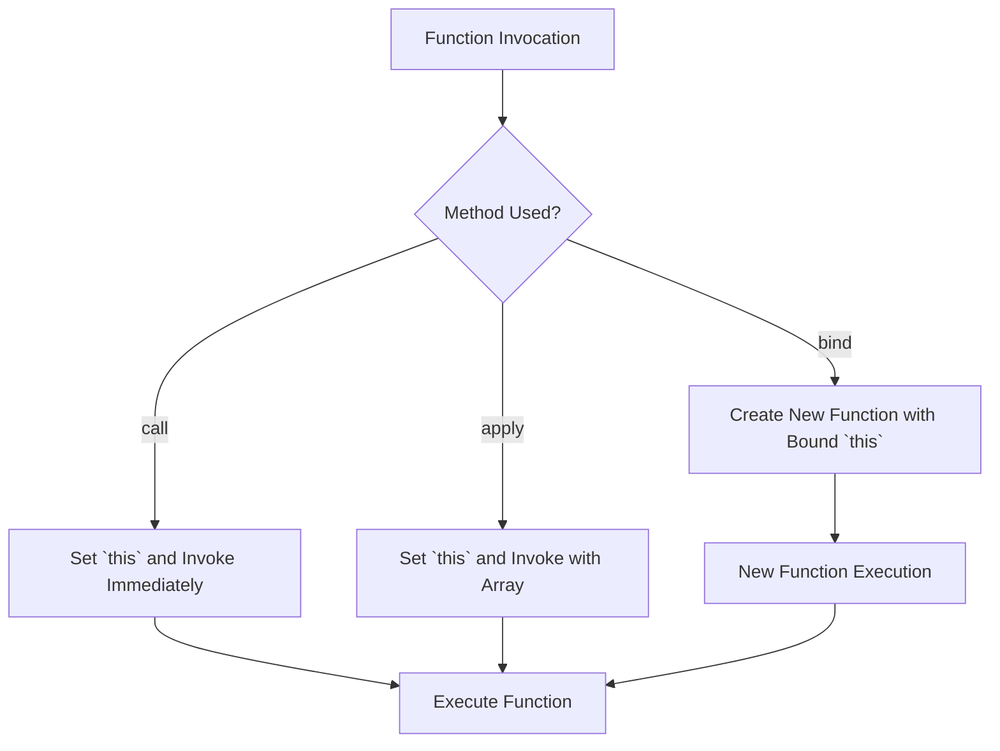

## 11.3 Changing `this` with `call`, `apply`, and `bind`

In JavaScript, the `this` keyword is a powerful feature that refers to the context in which a function is executed. However, understanding and controlling the value of `this` can be challenging, especially for beginners. In this section, we will explore three essential methods—`call`, `apply`, and `bind`—that allow us to manipulate the value of `this` in our functions. By mastering these methods, you'll gain greater control over your functions and be able to write more flexible and reusable code.

### Understanding the `this` Keyword

Before diving into `call`, `apply`, and `bind`, let's briefly revisit the `this` keyword. In JavaScript, `this` refers to the object that is executing the current function. The value of `this` is determined by how a function is called, not where it is defined. This can lead to some unexpected behavior, especially when dealing with nested functions or callbacks.

### Introducing `call`, `apply`, and `bind`

The `call`, `apply`, and `bind` methods are built-in JavaScript functions that allow us to explicitly set the value of `this` when invoking a function. Each method serves a slightly different purpose, and understanding their differences is key to using them effectively.

#### The `call` Method

The `call` method allows us to call a function with a specified `this` value and arguments provided individually.

**Syntax**:
```javascript
functionName.call(thisArg, arg1, arg2, ...);
```

- `thisArg`: The value to be used as `this` when calling the function.
- `arg1, arg2, ...`: Arguments to be passed to the function.

**Example**:
```javascript
function greet(greeting, punctuation) {
    console.log(greeting + ', ' + this.name + punctuation);
}

const person = { name: 'Alice' };

greet.call(person, 'Hello', '!'); // Output: Hello, Alice!
```

In this example, `call` sets `this` to the `person` object, allowing us to access `person.name` within the `greet` function.

#### The `apply` Method

The `apply` method is similar to `call`, but it takes arguments as an array.

**Syntax**:
```javascript
functionName.apply(thisArg, [arg1, arg2, ...]);
```

**Example**:
```javascript
function sum(a, b, c) {
    return a + b + c;
}

const numbers = [1, 2, 3];

console.log(sum.apply(null, numbers)); // Output: 6
```

Here, `apply` is used to pass the `numbers` array as individual arguments to the `sum` function.

#### The `bind` Method

The `bind` method creates a new function that, when called, has its `this` keyword set to the provided value, with a given sequence of arguments preceding any provided when the new function is called.

**Syntax**:
```javascript
const boundFunction = functionName.bind(thisArg, arg1, arg2, ...);
```

**Example**:
```javascript
const module = {
    x: 42,
    getX: function() {
        return this.x;
    }
};

const unboundGetX = module.getX;
console.log(unboundGetX()); // Output: undefined

const boundGetX = unboundGetX.bind(module);
console.log(boundGetX()); // Output: 42
```

In this example, `bind` is used to create a new function `boundGetX` with `this` bound to `module`, allowing it to access `module.x`.

### When to Use `call`, `apply`, and `bind`

Each method has its own use cases and best practices:

- **Use `call`** when you need to invoke a function immediately and pass individual arguments.
- **Use `apply`** when you need to invoke a function immediately and have arguments in an array.
- **Use `bind`** when you need to create a new function with a specific `this` value, often for event handlers or callbacks.

### Best Practices for Using `call`, `apply`, and `bind`

1. **Understand the Context**: Always be aware of the context in which your function will be executed. Use these methods to ensure `this` points to the correct object.

2. **Avoid Excessive Use**: While these methods are powerful, overusing them can lead to code that is difficult to read and maintain. Use them judiciously.

3. **Use Arrow Functions When Possible**: Arrow functions do not have their own `this` context and inherit `this` from the surrounding scope. They can often be a simpler alternative to `bind`.

4. **Performance Considerations**: `bind` creates a new function each time it is called, which can have performance implications in high-frequency scenarios. Use it wisely.

### Visualizing `call`, `apply`, and `bind`

To better understand how these methods work, let's visualize the process of changing `this` using a flowchart.



**Caption**: This flowchart illustrates how `call`, `apply`, and `bind` change the `this` context during function invocation.

### Try It Yourself

Now that we've covered the basics, it's time to experiment! Try modifying the code examples above to see how changing `this` affects the output. Here are some suggestions:

- Modify the `greet` function to include more personal details and use `call` to set `this`.
- Create an array of numbers and use `apply` to find the maximum value using `Math.max`.
- Write a function that logs a message to the console and use `bind` to set `this` to different objects.

### References and Further Reading

- [MDN Web Docs: Function.prototype.call()](https://developer.mozilla.org/en-US/docs/Web/JavaScript/Reference/Global_Objects/Function/call)
- [MDN Web Docs: Function.prototype.apply()](https://developer.mozilla.org/en-US/docs/Web/JavaScript/Reference/Global_Objects/Function/apply)
- [MDN Web Docs: Function.prototype.bind()](https://developer.mozilla.org/en-US/docs/Web/JavaScript/Reference/Global_Objects/Function/bind)

### Knowledge Check

To reinforce your understanding, consider these questions:

1. What is the primary difference between `call` and `apply`?
2. How does `bind` differ from `call` and `apply` in terms of function invocation?
3. Why might you choose to use `bind` over an arrow function?

### Embrace the Journey

Remember, mastering `this` and its manipulation methods is a significant step in becoming proficient in JavaScript. Keep experimenting, stay curious, and enjoy the journey of learning!

## Quiz Time!



### What does the `call` method do?

- [x] Invokes a function with a specified `this` value and individual arguments.
- [ ] Creates a new function with a bound `this` value.
- [ ] Invokes a function with an array of arguments.
- [ ] Changes the prototype of a function.

> **Explanation:** The `call` method is used to invoke a function with a specified `this` value and individual arguments.

### How does `apply` differ from `call`?

- [x] `apply` takes arguments as an array, while `call` takes them individually.
- [ ] `apply` creates a new function, while `call` does not.
- [ ] `apply` changes the prototype of a function, while `call` does not.
- [ ] `apply` is used for asynchronous functions, while `call` is not.

> **Explanation:** The primary difference is that `apply` takes arguments as an array, whereas `call` takes them individually.

### What does the `bind` method return?

- [x] A new function with a bound `this` value.
- [ ] The original function with a modified `this` value.
- [ ] An array of arguments.
- [ ] A promise.

> **Explanation:** The `bind` method returns a new function with a bound `this` value.

### When should you use `bind`?

- [x] When you need to create a new function with a specific `this` value.
- [ ] When you need to invoke a function immediately with individual arguments.
- [ ] When you need to invoke a function immediately with an array of arguments.
- [ ] When you need to change the prototype of a function.

> **Explanation:** `bind` is used to create a new function with a specific `this` value, often for event handlers or callbacks.

### Which method would you use to invoke a function with an array of arguments?

- [x] `apply`
- [ ] `call`
- [ ] `bind`
- [ ] `new`

> **Explanation:** The `apply` method is used to invoke a function with an array of arguments.

### What is a common use case for `bind`?

- [x] Creating event handlers with a specific `this` value.
- [ ] Immediately invoking a function with a specific `this` value.
- [ ] Changing the prototype of an object.
- [ ] Creating a new object instance.

> **Explanation:** `bind` is commonly used to create event handlers with a specific `this` value.

### What does `this` refer to in a function called with `call`?

- [x] The first argument passed to `call`.
- [ ] The global object.
- [ ] The function itself.
- [ ] The last argument passed to `call`.

> **Explanation:** In a function called with `call`, `this` refers to the first argument passed to `call`.

### What is the result of using `bind` on a function?

- [x] A new function with a bound `this` value.
- [ ] The function is immediately invoked.
- [ ] The function is converted to an arrow function.
- [ ] The function's prototype is changed.

> **Explanation:** `bind` results in a new function with a bound `this` value.

### Can `apply` be used to set `this` for a function?

- [x] True
- [ ] False

> **Explanation:** `apply` can be used to set `this` for a function, similar to `call`, but with arguments passed as an array.

### Which method is best for setting `this` in a function that will be called multiple times later?

- [x] `bind`
- [ ] `call`
- [ ] `apply`
- [ ] `new`

> **Explanation:** `bind` is best for setting `this` in a function that will be called multiple times later, as it creates a new function with a bound `this` value.




