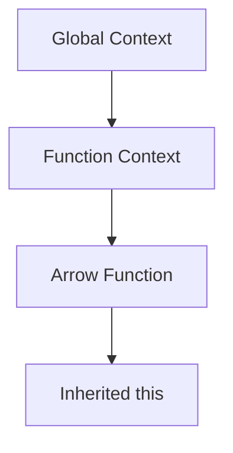

## 11.4 `this` in Arrow Functions

In the world of JavaScript, understanding the `this` keyword is crucial for mastering the language. The introduction of arrow functions in ES6 brought a significant change to how `this` is handled, making it easier for developers to manage context. In this section, we will explore how arrow functions handle the `this` keyword, the concept of lexical scoping, and the practical implications of using arrow functions in various scenarios.

### Understanding `this` in JavaScript

Before diving into arrow functions, let's briefly revisit the concept of `this` in JavaScript. The `this` keyword refers to the object that is executing the current function. Its value is determined by how a function is called, not where it is defined. This dynamic nature of `this` can sometimes lead to confusion, especially for beginners.

### Arrow Functions and `this`

Arrow functions, introduced in ES6, provide a more concise syntax for writing functions. One of their most notable features is how they handle the `this` keyword. Unlike traditional functions, arrow functions do not have their own `this` binding. Instead, they inherit `this` from the surrounding lexical context. This behavior is known as lexical scoping.

#### Lexical Scoping Explained

Lexical scoping means that the value of `this` in an arrow function is determined by the context in which the arrow function is defined, not where it is called. This is different from traditional functions, where `this` is determined by the call site.

**Example: Lexical Scoping in Arrow Functions**

```javascript
function Person(name) {
  this.name = name;
  this.sayName = () => {
    console.log(this.name);
  };
}

const john = new Person('John');
john.sayName(); // Output: John
```

In this example, the arrow function `sayName` inherits `this` from the `Person` function's context, which is the instance of `Person` created with `new Person('John')`.

### Comparing Arrow Functions with Traditional Functions

To fully grasp the differences in `this` behavior, let's compare arrow functions with traditional functions through examples.

#### Traditional Function Example

```javascript
function Person(name) {
  this.name = name;
  this.sayName = function() {
    console.log(this.name);
  };
}

const jane = new Person('Jane');
jane.sayName(); // Output: Jane

const sayNameFunction = jane.sayName;
sayNameFunction(); // Output: undefined (or error in strict mode)
```

In the traditional function example, when `sayNameFunction` is called outside the context of `jane`, `this` is not bound to `jane`, resulting in `undefined`.

#### Arrow Function Example

```javascript
function Person(name) {
  this.name = name;
  this.sayName = () => {
    console.log(this.name);
  };
}

const jane = new Person('Jane');
jane.sayName(); // Output: Jane

const sayNameArrow = jane.sayName;
sayNameArrow(); // Output: Jane
```

In the arrow function example, `sayNameArrow` retains the `this` value from the `Person` context, even when called outside of it.

### Practical Implications of Arrow Functions

Arrow functions are particularly useful in scenarios where maintaining the correct `this` context is challenging, such as in event handlers and callbacks.

#### Arrow Functions in Event Handlers

When using traditional functions in event handlers, you often need to use `bind` to ensure the correct `this` context.

**Traditional Function in Event Handler**

```javascript
function Button() {
  this.label = 'Click me';
  this.handleClick = function() {
    console.log(this.label);
  };
}

const button = new Button();
document.querySelector('button').addEventListener('click', button.handleClick.bind(button));
```

In this example, `bind` is used to ensure `this` refers to the `button` instance.

**Arrow Function in Event Handler**

```javascript
function Button() {
  this.label = 'Click me';
  this.handleClick = () => {
    console.log(this.label);
  };
}

const button = new Button();
document.querySelector('button').addEventListener('click', button.handleClick);
```

With an arrow function, there's no need for `bind` because `this` is lexically scoped.

#### Arrow Functions in Callbacks

Arrow functions simplify the use of callbacks, especially when dealing with asynchronous operations.

**Traditional Function in Callback**

```javascript
function Timer() {
  this.seconds = 0;
  setInterval(function() {
    this.seconds++;
    console.log(this.seconds);
  }.bind(this), 1000);
}

const timer = new Timer();
```

**Arrow Function in Callback**

```javascript
function Timer() {
  this.seconds = 0;
  setInterval(() => {
    this.seconds++;
    console.log(this.seconds);
  }, 1000);
}

const timer = new Timer();
```

In the arrow function example, `this` automatically refers to the `Timer` instance, eliminating the need for `bind`.

### Try It Yourself

To solidify your understanding, try modifying the examples above. Change the context where functions are called and observe how `this` behaves differently in arrow functions compared to traditional functions. Experiment with different scenarios, such as nested functions or methods within objects.

### Visualizing Lexical Scoping

To better understand how lexical scoping works with arrow functions, let's visualize it with a diagram.



**Diagram Explanation**: This diagram illustrates how an arrow function inherits `this` from its surrounding function context, rather than having its own `this` binding.

### Key Takeaways

- **Arrow functions do not have their own `this` binding**. They inherit `this` from the surrounding lexical context.
- **Lexical scoping** simplifies managing `this` in scenarios like event handlers and callbacks.
- **Arrow functions reduce the need for `bind`**, making code cleaner and more readable.
- **Experiment with code examples** to see how `this` behaves in different contexts.

### Further Reading

For more in-depth information on arrow functions and the `this` keyword, consider exploring the following resources:

- [MDN Web Docs: Arrow Functions](https://developer.mozilla.org/en-US/docs/Web/JavaScript/Reference/Functions/Arrow_functions)
- [JavaScript.info: Arrow Functions](https://javascript.info/arrow-functions-basics)

### Embrace the Journey

Remember, understanding `this` in JavaScript is a journey. As you continue to explore and experiment, you'll gain confidence in using arrow functions effectively. Keep practicing, stay curious, and enjoy the process of mastering JavaScript!

## Quiz Time!



### What is a key feature of arrow functions regarding the `this` keyword?

- [x] Arrow functions do not have their own `this` binding.
- [ ] Arrow functions always bind `this` to the global object.
- [ ] Arrow functions create a new `this` context.
- [ ] Arrow functions require `bind` to set `this`.

> **Explanation:** Arrow functions inherit `this` from the surrounding lexical context, unlike traditional functions that have their own `this` binding.

### How does `this` behave in arrow functions?

- [x] `this` is lexically scoped in arrow functions.
- [ ] `this` is dynamically scoped in arrow functions.
- [ ] `this` is always undefined in arrow functions.
- [ ] `this` is bound to the window object in arrow functions.

> **Explanation:** In arrow functions, `this` is lexically scoped, meaning it takes the value from the surrounding context where the function is defined.

### What is the main advantage of using arrow functions in event handlers?

- [x] Arrow functions automatically bind `this` to the surrounding context.
- [ ] Arrow functions require less memory than traditional functions.
- [ ] Arrow functions can only be used with DOM elements.
- [ ] Arrow functions are faster than traditional functions.

> **Explanation:** Arrow functions automatically bind `this` to the surrounding context, eliminating the need for `bind` in event handlers.

### In which scenario is `bind` unnecessary when using arrow functions?

- [x] When using arrow functions as callbacks.
- [ ] When defining methods in objects.
- [ ] When using arrow functions as constructors.
- [ ] When using arrow functions in global scope.

> **Explanation:** Arrow functions automatically inherit `this` from the surrounding context, making `bind` unnecessary when used as callbacks.

### What happens to `this` in an arrow function defined inside a traditional function?

- [x] `this` is inherited from the traditional function's context.
- [ ] `this` is undefined.
- [ ] `this` is bound to the global object.
- [ ] `this` is created anew for the arrow function.

> **Explanation:** An arrow function inherits `this` from the traditional function's context in which it is defined.

### How does `this` behave in a traditional function compared to an arrow function?

- [x] Traditional functions have their own `this` binding, while arrow functions do not.
- [ ] Both traditional and arrow functions have their own `this` binding.
- [ ] Traditional functions inherit `this` from the surrounding context.
- [ ] Arrow functions bind `this` to the global object.

> **Explanation:** Traditional functions have their own `this` binding, while arrow functions inherit `this` from the surrounding context.

### What is the output of the following code?

```javascript
function Car() {
  this.speed = 100;
  setTimeout(() => {
    console.log(this.speed);
  }, 1000);
}

const myCar = new Car();
```

- [x] 100
- [ ] undefined
- [ ] 0
- [ ] Error

> **Explanation:** The arrow function inside `setTimeout` inherits `this` from the `Car` function context, where `this.speed` is 100.

### Why are arrow functions not suitable for use as constructors?

- [x] Arrow functions do not have their own `this` binding.
- [ ] Arrow functions are slower than traditional functions.
- [ ] Arrow functions cannot return objects.
- [ ] Arrow functions do not support parameters.

> **Explanation:** Arrow functions do not have their own `this` binding, making them unsuitable for use as constructors.

### What is a common use case for arrow functions?

- [x] Simplifying callbacks and event handlers.
- [ ] Creating new objects.
- [ ] Defining global variables.
- [ ] Performing complex calculations.

> **Explanation:** Arrow functions simplify callbacks and event handlers by automatically binding `this` to the surrounding context.

### True or False: Arrow functions have their own `this` binding.

- [ ] True
- [x] False

> **Explanation:** False. Arrow functions do not have their own `this` binding; they inherit `this` from the surrounding lexical context.


