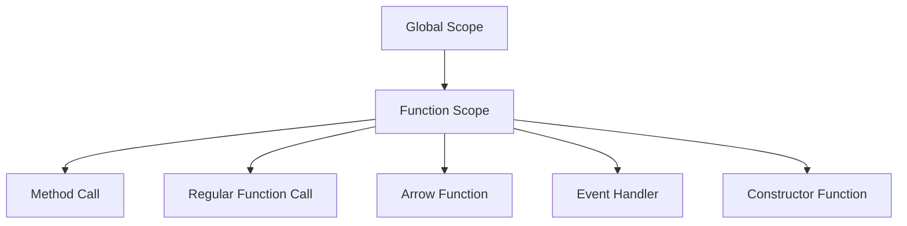

## 11.5 Common Pitfalls with `this`

In JavaScript, the `this` keyword is a powerful feature that allows functions to have a context. However, it can also be a source of confusion and bugs, especially for beginners. In this section, we'll explore common pitfalls associated with `this`, provide guidance on recognizing and fixing context issues, and offer tips for writing code that minimizes confusion. Let's dive in!

### Understanding `this`

Before we delve into the pitfalls, let's quickly recap what `this` is. In JavaScript, `this` refers to the object that is executing the current function. The value of `this` is determined by how a function is called, not where it is defined. This can lead to unexpected behavior if not handled carefully.

### Common Pitfalls with `this`

#### 1. Losing `this` in Callbacks

One of the most common pitfalls is losing the intended context of `this` when using callbacks. When a method is passed as a callback, the context of `this` can change unexpectedly.

```javascript
const person = {
  name: 'Alice',
  greet() {
    console.log(`Hello, my name is ${this.name}`);
  }
};

setTimeout(person.greet, 1000); // Output: Hello, my name is undefined
```

**Explanation:** In the example above, `setTimeout` calls `person.greet` as a regular function, not as a method of `person`. As a result, `this` is not bound to `person`, and `this.name` is `undefined`.

**Solution:** Use `bind` to explicitly set the context of `this`.

```javascript
setTimeout(person.greet.bind(person), 1000); // Output: Hello, my name is Alice
```

#### 2. Arrow Functions and Lexical `this`

Arrow functions do not have their own `this` context; they inherit `this` from the surrounding lexical scope. This behavior can be both beneficial and problematic.

```javascript
function Timer() {
  this.seconds = 0;
  setInterval(() => {
    this.seconds++;
    console.log(this.seconds);
  }, 1000);
}

const timer = new Timer();
```

**Explanation:** In the example above, the arrow function inside `setInterval` inherits `this` from the `Timer` function, allowing it to access `this.seconds`.

**Pitfall:** If you mistakenly use a regular function instead of an arrow function, `this` will be `undefined` or refer to the global object.

**Solution:** Use arrow functions when you need to maintain the lexical context of `this`.

#### 3. Method Borrowing

Method borrowing involves using a method from one object in the context of another. This can lead to unexpected `this` values if not handled correctly.

```javascript
const person1 = {
  name: 'Bob',
  greet() {
    console.log(`Hello, my name is ${this.name}`);
  }
};

const person2 = {
  name: 'Charlie'
};

person2.greet = person1.greet;
person2.greet(); // Output: Hello, my name is Charlie
```

**Explanation:** In the example above, `person2` borrows the `greet` method from `person1`. When `person2.greet()` is called, `this` refers to `person2`, not `person1`.

**Solution:** Ensure that the method is called in the correct context.

#### 4. `this` in Event Handlers

In event handlers, `this` often refers to the element that triggered the event. This behavior can be confusing when trying to access properties of the object that registered the event.

```javascript
const button = document.querySelector('button');

button.addEventListener('click', function() {
  console.log(this); // Output: <button> element
});
```

**Explanation:** In the example above, `this` refers to the button element, not any surrounding object.

**Solution:** Use arrow functions or `bind` to maintain the desired context.

```javascript
button.addEventListener('click', () => {
  console.log(this); // Output: desired context
});
```

#### 5. `this` in Constructor Functions

In constructor functions, `this` refers to the newly created object. However, if you forget to use the `new` keyword, `this` will refer to the global object or be `undefined` in strict mode.

```javascript
function Person(name) {
  this.name = name;
}

const person = Person('David'); // Forgot 'new'
console.log(person); // Output: undefined
console.log(window.name); // Output: David (in non-strict mode)
```

**Solution:** Always use the `new` keyword when calling constructor functions.

```javascript
const person = new Person('David');
```

### Debugging Techniques for `this`

Debugging `this` can be challenging, but there are several techniques and tools that can help:

1. **Use Console Logging:** Insert `console.log(this)` statements to inspect the value of `this` at different points in your code.

2. **Use Breakpoints:** Set breakpoints in your browser's developer tools to pause execution and examine the context of `this`.

3. **Use Strict Mode:** Enable strict mode by adding `"use strict";` at the top of your script. This can help catch errors related to `this`, such as using it in a function without a proper context.

4. **Use `bind`, `call`, and `apply`:** These methods allow you to explicitly set the value of `this` and can be useful for debugging and fixing context issues.

### Writing Code to Minimize Confusion with `this`

To avoid common pitfalls with `this`, consider the following best practices:

- **Use Arrow Functions:** When appropriate, use arrow functions to maintain the lexical context of `this`.

- **Use `bind`:** Use `bind` to explicitly set the context of `this` when passing methods as callbacks.

- **Avoid Nested Functions:** Avoid nesting functions that require different `this` contexts. Instead, use arrow functions or `bind`.

- **Use Descriptive Variable Names:** Use descriptive variable names to make it clear what `this` should refer to.

- **Document Your Code:** Include comments and documentation to explain the intended context of `this`.

### Visualizing `this` in JavaScript

To better understand how `this` works in different contexts, let's visualize the concept using a scope chain diagram.



**Diagram Explanation:** This diagram illustrates how `this` can have different values depending on the context in which a function is called. Understanding these contexts is key to avoiding common pitfalls.

### Try It Yourself

Experiment with the code examples provided in this section. Try modifying them to see how changes affect the value of `this`. For example, replace arrow functions with regular functions and observe the behavior. This hands-on practice will help solidify your understanding of `this`.

### Knowledge Check

- What happens to `this` when a method is passed as a callback?
- How can arrow functions help maintain the context of `this`?
- What is the difference between `bind`, `call`, and `apply`?
- How does strict mode affect the behavior of `this`?

### Conclusion

Understanding the `this` keyword and its common pitfalls is crucial for writing effective JavaScript code. By recognizing context issues, using debugging techniques, and following best practices, you can avoid many of the common errors associated with `this`. Remember, practice makes perfect. Keep experimenting, stay curious, and enjoy the journey!

## Quiz Time!



### What is a common pitfall when using `this` in callbacks?

- [x] Losing the intended context of `this`
- [ ] `this` always refers to the global object
- [ ] `this` is undefined in all callbacks
- [ ] `this` automatically binds to the nearest object

> **Explanation:** When a method is passed as a callback, the context of `this` can change unexpectedly, leading to losing the intended context.

### How can you maintain the context of `this` in a callback?

- [x] Use the `bind` method
- [ ] Use the `apply` method
- [ ] Use the `call` method
- [ ] Use a regular function

> **Explanation:** The `bind` method can be used to explicitly set the context of `this` in a callback.

### What does an arrow function do with `this`?

- [x] Inherits `this` from the surrounding lexical scope
- [ ] Creates a new `this` context
- [ ] Always binds `this` to the global object
- [ ] Makes `this` undefined

> **Explanation:** Arrow functions do not have their own `this` context; they inherit `this` from the surrounding lexical scope.

### What happens if you forget to use `new` with a constructor function?

- [x] `this` refers to the global object or is undefined in strict mode
- [ ] `this` automatically binds to the constructor
- [ ] `this` becomes null
- [ ] `this` refers to the previous object

> **Explanation:** Without `new`, `this` refers to the global object or is undefined in strict mode, leading to unexpected behavior.

### What is the purpose of the `bind` method?

- [x] To set the context of `this` explicitly
- [ ] To call a function immediately
- [ ] To apply a function to an array of arguments
- [ ] To create a new function with a different name

> **Explanation:** The `bind` method is used to explicitly set the context of `this` for a function.

### In event handlers, what does `this` typically refer to?

- [x] The element that triggered the event
- [ ] The global object
- [ ] The parent object
- [ ] The window object

> **Explanation:** In event handlers, `this` typically refers to the element that triggered the event.

### How can you avoid losing `this` in nested functions?

- [x] Use arrow functions
- [ ] Use regular functions
- [ ] Use global variables
- [ ] Use `apply` method

> **Explanation:** Arrow functions can help maintain the lexical context of `this`, avoiding loss in nested functions.

### What is a benefit of using strict mode with `this`?

- [x] It helps catch errors related to `this`
- [ ] It makes `this` always refer to the global object
- [ ] It prevents `this` from being used
- [ ] It automatically binds `this` to functions

> **Explanation:** Strict mode can help catch errors related to `this`, such as using it in a function without a proper context.

### What is a common mistake when using `this` in method borrowing?

- [x] Assuming `this` will refer to the original object
- [ ] Forgetting to define the method
- [ ] Using `this` in a global context
- [ ] Not using `this` at all

> **Explanation:** A common mistake is assuming `this` will refer to the original object when borrowing methods.

### True or False: Arrow functions always create a new `this` context.

- [ ] True
- [x] False

> **Explanation:** False. Arrow functions do not create a new `this` context; they inherit `this` from the surrounding lexical scope.


