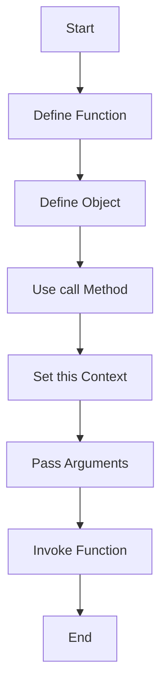

## 12.1 The `call` Method

Welcome to an exciting journey into the world of JavaScript functions! In this section, we'll dive deep into the `call` method, a powerful tool that allows us to invoke functions with a specific `this` value and pass arguments individually. Understanding `call` is essential for mastering JavaScript's function manipulation capabilities, and it opens up a world of possibilities for writing flexible and reusable code.

### Understanding the `call` Method

The `call` method is a built-in JavaScript function that allows you to call a function with a specified `this` value and arguments. This method is particularly useful when you want to control the context (`this` value) in which a function is executed. Let's break down the syntax and explore how `call` works.

#### Syntax of the `call` Method

The syntax for the `call` method is straightforward:

```javascript
functionName.call(thisArg, arg1, arg2, ..., argN);
```

- **`functionName`**: The function you want to invoke.
- **`thisArg`**: The value you want to use as `this` when executing the function.
- **`arg1, arg2, ..., argN`**: The arguments you want to pass to the function.

#### Key Points to Remember

- The `thisArg` can be any value, including `null` or `undefined`. If you pass `null` or `undefined`, the global object (or `window` in browsers) is used as the `this` value.
- The `call` method immediately invokes the function with the specified `this` value and arguments.

### Using `call` to Set `this` and Pass Arguments

Let's explore some examples to see how the `call` method can be used to set `this` and pass arguments.

#### Example 1: Changing the Context of `this`

Consider the following example where we have a simple function that logs a greeting message:

```javascript
function greet() {
    console.log(`Hello, my name is ${this.name}`);
}

const person1 = { name: 'Alice' };
const person2 = { name: 'Bob' };

// Using call to set `this` to person1
greet.call(person1); // Output: Hello, my name is Alice

// Using call to set `this` to person2
greet.call(person2); // Output: Hello, my name is Bob
```

In this example, we use the `call` method to change the context of `this` within the `greet` function. By passing `person1` and `person2` as the `thisArg`, we can control which object's `name` property is accessed.

#### Example 2: Passing Arguments with `call`

The `call` method also allows us to pass arguments to the function. Let's modify our previous example to include a greeting message:

```javascript
function greet(greeting) {
    console.log(`${greeting}, my name is ${this.name}`);
}

const person1 = { name: 'Alice' };
const person2 = { name: 'Bob' };

// Using call to set `this` and pass an argument
greet.call(person1, 'Hi'); // Output: Hi, my name is Alice
greet.call(person2, 'Hello'); // Output: Hello, my name is Bob
```

Here, we pass a greeting message as an argument to the `greet` function using the `call` method. This demonstrates how `call` can be used to both set `this` and pass additional arguments.

### Scenarios Where `call` is Useful

The `call` method is particularly useful in several scenarios. Let's explore some common use cases.

#### Use Case 1: Borrowing Methods

One of the most powerful features of `call` is its ability to borrow methods from one object and use them with another. This is especially useful when you want to reuse a method without duplicating code.

```javascript
const person1 = {
    name: 'Alice',
    introduce: function() {
        console.log(`Hi, I'm ${this.name}`);
    }
};

const person2 = { name: 'Bob' };

// Borrowing the introduce method from person1
person1.introduce.call(person2); // Output: Hi, I'm Bob
```

In this example, we borrow the `introduce` method from `person1` and use it with `person2`. By using `call`, we can execute the method in the context of `person2`, allowing us to reuse the method without copying it.

#### Use Case 2: Working with Arrays

The `call` method can also be used to work with arrays in interesting ways. For example, you can use `call` to convert an array-like object into a real array.

```javascript
function sum() {
    const args = Array.prototype.slice.call(arguments);
    return args.reduce((total, num) => total + num, 0);
}

console.log(sum(1, 2, 3)); // Output: 6
```

In this example, we use `call` to convert the `arguments` object (which is array-like) into a real array. This allows us to use array methods like `reduce` to calculate the sum of the arguments.

### Potential Pitfalls and How to Avoid Them

While the `call` method is powerful, there are some potential pitfalls to be aware of. Let's discuss these pitfalls and how to avoid them.

#### Pitfall 1: Losing `this` Context

One common issue is losing the `this` context when passing functions as arguments. This can happen if a function is called without the correct context.

```javascript
const person = {
    name: 'Alice',
    introduce: function() {
        console.log(`Hi, I'm ${this.name}`);
    }
};

const introduce = person.introduce;
introduce(); // Output: Hi, I'm undefined
```

In this example, the `introduce` function is called without a context, resulting in `this` being `undefined`. To avoid this, you can use `call` to explicitly set the context:

```javascript
introduce.call(person); // Output: Hi, I'm Alice
```

#### Pitfall 2: Overusing `call`

While `call` is useful, overusing it can lead to code that is difficult to read and maintain. It's important to use `call` judiciously and only when necessary.

#### Pitfall 3: Performance Considerations

Using `call` can have performance implications, especially in performance-critical code. It's important to profile your code and ensure that using `call` doesn't introduce unnecessary overhead.

### Visualizing the `call` Method

To better understand how the `call` method works, let's visualize the process using a flowchart.



**Figure 1: Flowchart of the `call` Method**

This flowchart illustrates the process of using the `call` method to invoke a function with a specific `this` context and arguments. By following these steps, you can effectively use `call` to control function execution.

### Try It Yourself

Now that we've explored the `call` method, it's time to try it yourself! Here are some exercises to help you practice using `call`.

1. **Exercise 1**: Create a function that logs a message using `this.name`. Use `call` to invoke the function with different objects.

2. **Exercise 2**: Write a function that calculates the sum of numbers. Use `call` to convert the `arguments` object into an array and calculate the sum.

3. **Exercise 3**: Borrow a method from one object and use it with another object. Use `call` to set the correct `this` context.

### References and Further Reading

- [MDN Web Docs: Function.prototype.call()](https://developer.mozilla.org/en-US/docs/Web/JavaScript/Reference/Global_Objects/Function/call)
- [W3Schools: JavaScript Function call()](https://www.w3schools.com/js/js_function_call.asp)

### Knowledge Check

Let's review what we've learned about the `call` method. Here are some key takeaways:

- The `call` method allows you to invoke a function with a specific `this` value and arguments.
- You can use `call` to borrow methods from one object and use them with another.
- Be mindful of potential pitfalls, such as losing `this` context and overusing `call`.

### Embrace the Journey

Remember, mastering JavaScript functions is a journey. As you continue to explore the language, you'll discover new ways to use `call` and other function methods to write powerful and flexible code. Keep experimenting, stay curious, and enjoy the journey!

## Quiz Time!



### What does the `call` method do in JavaScript?

- [x] Invokes a function with a specific `this` value and arguments
- [ ] Declares a new function
- [ ] Creates a new object
- [ ] Changes the prototype of an object

> **Explanation:** The `call` method is used to invoke a function with a specified `this` value and arguments.

### Which of the following is a correct syntax for using the `call` method?

- [x] `functionName.call(thisArg, arg1, arg2)`
- [ ] `functionName.call(arg1, arg2, thisArg)`
- [ ] `functionName(thisArg, arg1, arg2)`
- [ ] `functionName.call(thisArg)`

> **Explanation:** The correct syntax for using the `call` method is `functionName.call(thisArg, arg1, arg2)`.

### What happens if you pass `null` as the `thisArg` in the `call` method?

- [x] The global object is used as `this`
- [ ] An error is thrown
- [ ] `this` becomes `null`
- [ ] The function is not invoked

> **Explanation:** If `null` is passed as the `thisArg`, the global object is used as `this`.

### How can you use the `call` method to borrow a method from one object and use it with another?

- [x] By setting the `thisArg` to the object you want to use
- [ ] By copying the method to the other object
- [ ] By using the `new` keyword
- [ ] By using the `apply` method

> **Explanation:** You can borrow a method by setting the `thisArg` to the object you want to use with the `call` method.

### What is a potential pitfall of using the `call` method?

- [x] Losing the `this` context
- [ ] Creating infinite loops
- [ ] Declaring global variables
- [ ] Changing the function's prototype

> **Explanation:** A common pitfall is losing the `this` context when using the `call` method.

### When should you avoid using the `call` method?

- [x] When it leads to code that is difficult to read and maintain
- [ ] When you want to change the function's prototype
- [ ] When you need to declare a new function
- [ ] When you want to create a new object

> **Explanation:** Avoid using `call` if it makes the code difficult to read and maintain.

### What is the result of using `call` with an array-like object?

- [x] It can convert the object into a real array
- [ ] It throws an error
- [ ] It creates a new object
- [ ] It changes the object's prototype

> **Explanation:** Using `call` with an array-like object can convert it into a real array.

### Which method can be used to explicitly set the `this` context of a function?

- [x] `call`
- [ ] `bind`
- [ ] `apply`
- [ ] `new`

> **Explanation:** The `call` method can be used to explicitly set the `this` context of a function.

### What is the purpose of passing arguments to the `call` method?

- [x] To provide arguments to the function being invoked
- [ ] To change the function's prototype
- [ ] To create a new function
- [ ] To declare global variables

> **Explanation:** Passing arguments to the `call` method provides arguments to the function being invoked.

### True or False: The `call` method can only be used with functions that have a `this` keyword.

- [x] True
- [ ] False

> **Explanation:** The `call` method is specifically used to invoke functions with a specific `this` value, so it is relevant for functions that use `this`.


