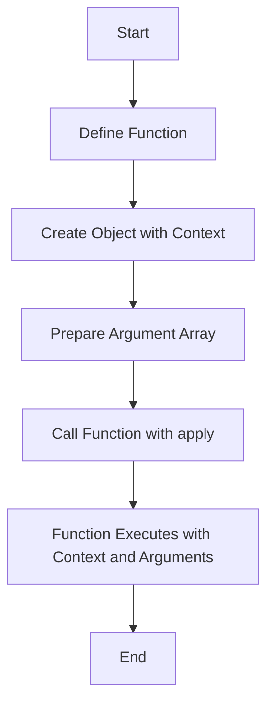

## 12.2 The `apply` Method

In the world of JavaScript, understanding how to manipulate the context in which a function is executed is a powerful skill. The `apply` method is one of the tools that allows us to do just that. It provides a way to call a function with a specified `this` value and arguments provided as an array. In this section, we will explore the `apply` method in detail, compare it with the `call` method, and discuss practical applications and performance considerations.

### Understanding `apply` and `call`

Before diving into the `apply` method, it's important to understand its sibling, the `call` method. Both `call` and `apply` are used to invoke functions with a specific `this` context. The primary difference between them lies in how they handle arguments.

- **`call` Method**: Invokes a function with a specified `this` value and arguments provided individually.
- **`apply` Method**: Invokes a function with a specified `this` value and arguments provided as an array.

Here's a simple comparison to illustrate the difference:

```javascript
function greet(greeting, punctuation) {
  console.log(`${greeting}, ${this.name}${punctuation}`);
}

const person = { name: 'Alice' };

// Using call
greet.call(person, 'Hello', '!'); // Output: Hello, Alice!

// Using apply
greet.apply(person, ['Hello', '!']); // Output: Hello, Alice!
```

In the example above, both `call` and `apply` achieve the same result, but the way we pass arguments differs. `call` takes arguments individually, while `apply` takes them as an array.

### Using `apply` with Argument Arrays

The `apply` method is particularly useful when you have an array of arguments that you want to pass to a function. This can be more convenient than using `call` when dealing with arrays.

#### Example: Using `apply` with Math Functions

One common use case for `apply` is with Math functions like `Math.max` or `Math.min`, which do not accept arrays directly. Instead, they require individual arguments. Here's how `apply` can be used to find the maximum value in an array:

```javascript
const numbers = [5, 6, 2, 3, 7];

// Using apply to find the maximum value
const max = Math.max.apply(null, numbers);
console.log(max); // Output: 7
```

In this example, `Math.max` is called with `null` as the `this` value (since it doesn't use `this`), and the `numbers` array is passed as the second argument. The `apply` method spreads the array elements as individual arguments to `Math.max`.

#### Practical Example: Merging Arrays

Another practical use of `apply` is in array manipulation, such as merging arrays. While modern JavaScript provides the `spread` operator for this purpose, `apply` can be used in environments where the spread operator is not available.

```javascript
const array1 = [1, 2, 3];
const array2 = [4, 5, 6];

// Merging arrays using apply
Array.prototype.push.apply(array1, array2);

console.log(array1); // Output: [1, 2, 3, 4, 5, 6]
```

In this example, `apply` is used to push all elements of `array2` into `array1`. The `push` method is called with `array1` as the `this` value, and `array2` is passed as an array of arguments.

### Performance Considerations

While `apply` is a powerful tool, it's important to consider performance implications, especially when dealing with large arrays. The `apply` method can lead to performance issues if the array of arguments is very large, as it effectively spreads the array into individual arguments.

#### Example: Performance with Large Arrays

```javascript
const largeArray = new Array(1000000).fill(1);

// Using apply with a large array
const sum = largeArray.reduce((acc, val) => acc + val, 0);

console.log(sum); // Output: 1000000
```

In this example, using `apply` with a large array could potentially lead to a stack overflow error due to the large number of arguments being passed. It's generally advisable to use methods like `reduce` or `forEach` for operations on large arrays, as they are optimized for such use cases.

### Try It Yourself

Now that we've explored the `apply` method, let's put it into practice. Try modifying the examples above to experiment with different scenarios:

1. **Modify the `greet` Function**: Change the `greet` function to include more parameters, and use `apply` to pass an array of arguments.
2. **Find the Minimum Value**: Use `apply` with `Math.min` to find the minimum value in an array.
3. **Merge More Arrays**: Extend the array merging example to merge three or more arrays using `apply`.

### Visualizing the `apply` Method

To better understand how the `apply` method works, let's visualize the process using a flowchart. This diagram illustrates the steps involved in using `apply` to call a function with a specific `this` context and an array of arguments.



**Diagram Explanation**: This flowchart represents the process of using the `apply` method. We start by defining a function, creating an object to serve as the context, preparing an array of arguments, and then using `apply` to call the function. The function executes with the specified context and arguments, completing the process.

### References and Further Reading

To deepen your understanding of the `apply` method and its applications, consider exploring the following resources:

- [MDN Web Docs: Function.prototype.apply()](https://developer.mozilla.org/en-US/docs/Web/JavaScript/Reference/Global_Objects/Function/apply)
- [W3Schools: JavaScript Function apply()](https://www.w3schools.com/js/js_function_apply.asp)

### Knowledge Check

Let's reinforce what we've learned about the `apply` method with a few questions and exercises:

1. **What is the primary difference between `call` and `apply`?**
2. **How can `apply` be used to find the maximum value in an array?**
3. **What are some performance considerations when using `apply` with large arrays?**

### Embrace the Journey

Remember, mastering JavaScript functions and their methods is a journey. The `apply` method is a valuable tool in your toolkit, allowing you to manipulate function execution context and arguments with ease. As you continue to explore JavaScript, keep experimenting, stay curious, and enjoy the process of learning and discovery!

## Quiz Time!



### What is the primary difference between `call` and `apply`?

- [x] `call` takes arguments individually, while `apply` takes them as an array.
- [ ] `apply` takes arguments individually, while `call` takes them as an array.
- [ ] `call` and `apply` are identical in functionality.
- [ ] `apply` is used only for asynchronous functions.

> **Explanation:** The primary difference is that `call` takes arguments individually, whereas `apply` takes them as an array.

### How can `apply` be used to find the maximum value in an array?

- [x] By passing the array as the second argument to `Math.max.apply`.
- [ ] By using `apply` with `Math.min`.
- [ ] By converting the array to a string and using `apply`.
- [ ] By using `apply` with `Array.prototype.concat`.

> **Explanation:** `apply` can be used with `Math.max` by passing the array as the second argument, spreading its elements as individual arguments.

### Which method is more suitable for operations on large arrays?

- [x] `reduce` or `forEach`
- [ ] `apply`
- [ ] `call`
- [ ] `bind`

> **Explanation:** `reduce` or `forEach` are more suitable for operations on large arrays as they are optimized for such use cases.

### What is a potential issue when using `apply` with large arrays?

- [x] Stack overflow error
- [ ] Memory leak
- [ ] Syntax error
- [ ] Type mismatch

> **Explanation:** Using `apply` with large arrays can lead to a stack overflow error due to the large number of arguments being passed.

### What does the `apply` method allow you to specify?

- [x] A `this` value and an array of arguments
- [ ] Only a `this` value
- [ ] Only an array of arguments
- [ ] Neither `this` value nor arguments

> **Explanation:** The `apply` method allows you to specify both a `this` value and an array of arguments.

### What is a common use case for the `apply` method?

- [x] Merging arrays
- [ ] Sorting arrays
- [ ] Filtering arrays
- [ ] Mapping arrays

> **Explanation:** A common use case for `apply` is merging arrays, especially when the spread operator is not available.

### How does `apply` handle the `this` value?

- [x] It allows you to specify the `this` value for the function call.
- [ ] It ignores the `this` value.
- [ ] It automatically binds the global object as `this`.
- [ ] It binds `this` to the function itself.

> **Explanation:** `apply` allows you to specify the `this` value for the function call, providing control over the execution context.

### What is the result of using `apply` with `Math.max` and an array of numbers?

- [x] The maximum value in the array
- [ ] The minimum value in the array
- [ ] The sum of the array elements
- [ ] The average of the array elements

> **Explanation:** Using `apply` with `Math.max` and an array of numbers results in the maximum value in the array.

### Which of the following is a valid use of `apply`?

- [x] `Math.max.apply(null, [1, 2, 3])`
- [ ] `Math.max.apply([1, 2, 3])`
- [ ] `Math.max.apply(null, 1, 2, 3)`
- [ ] `Math.max.apply([1, 2, 3], null)`

> **Explanation:** `Math.max.apply(null, [1, 2, 3])` is a valid use of `apply`, where `null` is the `this` value and `[1, 2, 3]` is the array of arguments.

### True or False: The `apply` method can only be used with built-in JavaScript functions.

- [ ] True
- [x] False

> **Explanation:** False. The `apply` method can be used with any function, not just built-in JavaScript functions.


