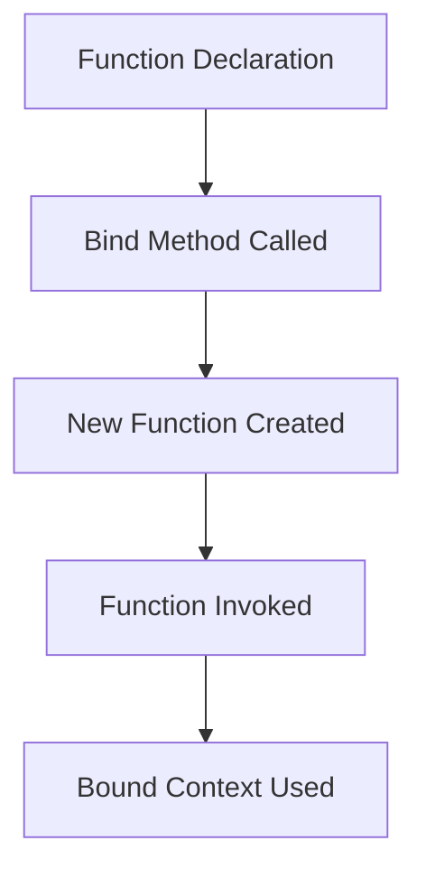

## 12.3 The `bind` Method

In the world of JavaScript, understanding how functions interact with the `this` keyword is crucial for writing effective and bug-free code. One of the powerful tools at your disposal for managing the `this` context is the `bind` method. In this section, we'll explore how `bind` works, how it differs from other methods like `call` and `apply`, and how you can use it to your advantage in various scenarios.

### Understanding the `bind` Method

The `bind` method in JavaScript is used to create a new function that, when called, has its `this` keyword set to a specified value. This is particularly useful when you want to ensure that a function maintains a specific context, regardless of how or where it is invoked.

#### How `bind` Works

The `bind` method returns a new function. This new function is a copy of the original function, but with a permanently bound `this` value. This means that the `this` value inside the function will always refer to the object you specify, no matter how the function is called.

Here's a simple example to illustrate the concept:

```javascript
const person = {
  name: 'Alice',
  greet: function() {
    console.log(`Hello, my name is ${this.name}`);
  }
};

const greet = person.greet;
greet(); // Output: Hello, my name is undefined

const boundGreet = person.greet.bind(person);
boundGreet(); // Output: Hello, my name is Alice
```

In this example, `greet` is a method of the `person` object. When we assign `greet` to a variable and call it, the `this` context is lost, resulting in `undefined`. However, by using `bind`, we create a new function `boundGreet` that always has `this` set to `person`, ensuring it works correctly.

### Using `bind` in Event Handlers and Callbacks

One of the most common use cases for `bind` is in event handlers and callbacks, where the `this` context can often be lost or changed.

#### Example: Event Handlers

Consider a scenario where you have a button, and you want to handle its click event using a method from an object:

```html
<button id="myButton">Click me</button>
```

```javascript
const buttonHandler = {
  message: 'Button clicked!',
  handleClick: function() {
    console.log(this.message);
  }
};

const button = document.getElementById('myButton');
button.addEventListener('click', buttonHandler.handleClick); // Output: undefined

button.addEventListener('click', buttonHandler.handleClick.bind(buttonHandler)); // Output: Button clicked!
```

In the first `addEventListener` call, `this` inside `handleClick` is not `buttonHandler`, leading to `undefined`. By using `bind`, we ensure that `this` always refers to `buttonHandler`, making the method work as expected.

#### Example: Callbacks

When passing methods as callbacks, the `this` context can also be lost. Here's how `bind` can help:

```javascript
const logger = {
  prefix: 'Log:',
  log: function(message) {
    console.log(`${this.prefix} ${message}`);
  }
};

function executeCallback(callback) {
  callback('This is a message');
}

executeCallback(logger.log); // Output: undefined This is a message
executeCallback(logger.log.bind(logger)); // Output: Log: This is a message
```

In this example, `executeCallback` is a function that takes a callback and executes it. Without `bind`, `this.prefix` is `undefined`. By binding `logger` to `log`, we ensure the correct context.

### Differences Between `call`, `apply`, and `bind`

While `call`, `apply`, and `bind` all allow you to set the `this` context, they serve different purposes and are used in different scenarios.

- **`call`**: Invokes a function with a specified `this` value and arguments provided individually.
- **`apply`**: Similar to `call`, but arguments are provided as an array.
- **`bind`**: Returns a new function with a specified `this` value, without invoking the function immediately.

#### Comparison Table

| Method | Invocation | Arguments | Returns |
|--------|------------|-----------|---------|
| `call` | Immediate  | Individually | Result of the function |
| `apply`| Immediate  | As an array  | Result of the function |
| `bind` | Deferred   | Individually | New function |

### Best Practices for Using `bind`

When using `bind`, consider the following best practices to ensure your code remains clean and efficient:

1. **Use `bind` for Event Handlers**: When attaching methods as event handlers, use `bind` to maintain the correct `this` context.

2. **Avoid Excessive Binding**: Binding creates a new function each time, which can lead to memory overhead. Bind functions only when necessary.

3. **Use Arrow Functions for Simple Cases**: For simple cases where you need to preserve `this`, consider using arrow functions, which lexically bind `this`.

4. **Be Mindful of Performance**: Binding can have performance implications, especially in performance-critical applications. Profile your code if necessary.

5. **Understand the Context**: Always be aware of what `this` refers to in your functions, and use `bind` to explicitly set it when needed.

### Visualizing Function Binding

To better understand how `bind` works, let's visualize the process using a flowchart:



**Caption**: This flowchart illustrates the process of using the `bind` method to create a new function with a bound context.

### Try It Yourself

Now that we've covered the basics of `bind`, let's try modifying some code to see how it works in practice. Take the following example and experiment with different bindings:

```javascript
const car = {
  brand: 'Toyota',
  getBrand: function() {
    console.log(this.brand);
  }
};

const getBrand = car.getBrand;
getBrand(); // Output: undefined

const boundGetBrand = car.getBrand.bind(car);
boundGetBrand(); // Output: Toyota
```

**Challenge**: Try binding `getBrand` to a different object with a `brand` property. What happens when you call the bound function?

### Further Reading

For more information on the `bind` method and related topics, consider exploring the following resources:

- [MDN Web Docs: Function.prototype.bind()](https://developer.mozilla.org/en-US/docs/Web/JavaScript/Reference/Global_Objects/Function/bind)
- [JavaScript.info: Bind, Call, and Apply](https://javascript.info/bind)
- [W3Schools: JavaScript Function bind()](https://www.w3schools.com/js/js_function_bind.asp)

### Knowledge Check

Before we wrap up, let's test your understanding of the `bind` method with a few questions:

1. What does the `bind` method return?
2. How does `bind` differ from `call` and `apply`?
3. Why is `bind` useful in event handlers?
4. What are some best practices for using `bind`?

### Embrace the Journey

Remember, mastering JavaScript's function methods is a journey. As you continue to explore and experiment with `bind`, you'll gain a deeper understanding of how functions and context work together. Keep practicing, stay curious, and enjoy the process of learning and growing as a developer!

## Quiz Time!



### What does the `bind` method return?

- [x] A new function with a bound `this` context
- [ ] The original function with a modified `this` context
- [ ] A reference to the `this` context
- [ ] An array of arguments

> **Explanation:** The `bind` method returns a new function where the `this` context is permanently set to the specified value.

### How does `bind` differ from `call` and `apply`?

- [x] `bind` returns a new function, while `call` and `apply` invoke the function immediately
- [ ] `bind` modifies the original function, while `call` and `apply` do not
- [ ] `bind` does not accept arguments, while `call` and `apply` do
- [ ] `bind` is used for asynchronous functions, while `call` and `apply` are not

> **Explanation:** `bind` creates a new function with a bound `this` context, whereas `call` and `apply` execute the function immediately with a specified `this` context.

### Why is `bind` useful in event handlers?

- [x] It ensures the correct `this` context is used when the event handler is called
- [ ] It allows multiple event handlers to be attached to the same event
- [ ] It automatically removes the event handler after execution
- [ ] It prevents the default action of the event

> **Explanation:** `bind` is useful in event handlers because it ensures that the `this` context inside the handler refers to the desired object, preventing context loss.

### What is a potential downside of using `bind` excessively?

- [x] It can lead to memory overhead due to the creation of new functions
- [ ] It can cause the `this` context to become undefined
- [ ] It prevents functions from being called asynchronously
- [ ] It makes functions immutable

> **Explanation:** Excessive use of `bind` can lead to memory overhead because each call to `bind` creates a new function.

### Which method is best for setting `this` context in simple cases?

- [x] Arrow functions
- [ ] `bind`
- [ ] `call`
- [ ] `apply`

> **Explanation:** Arrow functions lexically bind the `this` context, making them suitable for simple cases where context preservation is needed.

### What happens when you bind a function to a different object?

- [x] The `this` context inside the function refers to the new object
- [ ] The function is executed immediately with the new context
- [ ] The original function is modified to use the new context
- [ ] The function becomes a method of the new object

> **Explanation:** When you bind a function to a different object, the `this` context inside the function refers to the new object whenever the function is called.

### Can `bind` be used to pass arguments to a function?

- [x] Yes, `bind` can be used to pre-set arguments for the new function
- [ ] No, `bind` only sets the `this` context
- [ ] Yes, but only for asynchronous functions
- [ ] No, `bind` is not compatible with arguments

> **Explanation:** `bind` can be used to pre-set arguments for the new function, which will be passed when the function is called.

### What is the main purpose of the `bind` method?

- [x] To create a new function with a specific `this` context
- [ ] To execute a function with a specific `this` context
- [ ] To modify the original function's `this` context
- [ ] To prevent a function from being called

> **Explanation:** The main purpose of the `bind` method is to create a new function with a specific `this` context, ensuring consistent behavior.

### How does `bind` affect the original function?

- [x] It does not affect the original function; it creates a new one
- [ ] It modifies the original function's `this` context
- [ ] It deletes the original function
- [ ] It makes the original function asynchronous

> **Explanation:** `bind` does not affect the original function; it creates a new function with a bound `this` context.

### True or False: `bind` can be used to ensure a function always has the correct `this` context, regardless of how it is called.

- [x] True
- [ ] False

> **Explanation:** True. `bind` is used to ensure that a function always has the correct `this` context, regardless of how or where it is called.


