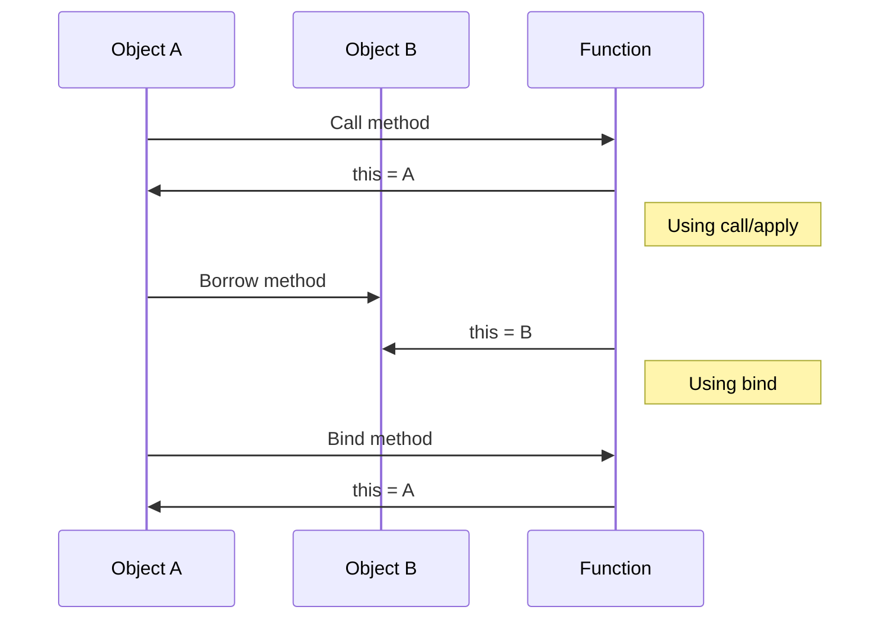

## 12.4 Practical Applications

In this section, we will explore the practical applications of JavaScript's function methods: `call`, `apply`, and `bind`. These methods are essential tools for managing function context and are particularly useful in solving common programming problems. We will also discuss the importance of context in asynchronous code and provide exercises to help you practice these concepts.

### Understanding Function Context

Before diving into practical applications, let's briefly revisit the concept of function context. In JavaScript, the context is represented by the `this` keyword, which refers to the object on which a function is invoked. The value of `this` can change depending on how a function is called, which makes understanding and controlling context crucial in JavaScript programming.

### The `call` Method

The `call` method allows you to invoke a function with a specified `this` value and individual arguments. This is particularly useful when you want to borrow methods from one object and use them with another.

#### Example: Borrowing Methods

Let's say we have two objects, `person1` and `person2`, each with a `fullName` method. We want to use the `fullName` method from `person1` with `person2`.

```javascript
const person1 = {
  firstName: 'John',
  lastName: 'Doe',
  fullName: function() {
    return `${this.firstName} ${this.lastName}`;
  }
};

const person2 = {
  firstName: 'Jane',
  lastName: 'Smith'
};

// Using call to borrow the fullName method
const fullNameOfPerson2 = person1.fullName.call(person2);
console.log(fullNameOfPerson2); // Output: Jane Smith
```

In this example, we use `call` to set the context of `person1.fullName` to `person2`, allowing us to use the method with `person2`'s properties.

### The `apply` Method

The `apply` method is similar to `call`, but it takes arguments as an array. This is useful when you have a function that requires multiple arguments and you want to pass them as an array.

#### Example: Using Math.max with Arrays

Suppose we have an array of numbers and we want to find the maximum value. The `Math.max` function can be used with `apply` to achieve this.

```javascript
const numbers = [5, 6, 2, 3, 7];

// Using apply to pass the array as arguments
const maxNumber = Math.max.apply(null, numbers);
console.log(maxNumber); // Output: 7
```

Here, `apply` is used to pass the `numbers` array to `Math.max`, which expects individual arguments.

### The `bind` Method

The `bind` method creates a new function with a specified `this` value and optional arguments. This is particularly useful for setting a fixed context for a function that will be called later.

#### Example: Event Handlers

In web development, event handlers often lose their intended context. The `bind` method can be used to ensure the correct context is maintained.

```javascript
const button = document.getElementById('myButton');

const user = {
  name: 'Alice',
  greet: function() {
    console.log(`Hello, ${this.name}!`);
  }
};

// Binding the greet method to the user object
const boundGreet = user.greet.bind(user);

button.addEventListener('click', boundGreet);
```

In this example, `bind` is used to ensure that `this` inside the `greet` method always refers to the `user` object, even when the method is used as an event handler.

### Importance of Context in Asynchronous Code

In asynchronous JavaScript, maintaining the correct context is crucial. Functions executed asynchronously, such as callbacks or promises, may not have the expected `this` value. Using `bind` can help maintain the intended context.

#### Example: Asynchronous Callbacks

Consider a scenario where we fetch data from an API and want to process it within a method of an object.

```javascript
const dataProcessor = {
  data: [],
  processData: function(data) {
    this.data = data;
    console.log('Data processed:', this.data);
  }
};

fetch('https://api.example.com/data')
  .then(response => response.json())
  .then(dataProcessor.processData.bind(dataProcessor))
  .catch(error => console.error('Error:', error));
```

Here, `bind` ensures that `this` inside `processData` refers to `dataProcessor`, even though `processData` is executed as a callback.

### Exercises for Practice

To reinforce your understanding of `call`, `apply`, and `bind`, try the following exercises:

1. **Exercise 1: Method Borrowing**
   - Create two objects with different properties.
   - Use `call` to borrow a method from one object and use it with the other.

2. **Exercise 2: Array Manipulation**
   - Use `apply` to find the minimum value in an array of numbers.

3. **Exercise 3: Event Handling**
   - Create a button on a webpage.
   - Use `bind` to ensure an event handler maintains the correct context.

4. **Exercise 4: Asynchronous Context**
   - Write a function that fetches data from an API and processes it within an object's method.
   - Use `bind` to maintain the correct context.

### Visualizing Context with Mermaid.js

To better understand how `call`, `apply`, and `bind` work, let's visualize the context switching using Mermaid.js.



This diagram illustrates how the `this` value changes when using `call`, `apply`, and `bind`.

### Key Takeaways

- **`call` and `apply`**: Use these methods to invoke functions with a specific `this` value. `call` takes arguments individually, while `apply` takes them as an array.
- **`bind`**: Use this method to create a new function with a fixed `this` value, useful for event handlers and asynchronous callbacks.
- **Context in Asynchronous Code**: Always ensure the correct context is maintained in asynchronous functions to avoid unexpected behavior.

### Embrace the Journey

Remember, mastering JavaScript's function methods is a journey. As you practice and experiment with `call`, `apply`, and `bind`, you'll gain confidence in managing function context. Keep exploring, stay curious, and enjoy the process of learning and applying these powerful tools in your programming projects.

## Quiz Time!



### What does the `call` method do in JavaScript?

- [x] Invokes a function with a specified `this` value and individual arguments
- [ ] Invokes a function with a specified `this` value and an array of arguments
- [ ] Creates a new function with a fixed `this` value
- [ ] Executes a function immediately after defining it

> **Explanation:** The `call` method is used to invoke a function with a specified `this` value and individual arguments.

### How does the `apply` method differ from `call`?

- [x] `apply` takes arguments as an array
- [ ] `apply` creates a new function with a fixed `this` value
- [ ] `apply` can only be used with asynchronous functions
- [ ] `apply` is used for method borrowing

> **Explanation:** The `apply` method is similar to `call`, but it takes arguments as an array, making it useful for functions that require multiple arguments.

### What is the primary use of the `bind` method?

- [x] To create a new function with a fixed `this` value
- [ ] To invoke a function with a specified `this` value and individual arguments
- [ ] To execute a function immediately after defining it
- [ ] To pass arguments as an array

> **Explanation:** The `bind` method is used to create a new function with a fixed `this` value, ensuring the correct context is maintained.

### Which method would you use to borrow a method from one object and use it with another?

- [x] `call`
- [ ] `apply`
- [ ] `bind`
- [ ] `new`

> **Explanation:** The `call` method is often used to borrow methods from one object and use them with another by specifying the `this` value.

### In which scenario is `bind` particularly useful?

- [x] When setting an event handler to maintain the correct context
- [ ] When finding the maximum value in an array
- [ ] When executing a function immediately after defining it
- [ ] When borrowing methods from another object

> **Explanation:** `bind` is particularly useful for setting event handlers to ensure the correct context is maintained.

### What does the following code do: `Math.max.apply(null, numbers)`?

- [x] Finds the maximum value in the `numbers` array
- [ ] Finds the minimum value in the `numbers` array
- [ ] Creates a new function with a fixed `this` value
- [ ] Executes a function immediately after defining it

> **Explanation:** `Math.max.apply(null, numbers)` uses `apply` to pass the `numbers` array as arguments to `Math.max`, finding the maximum value.

### Which method would you use to ensure a function maintains its context when used as a callback?

- [x] `bind`
- [ ] `call`
- [ ] `apply`
- [ ] `new`

> **Explanation:** The `bind` method is used to ensure a function maintains its context when used as a callback.

### What is the output of the following code?
```javascript
const obj = { name: 'Bob' };
function greet() { console.log(`Hello, ${this.name}`); }
greet.call(obj);
```

- [x] "Hello, Bob"
- [ ] "Hello, undefined"
- [ ] "Hello, "
- [ ] "Hello, name"

> **Explanation:** The `call` method sets `this` to `obj`, so `this.name` is "Bob".

### What is the purpose of using `bind` in asynchronous code?

- [x] To maintain the correct context for functions executed asynchronously
- [ ] To execute functions immediately after defining them
- [ ] To pass arguments as an array
- [ ] To find the maximum value in an array

> **Explanation:** `bind` is used in asynchronous code to maintain the correct context for functions executed asynchronously.

### True or False: The `apply` method can be used to execute a function immediately after defining it.

- [ ] True
- [x] False

> **Explanation:** The `apply` method is used to invoke a function with a specified `this` value and an array of arguments, not to execute a function immediately after defining it.


