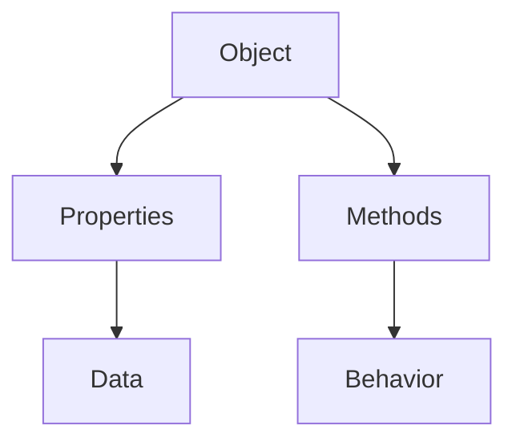

## 13.1 Defining Methods in Objects

In the journey of mastering JavaScript, understanding how to define methods within objects is a crucial step. Methods are functions associated with objects, and they play a vital role in object-oriented programming. In this section, we will explore how to define methods in objects using both ES5 and ES6 syntax, discuss the benefits of encapsulation, and provide practical examples to solidify your understanding.

### Understanding Methods in Objects

Before diving into the syntax, let's clarify what methods are. In JavaScript, a method is simply a function that is a property of an object. These methods can perform actions on the data contained within the object, making them essential for encapsulating behavior and data together.

#### Why Use Methods?

- **Encapsulation**: Methods allow you to bundle data (properties) and behavior (methods) together, promoting a modular and organized code structure.
- **Reusability**: Once a method is defined within an object, it can be reused across different instances of that object.
- **Maintainability**: Grouping related functions within objects makes the code easier to maintain and understand.

### Defining Methods in ES5

In ES5, methods are defined as properties of an object, where the property value is a function. Let's look at an example:

```javascript
// Define an object with a method in ES5
var car = {
  brand: "Toyota",
  model: "Corolla",
  year: 2020,
  startEngine: function() {
    console.log("The engine of the " + this.brand + " " + this.model + " is starting.");
  }
};

// Invoke the method
car.startEngine(); // Output: The engine of the Toyota Corolla is starting.
```

**Explanation**:
- The `car` object has properties `brand`, `model`, and `year`.
- The `startEngine` method is a function that uses the `this` keyword to access the object's properties.

#### Key Points:
- **`this` Keyword**: In methods, `this` refers to the object that owns the method. It is crucial for accessing other properties within the same object.
- **Function Expression**: In ES5, methods are typically defined using function expressions.

### Defining Methods in ES6

ES6 introduced a more concise syntax for defining methods within objects. This new syntax eliminates the need for the `function` keyword, making the code cleaner and more readable.

```javascript
// Define an object with a method in ES6
const car = {
  brand: "Toyota",
  model: "Corolla",
  year: 2020,
  startEngine() {
    console.log(`The engine of the ${this.brand} ${this.model} is starting.`);
  }
};

// Invoke the method
car.startEngine(); // Output: The engine of the Toyota Corolla is starting.
```

**Explanation**:
- The `startEngine` method is defined without the `function` keyword, making the syntax more concise.
- Template literals (backticks) are used for string interpolation, enhancing readability.

#### Key Points:
- **Concise Method Syntax**: ES6 allows defining methods without the `function` keyword.
- **Template Literals**: Use backticks (`) for easier string interpolation.

### Benefits of Using Methods in Objects

#### 1. Encapsulation

Encapsulation is a fundamental concept in object-oriented programming. By defining methods within objects, you encapsulate both data and behavior, creating a self-contained unit. This approach enhances code organization and readability.

#### 2. Code Reusability

Methods defined within objects can be reused across different instances. This reusability reduces redundancy and promotes DRY (Don't Repeat Yourself) principles.

#### 3. Improved Maintainability

Grouping related functions within objects makes the codebase easier to maintain. Changes to the object's behavior are localized, minimizing the risk of unintended side effects.

### Practical Examples

Let's explore some practical examples to see how methods can be defined and used within objects.

#### Example 1: A Simple Calculator

```javascript
// Define a calculator object
const calculator = {
  add(a, b) {
    return a + b;
  },
  subtract(a, b) {
    return a - b;
  },
  multiply(a, b) {
    return a * b;
  },
  divide(a, b) {
    if (b !== 0) {
      return a / b;
    } else {
      console.log("Error: Division by zero.");
      return null;
    }
  }
};

// Use the calculator methods
console.log(calculator.add(5, 3)); // Output: 8
console.log(calculator.divide(10, 2)); // Output: 5
console.log(calculator.divide(10, 0)); // Output: Error: Division by zero.
```

**Explanation**:
- The `calculator` object contains methods for basic arithmetic operations.
- The `divide` method includes error handling for division by zero.

#### Example 2: Managing a Library

```javascript
// Define a library object
const library = {
  books: [],
  addBook(title) {
    this.books.push(title);
    console.log(`Added "${title}" to the library.`);
  },
  listBooks() {
    console.log("Books in the library:");
    this.books.forEach((book, index) => {
      console.log(`${index + 1}. ${book}`);
    });
  }
};

// Use the library methods
library.addBook("JavaScript: The Good Parts");
library.addBook("Eloquent JavaScript");
library.listBooks();
```

**Explanation**:
- The `library` object manages a collection of books.
- The `addBook` method adds a new book to the collection.
- The `listBooks` method displays all books in the library.

### Visualizing Object Methods

To better understand how methods interact with objects, let's visualize the concept using a diagram.



**Diagram Explanation**:
- The object (`A`) contains both properties (`B`) and methods (`C`).
- Properties hold data (`D`), while methods define behavior (`E`).

### Try It Yourself

To reinforce your understanding, try modifying the examples above:

1. **Extend the Calculator**: Add a method to calculate the modulus of two numbers.
2. **Enhance the Library**: Implement a method to remove a book by title.

### References and Further Reading

For more information on JavaScript objects and methods, consider exploring the following resources:

- [MDN Web Docs: Working with Objects](https://developer.mozilla.org/en-US/docs/Web/JavaScript/Guide/Working_with_Objects)
- [W3Schools: JavaScript Objects](https://www.w3schools.com/js/js_objects.asp)

### Knowledge Check

Let's test your understanding with a few questions:

1. What is a method in JavaScript?
2. How does the `this` keyword function within a method?
3. What are the benefits of using methods within objects?

### Embrace the Journey

Remember, this is just the beginning. As you progress, you'll build more complex and interactive web pages. Keep experimenting, stay curious, and enjoy the journey!

## Quiz Time!



### What is a method in JavaScript?

- [x] A function that is a property of an object
- [ ] A variable declared inside a function
- [ ] A loop structure in JavaScript
- [ ] A type of JavaScript event

> **Explanation:** A method is a function that is associated with an object and can operate on the object's data.

### How do you define a method in an object using ES5 syntax?

- [x] By assigning a function to a property within the object
- [ ] By using the `class` keyword
- [ ] By declaring a function outside the object
- [ ] By using arrow functions

> **Explanation:** In ES5, methods are defined by assigning a function to a property within the object.

### What is the purpose of the `this` keyword in a method?

- [x] To refer to the object that owns the method
- [ ] To declare a new variable
- [ ] To create a new object
- [ ] To call another function

> **Explanation:** The `this` keyword is used within a method to refer to the object that owns the method.

### What is encapsulation in the context of object methods?

- [x] Bundling data and behavior together within an object
- [ ] Separating data from behavior
- [ ] Creating global variables
- [ ] Using loops to iterate over data

> **Explanation:** Encapsulation involves bundling data and behavior together within an object, promoting modularity and organization.

### How does ES6 improve method definition syntax?

- [x] By allowing methods to be defined without the `function` keyword
- [ ] By introducing the `var` keyword
- [ ] By requiring methods to be defined outside objects
- [ ] By removing the need for the `this` keyword

> **Explanation:** ES6 introduced a more concise syntax for defining methods without the `function` keyword.

### What is a benefit of using methods in objects?

- [x] Improved code organization and maintainability
- [ ] Increased complexity of the code
- [ ] Reduced reusability of functions
- [ ] More global variables

> **Explanation:** Methods in objects improve code organization and maintainability by encapsulating related functions.

### How can you access an object's property within a method?

- [x] Using the `this` keyword
- [ ] Using the `var` keyword
- [ ] Using a global variable
- [ ] Using an external library

> **Explanation:** The `this` keyword is used within a method to access the object's properties.

### What happens if you try to divide by zero in the calculator example?

- [x] An error message is logged, and `null` is returned
- [ ] The program crashes
- [ ] The method returns `Infinity`
- [ ] A new object is created

> **Explanation:** The `divide` method includes error handling for division by zero, logging an error message and returning `null`.

### What is the output of `car.startEngine()` in the ES6 example?

- [x] "The engine of the Toyota Corolla is starting."
- [ ] "The engine is starting."
- [ ] "Toyota Corolla"
- [ ] An error message

> **Explanation:** The `startEngine` method uses template literals to output the message with the car's brand and model.

### True or False: Methods can only be defined in ES6.

- [ ] True
- [x] False

> **Explanation:** Methods can be defined in both ES5 and ES6, with ES6 offering a more concise syntax.


